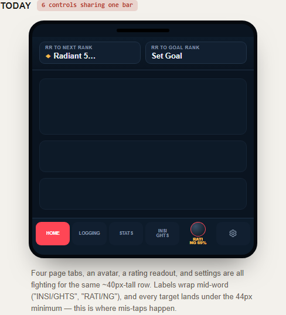
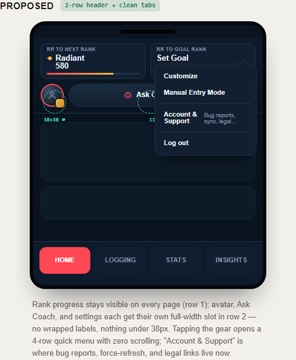
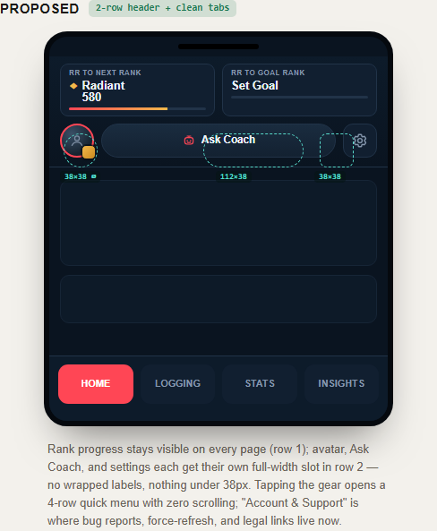

# Mobile Nav Redesign — Full Spec for Codex

**Status:** Approved by Michael, ready to build. This supersedes the "add `data-mobile-action=rating`" patch from the last passthrough round (`notes/visual-passthrough.md` #2) — that fix is being *replaced*, not kept, because the bottom bar it lives in is going away. Read this whole document before touching code; the sections build on each other.

**Visual reference:** live interactive mockup (side-by-side, true mobile scale, annotated tap-target sizes) — https://claude.ai/code/artifact/5c9e18cf-4f04-4669-86c6-5a2460ace7a1 — plus static screenshots below for anything that can't load that URL.

**Status (2026-07-09 follow-up):** The Account & Support simplification is now shipped: the modal is down to `account` and `support`, Import History plus the Tracker.gg profile controls moved onto the Logging page near manual entry, Force Refresh was removed, the duplicate Account-tab Log out row was removed, Tip to Dev moved to the top of Support, and Manual Entry Mode now closes Account & Support before opening the starting RR prompt so the two mobile layers do not overlap.

**Status (2026-07-10 follow-up):** The relocated Import History / Tracker.gg controls were **removed entirely**. HenrikDev Riot-ID sync supersedes the screenshot workflow. Everything else in this file's Account & Support work still stands.

**Policy amendment (shipped 2026-07-11):** §4's "bottom bar is page navigation only, exactly 4 tabs, nothing else ever goes here again" rule is **no longer absolute**. Michael's explicit call, made for the Gamesense Library feature (`notes/gamesense-library-2026-07-11.md`): a 5th tab is acceptable on both mobile and desktop when a feature is significant and thorough enough to earn a top-level destination. `Library` is now the first shipped exception. This isn't a blanket reopening of the bottom bar to anything — it's a deliberate one-time exception for a specific, substantial feature, made by Michael directly. Don't treat this as license to keep adding tabs freely; a future 6th+ tab request should still be treated as a real decision to confirm, not an assumed-fine default now that the "exactly 4" line has moved once.

---

## 1. The problem (why this exists)

The mobile bottom bar now carries 6 things — 4 page tabs, the avatar (with a rating readout jammed next to it), and settings — in one ~40px row. Labels wrap mid-word ("INSI/GHTS", "RATI/NG"), and every tap target lands under the 44px minimum:

This happened because Ask Coach, Bug Report, Sync, and Profile Rating were bolted onto the mobile bottom shell one at a time across separate fix passes (see the CSS maintainability note in `testing/visual-audit/CORRECTIONS.md`) without ever re-budgeting the space. This spec re-budgets it once, on purpose.

## 2. The decision

Split by **function**, not by "whichever bar has room":

- **Bottom bar** — page navigation only. Nothing else ever goes here again.
- **Header row 1** — rank progress (RR to Next Rank, RR to Goal Rank). Must be visible on every page, not just Home — it's the "where am I right now" readout and costs nothing extra to keep global.
- **Header row 2** — profile identity + the one action important enough to stay one tap away (Ask Coach) + settings entry point.
- **Settings** — collapses from "one long scrolling list" into a 4-row quick menu (never scrolls) + a categorized modal for everything else (Account / Data & Sync / Support / Legal), reusing the tab pattern the Edit Profile modal already has. Bug Report and Sync both move here — Bug Report because it's not urgent enough to cost a header slot, Sync because it's being replaced by pull-to-refresh + a manual fallback.

**This is mobile-only.** Desktop's header (`#profileAvatarWrap`, `#profileRatingWidget`, `#profileDropdownToggle`, `#askCoachOpen`, `#bugReportOpen`, `#profileSyncBtn`) is not cramped today and keeps all six as separate icons, unchanged. The one thing desktop *does* also get: the settings dropdown's content gets reorganized into the same quick-menu + Account & Support modal pattern (see §5) — that list is long on both viewports, and there's no reason to maintain two different settings structures for the same items. Nothing about desktop's header icons changes.

---

## 3. Header row 1 — Rank Progress (mobile only)

- Two cards side by side, full width of the row: `RR to Next Rank` / `RR to Goal Rank` — same content as today's widgets, just resized to fit two-up instead of competing with icons in a single row.
- **Do not truncate the RR number mid-value** (today's "Radiant 5…" bug). If the rank name + number don't fit one line, wrap to two lines inside the card (rank name on line 1, number on line 2) rather than clipping — see the mockup's `Radiant / 580` two-line treatment.
- Present on every page, not conditionally shown on Home only.

## 4. Header row 2 — Profile & Actions (mobile only)

Three full-height slots, one row, no wrapping:

1. **Avatar + rank badge** (left, ~38x38px circle). Tapping opens a single combined **Profile popover** containing both the guest-switcher rows (`Guest: Blank` / `Guest: Demo Import` / `+ Add Profile`) *and* the Profile Rating / Coach Readiness summary underneath it in the same popover. These are two separate desktop dropdowns today (`#profileSwitcher` and `#profileRatingDropdown`) — on mobile there's only room for one avatar tap target, so they merge into one scrollable-if-needed popover, not two separate triggers.
   - **This fixes a real bug while you're in here:** the mobile avatar clone (`ensureMobileBottomShell()`, app.js ~610-678, and the older `.mobile-bottom-avatar-btn`) only clones `` — there is no rank-icon element in the mobile markup at all, unlike desktop's avatar which stacks `#profileAvatarImg` + `#profileRankIcon`. Add the rank badge element and sync its `src` from `#profileRankIcon` the same way the avatar image is already synced.
2. **Ask Coach** (center, flexes to fill remaining width) — icon + "Ask Coach" text label, not icon-only. It's the one action worth a labeled pill instead of a bare glyph since row 2 has room now that Bug Report and Sync are gone.
3. **Settings gear** (right, ~38x38px) — opens the quick menu (§5).

## 5. Settings — quick menu + Account & Support modal

### 5a. Quick menu (gear tap, both viewports)

A short popover, **exactly 4 rows, never scrolls at any content length or auth state**:

1. Customize (opens Edit Profile / Theme Selector — unchanged)
2. Manual Entry Mode (the existing toggle — unchanged)
3. **Account & Support** — opens the modal below
4. Log out (or "Log in / Sign up" if guest — same conditional swap the current dropdown already does)

### 5b. Account & Support modal (both viewports)

Reuse the **exact tab pattern already built for Edit Profile** (`editProfileModal`, index.html ~323-440 — left-side vertical tabs, right-side content panel, `.profile-edit-shell` / `.profile-edit-tab` / `.profile-edit-panel` classes). Do not invent a new modal shell for this — same component, new tab content:

| Tab | Contents |
| --- | --- |
| **Account** | Security Settings, Log in / Sign up (guest only), Manual Entry Mode, Log out |
| **Data & Sync** | Import History, Tracker.gg Profile URL field + Save, **Force Refresh** row (see §6) with a last-synced timestamp |
| **Support** | Report a Bug (moved from its own header icon), Contact Support (existing mailto link), Tip to Dev |
| **Legal** | Terms of Service, Privacy Policy |

Each tab holds 3-5 short rows — confirm none of them need internal scrolling at 844px viewport height (they shouldn't, but check on the smallest supported phone height too, see §8).

## 6. Sync → pull-to-refresh + Force Refresh fallback

Remove the dedicated Sync icon/button (mobile `.mobile-bottom-icon-btn[data-mobile-action="sync"]` and its desktop equivalent stay as-is on desktop, but the *mobile* one is deleted, not repositioned). Replace with:

- **Automatic refresh on app open** (already the stated behavior/goal — confirm this is actually true today, don't assume).
- **Pull-to-refresh gesture** on the Home page for "I left the app open, force it now." Standard native-feeling bounce-and-release, no added chrome.
- **Force Refresh row** inside Data & Sync (§5b) as the discoverable fallback for anyone who doesn't find/trust the gesture, showing last-synced time.

---

## 7. Things not to forget

- **Don't add an 8th contradictory CSS block.** `app.css` already has 6+ separate, non-adjacent `body.is-mobile-layout .nav-right/.nav-left/.nav-btn{...}` blocks resolved only by source-order last-wins (flagged in `CORRECTIONS.md`'s maintainability note, and almost certainly the reason Ask Coach silently failed to open on mobile in the last round). Building the new row 1/row 2 header as a fresh, single, clearly-scoped block — and **deleting or neutralizing the old conflicting mobile rules for `.nav-right`/avatar/rating/dropdown-toggle** so there's exactly one source of truth — is part of this task, not optional cleanup to skip.
- **Tap targets ≥ 38px, ideally 44px.** Every control in the new header rows and bottom bar should hit this; the mockup's dashed annotations show the target sizing used for reference.
- **The quick menu must never scroll**, at any auth state (guest vs. logged in changes row 4's label) and at any reasonable text-size setting. This was the explicit ask — treat it as a hard constraint, not a nice-to-have.
- **This is mobile-only for the header/bottom-bar layout.** Verify `isMobileLayoutViewport()` (or whatever the current mobile-detection gate is) correctly scopes all of this and desktop's existing header/dropdown icons are pixel-identical to before, except for the Account & Support modal content reorganization (§5b, which is shared).
- **The combined Profile popover (§4.1) is new** — it doesn't exist on desktop today (desktop keeps switcher and rating as two separate dropdowns). Don't accidentally change desktop's behavior while building this.
- **Update the test harness.** `testing/visual-audit/audit.js`'s `MODALS`/`STATE_SETUP` mobile selectors (`.mobile-bottom-avatar-btn`, `.mobile-bottom-icon-btn[data-mobile-action="menu"|"rating"|"sync"]`) reference elements that are being removed or renamed by this spec. Update the harness to match whatever selectors you land on, and update the "different DOM entry points" note in `testing/visual-audit/PASSTHROUGH-CHECKLIST.md` so it stops describing the old bottom-shell actions.
- **Copy voice** — any new label text (Force Refresh timestamp phrasing, Account & Support row descriptions) should follow `notes/copy-language.md`'s rules (player language first, no internal jargon) — add anything new to that file's audit list rather than freehanding it.

## 8. Testing checklist — do not report this done until all of these pass

1. Re-run the visual audit harness (`cd testing/visual-audit && node audit.js`) after updating its selectors (§7). Zero console errors, zero `hasHorizontalOverflow` flags, on both guest states.
2. New `output/mobile/*/` screenshots show: row 1 always present on Home/Logging/Stats/Insights; row 2 with no wrapped text; bottom bar with exactly 4 tabs and no other controls.
3. Manually verify on the **smallest realistic phone width/height** you can test (e.g. 360x740 or an iPhone SE-class viewport, not just the 390x844 used in the mockup) — the quick menu and Account & Support tabs must still fit without scrolling there too.
4. Manually tap through: avatar → combined Profile popover shows both guest-switcher rows *and* rating summary; gear → 4-row quick menu → Account & Support → all 4 tabs render, no tab scrolls.
5. Confirm Ask Coach and Report a Bug both actually open and are usable on a real mobile viewport (this exact regression — icon visible, panel never appears — is what broke last round; don't just trust that moving Bug Report into the modal makes it work, verify the modal itself opens and its form is usable).
6. Confirm the rank-icon badge renders on the mobile avatar (was previously completely missing — verify it's not just present but showing the *correct* current rank, not a placeholder).
7. Confirm pull-to-refresh on Home doesn't fight with any existing scroll-lock/overscroll behavior elsewhere on that page, and that the Force Refresh row's timestamp updates after a manual trigger.
8. Confirm desktop is unaffected: `output/desktop/*/` screenshots for the header icons should be pixel-identical to the pre-change baseline; only the settings dropdown's *content* should differ (now quick-menu + modal instead of one long list).
9. Update `testing/visual-audit/CORRECTIONS.md` marking the relevant prior findings (Ask Coach/Bug Report mobile, Profile Rating mobile gap) as superseded by this rebuild, and note the outcome of each item above.

---

## 9. Follow-up (2026-07-09) — collapse Account & Support from 4 tabs to 2

Now that the shipped version has been used for a few days, Michael wants the tab structure simplified. Current structure (`index.html:441-520`): tabs `account` / `sync` (labeled "Data & Sync") / `support` / `legal`. Target: **two tabs — `account` and `support`.**

1. **Delete the "Data & Sync" tab entirely.** Its three contents get redistributed, not deleted:
   - `#accountSupportImportHistoryBtn` (`index.html:483`) and the Tracker.gg URL field + `#accountSupportSaveTrackerBtn` (`index.html:484-488`) move to the **Logging page** — this is where a player is already thinking about match data, and it's a more discoverable spot than three taps deep in Settings. Exact placement within Logging is your call — near the existing manual-entry form is the obvious fit since both are "add match data" actions — but don't bury it below the fold on mobile.
   - `#accountSupportForceRefreshBtn` (`index.html:489-494`) gets **deleted, not moved.** Pull-to-refresh already shipped in the original mobile nav redesign (§6 above) and covers the same need; keeping a second manual "Force Refresh" control is redundant now that the swipe gesture exists.
   - The Manual Entry Mode toggle already lives in the `account` tab (`index.html:466-472`) — nothing to move, the Data & Sync tab was never the source of truth for it.

2. **Delete the "Legal" tab, fold its two links into Support.** `terms.html`/`privacy.html` links (`index.html:516-517`) move into the `support` panel's row list, after the existing three rows.

3. **Remove the duplicate Log out row from the Account tab.** `#accountSupportLogoutBtn` (`index.html:473`) is redundant — Log out already lives in the mobile quick menu (row 4, per §5a above) one tap away from anywhere. Keep it only there; the Account tab drops to 3 rows: Security Settings, Log in / Sign up, Manual Entry Mode.

4. **Tip to Dev needs better placement, not just a tab shuffle.** Michael's complaint is specifically that it's hard to find where it currently lives (`index.html:506`, bottom of the Support list). Collapsing tabs alone doesn't fix that — it's still gear → Account & Support → Support tab → last row. Two options, pick one (or propose a third) rather than leaving it where it is:
   - **(a)** Move it to the top of the Support row list instead of the bottom, and/or give it a small distinct visual treatment (different from a plain gray row) so it doesn't read as identical-priority to "Report a Bug."
   - **(b)** Surface it somewhere outside this modal entirely — e.g. a small persistent row on the Home page or the mobile quick menu itself — if the goal is genuinely more visibility rather than just easier-to-find-when-you're-already-looking.
   Flag which you pick in the status update; this is a product call as much as a layout one.

5. **Resulting structure to verify:** `account` tab (Security Settings, Log in/Sign up, Manual Entry Mode — 3 rows) and `support` tab (Report a Bug, Contact Support, Tip to Dev, Terms of Service, Privacy Policy — 5 rows, in whatever order #4 lands on). Confirm 5 rows still fits without scrolling on the smallest tested viewport (§8.3's constraint carries over — this modal's "never scrolls" bar doesn't relax just because content moved tabs).

### Testing checklist for this pass

1. Open Account & Support on mobile — confirm exactly 2 tabs, both fit without scrolling their row lists.
2. Confirm Import History and the Tracker.gg URL field are reachable and functional from the Logging page, and that the import flow itself (modal, OCR, review screen) is unchanged — only the entry point moved.
3. Confirm Force Refresh is gone and pull-to-refresh still works on Home as the sole manual-refresh mechanism.
4. Confirm Log out still works from the quick menu and is no longer duplicated inside the Account tab.
5. Confirm Terms of Service / Privacy Policy links work from inside the Support tab.
6. Confirm desktop's settings dropdown reflects the same 2-tab content reorganization (per the original §2 note: desktop shares this modal's content structure, only the entry point differs) — no leftover reference to a "Data & Sync" or "Legal" tab anywhere.
7. Update this file's own status and `testing/visual-audit/CORRECTIONS.md`/`PASSTHROUGH-CHECKLIST.md` mobile selector notes if any `data-account-support-tab`/`panel` selectors the harness references changed.
