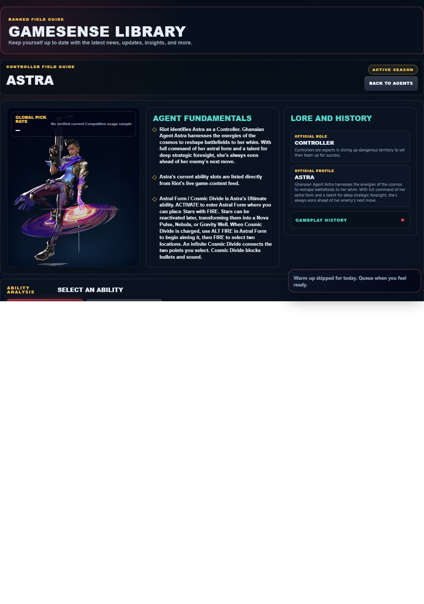

# Library Draft Review — Agent: Astra — 2026-07-23

## Summary

One-time full-coverage baseline. 2 fields changed for Patch 13.01.

## Screenshot

## Field-by-field changes

| Field | Tier | Before | After | Sources checked | Confidence |
| --- | --- | --- | --- | --- | --- |
| `abilities` | canonical | [   {     "id": "nova-pulse",     "name": "Nova Pulse",     "slot": "Q - Basic",     "icon": "https://media.valorant-api.com/agents/41fb69c1-4189-7b37-f117-bcaf1e96f1bf/abilities/ability1/displayicon.png",     "summary": "Place Stars in Astral Form (Ultimate Key).\r\n\r\nACTIVATE a Star to detonate a Nova Pulse. The Nova Pulse charges briefly then strikes, Concussing all players in its area.",     "stats": {       "Cost": "Current client value not published in Riot's public content feed",       "Charges": "1",       "Source": "Riot game text + Valorant Wiki current infobox"     },     "purpose": "Nova Pulse applies direct pressure. Pair its verified damage effect with a confirmed position rather than spending it on an unchecked guess.",     "setup": "Nova Pulse needs a deliberate target or path. Confirm the landing area and the teammate timing before deploying it.",     "source": "https://valorant-api.com/v1/agents/41fb69c1-4189-7b37-f117-bcaf1e96f1bf?language=en-US"   },   {     "id": "nebula-dissipate",     "name": "Nebula  / Dissipate",     "slot": "Nebula (Primary use): E - Basic",     "icon": "https://media.valorant-api.com/agents/41fb69c1-4189-7b37-f117-bcaf1e96f1bf/abilities/ability2/displayicon.png",     "summary": "Place Stars in Astral Form (Ultimate Key). \r\n\r\nACTIVATE a Star to transform it into a Nebula (smoke).\r\n\r\nUSE a Star to Dissipate it, returning the Star to be placed in a new location after a delay.\r\n\r\nDissipate briefly forms a fake Nebula at the Star's location before returning.",     "stats": {       "Cost": "Current client value not published in Riot's public content feed",       "Charges": "2",       "Source": "Riot game text + Valorant Wiki current infobox"     },     "purpose": "Nebula  / Dissipate controls sightlines. Place it on the specific defender view the team needs removed, then move while that view is blocked.",     "setup": "Nebula  / Dissipate needs a deliberate target or path. Confirm the landing area and the teammate timing before deploying it.",     "source": "https://valorant-api.com/v1/agents/41fb69c1-4189-7b37-f117-bcaf1e96f1bf?language=en-US"   },   {     "id": "gravity-well",     "name": "Gravity Well",     "slot": "C - Basic",     "icon": "https://media.valorant-api.com/agents/41fb69c1-4189-7b37-f117-bcaf1e96f1bf/abilities/grenade/displayicon.png",     "summary": "Place Stars in Astral Form (Ultimate Key).\r\n\r\nACTIVATE a Star to form a Gravity Well. Players in the area are pulled toward the center before it explodes, making all players still trapped inside Vulnerable.",     "stats": {       "Cost": "Current client value not published in Riot's public content feed",       "Charges": "1",       "Source": "Riot game text + Valorant Wiki current infobox"     },     "purpose": "Gravity Well applies direct pressure. Pair its verified damage effect with a confirmed position rather than spending it on an unchecked guess.",     "setup": "Gravity Well needs a deliberate target or path. Confirm the landing area and the teammate timing before deploying it.",     "source": "https://valorant-api.com/v1/agents/41fb69c1-4189-7b37-f117-bcaf1e96f1bf?language=en-US"   },   {     "id": "astral-form-cosmic-divide",     "name": "Astral Form / Cosmic Divide",     "slot": "X - Ultimate",     "icon": "https://media.valorant-api.com/agents/41fb69c1-4189-7b37-f117-bcaf1e96f1bf/abilities/ultimate/displayicon.png",     "summary": "ACTIVATE to enter Astral Form where you can place Stars with FIRE. Stars can be reactivated later, transforming them into a Nova Pulse, Nebula, or Gravity Well.\r\n\r\nWhen Cosmic Divide is charged, use ALT FIRE in Astral Form to begin aiming it, then FIRE to select two locations. An infinite Cosmic Divide connects the two points you select. Cosmic Divide blocks bullets and sound.",     "stats": {       "Cost": "Ultimate-point value not published in Riot's public content feed",       "Charges": "Current client value not published in Riot's public content feed",       "Source": "Riot game text; economy detail unavailable"     },     "purpose": "Astral Form / Cosmic Divide performs the exact function in Riot's current description. Build the play around that stated effect instead of assuming an unlisted interaction.",     "setup": "Astral Form / Cosmic Divide needs a deliberate target or path. Confirm the landing area and the teammate timing before deploying it.",     "source": "https://valorant-api.com/v1/agents/41fb69c1-4189-7b37-f117-bcaf1e96f1bf?language=en-US"   },   {     "id": "astral-form",     "name": "Astral Form",     "slot": "Passive",     "icon": "https://media.valorant-api.com/agents/41fb69c1-4189-7b37-f117-bcaf1e96f1bf/abilities/passive/displayicon.png",     "summary": "ACTIVATE Ultimate to enter Astral Form and PRIMARY FIRE to place Stars. Target Stars with your Nova Pulse, Nebula, or Gravity Well to use those abilities.",     "stats": {       "Cost": "Passive; no purchase",       "Charges": "Current client value not published in Riot's public content feed",       "Source": "Riot game text + Valorant Wiki current infobox"     },     "purpose": "Astral Form performs the exact function in Riot's current description. Build the play around that stated effect instead of assuming an unlisted interaction.",     "setup": "Astral Form needs a deliberate target or path. Confirm the landing area and the teammate timing before deploying it.",     "source": "https://valorant-api.com/v1/agents/41fb69c1-4189-7b37-f117-bcaf1e96f1bf?language=en-US"   } ] | [   {     "id": "nova-pulse",     "name": "Nova Pulse",     "slot": "C - Basic",     "icon": "https://media.valorant-api.com/agents/41fb69c1-4189-7b37-f117-bcaf1e96f1bf/abilities/ability1/displayicon.png",     "summary": "Place Stars in Astral Form (Ultimate Key).\r\n\r\nACTIVATE a Star to detonate a Nova Pulse. The Nova Pulse charges briefly then strikes, Concussing all players in its area.",     "stats": {       "Cost": "Current client value not published in Riot's public content feed",       "Charges": "1",       "Source": "Riot game text + Valorant Wiki current infobox"     },     "purpose": "Nova Pulse applies direct pressure. Pair its verified damage effect with a confirmed position rather than spending it on an unchecked guess.",     "setup": "Nova Pulse needs a deliberate target or path. Confirm the landing area and the teammate timing before deploying it.",     "source": "https://valorant-api.com/v1/agents/41fb69c1-4189-7b37-f117-bcaf1e96f1bf?language=en-US"   },   {     "id": "nebula-dissipate",     "name": "Nebula  / Dissipate",     "slot": "Q - Basic",     "icon": "https://media.valorant-api.com/agents/41fb69c1-4189-7b37-f117-bcaf1e96f1bf/abilities/ability2/displayicon.png",     "summary": "Place Stars in Astral Form (Ultimate Key). \r\n\r\nACTIVATE a Star to transform it into a Nebula (smoke).\r\n\r\nUSE a Star to Dissipate it, returning the Star to be placed in a new location after a delay.\r\n\r\nDissipate briefly forms a fake Nebula at the Star's location before returning.",     "stats": {       "Cost": "Current client value not published in Riot's public content feed",       "Charges": "2",       "Source": "Riot game text + Valorant Wiki current infobox"     },     "purpose": "Nebula  / Dissipate controls sightlines. Place it on the specific defender view the team needs removed, then move while that view is blocked.",     "setup": "Nebula  / Dissipate needs a deliberate target or path. Confirm the landing area and the teammate timing before deploying it.",     "source": "https://valorant-api.com/v1/agents/41fb69c1-4189-7b37-f117-bcaf1e96f1bf?language=en-US"   },   {     "id": "gravity-well",     "name": "Gravity Well",     "slot": "E - Signature",     "icon": "https://media.valorant-api.com/agents/41fb69c1-4189-7b37-f117-bcaf1e96f1bf/abilities/grenade/displayicon.png",     "summary": "Place Stars in Astral Form (Ultimate Key).\r\n\r\nACTIVATE a Star to form a Gravity Well. Players in the area are pulled toward the center before it explodes, making all players still trapped inside Vulnerable.",     "stats": {       "Cost": "Current client value not published in Riot's public content feed",       "Charges": "1",       "Source": "Riot game text + Valorant Wiki current infobox"     },     "purpose": "Gravity Well applies direct pressure. Pair its verified damage effect with a confirmed position rather than spending it on an unchecked guess.",     "setup": "Gravity Well needs a deliberate target or path. Confirm the landing area and the teammate timing before deploying it.",     "source": "https://valorant-api.com/v1/agents/41fb69c1-4189-7b37-f117-bcaf1e96f1bf?language=en-US"   },   {     "id": "astral-form-cosmic-divide",     "name": "Astral Form / Cosmic Divide",     "slot": "X - Ultimate",     "icon": "https://media.valorant-api.com/agents/41fb69c1-4189-7b37-f117-bcaf1e96f1bf/abilities/ultimate/displayicon.png",     "summary": "ACTIVATE to enter Astral Form where you can place Stars with FIRE. Stars can be reactivated later, transforming them into a Nova Pulse, Nebula, or Gravity Well.\r\n\r\nWhen Cosmic Divide is charged, use ALT FIRE in Astral Form to begin aiming it, then FIRE to select two locations. An infinite Cosmic Divide connects the two points you select. Cosmic Divide blocks bullets and sound.",     "stats": {       "Cost": "Ultimate-point value not published in Riot's public content feed",       "Charges": "Current client value not published in Riot's public content feed",       "Source": "Riot game text; economy detail unavailable"     },     "purpose": "Astral Form / Cosmic Divide performs the exact function in Riot's current description. Build the play around that stated effect instead of assuming an unlisted interaction.",     "setup": "Astral Form / Cosmic Divide needs a deliberate target or path. Confirm the landing area and the teammate timing before deploying it.",     "source": "https://valorant-api.com/v1/agents/41fb69c1-4189-7b37-f117-bcaf1e96f1bf?language=en-US"   },   {     "id": "astral-form",     "name": "Astral Form",     "slot": "Passive - Passive",     "icon": "https://media.valorant-api.com/agents/41fb69c1-4189-7b37-f117-bcaf1e96f1bf/abilities/passive/displayicon.png",     "summary": "ACTIVATE Ultimate to enter Astral Form and PRIMARY FIRE to place Stars. Target Stars with your Nova Pulse, Nebula, or Gravity Well to use those abilities.",     "stats": {       "Cost": "Passive; no purchase",       "Charges": "Current client value not published in Riot's public content feed",       "Source": "Riot game text + Valorant Wiki current infobox"     },     "purpose": "Astral Form performs the exact function in Riot's current description. Build the play around that stated effect instead of assuming an unlisted interaction.",     "setup": "Astral Form needs a deliberate target or path. Confirm the landing area and the teammate timing before deploying it.",     "source": "https://valorant-api.com/v1/agents/41fb69c1-4189-7b37-f117-bcaf1e96f1bf?language=en-US"   } ] | [https://valorant-api.com/v1/agents/41fb69c1-4189-7b37-f117-bcaf1e96f1bf?language=en-US](https://valorant-api.com/v1/agents/41fb69c1-4189-7b37-f117-bcaf1e96f1bf?language=en-US) | n/a (auto-approved) |
| `uuid` | canonical |  | 41fb69c1-4189-7b37-f117-bcaf1e96f1bf | [https://valorant-api.com/v1/agents/41fb69c1-4189-7b37-f117-bcaf1e96f1bf?language=en-US](https://valorant-api.com/v1/agents/41fb69c1-4189-7b37-f117-bcaf1e96f1bf?language=en-US) | n/a (auto-approved) |

## Approval

- [ ] Approved as-is
- [ ] Approved with edits (note edits below)
- [ ] Rejected (note why below)

Notes:

Promotion totals: 2 canonical, 0 synthesized, 0 mixed-tier field groups.
