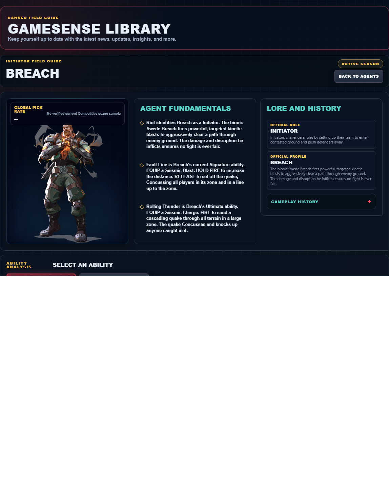
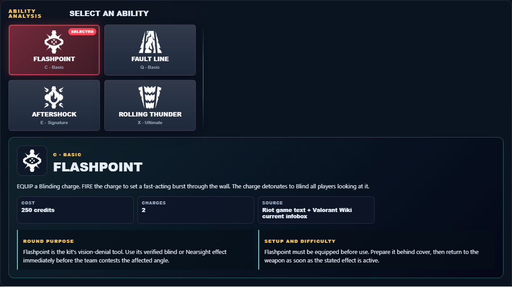

# Library Draft Review — Agent: Breach — 2026-07-23

## Summary

One-time full-coverage baseline. 2 fields changed for Patch 13.01.

## Screenshot

## Field-by-field changes

| Field | Tier | Before | After | Sources checked | Confidence |
| --- | --- | --- | --- | --- | --- |
| `abilities` | canonical | [   {     "id": "flashpoint",     "name": "Flashpoint",     "slot": "Q - Basic",     "icon": "https://media.valorant-api.com/agents/5f8d3a7f-467b-97f3-062c-13acf203c006/abilities/ability1/displayicon.png",     "summary": "EQUIP a Blinding charge. FIRE the charge to set a fast-acting burst through the wall. The charge detonates to Blind all players looking at it.",     "stats": {       "Cost": "250 credits",       "Charges": "2",       "Source": "Riot game text + Valorant Wiki current infobox"     },     "purpose": "Flashpoint is the kit's vision-denial tool. Use its verified blind or Nearsight effect immediately before the team contests the affected angle.",     "setup": "Flashpoint must be equipped before use. Prepare it behind cover, then return to the weapon as soon as the stated effect is active.",     "source": "https://valorant-api.com/v1/agents/5f8d3a7f-467b-97f3-062c-13acf203c006?language=en-US"   },   {     "id": "fault-line",     "name": "Fault Line",     "slot": "E - Signature",     "icon": "https://media.valorant-api.com/agents/5f8d3a7f-467b-97f3-062c-13acf203c006/abilities/ability2/displayicon.png",     "summary": "EQUIP a Seismic Blast. HOLD FIRE to increase the distance. RELEASE to set off the quake, Concussing all players in its zone and in a line up to the zone.",     "stats": {       "Cost": "Free signature charge",       "Charges": "1",       "Source": "Riot game text + Valorant Wiki current infobox"     },     "purpose": "Fault Line limits an opponent's options. Time its verified control effect for the moment an enemy must cross or fight.",     "setup": "Fault Line must be equipped before use. Prepare it behind cover, then return to the weapon as soon as the stated effect is active.",     "source": "https://valorant-api.com/v1/agents/5f8d3a7f-467b-97f3-062c-13acf203c006?language=en-US"   },   {     "id": "aftershock",     "name": "Aftershock",     "slot": "C - Basic",     "icon": "https://media.valorant-api.com/agents/5f8d3a7f-467b-97f3-062c-13acf203c006/abilities/grenade/displayicon.png",     "summary": "EQUIP a fusion charge. FIRE the charge to set a slow-acting burst through the wall. The burst does heavy damage to anyone caught in its area.",     "stats": {       "Cost": "200 credits",       "Charges": "1",       "Source": "Riot game text + Valorant Wiki current infobox"     },     "purpose": "Aftershock applies direct pressure. Pair its verified damage effect with a confirmed position rather than spending it on an unchecked guess.",     "setup": "Aftershock must be equipped before use. Prepare it behind cover, then return to the weapon as soon as the stated effect is active.",     "source": "https://valorant-api.com/v1/agents/5f8d3a7f-467b-97f3-062c-13acf203c006?language=en-US"   },   {     "id": "rolling-thunder",     "name": "Rolling Thunder",     "slot": "X - Ultimate",     "icon": "https://media.valorant-api.com/agents/5f8d3a7f-467b-97f3-062c-13acf203c006/abilities/ultimate/displayicon.png",     "summary": "EQUIP a Seismic Charge. FIRE to send a cascading quake through all terrain in a large zone. The quake Concusses and knocks up anyone caught in it.",     "stats": {       "Cost": "8 ultimate points",       "Charges": "Current client value not published in Riot's public content feed",       "Source": "Riot game text + Valorant Wiki current infobox"     },     "purpose": "Rolling Thunder limits an opponent's options. Time its verified control effect for the moment an enemy must cross or fight.",     "setup": "Rolling Thunder must be equipped before use. Prepare it behind cover, then return to the weapon as soon as the stated effect is active.",     "source": "https://valorant-api.com/v1/agents/5f8d3a7f-467b-97f3-062c-13acf203c006?language=en-US"   } ] | [   {     "id": "flashpoint",     "name": "Flashpoint",     "slot": "C - Basic",     "icon": "https://media.valorant-api.com/agents/5f8d3a7f-467b-97f3-062c-13acf203c006/abilities/ability1/displayicon.png",     "summary": "EQUIP a Blinding charge. FIRE the charge to set a fast-acting burst through the wall. The charge detonates to Blind all players looking at it.",     "stats": {       "Cost": "250 credits",       "Charges": "2",       "Source": "Riot game text + Valorant Wiki current infobox"     },     "purpose": "Flashpoint is the kit's vision-denial tool. Use its verified blind or Nearsight effect immediately before the team contests the affected angle.",     "setup": "Flashpoint must be equipped before use. Prepare it behind cover, then return to the weapon as soon as the stated effect is active.",     "source": "https://valorant-api.com/v1/agents/5f8d3a7f-467b-97f3-062c-13acf203c006?language=en-US"   },   {     "id": "fault-line",     "name": "Fault Line",     "slot": "Q - Basic",     "icon": "https://media.valorant-api.com/agents/5f8d3a7f-467b-97f3-062c-13acf203c006/abilities/ability2/displayicon.png",     "summary": "EQUIP a Seismic Blast. HOLD FIRE to increase the distance. RELEASE to set off the quake, Concussing all players in its zone and in a line up to the zone.",     "stats": {       "Cost": "Free signature charge",       "Charges": "1",       "Source": "Riot game text + Valorant Wiki current infobox"     },     "purpose": "Fault Line limits an opponent's options. Time its verified control effect for the moment an enemy must cross or fight.",     "setup": "Fault Line must be equipped before use. Prepare it behind cover, then return to the weapon as soon as the stated effect is active.",     "source": "https://valorant-api.com/v1/agents/5f8d3a7f-467b-97f3-062c-13acf203c006?language=en-US"   },   {     "id": "aftershock",     "name": "Aftershock",     "slot": "E - Signature",     "icon": "https://media.valorant-api.com/agents/5f8d3a7f-467b-97f3-062c-13acf203c006/abilities/grenade/displayicon.png",     "summary": "EQUIP a fusion charge. FIRE the charge to set a slow-acting burst through the wall. The burst does heavy damage to anyone caught in its area.",     "stats": {       "Cost": "200 credits",       "Charges": "1",       "Source": "Riot game text + Valorant Wiki current infobox"     },     "purpose": "Aftershock applies direct pressure. Pair its verified damage effect with a confirmed position rather than spending it on an unchecked guess.",     "setup": "Aftershock must be equipped before use. Prepare it behind cover, then return to the weapon as soon as the stated effect is active.",     "source": "https://valorant-api.com/v1/agents/5f8d3a7f-467b-97f3-062c-13acf203c006?language=en-US"   },   {     "id": "rolling-thunder",     "name": "Rolling Thunder",     "slot": "X - Ultimate",     "icon": "https://media.valorant-api.com/agents/5f8d3a7f-467b-97f3-062c-13acf203c006/abilities/ultimate/displayicon.png",     "summary": "EQUIP a Seismic Charge. FIRE to send a cascading quake through all terrain in a large zone. The quake Concusses and knocks up anyone caught in it.",     "stats": {       "Cost": "8 ultimate points",       "Charges": "Current client value not published in Riot's public content feed",       "Source": "Riot game text + Valorant Wiki current infobox"     },     "purpose": "Rolling Thunder limits an opponent's options. Time its verified control effect for the moment an enemy must cross or fight.",     "setup": "Rolling Thunder must be equipped before use. Prepare it behind cover, then return to the weapon as soon as the stated effect is active.",     "source": "https://valorant-api.com/v1/agents/5f8d3a7f-467b-97f3-062c-13acf203c006?language=en-US"   } ] | [https://valorant-api.com/v1/agents/5f8d3a7f-467b-97f3-062c-13acf203c006?language=en-US](https://valorant-api.com/v1/agents/5f8d3a7f-467b-97f3-062c-13acf203c006?language=en-US) | n/a (auto-approved) |
| `uuid` | canonical |  | 5f8d3a7f-467b-97f3-062c-13acf203c006 | [https://valorant-api.com/v1/agents/5f8d3a7f-467b-97f3-062c-13acf203c006?language=en-US](https://valorant-api.com/v1/agents/5f8d3a7f-467b-97f3-062c-13acf203c006?language=en-US) | n/a (auto-approved) |

## Approval

- [ ] Approved as-is
- [ ] Approved with edits (note edits below)
- [ ] Rejected (note why below)

Notes:

Promotion totals: 2 canonical, 0 synthesized, 0 mixed-tier field groups.
