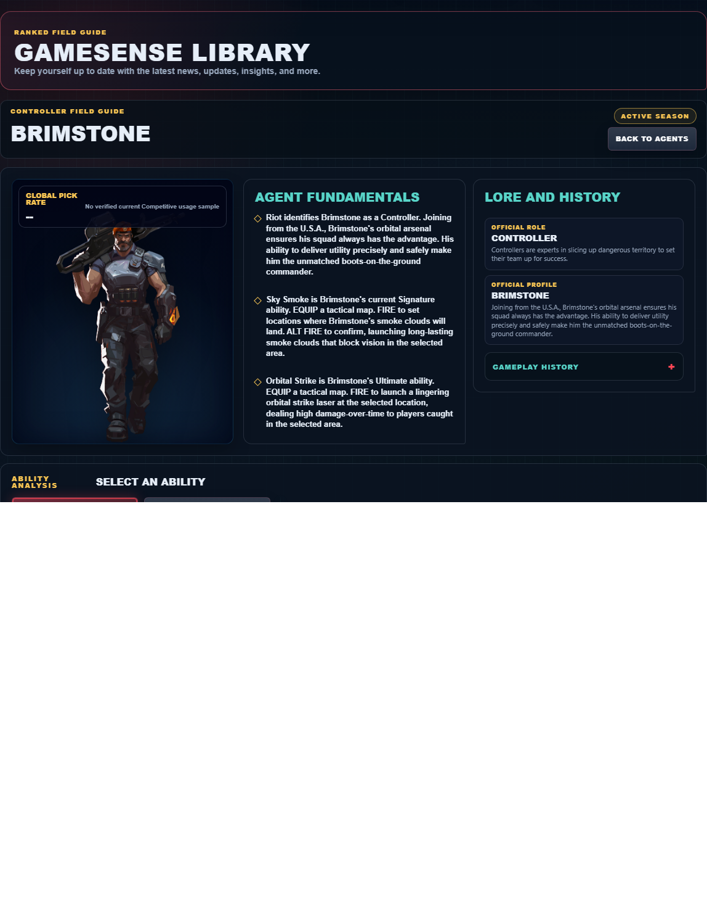
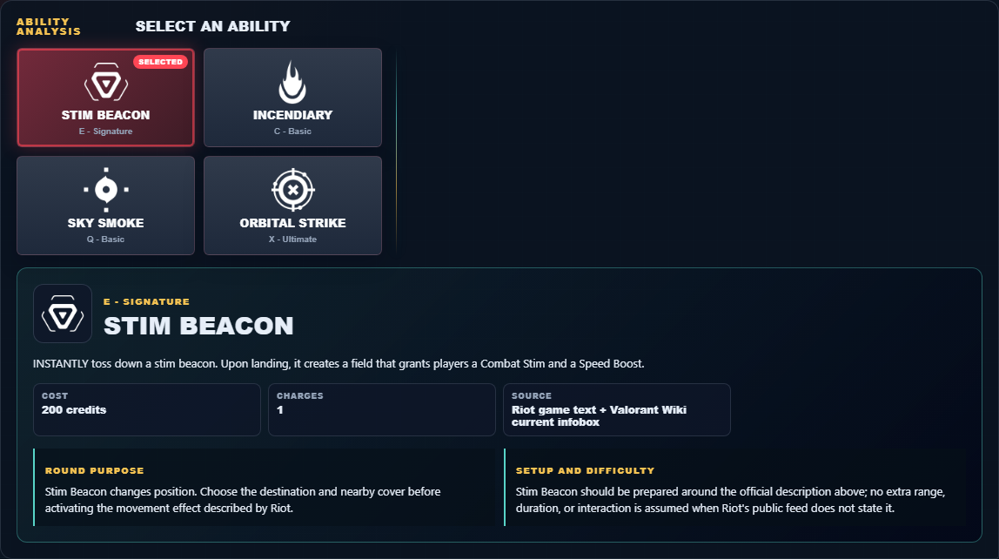

# Library Draft Review — Agent: Brimstone — 2026-07-23

## Summary

One-time full-coverage baseline. 2 fields changed for Patch 13.01.

## Screenshot

## Field-by-field changes

| Field | Tier | Before | After | Sources checked | Confidence |
| --- | --- | --- | --- | --- | --- |
| `abilities` | canonical | [   {     "id": "stim-beacon",     "name": "Stim Beacon",     "slot": "C - Basic",     "icon": "https://media.valorant-api.com/agents/9f0d8ba9-4140-b941-57d3-a7ad57c6b417/abilities/grenade/displayicon.png",     "summary": "INSTANTLY toss down a stim beacon. Upon landing, it creates a field that grants players a Combat Stim and a Speed Boost.",     "stats": {       "Cost": "200 credits",       "Charges": "1",       "Source": "Riot game text + Valorant Wiki current infobox"     },     "purpose": "Stim Beacon changes position. Choose the destination and nearby cover before activating the movement effect described by Riot.",     "setup": "Stim Beacon should be prepared around the official description above; no extra range, duration, or interaction is assumed when Riot's public feed does not state it.",     "source": "https://valorant-api.com/v1/agents/9f0d8ba9-4140-b941-57d3-a7ad57c6b417?language=en-US"   },   {     "id": "incendiary",     "name": "Incendiary",     "slot": "Q - Basic",     "icon": "https://media.valorant-api.com/agents/9f0d8ba9-4140-b941-57d3-a7ad57c6b417/abilities/ability1/displayicon.png",     "summary": "EQUIP an incendiary grenade launcher. FIRE to launch a grenade that detonates as it comes to a rest on the floor, creating a lingering fire zone that damages players within the zone.",     "stats": {       "Cost": "250 credits",       "Charges": "1",       "Source": "Riot game text + Valorant Wiki current infobox"     },     "purpose": "Incendiary applies direct pressure. Pair its verified damage effect with a confirmed position rather than spending it on an unchecked guess.",     "setup": "Incendiary must be equipped before use. Prepare it behind cover, then return to the weapon as soon as the stated effect is active.",     "source": "https://valorant-api.com/v1/agents/9f0d8ba9-4140-b941-57d3-a7ad57c6b417?language=en-US"   },   {     "id": "sky-smoke",     "name": "Sky Smoke",     "slot": "E - Signature",     "icon": "https://media.valorant-api.com/agents/9f0d8ba9-4140-b941-57d3-a7ad57c6b417/abilities/ability2/displayicon.png",     "summary": "EQUIP a tactical map. FIRE to set locations where Brimstone's smoke clouds will land. ALT FIRE to confirm, launching long-lasting smoke clouds that block vision in the selected area.",     "stats": {       "Cost": "100 credits",       "Charges": "3",       "Source": "Riot game text + Valorant Wiki current infobox"     },     "purpose": "Sky Smoke controls sightlines. Place it on the specific defender view the team needs removed, then move while that view is blocked.",     "setup": "Sky Smoke must be equipped before use. Prepare it behind cover, then return to the weapon as soon as the stated effect is active.",     "source": "https://valorant-api.com/v1/agents/9f0d8ba9-4140-b941-57d3-a7ad57c6b417?language=en-US"   },   {     "id": "orbital-strike",     "name": "Orbital Strike",     "slot": "X - Ultimate",     "icon": "https://media.valorant-api.com/agents/9f0d8ba9-4140-b941-57d3-a7ad57c6b417/abilities/ultimate/displayicon.png",     "summary": "EQUIP a tactical map. FIRE to launch a lingering orbital strike laser at the selected location, dealing high damage-over-time to players caught in the selected area.",     "stats": {       "Cost": "8 ultimate points",       "Charges": "Current client value not published in Riot's public content feed",       "Source": "Riot game text + Valorant Wiki current infobox"     },     "purpose": "Orbital Strike applies direct pressure. Pair its verified damage effect with a confirmed position rather than spending it on an unchecked guess.",     "setup": "Orbital Strike must be equipped before use. Prepare it behind cover, then return to the weapon as soon as the stated effect is active.",     "source": "https://valorant-api.com/v1/agents/9f0d8ba9-4140-b941-57d3-a7ad57c6b417?language=en-US"   } ] | [   {     "id": "stim-beacon",     "name": "Stim Beacon",     "slot": "E - Signature",     "icon": "https://media.valorant-api.com/agents/9f0d8ba9-4140-b941-57d3-a7ad57c6b417/abilities/grenade/displayicon.png",     "summary": "INSTANTLY toss down a stim beacon. Upon landing, it creates a field that grants players a Combat Stim and a Speed Boost.",     "stats": {       "Cost": "200 credits",       "Charges": "1",       "Source": "Riot game text + Valorant Wiki current infobox"     },     "purpose": "Stim Beacon changes position. Choose the destination and nearby cover before activating the movement effect described by Riot.",     "setup": "Stim Beacon should be prepared around the official description above; no extra range, duration, or interaction is assumed when Riot's public feed does not state it.",     "source": "https://valorant-api.com/v1/agents/9f0d8ba9-4140-b941-57d3-a7ad57c6b417?language=en-US"   },   {     "id": "incendiary",     "name": "Incendiary",     "slot": "C - Basic",     "icon": "https://media.valorant-api.com/agents/9f0d8ba9-4140-b941-57d3-a7ad57c6b417/abilities/ability1/displayicon.png",     "summary": "EQUIP an incendiary grenade launcher. FIRE to launch a grenade that detonates as it comes to a rest on the floor, creating a lingering fire zone that damages players within the zone.",     "stats": {       "Cost": "250 credits",       "Charges": "1",       "Source": "Riot game text + Valorant Wiki current infobox"     },     "purpose": "Incendiary applies direct pressure. Pair its verified damage effect with a confirmed position rather than spending it on an unchecked guess.",     "setup": "Incendiary must be equipped before use. Prepare it behind cover, then return to the weapon as soon as the stated effect is active.",     "source": "https://valorant-api.com/v1/agents/9f0d8ba9-4140-b941-57d3-a7ad57c6b417?language=en-US"   },   {     "id": "sky-smoke",     "name": "Sky Smoke",     "slot": "Q - Basic",     "icon": "https://media.valorant-api.com/agents/9f0d8ba9-4140-b941-57d3-a7ad57c6b417/abilities/ability2/displayicon.png",     "summary": "EQUIP a tactical map. FIRE to set locations where Brimstone's smoke clouds will land. ALT FIRE to confirm, launching long-lasting smoke clouds that block vision in the selected area.",     "stats": {       "Cost": "100 credits",       "Charges": "3",       "Source": "Riot game text + Valorant Wiki current infobox"     },     "purpose": "Sky Smoke controls sightlines. Place it on the specific defender view the team needs removed, then move while that view is blocked.",     "setup": "Sky Smoke must be equipped before use. Prepare it behind cover, then return to the weapon as soon as the stated effect is active.",     "source": "https://valorant-api.com/v1/agents/9f0d8ba9-4140-b941-57d3-a7ad57c6b417?language=en-US"   },   {     "id": "orbital-strike",     "name": "Orbital Strike",     "slot": "X - Ultimate",     "icon": "https://media.valorant-api.com/agents/9f0d8ba9-4140-b941-57d3-a7ad57c6b417/abilities/ultimate/displayicon.png",     "summary": "EQUIP a tactical map. FIRE to launch a lingering orbital strike laser at the selected location, dealing high damage-over-time to players caught in the selected area.",     "stats": {       "Cost": "8 ultimate points",       "Charges": "Current client value not published in Riot's public content feed",       "Source": "Riot game text + Valorant Wiki current infobox"     },     "purpose": "Orbital Strike applies direct pressure. Pair its verified damage effect with a confirmed position rather than spending it on an unchecked guess.",     "setup": "Orbital Strike must be equipped before use. Prepare it behind cover, then return to the weapon as soon as the stated effect is active.",     "source": "https://valorant-api.com/v1/agents/9f0d8ba9-4140-b941-57d3-a7ad57c6b417?language=en-US"   } ] | [https://valorant-api.com/v1/agents/9f0d8ba9-4140-b941-57d3-a7ad57c6b417?language=en-US](https://valorant-api.com/v1/agents/9f0d8ba9-4140-b941-57d3-a7ad57c6b417?language=en-US) | n/a (auto-approved) |
| `uuid` | canonical |  | 9f0d8ba9-4140-b941-57d3-a7ad57c6b417 | [https://valorant-api.com/v1/agents/9f0d8ba9-4140-b941-57d3-a7ad57c6b417?language=en-US](https://valorant-api.com/v1/agents/9f0d8ba9-4140-b941-57d3-a7ad57c6b417?language=en-US) | n/a (auto-approved) |

## Approval

- [ ] Approved as-is
- [ ] Approved with edits (note edits below)
- [ ] Rejected (note why below)

Notes:

Promotion totals: 2 canonical, 0 synthesized, 0 mixed-tier field groups.
