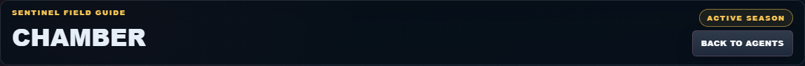
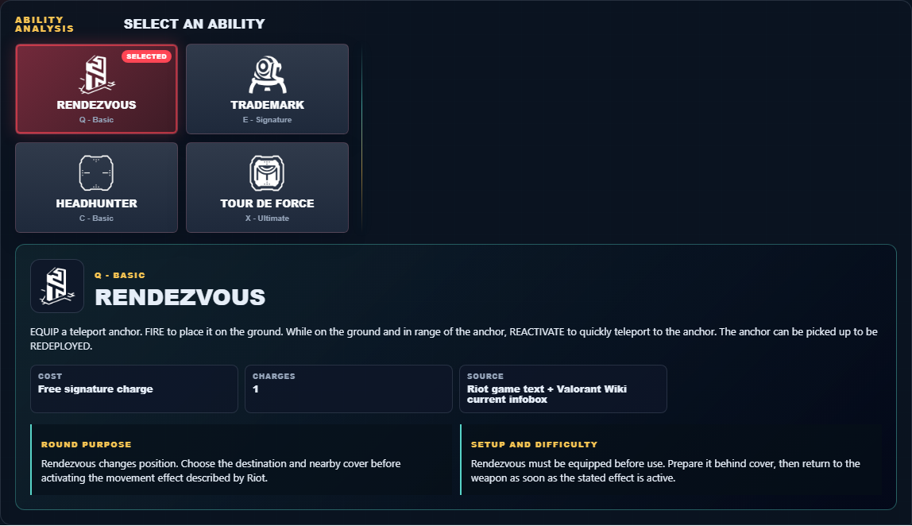

# Library Draft Review — Agent: Chamber — 2026-07-23

## Summary

One-time full-coverage baseline. 2 fields changed for Patch 13.01.

## Screenshot

## Field-by-field changes

| Field | Tier | Before | After | Sources checked | Confidence |
| --- | --- | --- | --- | --- | --- |
| `abilities` | canonical | [   {     "id": "rendezvous",     "name": "Rendezvous",     "slot": "E - Signature",     "icon": "https://media.valorant-api.com/agents/22697a3d-45bf-8dd7-4fec-84a9e28c69d7/abilities/ability2/displayicon.png",     "summary": "EQUIP a teleport anchor. FIRE to place it on the ground. While on the ground and in range of the anchor, REACTIVATE to quickly teleport to the anchor. The anchor can be picked up to be REDEPLOYED.",     "stats": {       "Cost": "Free signature charge",       "Charges": "1",       "Source": "Riot game text + Valorant Wiki current infobox"     },     "purpose": "Rendezvous changes position. Choose the destination and nearby cover before activating the movement effect described by Riot.",     "setup": "Rendezvous must be equipped before use. Prepare it behind cover, then return to the weapon as soon as the stated effect is active.",     "source": "https://valorant-api.com/v1/agents/22697a3d-45bf-8dd7-4fec-84a9e28c69d7?language=en-US"   },   {     "id": "trademark",     "name": "Trademark",     "slot": "C - Basic",     "icon": "https://media.valorant-api.com/agents/22697a3d-45bf-8dd7-4fec-84a9e28c69d7/abilities/grenade/displayicon.png",     "summary": "EQUIP a trap that scans for enemies. FIRE to place it on the ground. When a visible enemy comes in range, the trap counts down and then destabilizes the terrain around them, creating a lingering field that Slows players caught inside of it. The trap can be picked up to be REDEPLOYED.",     "stats": {       "Cost": "200 credits",       "Charges": "1",       "Source": "Riot game text + Valorant Wiki current infobox"     },     "purpose": "Trademark provides information. Use the reveal, detection, or tracking result to name an occupied space before a teammate commits.",     "setup": "Trademark must be equipped before use. Prepare it behind cover, then return to the weapon as soon as the stated effect is active.",     "source": "https://valorant-api.com/v1/agents/22697a3d-45bf-8dd7-4fec-84a9e28c69d7?language=en-US"   },   {     "id": "headhunter",     "name": "Headhunter",     "slot": "Q - Basic",     "icon": "https://media.valorant-api.com/agents/22697a3d-45bf-8dd7-4fec-84a9e28c69d7/abilities/ability1/displayicon.png",     "summary": "ACTIVATE to equip a heavy pistol. ALT FIRE with the pistol equipped to aim down sights.",     "stats": {       "Cost": "100 credits",       "Charges": "8 20px\|link=",       "Source": "Riot game text + Valorant Wiki current infobox"     },     "purpose": "Headhunter performs the exact function in Riot's current description. Build the play around that stated effect instead of assuming an unlisted interaction.",     "setup": "Headhunter must be equipped before use. Prepare it behind cover, then return to the weapon as soon as the stated effect is active.",     "source": "https://valorant-api.com/v1/agents/22697a3d-45bf-8dd7-4fec-84a9e28c69d7?language=en-US"   },   {     "id": "tour-de-force",     "name": "Tour De Force",     "slot": "X - Ultimate",     "icon": "https://media.valorant-api.com/agents/22697a3d-45bf-8dd7-4fec-84a9e28c69d7/abilities/ultimate/displayicon.png",     "summary": "ACTIVATE to summon a powerful, custom sniper rifle that will kill an enemy with any direct hit to the upper body. ALT FIRE to aim down sights. Killing an enemy creates a lingering field that Slows players caught inside of it.",     "stats": {       "Cost": "8 ultimate points",       "Charges": "Current client value not published in Riot's public content feed",       "Source": "Riot game text + Valorant Wiki current infobox"     },     "purpose": "Tour De Force limits an opponent's options. Time its verified control effect for the moment an enemy must cross or fight.",     "setup": "Tour De Force needs a deliberate target or path. Confirm the landing area and the teammate timing before deploying it.",     "source": "https://valorant-api.com/v1/agents/22697a3d-45bf-8dd7-4fec-84a9e28c69d7?language=en-US"   } ] | [   {     "id": "rendezvous",     "name": "Rendezvous",     "slot": "Q - Basic",     "icon": "https://media.valorant-api.com/agents/22697a3d-45bf-8dd7-4fec-84a9e28c69d7/abilities/ability2/displayicon.png",     "summary": "EQUIP a teleport anchor. FIRE to place it on the ground. While on the ground and in range of the anchor, REACTIVATE to quickly teleport to the anchor. The anchor can be picked up to be REDEPLOYED.",     "stats": {       "Cost": "Free signature charge",       "Charges": "1",       "Source": "Riot game text + Valorant Wiki current infobox"     },     "purpose": "Rendezvous changes position. Choose the destination and nearby cover before activating the movement effect described by Riot.",     "setup": "Rendezvous must be equipped before use. Prepare it behind cover, then return to the weapon as soon as the stated effect is active.",     "source": "https://valorant-api.com/v1/agents/22697a3d-45bf-8dd7-4fec-84a9e28c69d7?language=en-US"   },   {     "id": "trademark",     "name": "Trademark",     "slot": "E - Signature",     "icon": "https://media.valorant-api.com/agents/22697a3d-45bf-8dd7-4fec-84a9e28c69d7/abilities/grenade/displayicon.png",     "summary": "EQUIP a trap that scans for enemies. FIRE to place it on the ground. When a visible enemy comes in range, the trap counts down and then destabilizes the terrain around them, creating a lingering field that Slows players caught inside of it. The trap can be picked up to be REDEPLOYED.",     "stats": {       "Cost": "200 credits",       "Charges": "1",       "Source": "Riot game text + Valorant Wiki current infobox"     },     "purpose": "Trademark provides information. Use the reveal, detection, or tracking result to name an occupied space before a teammate commits.",     "setup": "Trademark must be equipped before use. Prepare it behind cover, then return to the weapon as soon as the stated effect is active.",     "source": "https://valorant-api.com/v1/agents/22697a3d-45bf-8dd7-4fec-84a9e28c69d7?language=en-US"   },   {     "id": "headhunter",     "name": "Headhunter",     "slot": "C - Basic",     "icon": "https://media.valorant-api.com/agents/22697a3d-45bf-8dd7-4fec-84a9e28c69d7/abilities/ability1/displayicon.png",     "summary": "ACTIVATE to equip a heavy pistol. ALT FIRE with the pistol equipped to aim down sights.",     "stats": {       "Cost": "100 credits",       "Charges": "8 20px\|link=",       "Source": "Riot game text + Valorant Wiki current infobox"     },     "purpose": "Headhunter performs the exact function in Riot's current description. Build the play around that stated effect instead of assuming an unlisted interaction.",     "setup": "Headhunter must be equipped before use. Prepare it behind cover, then return to the weapon as soon as the stated effect is active.",     "source": "https://valorant-api.com/v1/agents/22697a3d-45bf-8dd7-4fec-84a9e28c69d7?language=en-US"   },   {     "id": "tour-de-force",     "name": "Tour De Force",     "slot": "X - Ultimate",     "icon": "https://media.valorant-api.com/agents/22697a3d-45bf-8dd7-4fec-84a9e28c69d7/abilities/ultimate/displayicon.png",     "summary": "ACTIVATE to summon a powerful, custom sniper rifle that will kill an enemy with any direct hit to the upper body. ALT FIRE to aim down sights. Killing an enemy creates a lingering field that Slows players caught inside of it.",     "stats": {       "Cost": "8 ultimate points",       "Charges": "Current client value not published in Riot's public content feed",       "Source": "Riot game text + Valorant Wiki current infobox"     },     "purpose": "Tour De Force limits an opponent's options. Time its verified control effect for the moment an enemy must cross or fight.",     "setup": "Tour De Force needs a deliberate target or path. Confirm the landing area and the teammate timing before deploying it.",     "source": "https://valorant-api.com/v1/agents/22697a3d-45bf-8dd7-4fec-84a9e28c69d7?language=en-US"   } ] | [https://valorant-api.com/v1/agents/22697a3d-45bf-8dd7-4fec-84a9e28c69d7?language=en-US](https://valorant-api.com/v1/agents/22697a3d-45bf-8dd7-4fec-84a9e28c69d7?language=en-US) | n/a (auto-approved) |
| `uuid` | canonical |  | 22697a3d-45bf-8dd7-4fec-84a9e28c69d7 | [https://valorant-api.com/v1/agents/22697a3d-45bf-8dd7-4fec-84a9e28c69d7?language=en-US](https://valorant-api.com/v1/agents/22697a3d-45bf-8dd7-4fec-84a9e28c69d7?language=en-US) | n/a (auto-approved) |

## Approval

- [ ] Approved as-is
- [ ] Approved with edits (note edits below)
- [ ] Rejected (note why below)

Notes:

Promotion totals: 2 canonical, 0 synthesized, 0 mixed-tier field groups.
