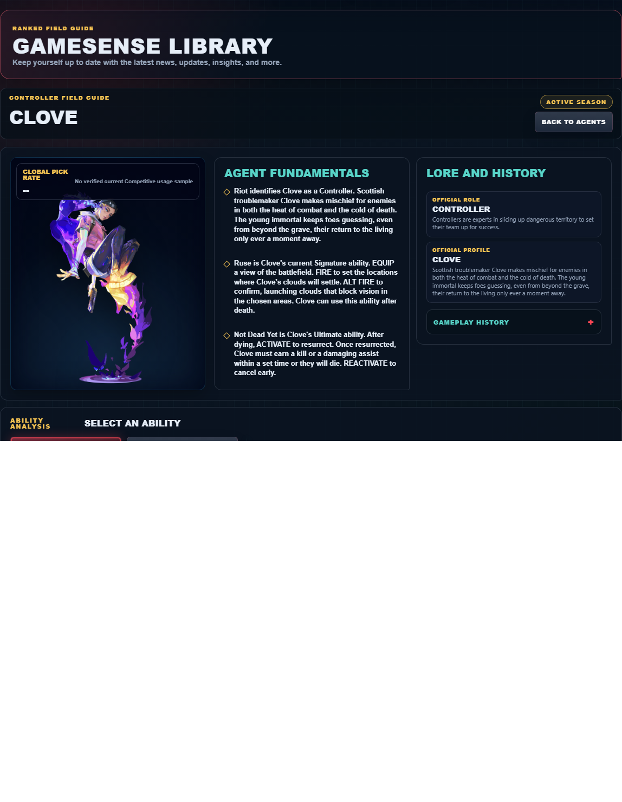
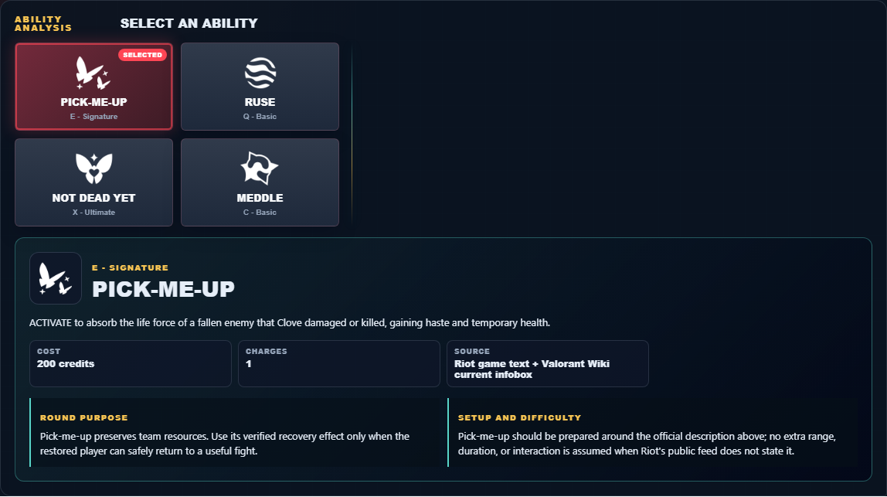

# Library Draft Review — Agent: Clove — 2026-07-23

## Summary

One-time full-coverage baseline. 2 fields changed for Patch 13.01.

## Screenshot

## Field-by-field changes

| Field | Tier | Before | After | Sources checked | Confidence |
| --- | --- | --- | --- | --- | --- |
| `abilities` | canonical | [   {     "id": "pick-me-up",     "name": "Pick-me-up",     "slot": "C - Basic",     "icon": "https://media.valorant-api.com/agents/1dbf2edd-4729-0984-3115-daa5eed44993/abilities/grenade/displayicon.png",     "summary": "ACTIVATE to absorb the life force of a fallen enemy that Clove damaged or killed, gaining haste and temporary health.",     "stats": {       "Cost": "200 credits",       "Charges": "1",       "Source": "Riot game text + Valorant Wiki current infobox"     },     "purpose": "Pick-me-up preserves team resources. Use its verified recovery effect only when the restored player can safely return to a useful fight.",     "setup": "Pick-me-up should be prepared around the official description above; no extra range, duration, or interaction is assumed when Riot's public feed does not state it.",     "source": "https://valorant-api.com/v1/agents/1dbf2edd-4729-0984-3115-daa5eed44993?language=en-US"   },   {     "id": "ruse",     "name": "Ruse",     "slot": "E - Signature",     "icon": "https://media.valorant-api.com/agents/1dbf2edd-4729-0984-3115-daa5eed44993/abilities/ability2/displayicon.png",     "summary": "EQUIP a view of the battlefield. FIRE to set the locations where Clove's clouds will settle. ALT FIRE to confirm, launching clouds that block vision in the chosen areas. Clove can use this ability after death.",     "stats": {       "Cost": "150 credits",       "Charges": "2",       "Source": "Riot game text + Valorant Wiki current infobox"     },     "purpose": "Ruse performs the exact function in Riot's current description. Build the play around that stated effect instead of assuming an unlisted interaction.",     "setup": "Ruse must be equipped before use. Prepare it behind cover, then return to the weapon as soon as the stated effect is active.",     "source": "https://valorant-api.com/v1/agents/1dbf2edd-4729-0984-3115-daa5eed44993?language=en-US"   },   {     "id": "not-dead-yet",     "name": "Not Dead Yet",     "slot": "X - Ultimate",     "icon": "https://media.valorant-api.com/agents/1dbf2edd-4729-0984-3115-daa5eed44993/abilities/ultimate/displayicon.png",     "summary": "After dying, ACTIVATE to resurrect. Once resurrected, Clove must earn a kill or a damaging assist within a set time or they will die. REACTIVATE to cancel early.",     "stats": {       "Cost": "8 ultimate points",       "Charges": "Current client value not published in Riot's public content feed",       "Source": "Riot game text + Valorant Wiki current infobox"     },     "purpose": "Not Dead Yet preserves team resources. Use its verified recovery effect only when the restored player can safely return to a useful fight.",     "setup": "Not Dead Yet has a second activation in Riot's description. Decide what will trigger that follow-up before the first cast.",     "source": "https://valorant-api.com/v1/agents/1dbf2edd-4729-0984-3115-daa5eed44993?language=en-US"   },   {     "id": "meddle",     "name": "Meddle",     "slot": "Q - Basic",     "icon": "https://media.valorant-api.com/agents/1dbf2edd-4729-0984-3115-daa5eed44993/abilities/ability1/displayicon.png",     "summary": "EQUIP a fragment of immortality essence. FIRE to throw the fragment, which upon landing on the floor, erupts after a short delay and temporarily Decays all targets caught inside.",     "stats": {       "Cost": "250 credits",       "Charges": "1",       "Source": "Riot game text + Valorant Wiki current infobox"     },     "purpose": "Meddle performs the exact function in Riot's current description. Build the play around that stated effect instead of assuming an unlisted interaction.",     "setup": "Meddle must be equipped before use. Prepare it behind cover, then return to the weapon as soon as the stated effect is active.",     "source": "https://valorant-api.com/v1/agents/1dbf2edd-4729-0984-3115-daa5eed44993?language=en-US"   } ] | [   {     "id": "pick-me-up",     "name": "Pick-me-up",     "slot": "E - Signature",     "icon": "https://media.valorant-api.com/agents/1dbf2edd-4729-0984-3115-daa5eed44993/abilities/grenade/displayicon.png",     "summary": "ACTIVATE to absorb the life force of a fallen enemy that Clove damaged or killed, gaining haste and temporary health.",     "stats": {       "Cost": "200 credits",       "Charges": "1",       "Source": "Riot game text + Valorant Wiki current infobox"     },     "purpose": "Pick-me-up preserves team resources. Use its verified recovery effect only when the restored player can safely return to a useful fight.",     "setup": "Pick-me-up should be prepared around the official description above; no extra range, duration, or interaction is assumed when Riot's public feed does not state it.",     "source": "https://valorant-api.com/v1/agents/1dbf2edd-4729-0984-3115-daa5eed44993?language=en-US"   },   {     "id": "ruse",     "name": "Ruse",     "slot": "Q - Basic",     "icon": "https://media.valorant-api.com/agents/1dbf2edd-4729-0984-3115-daa5eed44993/abilities/ability2/displayicon.png",     "summary": "EQUIP a view of the battlefield. FIRE to set the locations where Clove’s clouds will settle. ALT FIRE to confirm, launching clouds that block vision in the chosen areas. Clove can use this ability after death.",     "stats": {       "Cost": "150 credits",       "Charges": "2",       "Source": "Riot game text + Valorant Wiki current infobox"     },     "purpose": "Ruse performs the exact function in Riot's current description. Build the play around that stated effect instead of assuming an unlisted interaction.",     "setup": "Ruse must be equipped before use. Prepare it behind cover, then return to the weapon as soon as the stated effect is active.",     "source": "https://valorant-api.com/v1/agents/1dbf2edd-4729-0984-3115-daa5eed44993?language=en-US"   },   {     "id": "not-dead-yet",     "name": "Not Dead Yet",     "slot": "X - Ultimate",     "icon": "https://media.valorant-api.com/agents/1dbf2edd-4729-0984-3115-daa5eed44993/abilities/ultimate/displayicon.png",     "summary": "After dying, ACTIVATE to resurrect. Once resurrected, Clove must earn a kill or a damaging assist within a set time or they will die. REACTIVATE to cancel early.",     "stats": {       "Cost": "8 ultimate points",       "Charges": "Current client value not published in Riot's public content feed",       "Source": "Riot game text + Valorant Wiki current infobox"     },     "purpose": "Not Dead Yet preserves team resources. Use its verified recovery effect only when the restored player can safely return to a useful fight.",     "setup": "Not Dead Yet has a second activation in Riot's description. Decide what will trigger that follow-up before the first cast.",     "source": "https://valorant-api.com/v1/agents/1dbf2edd-4729-0984-3115-daa5eed44993?language=en-US"   },   {     "id": "meddle",     "name": "Meddle",     "slot": "C - Basic",     "icon": "https://media.valorant-api.com/agents/1dbf2edd-4729-0984-3115-daa5eed44993/abilities/ability1/displayicon.png",     "summary": "EQUIP a fragment of immortality essence. FIRE to throw the fragment, which upon landing on the floor, erupts after a short delay and temporarily Decays all targets caught inside.",     "stats": {       "Cost": "250 credits",       "Charges": "1",       "Source": "Riot game text + Valorant Wiki current infobox"     },     "purpose": "Meddle performs the exact function in Riot's current description. Build the play around that stated effect instead of assuming an unlisted interaction.",     "setup": "Meddle must be equipped before use. Prepare it behind cover, then return to the weapon as soon as the stated effect is active.",     "source": "https://valorant-api.com/v1/agents/1dbf2edd-4729-0984-3115-daa5eed44993?language=en-US"   } ] | [https://valorant-api.com/v1/agents/1dbf2edd-4729-0984-3115-daa5eed44993?language=en-US](https://valorant-api.com/v1/agents/1dbf2edd-4729-0984-3115-daa5eed44993?language=en-US) | n/a (auto-approved) |
| `uuid` | canonical |  | 1dbf2edd-4729-0984-3115-daa5eed44993 | [https://valorant-api.com/v1/agents/1dbf2edd-4729-0984-3115-daa5eed44993?language=en-US](https://valorant-api.com/v1/agents/1dbf2edd-4729-0984-3115-daa5eed44993?language=en-US) | n/a (auto-approved) |

## Approval

- [ ] Approved as-is
- [ ] Approved with edits (note edits below)
- [ ] Rejected (note why below)

Notes:

Promotion totals: 2 canonical, 0 synthesized, 0 mixed-tier field groups.
