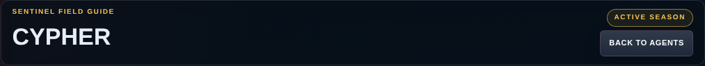
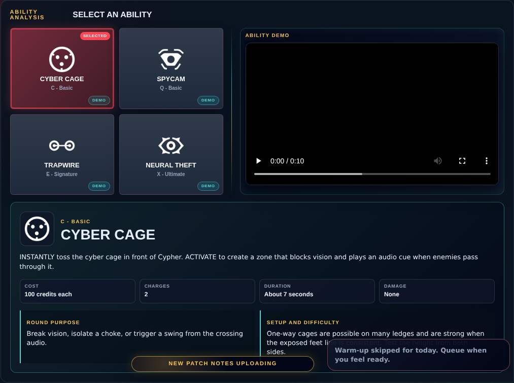

# Library Draft Review — Agent: Cypher — 2026-08-17

## Summary

Scheduled canonical refresh. 1 field changed for Patch 13.02.

## Screenshot

## Field-by-field changes

| Field | Tier | Before | After | Sources checked | Confidence |
| --- | --- | --- | --- | --- | --- |
| `abilities` | canonical | [   {     "id": "cyber-cage",     "name": "Cyber Cage",     "slot": "C - Basic",     "icon": "https://media.valorant-api.com/agents/117ed9e3-49f3-6512-3ccf-0cada7e3823b/abilities/ability1/displayicon.png",     "summary": "INSTANTLY toss the cyber cage in front of Cypher. ACTIVATE to create a zone that blocks vision and plays an audio cue when enemies pass through it.",     "stats": {       "Cost": "100 credits each",       "Charges": "2",       "Duration": "About 7 seconds",       "Damage": "None"     },     "purpose": "Break vision, isolate a choke, or trigger a swing from the crossing audio.",     "setup": "One-way cages are possible on many ledges and are strong when the exposed feet line is consistent. Test the height from both sides.",     "video": {       "src": "https://cmsassets.rgpub.io/sanity/files/dsfx7636/game_data/54a8dfaa9b82c7aaf994b0432bb25ef1e95c985c.mp4?accountingTag=VAL",       "title": "CYBER CAGE",       "source": "https://playvalorant.com/en-us/agents/cypher/",       "provider": "riot"     },     "source": "https://valorant-api.com/v1/agents/117ed9e3-49f3-6512-3ccf-0cada7e3823b?language=en-US"   },   {     "id": "spycam",     "name": "Spycam",     "slot": "Q - Basic",     "icon": "https://media.valorant-api.com/agents/117ed9e3-49f3-6512-3ccf-0cada7e3823b/abilities/ability2/displayicon.png",     "summary": "EQUIP a spycam. FIRE to place the spycam at the targeted location. RE-USE this ability to take control of the camera's view. While in control of the camera, FIRE to shoot a marking dart. This dart will Reveal the location of any player struck by the dart. This ability can be picked up to be REDEPLOYED.",     "stats": {       "Cost": "Free",       "Charges": "1",       "Recharge": "Cooldown if destroyed",       "Damage": "None"     },     "purpose": "Confirm an execute, watch a rotation, and force an enemy to turn away from the gunfight.",     "setup": "Use a view that answers one question clearly. A hidden camera pointed at empty geometry is not information.",     "video": {       "src": "https://cmsassets.rgpub.io/sanity/files/dsfx7636/game_data/825ba0643c74ad583350d1eb562bb7650ad78ae0.mp4?accountingTag=VAL",       "title": "SPYCAM",       "source": "https://playvalorant.com/en-us/agents/cypher/",       "provider": "riot"     },     "source": "https://valorant-api.com/v1/agents/117ed9e3-49f3-6512-3ccf-0cada7e3823b?language=en-US"   },   {     "id": "trapwire",     "name": "Trapwire",     "slot": "E - Signature",     "icon": "https://media.valorant-api.com/agents/117ed9e3-49f3-6512-3ccf-0cada7e3823b/abilities/grenade/displayicon.png",     "summary": "EQUIP a trapwire. FIRE to place a destructible and covert trapwire at the targeted location, creating a line that spans between the placed location and the wall opposite. Enemy players who cross a trapwire will be Slowed and Revealed after a short period if they do not destroy the device in time. This ability can be picked up to be REDEPLOYED.",     "stats": {       "Cost": "200 credits each",       "Charges": "2",       "Windup": "0.9 seconds on PC",       "Damage": "No meaningful direct damage"     },     "purpose": "Protect a flank, delay an entry, and create a guaranteed wallbang or swing timing.",     "setup": "Change height and anchor position. A trip has little value if attackers can clear it without exposing themselves.",     "video": {       "src": "https://cmsassets.rgpub.io/sanity/files/dsfx7636/game_data/aab21b75eb43f0e8cc9c0b816cb4877ae868b9fd.mp4?accountingTag=VAL",       "title": "TRAPWIRE",       "source": "https://playvalorant.com/en-us/agents/cypher/",       "provider": "riot"     },     "source": "https://valorant-api.com/v1/agents/117ed9e3-49f3-6512-3ccf-0cada7e3823b?language=en-US"   },   {     "id": "neural-theft",     "name": "Neural Theft",     "slot": "X - Ultimate",     "icon": "https://media.valorant-api.com/agents/117ed9e3-49f3-6512-3ccf-0cada7e3823b/abilities/ultimate/displayicon.png",     "summary": "INSTANTLY use on a targeted dead enemy to download information on their team.  After a brief delay, the location of all living enemy players will be Revealed twice.",     "stats": {       "Cost": "7 ultimate points",       "Pulses": "2 reveals",       "Damage": "None",       "Requirement": "Recent enemy corpse"     },     "purpose": "Call rotations, isolate lurkers, and time a swing between reveal pulses.",     "setup": "Say which enemy position changes the plan. The second reveal can punish players who immediately reposition after the first.",     "video": {       "src": "https://cmsassets.rgpub.io/sanity/files/dsfx7636/game_data/ddeaad5ff2e4865351755b71fdc4fc97339fb334.mp4?accountingTag=VAL",       "title": "NEURAL THEFT",       "source": "https://playvalorant.com/en-us/agents/cypher/",       "provider": "riot"     },     "source": "https://valorant-api.com/v1/agents/117ed9e3-49f3-6512-3ccf-0cada7e3823b?language=en-US"   } ] | [   {     "id": "cyber-cage",     "name": "Cyber Cage",     "slot": "C - Basic",     "icon": "https://media.valorant-api.com/agents/117ed9e3-49f3-6512-3ccf-0cada7e3823b/abilities/ability1/displayicon.png",     "summary": "INSTANTLY toss the cyber cage in front of Cypher. ACTIVATE to create a zone that blocks vision and plays an audio cue when enemies pass through it.",     "stats": {       "Cost": "100 credits each",       "Charges": "2",       "Duration": "About 7 seconds",       "Damage": "None"     },     "purpose": "Break vision, isolate a choke, or trigger a swing from the crossing audio.",     "setup": "One-way cages are possible on many ledges and are strong when the exposed feet line is consistent. Test the height from both sides.",     "video": {       "src": "https://cmsassets.rgpub.io/sanity/files/dsfx7636/game_data/54a8dfaa9b82c7aaf994b0432bb25ef1e95c985c.mp4?accountingTag=VAL",       "title": "Cypher Cyber Cage ability demo",       "source": "https://playvalorant.com/en-us/agents/",       "provider": "riot"     },     "source": "https://valorant-api.com/v1/agents/117ed9e3-49f3-6512-3ccf-0cada7e3823b?language=en-US"   },   {     "id": "spycam",     "name": "Spycam",     "slot": "Q - Basic",     "icon": "https://media.valorant-api.com/agents/117ed9e3-49f3-6512-3ccf-0cada7e3823b/abilities/ability2/displayicon.png",     "summary": "EQUIP a spycam. FIRE to place the spycam at the targeted location. RE-USE this ability to take control of the camera's view. While in control of the camera, FIRE to shoot a marking dart. This dart will Reveal the location of any player struck by the dart. This ability can be picked up to be REDEPLOYED.",     "stats": {       "Cost": "Free",       "Charges": "1",       "Recharge": "Cooldown if destroyed",       "Damage": "None"     },     "purpose": "Confirm an execute, watch a rotation, and force an enemy to turn away from the gunfight.",     "setup": "Use a view that answers one question clearly. A hidden camera pointed at empty geometry is not information.",     "video": {       "src": "https://cmsassets.rgpub.io/sanity/files/dsfx7636/game_data/825ba0643c74ad583350d1eb562bb7650ad78ae0.mp4?accountingTag=VAL",       "title": "Cypher Spycam ability demo",       "source": "https://playvalorant.com/en-us/agents/",       "provider": "riot"     },     "source": "https://valorant-api.com/v1/agents/117ed9e3-49f3-6512-3ccf-0cada7e3823b?language=en-US"   },   {     "id": "trapwire",     "name": "Trapwire",     "slot": "E - Signature",     "icon": "https://media.valorant-api.com/agents/117ed9e3-49f3-6512-3ccf-0cada7e3823b/abilities/grenade/displayicon.png",     "summary": "EQUIP a trapwire. FIRE to place a destructible and covert trapwire at the targeted location, creating a line that spans between the placed location and the wall opposite. Enemy players who cross a trapwire will be Slowed and Revealed after a short period if they do not destroy the device in time. This ability can be picked up to be REDEPLOYED.",     "stats": {       "Cost": "200 credits each",       "Charges": "2",       "Windup": "0.9 seconds on PC",       "Damage": "No meaningful direct damage"     },     "purpose": "Protect a flank, delay an entry, and create a guaranteed wallbang or swing timing.",     "setup": "Change height and anchor position. A trip has little value if attackers can clear it without exposing themselves.",     "video": {       "src": "https://cmsassets.rgpub.io/sanity/files/dsfx7636/game_data/aab21b75eb43f0e8cc9c0b816cb4877ae868b9fd.mp4?accountingTag=VAL",       "title": "Cypher Trapwire ability demo",       "source": "https://playvalorant.com/en-us/agents/",       "provider": "riot"     },     "source": "https://valorant-api.com/v1/agents/117ed9e3-49f3-6512-3ccf-0cada7e3823b?language=en-US"   },   {     "id": "neural-theft",     "name": "Neural Theft",     "slot": "X - Ultimate",     "icon": "https://media.valorant-api.com/agents/117ed9e3-49f3-6512-3ccf-0cada7e3823b/abilities/ultimate/displayicon.png",     "summary": "INSTANTLY use on a targeted dead enemy to download information on their team.  After a brief delay, the location of all living enemy players will be Revealed twice.",     "stats": {       "Cost": "7 ultimate points",       "Pulses": "2 reveals",       "Damage": "None",       "Requirement": "Recent enemy corpse"     },     "purpose": "Call rotations, isolate lurkers, and time a swing between reveal pulses.",     "setup": "Say which enemy position changes the plan. The second reveal can punish players who immediately reposition after the first.",     "video": {       "src": "https://cmsassets.rgpub.io/sanity/files/dsfx7636/game_data/ddeaad5ff2e4865351755b71fdc4fc97339fb334.mp4?accountingTag=VAL",       "title": "Cypher Neural Theft ability demo",       "source": "https://playvalorant.com/en-us/agents/",       "provider": "riot"     },     "source": "https://valorant-api.com/v1/agents/117ed9e3-49f3-6512-3ccf-0cada7e3823b?language=en-US"   } ] | [https://valorant-api.com/v1/agents/117ed9e3-49f3-6512-3ccf-0cada7e3823b?language=en-US](https://valorant-api.com/v1/agents/117ed9e3-49f3-6512-3ccf-0cada7e3823b?language=en-US) | n/a (auto-approved) |

## Approval

- [ ] Approved as-is
- [ ] Approved with edits (note edits below)
- [ ] Rejected (note why below)

Notes:

Promotion totals: 1 canonical, 0 synthesized, 0 mixed-tier field groups.
