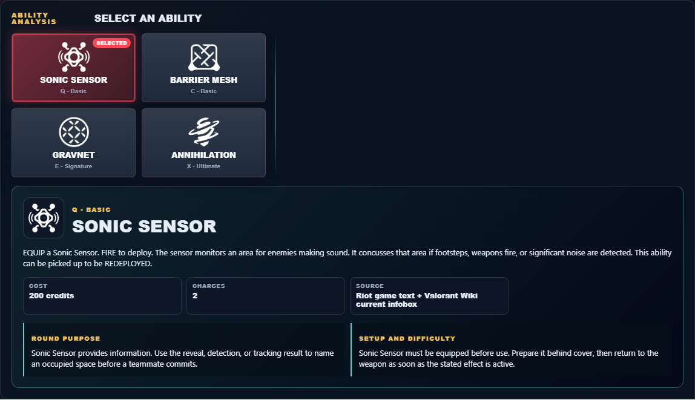
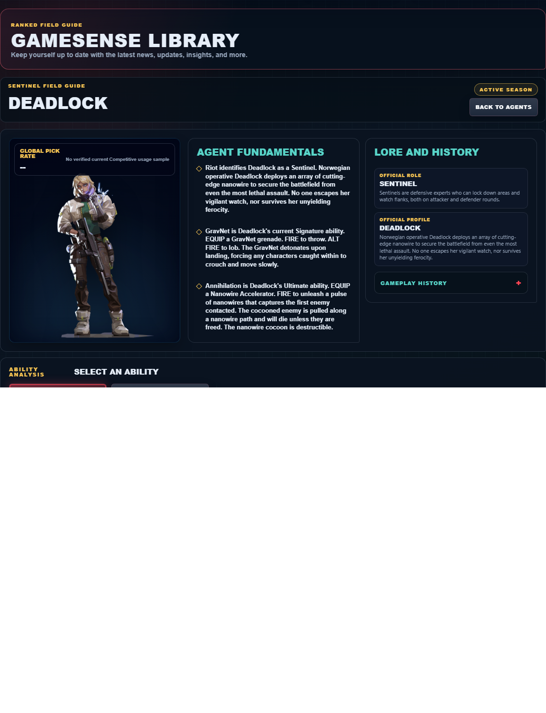

# Library Draft Review — Agent: Deadlock — 2026-07-23

## Summary

One-time full-coverage baseline. 2 fields changed for Patch 13.01.

## Screenshot

## Field-by-field changes

| Field | Tier | Before | After | Sources checked | Confidence |
| --- | --- | --- | --- | --- | --- |
| `abilities` | canonical | [   {     "id": "sonic-sensor",     "name": "Sonic Sensor",     "slot": "Q - Basic",     "icon": "https://media.valorant-api.com/agents/cc8b64c8-4b25-4ff9-6e7f-37b4da43d235/abilities/ability1/displayicon.png",     "summary": "EQUIP a Sonic Sensor. FIRE to deploy. The sensor monitors an area for enemies making sound. It concusses that area if footsteps, weapons fire, or significant noise are detected. This ability can be picked up to be REDEPLOYED.",     "stats": {       "Cost": "200 credits",       "Charges": "2",       "Source": "Riot game text + Valorant Wiki current infobox"     },     "purpose": "Sonic Sensor provides information. Use the reveal, detection, or tracking result to name an occupied space before a teammate commits.",     "setup": "Sonic Sensor must be equipped before use. Prepare it behind cover, then return to the weapon as soon as the stated effect is active.",     "source": "https://valorant-api.com/v1/agents/cc8b64c8-4b25-4ff9-6e7f-37b4da43d235?language=en-US"   },   {     "id": "barrier-mesh",     "name": "Barrier Mesh",     "slot": "C - Basic",     "icon": "https://media.valorant-api.com/agents/cc8b64c8-4b25-4ff9-6e7f-37b4da43d235/abilities/grenade/displayicon.png",     "summary": "EQUIP a Barrier Mesh disc. FIRE to throw forward. Upon landing, the disc generates barriers from the origin point that block character movement.",     "stats": {       "Cost": "300 credits",       "Charges": "1",       "Source": "Riot game text + Valorant Wiki current infobox"     },     "purpose": "Barrier Mesh changes position. Choose the destination and nearby cover before activating the movement effect described by Riot.",     "setup": "Barrier Mesh must be equipped before use. Prepare it behind cover, then return to the weapon as soon as the stated effect is active.",     "source": "https://valorant-api.com/v1/agents/cc8b64c8-4b25-4ff9-6e7f-37b4da43d235?language=en-US"   },   {     "id": "gravnet",     "name": "GravNet",     "slot": "E - Signature",     "icon": "https://media.valorant-api.com/agents/cc8b64c8-4b25-4ff9-6e7f-37b4da43d235/abilities/ability2/displayicon.png",     "summary": "EQUIP a GravNet grenade. FIRE to throw. ALT FIRE to lob. The GravNet detonates upon landing, forcing any characters caught within to crouch and move slowly.",     "stats": {       "Cost": "Free signature charge",       "Charges": "1",       "Source": "Riot game text + Valorant Wiki current infobox"     },     "purpose": "GravNet applies direct pressure. Pair its verified damage effect with a confirmed position rather than spending it on an unchecked guess.",     "setup": "GravNet must be equipped before use. Prepare it behind cover, then return to the weapon as soon as the stated effect is active.",     "source": "https://valorant-api.com/v1/agents/cc8b64c8-4b25-4ff9-6e7f-37b4da43d235?language=en-US"   },   {     "id": "annihilation",     "name": "Annihilation",     "slot": "X - Ultimate",     "icon": "https://media.valorant-api.com/agents/cc8b64c8-4b25-4ff9-6e7f-37b4da43d235/abilities/ultimate/displayicon.png",     "summary": "EQUIP a Nanowire Accelerator. FIRE to unleash a pulse of nanowires that captures the first enemy contacted. The cocooned enemy is pulled along a nanowire path and will die unless they are freed. The nanowire cocoon is destructible.",     "stats": {       "Cost": "7 ultimate points",       "Charges": "Current client value not published in Riot's public content feed",       "Source": "Riot game text + Valorant Wiki current infobox"     },     "purpose": "Annihilation performs the exact function in Riot's current description. Build the play around that stated effect instead of assuming an unlisted interaction.",     "setup": "Annihilation must be equipped before use. Prepare it behind cover, then return to the weapon as soon as the stated effect is active.",     "source": "https://valorant-api.com/v1/agents/cc8b64c8-4b25-4ff9-6e7f-37b4da43d235?language=en-US"   } ] | [   {     "id": "sonic-sensor",     "name": "Sonic Sensor",     "slot": "C - Basic",     "icon": "https://media.valorant-api.com/agents/cc8b64c8-4b25-4ff9-6e7f-37b4da43d235/abilities/ability1/displayicon.png",     "summary": "EQUIP a Sonic Sensor. FIRE to deploy. The sensor monitors an area for enemies making sound. It concusses that area if footsteps, weapons fire, or significant noise are detected. This ability can be picked up to be REDEPLOYED.",     "stats": {       "Cost": "200 credits",       "Charges": "2",       "Source": "Riot game text + Valorant Wiki current infobox"     },     "purpose": "Sonic Sensor provides information. Use the reveal, detection, or tracking result to name an occupied space before a teammate commits.",     "setup": "Sonic Sensor must be equipped before use. Prepare it behind cover, then return to the weapon as soon as the stated effect is active.",     "source": "https://valorant-api.com/v1/agents/cc8b64c8-4b25-4ff9-6e7f-37b4da43d235?language=en-US"   },   {     "id": "barrier-mesh",     "name": "Barrier Mesh",     "slot": "E - Signature",     "icon": "https://media.valorant-api.com/agents/cc8b64c8-4b25-4ff9-6e7f-37b4da43d235/abilities/grenade/displayicon.png",     "summary": "EQUIP a Barrier Mesh disc. FIRE to throw forward. Upon landing, the disc generates barriers from the origin point that block character movement.",     "stats": {       "Cost": "300 credits",       "Charges": "1",       "Source": "Riot game text + Valorant Wiki current infobox"     },     "purpose": "Barrier Mesh changes position. Choose the destination and nearby cover before activating the movement effect described by Riot.",     "setup": "Barrier Mesh must be equipped before use. Prepare it behind cover, then return to the weapon as soon as the stated effect is active.",     "source": "https://valorant-api.com/v1/agents/cc8b64c8-4b25-4ff9-6e7f-37b4da43d235?language=en-US"   },   {     "id": "gravnet",     "name": "GravNet",     "slot": "Q - Basic",     "icon": "https://media.valorant-api.com/agents/cc8b64c8-4b25-4ff9-6e7f-37b4da43d235/abilities/ability2/displayicon.png",     "summary": "EQUIP a GravNet grenade. FIRE to throw. ALT FIRE to lob. The GravNet detonates upon landing, forcing any characters caught within to crouch and move slowly.",     "stats": {       "Cost": "Free signature charge",       "Charges": "1",       "Source": "Riot game text + Valorant Wiki current infobox"     },     "purpose": "GravNet applies direct pressure. Pair its verified damage effect with a confirmed position rather than spending it on an unchecked guess.",     "setup": "GravNet must be equipped before use. Prepare it behind cover, then return to the weapon as soon as the stated effect is active.",     "source": "https://valorant-api.com/v1/agents/cc8b64c8-4b25-4ff9-6e7f-37b4da43d235?language=en-US"   },   {     "id": "annihilation",     "name": "Annihilation",     "slot": "X - Ultimate",     "icon": "https://media.valorant-api.com/agents/cc8b64c8-4b25-4ff9-6e7f-37b4da43d235/abilities/ultimate/displayicon.png",     "summary": "EQUIP a Nanowire Accelerator. FIRE to unleash a pulse of nanowires that captures the first enemy contacted. The cocooned enemy is pulled along a nanowire path and will die unless they are freed. The nanowire cocoon is destructible.",     "stats": {       "Cost": "7 ultimate points",       "Charges": "Current client value not published in Riot's public content feed",       "Source": "Riot game text + Valorant Wiki current infobox"     },     "purpose": "Annihilation performs the exact function in Riot's current description. Build the play around that stated effect instead of assuming an unlisted interaction.",     "setup": "Annihilation must be equipped before use. Prepare it behind cover, then return to the weapon as soon as the stated effect is active.",     "source": "https://valorant-api.com/v1/agents/cc8b64c8-4b25-4ff9-6e7f-37b4da43d235?language=en-US"   } ] | [https://valorant-api.com/v1/agents/cc8b64c8-4b25-4ff9-6e7f-37b4da43d235?language=en-US](https://valorant-api.com/v1/agents/cc8b64c8-4b25-4ff9-6e7f-37b4da43d235?language=en-US) | n/a (auto-approved) |
| `uuid` | canonical |  | cc8b64c8-4b25-4ff9-6e7f-37b4da43d235 | [https://valorant-api.com/v1/agents/cc8b64c8-4b25-4ff9-6e7f-37b4da43d235?language=en-US](https://valorant-api.com/v1/agents/cc8b64c8-4b25-4ff9-6e7f-37b4da43d235?language=en-US) | n/a (auto-approved) |

## Approval

- [ ] Approved as-is
- [ ] Approved with edits (note edits below)
- [ ] Rejected (note why below)

Notes:

Promotion totals: 2 canonical, 0 synthesized, 0 mixed-tier field groups.
