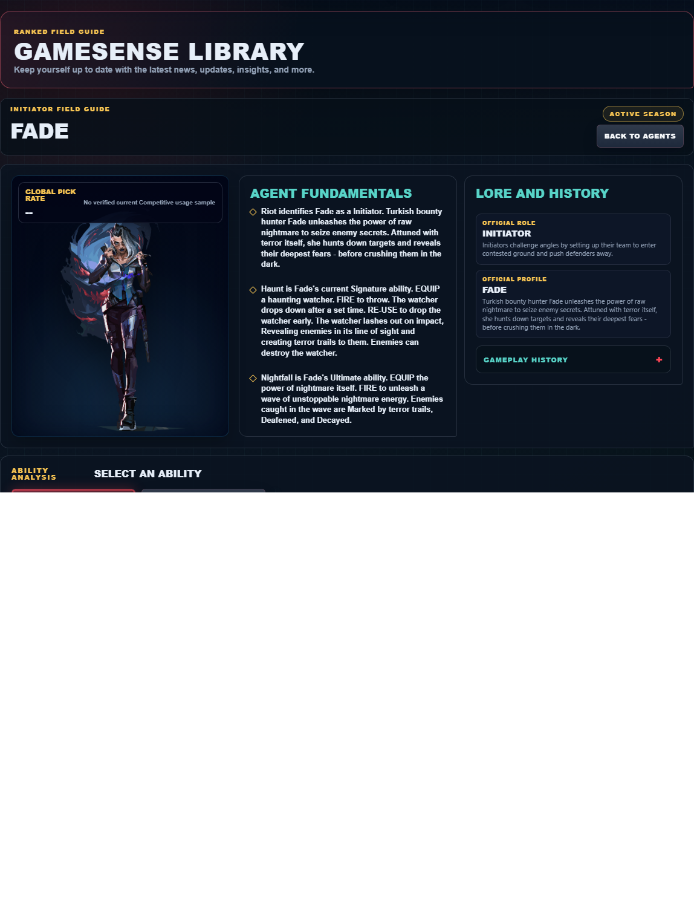

# Library Draft Review — Agent: Fade — 2026-07-23

## Summary

One-time full-coverage baseline. 2 fields changed for Patch 13.01.

## Screenshot

## Field-by-field changes

| Field | Tier | Before | After | Sources checked | Confidence |
| --- | --- | --- | --- | --- | --- |
| `abilities` | canonical | [   {     "id": "seize",     "name": "Seize",     "slot": "Q - Basic",     "icon": "https://media.valorant-api.com/agents/dade69b4-4f5a-8528-247b-219e5a1facd6/abilities/ability1/displayicon.png",     "summary": "EQUIP a knot of raw fear. FIRE to throw. The knot drops down after a set time. RE-USE to drop the knot early. The knot ruptures on impact, holding nearby enemies in place. Held enemies are Deafened, and Decayed.",     "stats": {       "Cost": "200 credits",       "Charges": "1",       "Source": "Riot game text + Valorant Wiki current infobox"     },     "purpose": "Seize performs the exact function in Riot's current description. Build the play around that stated effect instead of assuming an unlisted interaction.",     "setup": "Seize must be equipped before use. Prepare it behind cover, then return to the weapon as soon as the stated effect is active.",     "source": "https://valorant-api.com/v1/agents/dade69b4-4f5a-8528-247b-219e5a1facd6?language=en-US"   },   {     "id": "haunt",     "name": "Haunt",     "slot": "E - Signature",     "icon": "https://media.valorant-api.com/agents/dade69b4-4f5a-8528-247b-219e5a1facd6/abilities/ability2/displayicon.png",     "summary": "EQUIP a haunting watcher. FIRE to throw. The watcher drops down after a set time. RE-USE to drop the watcher early. The watcher lashes out on impact, Revealing enemies in its line of sight and creating terror trails to them. Enemies can destroy the watcher.",     "stats": {       "Cost": "Free signature charge",       "Charges": "1",       "Source": "Riot game text + Valorant Wiki current infobox"     },     "purpose": "Haunt provides information. Use the reveal, detection, or tracking result to name an occupied space before a teammate commits.",     "setup": "Haunt must be equipped before use. Prepare it behind cover, then return to the weapon as soon as the stated effect is active.",     "source": "https://valorant-api.com/v1/agents/dade69b4-4f5a-8528-247b-219e5a1facd6?language=en-US"   },   {     "id": "prowler",     "name": "Prowler",     "slot": "C - Basic",     "icon": "https://media.valorant-api.com/agents/dade69b4-4f5a-8528-247b-219e5a1facd6/abilities/grenade/displayicon.png",     "summary": "EQUIP a prowler. FIRE to send the prowler forward. HOLD FIRE to steer the prowler towards your crosshair. The prowler will chase down the first enemy or terror trail it sees, and Nearsight the enemy on impact.",     "stats": {       "Cost": "250 credits",       "Charges": "2",       "Source": "Riot game text + Valorant Wiki current infobox"     },     "purpose": "Prowler is the kit's vision-denial tool. Use its verified blind or Nearsight effect immediately before the team contests the affected angle.",     "setup": "Prowler must be equipped before use. Prepare it behind cover, then return to the weapon as soon as the stated effect is active.",     "source": "https://valorant-api.com/v1/agents/dade69b4-4f5a-8528-247b-219e5a1facd6?language=en-US"   },   {     "id": "nightfall",     "name": "Nightfall",     "slot": "X - Ultimate",     "icon": "https://media.valorant-api.com/agents/dade69b4-4f5a-8528-247b-219e5a1facd6/abilities/ultimate/displayicon.png",     "summary": "EQUIP the power of nightmare itself. FIRE to unleash a wave of unstoppable nightmare energy. Enemies caught in the wave are Marked by terror trails, Deafened, and Decayed.",     "stats": {       "Cost": "8 ultimate points",       "Charges": "Current client value not published in Riot's public content feed",       "Source": "Riot game text + Valorant Wiki current infobox"     },     "purpose": "Nightfall performs the exact function in Riot's current description. Build the play around that stated effect instead of assuming an unlisted interaction.",     "setup": "Nightfall must be equipped before use. Prepare it behind cover, then return to the weapon as soon as the stated effect is active.",     "source": "https://valorant-api.com/v1/agents/dade69b4-4f5a-8528-247b-219e5a1facd6?language=en-US"   } ] | [   {     "id": "seize",     "name": "Seize",     "slot": "C - Basic",     "icon": "https://media.valorant-api.com/agents/dade69b4-4f5a-8528-247b-219e5a1facd6/abilities/ability1/displayicon.png",     "summary": "EQUIP a knot of raw fear. FIRE to throw. The knot drops down after a set time. RE-USE to drop the knot early. The knot ruptures on impact, holding nearby enemies in place. Held enemies are Deafened, and Decayed.",     "stats": {       "Cost": "200 credits",       "Charges": "1",       "Source": "Riot game text + Valorant Wiki current infobox"     },     "purpose": "Seize performs the exact function in Riot's current description. Build the play around that stated effect instead of assuming an unlisted interaction.",     "setup": "Seize must be equipped before use. Prepare it behind cover, then return to the weapon as soon as the stated effect is active.",     "source": "https://valorant-api.com/v1/agents/dade69b4-4f5a-8528-247b-219e5a1facd6?language=en-US"   },   {     "id": "haunt",     "name": "Haunt",     "slot": "Q - Basic",     "icon": "https://media.valorant-api.com/agents/dade69b4-4f5a-8528-247b-219e5a1facd6/abilities/ability2/displayicon.png",     "summary": "EQUIP a haunting watcher. FIRE to throw. The watcher drops down after a set time. RE-USE to drop the watcher early. The watcher lashes out on impact, Revealing enemies in its line of sight and creating terror trails to them. Enemies can destroy the watcher.",     "stats": {       "Cost": "Free signature charge",       "Charges": "1",       "Source": "Riot game text + Valorant Wiki current infobox"     },     "purpose": "Haunt provides information. Use the reveal, detection, or tracking result to name an occupied space before a teammate commits.",     "setup": "Haunt must be equipped before use. Prepare it behind cover, then return to the weapon as soon as the stated effect is active.",     "source": "https://valorant-api.com/v1/agents/dade69b4-4f5a-8528-247b-219e5a1facd6?language=en-US"   },   {     "id": "prowler",     "name": "Prowler",     "slot": "E - Signature",     "icon": "https://media.valorant-api.com/agents/dade69b4-4f5a-8528-247b-219e5a1facd6/abilities/grenade/displayicon.png",     "summary": "EQUIP a prowler. FIRE to send the prowler forward. HOLD FIRE to steer the prowler towards your crosshair. The prowler will chase down the first enemy or terror trail it sees, and Nearsight the enemy on impact.",     "stats": {       "Cost": "250 credits",       "Charges": "2",       "Source": "Riot game text + Valorant Wiki current infobox"     },     "purpose": "Prowler is the kit's vision-denial tool. Use its verified blind or Nearsight effect immediately before the team contests the affected angle.",     "setup": "Prowler must be equipped before use. Prepare it behind cover, then return to the weapon as soon as the stated effect is active.",     "source": "https://valorant-api.com/v1/agents/dade69b4-4f5a-8528-247b-219e5a1facd6?language=en-US"   },   {     "id": "nightfall",     "name": "Nightfall",     "slot": "X - Ultimate",     "icon": "https://media.valorant-api.com/agents/dade69b4-4f5a-8528-247b-219e5a1facd6/abilities/ultimate/displayicon.png",     "summary": "EQUIP the power of nightmare itself. FIRE to unleash a wave of unstoppable nightmare energy. Enemies caught in the wave are Marked by terror trails, Deafened, and Decayed.",     "stats": {       "Cost": "8 ultimate points",       "Charges": "Current client value not published in Riot's public content feed",       "Source": "Riot game text + Valorant Wiki current infobox"     },     "purpose": "Nightfall performs the exact function in Riot's current description. Build the play around that stated effect instead of assuming an unlisted interaction.",     "setup": "Nightfall must be equipped before use. Prepare it behind cover, then return to the weapon as soon as the stated effect is active.",     "source": "https://valorant-api.com/v1/agents/dade69b4-4f5a-8528-247b-219e5a1facd6?language=en-US"   } ] | [https://valorant-api.com/v1/agents/dade69b4-4f5a-8528-247b-219e5a1facd6?language=en-US](https://valorant-api.com/v1/agents/dade69b4-4f5a-8528-247b-219e5a1facd6?language=en-US) | n/a (auto-approved) |
| `uuid` | canonical |  | dade69b4-4f5a-8528-247b-219e5a1facd6 | [https://valorant-api.com/v1/agents/dade69b4-4f5a-8528-247b-219e5a1facd6?language=en-US](https://valorant-api.com/v1/agents/dade69b4-4f5a-8528-247b-219e5a1facd6?language=en-US) | n/a (auto-approved) |

## Approval

- [ ] Approved as-is
- [ ] Approved with edits (note edits below)
- [ ] Rejected (note why below)

Notes:

Promotion totals: 2 canonical, 0 synthesized, 0 mixed-tier field groups.
