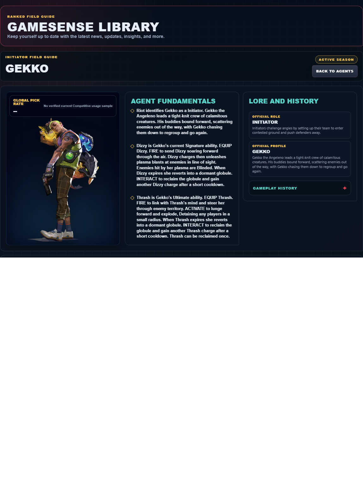
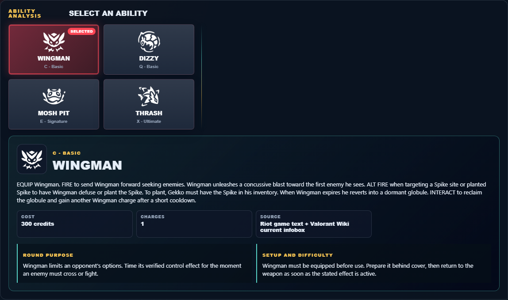

# Library Draft Review — Agent: Gekko — 2026-07-23

## Summary

One-time full-coverage baseline. 2 fields changed for Patch 13.01.

## Screenshot

## Field-by-field changes

| Field | Tier | Before | After | Sources checked | Confidence |
| --- | --- | --- | --- | --- | --- |
| `abilities` | canonical | [   {     "id": "wingman",     "name": "Wingman",     "slot": "Q - Basic",     "icon": "https://media.valorant-api.com/agents/e370fa57-4757-3604-3648-499e1f642d3f/abilities/ability1/displayicon.png",     "summary": "EQUIP Wingman. FIRE to send Wingman forward seeking enemies. Wingman unleashes a concussive blast toward the first enemy he sees. ALT FIRE when targeting a Spike site or planted Spike to have Wingman defuse or plant the Spike. To plant, Gekko must have the Spike in his inventory. When Wingman expires he reverts into a dormant globule. INTERACT to reclaim the globule and gain another Wingman charge after a short cooldown.",     "stats": {       "Cost": "300 credits",       "Charges": "1",       "Source": "Riot game text + Valorant Wiki current infobox"     },     "purpose": "Wingman limits an opponent's options. Time its verified control effect for the moment an enemy must cross or fight.",     "setup": "Wingman must be equipped before use. Prepare it behind cover, then return to the weapon as soon as the stated effect is active.",     "source": "https://valorant-api.com/v1/agents/e370fa57-4757-3604-3648-499e1f642d3f?language=en-US"   },   {     "id": "dizzy",     "name": "Dizzy",     "slot": "E - Signature",     "icon": "https://media.valorant-api.com/agents/e370fa57-4757-3604-3648-499e1f642d3f/abilities/ability2/displayicon.png",     "summary": "EQUIP Dizzy. FIRE to send Dizzy soaring forward through the air. Dizzy charges then unleashes plasma blasts at enemies in line of sight. Enemies hit by her plasma are Blinded. When Dizzy expires she reverts into a dormant globule. INTERACT to reclaim the globule and gain another Dizzy charge after a short cooldown.",     "stats": {       "Cost": "Free signature charge",       "Charges": "1",       "Source": "Riot game text + Valorant Wiki current infobox"     },     "purpose": "Dizzy is the kit's vision-denial tool. Use its verified blind or Nearsight effect immediately before the team contests the affected angle.",     "setup": "Dizzy must be equipped before use. Prepare it behind cover, then return to the weapon as soon as the stated effect is active.",     "source": "https://valorant-api.com/v1/agents/e370fa57-4757-3604-3648-499e1f642d3f?language=en-US"   },   {     "id": "mosh-pit",     "name": "Mosh Pit",     "slot": "C - Basic",     "icon": "https://media.valorant-api.com/agents/e370fa57-4757-3604-3648-499e1f642d3f/abilities/grenade/displayicon.png",     "summary": "EQUIP Mosh. FIRE to throw Mosh like a grenade. ALT FIRE to lob. Upon landing Mosh duplicates across a large area that deals a small amount of damage over time then after a short delay explodes. INTERACT to reclaim the globule and gain another Mosh charge after a short cooldown.",     "stats": {       "Cost": "250 credits",       "Charges": "1",       "Source": "Riot game text + Valorant Wiki current infobox"     },     "purpose": "Mosh Pit applies direct pressure. Pair its verified damage effect with a confirmed position rather than spending it on an unchecked guess.",     "setup": "Mosh Pit must be equipped before use. Prepare it behind cover, then return to the weapon as soon as the stated effect is active.",     "source": "https://valorant-api.com/v1/agents/e370fa57-4757-3604-3648-499e1f642d3f?language=en-US"   },   {     "id": "thrash",     "name": "Thrash",     "slot": "X - Ultimate",     "icon": "https://media.valorant-api.com/agents/e370fa57-4757-3604-3648-499e1f642d3f/abilities/ultimate/displayicon.png",     "summary": "EQUIP Thrash. FIRE to link with Thrash's mind and steer her through enemy territory. ACTIVATE to lunge forward and explode, Detaining any players in a small radius. When Thrash expires she reverts into a dormant globule. INTERACT to reclaim the globule and gain another Thrash charge after a short cooldown. Thrash can be reclaimed once.",     "stats": {       "Cost": "8 ultimate points",       "Charges": "Current client value not published in Riot's public content feed",       "Source": "Riot game text + Valorant Wiki current infobox"     },     "purpose": "Thrash applies direct pressure. Pair its verified damage effect with a confirmed position rather than spending it on an unchecked guess.",     "setup": "Thrash must be equipped before use. Prepare it behind cover, then return to the weapon as soon as the stated effect is active.",     "source": "https://valorant-api.com/v1/agents/e370fa57-4757-3604-3648-499e1f642d3f?language=en-US"   } ] | [   {     "id": "wingman",     "name": "Wingman",     "slot": "C - Basic",     "icon": "https://media.valorant-api.com/agents/e370fa57-4757-3604-3648-499e1f642d3f/abilities/ability1/displayicon.png",     "summary": "EQUIP Wingman. FIRE to send Wingman forward seeking enemies. Wingman unleashes a concussive blast toward the first enemy he sees. ALT FIRE when targeting a Spike site or planted Spike to have Wingman defuse or plant the Spike. To plant, Gekko must have the Spike in his inventory. When Wingman expires he reverts into a dormant globule. INTERACT to reclaim the globule and gain another Wingman charge after a short cooldown.",     "stats": {       "Cost": "300 credits",       "Charges": "1",       "Source": "Riot game text + Valorant Wiki current infobox"     },     "purpose": "Wingman limits an opponent's options. Time its verified control effect for the moment an enemy must cross or fight.",     "setup": "Wingman must be equipped before use. Prepare it behind cover, then return to the weapon as soon as the stated effect is active.",     "source": "https://valorant-api.com/v1/agents/e370fa57-4757-3604-3648-499e1f642d3f?language=en-US"   },   {     "id": "dizzy",     "name": "Dizzy",     "slot": "Q - Basic",     "icon": "https://media.valorant-api.com/agents/e370fa57-4757-3604-3648-499e1f642d3f/abilities/ability2/displayicon.png",     "summary": "EQUIP Dizzy. FIRE to send Dizzy soaring forward through the air. Dizzy charges then unleashes plasma blasts at enemies in line of sight. Enemies hit by her plasma are Blinded. When Dizzy expires she reverts into a dormant globule. INTERACT to reclaim the globule and gain another Dizzy charge after a short cooldown.",     "stats": {       "Cost": "Free signature charge",       "Charges": "1",       "Source": "Riot game text + Valorant Wiki current infobox"     },     "purpose": "Dizzy is the kit's vision-denial tool. Use its verified blind or Nearsight effect immediately before the team contests the affected angle.",     "setup": "Dizzy must be equipped before use. Prepare it behind cover, then return to the weapon as soon as the stated effect is active.",     "source": "https://valorant-api.com/v1/agents/e370fa57-4757-3604-3648-499e1f642d3f?language=en-US"   },   {     "id": "mosh-pit",     "name": "Mosh Pit",     "slot": "E - Signature",     "icon": "https://media.valorant-api.com/agents/e370fa57-4757-3604-3648-499e1f642d3f/abilities/grenade/displayicon.png",     "summary": "EQUIP Mosh. FIRE to throw Mosh like a grenade. ALT FIRE to lob. Upon landing Mosh duplicates across a large area that deals a small amount of damage over time then after a short delay explodes. INTERACT to reclaim the globule and gain another Mosh charge after a short cooldown.",     "stats": {       "Cost": "250 credits",       "Charges": "1",       "Source": "Riot game text + Valorant Wiki current infobox"     },     "purpose": "Mosh Pit applies direct pressure. Pair its verified damage effect with a confirmed position rather than spending it on an unchecked guess.",     "setup": "Mosh Pit must be equipped before use. Prepare it behind cover, then return to the weapon as soon as the stated effect is active.",     "source": "https://valorant-api.com/v1/agents/e370fa57-4757-3604-3648-499e1f642d3f?language=en-US"   },   {     "id": "thrash",     "name": "Thrash",     "slot": "X - Ultimate",     "icon": "https://media.valorant-api.com/agents/e370fa57-4757-3604-3648-499e1f642d3f/abilities/ultimate/displayicon.png",     "summary": "EQUIP Thrash. FIRE to link with Thrash’s mind and steer her through enemy territory. ACTIVATE to lunge forward and explode, Detaining any players in a small radius. When Thrash expires she reverts into a dormant globule. INTERACT to reclaim the globule and gain another Thrash charge after a short cooldown. Thrash can be reclaimed once.",     "stats": {       "Cost": "8 ultimate points",       "Charges": "Current client value not published in Riot's public content feed",       "Source": "Riot game text + Valorant Wiki current infobox"     },     "purpose": "Thrash applies direct pressure. Pair its verified damage effect with a confirmed position rather than spending it on an unchecked guess.",     "setup": "Thrash must be equipped before use. Prepare it behind cover, then return to the weapon as soon as the stated effect is active.",     "source": "https://valorant-api.com/v1/agents/e370fa57-4757-3604-3648-499e1f642d3f?language=en-US"   } ] | [https://valorant-api.com/v1/agents/e370fa57-4757-3604-3648-499e1f642d3f?language=en-US](https://valorant-api.com/v1/agents/e370fa57-4757-3604-3648-499e1f642d3f?language=en-US) | n/a (auto-approved) |
| `uuid` | canonical |  | e370fa57-4757-3604-3648-499e1f642d3f | [https://valorant-api.com/v1/agents/e370fa57-4757-3604-3648-499e1f642d3f?language=en-US](https://valorant-api.com/v1/agents/e370fa57-4757-3604-3648-499e1f642d3f?language=en-US) | n/a (auto-approved) |

## Approval

- [ ] Approved as-is
- [ ] Approved with edits (note edits below)
- [ ] Rejected (note why below)

Notes:

Promotion totals: 2 canonical, 0 synthesized, 0 mixed-tier field groups.
