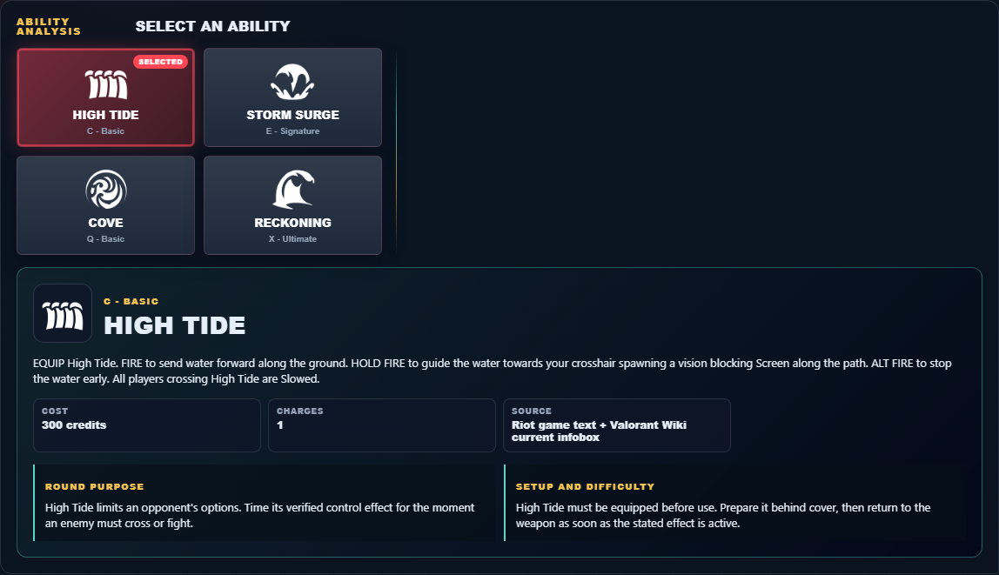

# Library Draft Review — Agent: Harbor — 2026-07-23

## Summary

One-time full-coverage baseline. 2 fields changed for Patch 13.01.

## Screenshot

## Field-by-field changes

| Field | Tier | Before | After | Sources checked | Confidence |
| --- | --- | --- | --- | --- | --- |
| `abilities` | canonical | [   {     "id": "high-tide",     "name": "High Tide",     "slot": "Q - Basic",     "icon": "https://media.valorant-api.com/agents/95b78ed7-4637-86d9-7e41-71ba8c293152/abilities/ability1/displayicon.png",     "summary": "EQUIP High Tide. FIRE to send water forward along the ground. HOLD FIRE to guide the water towards your crosshair spawning a vision blocking Screen along the path. ALT FIRE to stop the water early. All players crossing High Tide are Slowed.",     "stats": {       "Cost": "300 credits",       "Charges": "1",       "Source": "Riot game text + Valorant Wiki current infobox"     },     "purpose": "High Tide limits an opponent's options. Time its verified control effect for the moment an enemy must cross or fight.",     "setup": "High Tide must be equipped before use. Prepare it behind cover, then return to the weapon as soon as the stated effect is active.",     "source": "https://valorant-api.com/v1/agents/95b78ed7-4637-86d9-7e41-71ba8c293152?language=en-US"   },   {     "id": "storm-surge",     "name": "Storm Surge",     "slot": "C - Basic",     "icon": "https://media.valorant-api.com/agents/95b78ed7-4637-86d9-7e41-71ba8c293152/abilities/grenade/displayicon.png",     "summary": "EQUIP Storm Surge. FIRE to throw, creating an explosive whirlpool that Slows and Nearsights players within it after a short duration.",     "stats": {       "Cost": "200 credits",       "Charges": "1",       "Source": "Riot game text + Valorant Wiki current infobox"     },     "purpose": "Storm Surge is the kit's vision-denial tool. Use its verified blind or Nearsight effect immediately before the team contests the affected angle.",     "setup": "Storm Surge must be equipped before use. Prepare it behind cover, then return to the weapon as soon as the stated effect is active.",     "source": "https://valorant-api.com/v1/agents/95b78ed7-4637-86d9-7e41-71ba8c293152?language=en-US"   },   {     "id": "cove",     "name": "Cove",     "slot": "E - Signature",     "icon": "https://media.valorant-api.com/agents/95b78ed7-4637-86d9-7e41-71ba8c293152/abilities/ability2/displayicon.png",     "summary": "EQUIP Cove. ACTIVATE to form a water Smoke in the select location. HOLD FIRE while targeting to move the marker further away and HOLD ALT FIRE to move it closer. RELOAD to toggle targeting view. REACTIVATE to Shield the water Smoke, blocking any bullets that hit it. The Shielded water Smoke can be destroyed.",     "stats": {       "Cost": "Free signature charge",       "Charges": "1",       "Source": "Riot game text + Valorant Wiki current infobox"     },     "purpose": "Cove controls sightlines. Place it on the specific defender view the team needs removed, then move while that view is blocked.",     "setup": "Cove must be equipped before use. Prepare it behind cover, then return to the weapon as soon as the stated effect is active.",     "source": "https://valorant-api.com/v1/agents/95b78ed7-4637-86d9-7e41-71ba8c293152?language=en-US"   },   {     "id": "reckoning",     "name": "Reckoning",     "slot": "X - Ultimate",     "icon": "https://media.valorant-api.com/agents/95b78ed7-4637-86d9-7e41-71ba8c293152/abilities/ultimate/displayicon.png",     "summary": "EQUIP Reckoning. FIRE to unleash the full power of your artifact, releasing a surge of water that barrels forward to Nearsight and Slow enemies that are hit.",     "stats": {       "Cost": "7 ultimate points",       "Charges": "Current client value not published in Riot's public content feed",       "Source": "Riot game text + Valorant Wiki current infobox"     },     "purpose": "Reckoning is the kit's vision-denial tool. Use its verified blind or Nearsight effect immediately before the team contests the affected angle.",     "setup": "Reckoning must be equipped before use. Prepare it behind cover, then return to the weapon as soon as the stated effect is active.",     "source": "https://valorant-api.com/v1/agents/95b78ed7-4637-86d9-7e41-71ba8c293152?language=en-US"   } ] | [   {     "id": "high-tide",     "name": "High Tide",     "slot": "C - Basic",     "icon": "https://media.valorant-api.com/agents/95b78ed7-4637-86d9-7e41-71ba8c293152/abilities/ability1/displayicon.png",     "summary": "EQUIP High Tide. FIRE to send water forward along the ground. HOLD FIRE to guide the water towards your crosshair spawning a vision blocking Screen along the path. ALT FIRE to stop the water early. All players crossing High Tide are Slowed.",     "stats": {       "Cost": "300 credits",       "Charges": "1",       "Source": "Riot game text + Valorant Wiki current infobox"     },     "purpose": "High Tide limits an opponent's options. Time its verified control effect for the moment an enemy must cross or fight.",     "setup": "High Tide must be equipped before use. Prepare it behind cover, then return to the weapon as soon as the stated effect is active.",     "source": "https://valorant-api.com/v1/agents/95b78ed7-4637-86d9-7e41-71ba8c293152?language=en-US"   },   {     "id": "storm-surge",     "name": "Storm Surge",     "slot": "E - Signature",     "icon": "https://media.valorant-api.com/agents/95b78ed7-4637-86d9-7e41-71ba8c293152/abilities/grenade/displayicon.png",     "summary": "EQUIP Storm Surge. FIRE to throw, creating an explosive whirlpool that Slows and Nearsights players within it after a short duration.",     "stats": {       "Cost": "200 credits",       "Charges": "1",       "Source": "Riot game text + Valorant Wiki current infobox"     },     "purpose": "Storm Surge is the kit's vision-denial tool. Use its verified blind or Nearsight effect immediately before the team contests the affected angle.",     "setup": "Storm Surge must be equipped before use. Prepare it behind cover, then return to the weapon as soon as the stated effect is active.",     "source": "https://valorant-api.com/v1/agents/95b78ed7-4637-86d9-7e41-71ba8c293152?language=en-US"   },   {     "id": "cove",     "name": "Cove",     "slot": "Q - Basic",     "icon": "https://media.valorant-api.com/agents/95b78ed7-4637-86d9-7e41-71ba8c293152/abilities/ability2/displayicon.png",     "summary": "EQUIP Cove. ACTIVATE to form a water Smoke in the select location. HOLD FIRE while targeting to move the marker further away and HOLD ALT FIRE to move it closer. RELOAD to toggle targeting view. REACTIVATE to Shield the water Smoke, blocking any bullets that hit it. The Shielded water Smoke can be destroyed.",     "stats": {       "Cost": "Free signature charge",       "Charges": "1",       "Source": "Riot game text + Valorant Wiki current infobox"     },     "purpose": "Cove controls sightlines. Place it on the specific defender view the team needs removed, then move while that view is blocked.",     "setup": "Cove must be equipped before use. Prepare it behind cover, then return to the weapon as soon as the stated effect is active.",     "source": "https://valorant-api.com/v1/agents/95b78ed7-4637-86d9-7e41-71ba8c293152?language=en-US"   },   {     "id": "reckoning",     "name": "Reckoning",     "slot": "X - Ultimate",     "icon": "https://media.valorant-api.com/agents/95b78ed7-4637-86d9-7e41-71ba8c293152/abilities/ultimate/displayicon.png",     "summary": "EQUIP Reckoning. FIRE to unleash the full power of your artifact, releasing a surge of water that barrels forward to Nearsight and Slow enemies that are hit.",     "stats": {       "Cost": "7 ultimate points",       "Charges": "Current client value not published in Riot's public content feed",       "Source": "Riot game text + Valorant Wiki current infobox"     },     "purpose": "Reckoning is the kit's vision-denial tool. Use its verified blind or Nearsight effect immediately before the team contests the affected angle.",     "setup": "Reckoning must be equipped before use. Prepare it behind cover, then return to the weapon as soon as the stated effect is active.",     "source": "https://valorant-api.com/v1/agents/95b78ed7-4637-86d9-7e41-71ba8c293152?language=en-US"   } ] | [https://valorant-api.com/v1/agents/95b78ed7-4637-86d9-7e41-71ba8c293152?language=en-US](https://valorant-api.com/v1/agents/95b78ed7-4637-86d9-7e41-71ba8c293152?language=en-US) | n/a (auto-approved) |
| `uuid` | canonical |  | 95b78ed7-4637-86d9-7e41-71ba8c293152 | [https://valorant-api.com/v1/agents/95b78ed7-4637-86d9-7e41-71ba8c293152?language=en-US](https://valorant-api.com/v1/agents/95b78ed7-4637-86d9-7e41-71ba8c293152?language=en-US) | n/a (auto-approved) |

## Approval

- [ ] Approved as-is
- [ ] Approved with edits (note edits below)
- [ ] Rejected (note why below)

Notes:

Promotion totals: 2 canonical, 0 synthesized, 0 mixed-tier field groups.
