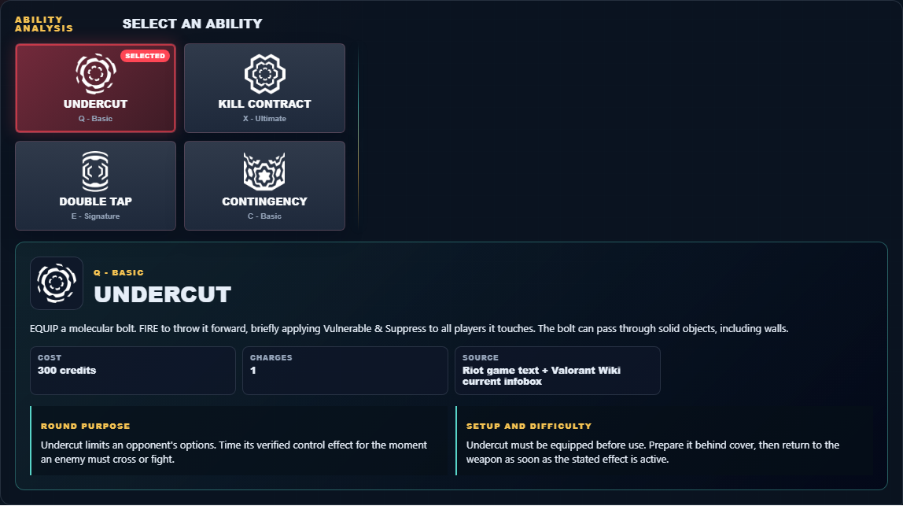

# Library Draft Review — Agent: Iso — 2026-07-23

## Summary

One-time full-coverage baseline. 2 fields changed for Patch 13.01.

## Screenshot

## Field-by-field changes

| Field | Tier | Before | After | Sources checked | Confidence |
| --- | --- | --- | --- | --- | --- |
| `abilities` | canonical | [   {     "id": "undercut",     "name": "Undercut",     "slot": "Q - Basic",     "icon": "https://media.valorant-api.com/agents/0e38b510-41a8-5780-5e8f-568b2a4f2d6c/abilities/ability1/displayicon.png",     "summary": "EQUIP a molecular bolt. FIRE to throw it forward, briefly applying Vulnerable & Suppress to all players it touches. The bolt can pass through solid objects, including walls.",     "stats": {       "Cost": "300 credits",       "Charges": "1",       "Source": "Riot game text + Valorant Wiki current infobox"     },     "purpose": "Undercut limits an opponent's options. Time its verified control effect for the moment an enemy must cross or fight.",     "setup": "Undercut must be equipped before use. Prepare it behind cover, then return to the weapon as soon as the stated effect is active.",     "source": "https://valorant-api.com/v1/agents/0e38b510-41a8-5780-5e8f-568b2a4f2d6c?language=en-US"   },   {     "id": "kill-contract",     "name": "Kill Contract",     "slot": "X - Ultimate",     "icon": "https://media.valorant-api.com/agents/0e38b510-41a8-5780-5e8f-568b2a4f2d6c/abilities/ultimate/displayicon.png",     "summary": "EQUIP an interdimensional arena. FIRE to hurl a column of energy through the battlefield, pulling and healing both you and the first enemy hit into the arena to duel to the death.",     "stats": {       "Cost": "7 ultimate points",       "Charges": "Current client value not published in Riot's public content feed",       "Source": "Riot game text + Valorant Wiki current infobox"     },     "purpose": "Kill Contract preserves team resources. Use its verified recovery effect only when the restored player can safely return to a useful fight.",     "setup": "Kill Contract must be equipped before use. Prepare it behind cover, then return to the weapon as soon as the stated effect is active.",     "source": "https://valorant-api.com/v1/agents/0e38b510-41a8-5780-5e8f-568b2a4f2d6c?language=en-US"   },   {     "id": "double-tap",     "name": "Double Tap",     "slot": "E - Signature",     "icon": "https://media.valorant-api.com/agents/0e38b510-41a8-5780-5e8f-568b2a4f2d6c/abilities/ability2/displayicon.png",     "summary": "INSTANTLY start channeling your focus. Once focused: gain a shield which absorbs one instance of damage from any source, reload more quickly, and enter a flow state during which downed enemies you kill or damage spawn an energy orb. Shooting this orb refreshes your flow state and your existing shield, or grants another.",     "stats": {       "Cost": "Free signature charge",       "Charges": "1",       "Source": "Riot game text + Valorant Wiki current infobox"     },     "purpose": "Double Tap applies direct pressure. Pair its verified damage effect with a confirmed position rather than spending it on an unchecked guess.",     "setup": "Double Tap includes a channel, windup, or delay in its official behavior. Start it from safety and account for that time before contact.",     "source": "https://valorant-api.com/v1/agents/0e38b510-41a8-5780-5e8f-568b2a4f2d6c?language=en-US"   },   {     "id": "contingency",     "name": "Contingency",     "slot": "C - Basic",     "icon": "https://media.valorant-api.com/agents/0e38b510-41a8-5780-5e8f-568b2a4f2d6c/abilities/grenade/displayicon.png",     "summary": "EQUIP to assemble prismatic energy. FIRE to push an indestructible wall of energy forward that blocks bullets. ALT FIRE to push out a slower version of the wall.",     "stats": {       "Cost": "200 credits",       "Charges": "1",       "Source": "Riot game text + Valorant Wiki current infobox"     },     "purpose": "Contingency controls sightlines. Place it on the specific defender view the team needs removed, then move while that view is blocked.",     "setup": "Contingency must be equipped before use. Prepare it behind cover, then return to the weapon as soon as the stated effect is active.",     "source": "https://valorant-api.com/v1/agents/0e38b510-41a8-5780-5e8f-568b2a4f2d6c?language=en-US"   } ] | [   {     "id": "undercut",     "name": "Undercut",     "slot": "C - Basic",     "icon": "https://media.valorant-api.com/agents/0e38b510-41a8-5780-5e8f-568b2a4f2d6c/abilities/ability1/displayicon.png",     "summary": "EQUIP a molecular bolt. FIRE to throw it forward, briefly applying Vulnerable & Suppress to all players it touches. The bolt can pass through solid objects, including walls.",     "stats": {       "Cost": "300 credits",       "Charges": "1",       "Source": "Riot game text + Valorant Wiki current infobox"     },     "purpose": "Undercut limits an opponent's options. Time its verified control effect for the moment an enemy must cross or fight.",     "setup": "Undercut must be equipped before use. Prepare it behind cover, then return to the weapon as soon as the stated effect is active.",     "source": "https://valorant-api.com/v1/agents/0e38b510-41a8-5780-5e8f-568b2a4f2d6c?language=en-US"   },   {     "id": "kill-contract",     "name": "Kill Contract",     "slot": "X - Ultimate",     "icon": "https://media.valorant-api.com/agents/0e38b510-41a8-5780-5e8f-568b2a4f2d6c/abilities/ultimate/displayicon.png",     "summary": "EQUIP an interdimensional arena. FIRE to hurl a column of energy through the battlefield, pulling and healing both you and the first enemy hit into the arena to duel to the death.",     "stats": {       "Cost": "7 ultimate points",       "Charges": "Current client value not published in Riot's public content feed",       "Source": "Riot game text + Valorant Wiki current infobox"     },     "purpose": "Kill Contract preserves team resources. Use its verified recovery effect only when the restored player can safely return to a useful fight.",     "setup": "Kill Contract must be equipped before use. Prepare it behind cover, then return to the weapon as soon as the stated effect is active.",     "source": "https://valorant-api.com/v1/agents/0e38b510-41a8-5780-5e8f-568b2a4f2d6c?language=en-US"   },   {     "id": "double-tap",     "name": "Double Tap",     "slot": "Q - Basic",     "icon": "https://media.valorant-api.com/agents/0e38b510-41a8-5780-5e8f-568b2a4f2d6c/abilities/ability2/displayicon.png",     "summary": "INSTANTLY start channeling your focus. Once focused: gain a shield which absorbs one instance of damage from any source, reload more quickly, and enter a flow state during which downed enemies you kill or damage spawn an energy orb. Shooting this orb refreshes your flow state and your existing shield, or grants another.",     "stats": {       "Cost": "Free signature charge",       "Charges": "1",       "Source": "Riot game text + Valorant Wiki current infobox"     },     "purpose": "Double Tap applies direct pressure. Pair its verified damage effect with a confirmed position rather than spending it on an unchecked guess.",     "setup": "Double Tap includes a channel, windup, or delay in its official behavior. Start it from safety and account for that time before contact.",     "source": "https://valorant-api.com/v1/agents/0e38b510-41a8-5780-5e8f-568b2a4f2d6c?language=en-US"   },   {     "id": "contingency",     "name": "Contingency",     "slot": "E - Signature",     "icon": "https://media.valorant-api.com/agents/0e38b510-41a8-5780-5e8f-568b2a4f2d6c/abilities/grenade/displayicon.png",     "summary": "EQUIP to assemble prismatic energy. FIRE to push an indestructible wall of energy forward that blocks bullets. ALT FIRE to push out a slower version of the wall.",     "stats": {       "Cost": "200 credits",       "Charges": "1",       "Source": "Riot game text + Valorant Wiki current infobox"     },     "purpose": "Contingency controls sightlines. Place it on the specific defender view the team needs removed, then move while that view is blocked.",     "setup": "Contingency must be equipped before use. Prepare it behind cover, then return to the weapon as soon as the stated effect is active.",     "source": "https://valorant-api.com/v1/agents/0e38b510-41a8-5780-5e8f-568b2a4f2d6c?language=en-US"   } ] | [https://valorant-api.com/v1/agents/0e38b510-41a8-5780-5e8f-568b2a4f2d6c?language=en-US](https://valorant-api.com/v1/agents/0e38b510-41a8-5780-5e8f-568b2a4f2d6c?language=en-US) | n/a (auto-approved) |
| `uuid` | canonical |  | 0e38b510-41a8-5780-5e8f-568b2a4f2d6c | [https://valorant-api.com/v1/agents/0e38b510-41a8-5780-5e8f-568b2a4f2d6c?language=en-US](https://valorant-api.com/v1/agents/0e38b510-41a8-5780-5e8f-568b2a4f2d6c?language=en-US) | n/a (auto-approved) |

## Approval

- [ ] Approved as-is
- [ ] Approved with edits (note edits below)
- [ ] Rejected (note why below)

Notes:

Promotion totals: 2 canonical, 0 synthesized, 0 mixed-tier field groups.
