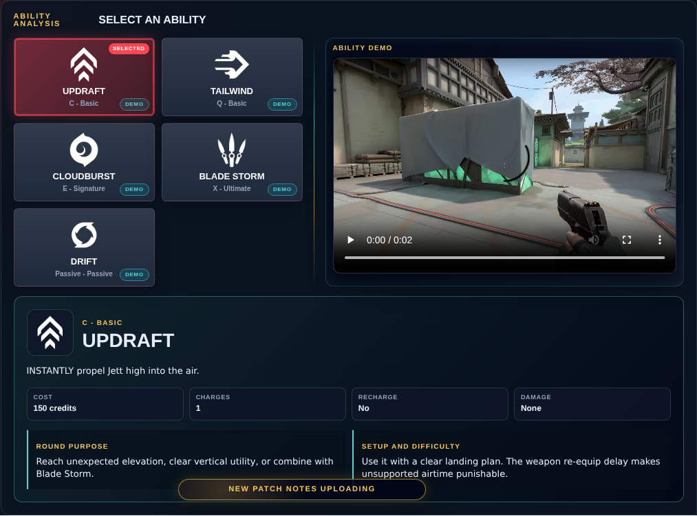

# Library Draft Review — Agent: Jett — 2026-08-15

## Summary

Scheduled canonical refresh. 1 field changed for Patch 13.02.

## Screenshot

## Field-by-field changes

| Field | Tier | Before | After | Sources checked | Confidence |
| --- | --- | --- | --- | --- | --- |
| `abilities` | canonical | [   {     "id": "updraft",     "name": "Updraft",     "slot": "C - Basic",     "icon": "https://media.valorant-api.com/agents/add6443a-41bd-e414-f6ad-e58d267f4e95/abilities/ability1/displayicon.png",     "summary": "INSTANTLY propel Jett high into the air.",     "stats": {       "Cost": "150 credits",       "Charges": "1",       "Recharge": "No",       "Damage": "None"     },     "purpose": "Reach unexpected elevation, clear vertical utility, or combine with Blade Storm.",     "setup": "Use it with a clear landing plan. The weapon re-equip delay makes unsupported airtime punishable.",     "video": {       "src": "https://cmsassets.rgpub.io/sanity/files/dsfx7636/game_data/4cbc968f05713579aae9464c5a16dc3f6863f943.mp4?accountingTag=VAL",       "title": "UPDRAFT",       "source": "https://playvalorant.com/en-us/agents/jett/",       "provider": "riot"     },     "source": "https://valorant-api.com/v1/agents/add6443a-41bd-e414-f6ad-e58d267f4e95?language=en-US"   },   {     "id": "tailwind",     "name": "Tailwind",     "slot": "Q - Basic",     "icon": "https://media.valorant-api.com/agents/add6443a-41bd-e414-f6ad-e58d267f4e95/abilities/ability2/displayicon.png",     "summary": "ACTIVATE to prepare a gust of wind for a limited time. RE-USE the wind to propel Jett in the direction she is moving. If Jett is standing still, she propels forward. Tailwind charge resets every two kills.",     "stats": {       "Cost": "Free",       "Charges": "1",       "Recharge": "After 2 kills",       "Damage": "None"     },     "purpose": "Create entry space or escape after an Operator shot or opening duel.",     "setup": "Use the dash with a clear destination. It should end behind cover or inside a planned Cloudburst.",     "video": {       "src": "https://cmsassets.rgpub.io/sanity/files/dsfx7636/game_data/ec6b3cf1f8ac09d597b0193de1d7bb81335b40e4.mp4?accountingTag=VAL",       "title": "TAILWIND",       "source": "https://playvalorant.com/en-us/agents/jett/",       "provider": "riot"     },     "source": "https://valorant-api.com/v1/agents/add6443a-41bd-e414-f6ad-e58d267f4e95?language=en-US"   },   {     "id": "cloudburst",     "name": "Cloudburst",     "slot": "E - Signature",     "icon": "https://media.valorant-api.com/agents/add6443a-41bd-e414-f6ad-e58d267f4e95/abilities/grenade/displayicon.png",     "summary": "INSTANTLY throw a projectile that expands into a brief vision-blocking cloud on impact with a surface. HOLD the ability key to curve the smoke in the direction of your crosshair.",     "stats": {       "Cost": "200 credits",       "Charges": "2",       "Duration": "2.5 seconds",       "Damage": "None"     },     "purpose": "Break one sightline long enough to dash, cross, isolate, or retrieve the spike.",     "setup": "Small one-ways are possible, but the short duration makes them a momentary duel tool rather than controller coverage.",     "video": {       "src": "https://cmsassets.rgpub.io/sanity/files/dsfx7636/game_data/3353597819f0c032d56ff947d9762368b4ee6c6b.mp4?accountingTag=VAL",       "title": "CLOUDBURST",       "source": "https://playvalorant.com/en-us/agents/jett/",       "provider": "riot"     },     "source": "https://valorant-api.com/v1/agents/add6443a-41bd-e414-f6ad-e58d267f4e95?language=en-US"   },   {     "id": "blade-storm",     "name": "Blade Storm",     "slot": "X - Ultimate",     "icon": "https://media.valorant-api.com/agents/add6443a-41bd-e414-f6ad-e58d267f4e95/abilities/ultimate/displayicon.png",     "summary": "EQUIP a set of highly accurate throwing knives. FIRE to throw a single knife and recharge knives on a kill. ALT FIRE to throw all remaining daggers but does not recharge on a kill.",     "stats": {       "Cost": "8 ultimate points",       "Ammo": "5 knives",       "Damage": "50 body / 150 head",       "Falloff": "No single-fire falloff"     },     "purpose": "Preserve economy, fight accurately while moving, and pair vertical movement with a weapon that stays precise.",     "setup": "Single-fire for reliable resets. Alternate fire is a close-range commitment and does not restore knives on a kill.",     "video": {       "src": "https://cmsassets.rgpub.io/sanity/files/dsfx7636/game_data/667770571300e065b332617e5c8f2e009ed88928.mp4?accountingTag=VAL",       "title": "BLADE STORM",       "source": "https://playvalorant.com/en-us/agents/jett/",       "provider": "riot"     },     "source": "https://valorant-api.com/v1/agents/add6443a-41bd-e414-f6ad-e58d267f4e95?language=en-US"   },   {     "id": "drift",     "name": "Drift",     "slot": "Passive - Passive",     "icon": "https://media.valorant-api.com/agents/add6443a-41bd-e414-f6ad-e58d267f4e95/abilities/passive/displayicon.png",     "summary": "Holding the jump button while falling allows you to glide through the air.",     "source": "https://valorant-api.com/v1/agents/add6443a-41bd-e414-f6ad-e58d267f4e95?language=en-US",     "video": {       "src": "https://cmsassets.rgpub.io/sanity/files/dsfx7636/game_data/4cbc968f05713579aae9464c5a16dc3f6863f943.mp4?accountingTag=VAL",       "title": "Jett ability showcase",       "source": "https://playvalorant.com/en-us/agents/jett/",       "provider": "riot",       "contextualFallback": true     }   } ] | [   {     "id": "updraft",     "name": "Updraft",     "slot": "C - Basic",     "icon": "https://media.valorant-api.com/agents/add6443a-41bd-e414-f6ad-e58d267f4e95/abilities/ability1/displayicon.png",     "summary": "INSTANTLY propel Jett high into the air.",     "stats": {       "Cost": "150 credits",       "Charges": "1",       "Recharge": "No",       "Damage": "None"     },     "purpose": "Reach unexpected elevation, clear vertical utility, or combine with Blade Storm.",     "setup": "Use it with a clear landing plan. The weapon re-equip delay makes unsupported airtime punishable.",     "video": {       "src": "https://cmsassets.rgpub.io/sanity/files/dsfx7636/game_data/4cbc968f05713579aae9464c5a16dc3f6863f943.mp4?accountingTag=VAL",       "title": "Jett Updraft ability demo",       "source": "https://playvalorant.com/en-us/agents/",       "provider": "riot"     },     "source": "https://valorant-api.com/v1/agents/add6443a-41bd-e414-f6ad-e58d267f4e95?language=en-US"   },   {     "id": "tailwind",     "name": "Tailwind",     "slot": "Q - Basic",     "icon": "https://media.valorant-api.com/agents/add6443a-41bd-e414-f6ad-e58d267f4e95/abilities/ability2/displayicon.png",     "summary": "ACTIVATE to prepare a gust of wind for a limited time. RE-USE the wind to propel Jett in the direction she is moving. If Jett is standing still, she propels forward. Tailwind charge resets every two kills.",     "stats": {       "Cost": "Free",       "Charges": "1",       "Recharge": "After 2 kills",       "Damage": "None"     },     "purpose": "Create entry space or escape after an Operator shot or opening duel.",     "setup": "Use the dash with a clear destination. It should end behind cover or inside a planned Cloudburst.",     "video": {       "src": "https://cmsassets.rgpub.io/sanity/files/dsfx7636/game_data/ec6b3cf1f8ac09d597b0193de1d7bb81335b40e4.mp4?accountingTag=VAL",       "title": "Jett Tailwind ability demo",       "source": "https://playvalorant.com/en-us/agents/",       "provider": "riot"     },     "source": "https://valorant-api.com/v1/agents/add6443a-41bd-e414-f6ad-e58d267f4e95?language=en-US"   },   {     "id": "cloudburst",     "name": "Cloudburst",     "slot": "E - Signature",     "icon": "https://media.valorant-api.com/agents/add6443a-41bd-e414-f6ad-e58d267f4e95/abilities/grenade/displayicon.png",     "summary": "INSTANTLY throw a projectile that expands into a brief vision-blocking cloud on impact with a surface. HOLD the ability key to curve the smoke in the direction of your crosshair.",     "stats": {       "Cost": "200 credits",       "Charges": "2",       "Duration": "2.5 seconds",       "Damage": "None"     },     "purpose": "Break one sightline long enough to dash, cross, isolate, or retrieve the spike.",     "setup": "Small one-ways are possible, but the short duration makes them a momentary duel tool rather than controller coverage.",     "video": {       "src": "https://cmsassets.rgpub.io/sanity/files/dsfx7636/game_data/3353597819f0c032d56ff947d9762368b4ee6c6b.mp4?accountingTag=VAL",       "title": "Jett Cloudburst ability demo",       "source": "https://playvalorant.com/en-us/agents/",       "provider": "riot"     },     "source": "https://valorant-api.com/v1/agents/add6443a-41bd-e414-f6ad-e58d267f4e95?language=en-US"   },   {     "id": "blade-storm",     "name": "Blade Storm",     "slot": "X - Ultimate",     "icon": "https://media.valorant-api.com/agents/add6443a-41bd-e414-f6ad-e58d267f4e95/abilities/ultimate/displayicon.png",     "summary": "EQUIP a set of highly accurate throwing knives. FIRE to throw a single knife and recharge knives on a kill. ALT FIRE to throw all remaining daggers but does not recharge on a kill.",     "stats": {       "Cost": "8 ultimate points",       "Ammo": "5 knives",       "Damage": "50 body / 150 head",       "Falloff": "No single-fire falloff"     },     "purpose": "Preserve economy, fight accurately while moving, and pair vertical movement with a weapon that stays precise.",     "setup": "Single-fire for reliable resets. Alternate fire is a close-range commitment and does not restore knives on a kill.",     "video": {       "src": "https://cmsassets.rgpub.io/sanity/files/dsfx7636/game_data/667770571300e065b332617e5c8f2e009ed88928.mp4?accountingTag=VAL",       "title": "Jett Blade Storm ability demo",       "source": "https://playvalorant.com/en-us/agents/",       "provider": "riot"     },     "source": "https://valorant-api.com/v1/agents/add6443a-41bd-e414-f6ad-e58d267f4e95?language=en-US"   },   {     "id": "drift",     "name": "Drift",     "slot": "Passive - Passive",     "icon": "https://media.valorant-api.com/agents/add6443a-41bd-e414-f6ad-e58d267f4e95/abilities/passive/displayicon.png",     "summary": "Holding the jump button while falling allows you to glide through the air.",     "source": "https://valorant-api.com/v1/agents/add6443a-41bd-e414-f6ad-e58d267f4e95?language=en-US"   } ] | [https://valorant-api.com/v1/agents/add6443a-41bd-e414-f6ad-e58d267f4e95?language=en-US](https://valorant-api.com/v1/agents/add6443a-41bd-e414-f6ad-e58d267f4e95?language=en-US) | n/a (auto-approved) |

## Approval

- [ ] Approved as-is
- [ ] Approved with edits (note edits below)
- [ ] Rejected (note why below)

Notes:

Promotion totals: 1 canonical, 0 synthesized, 0 mixed-tier field groups.
