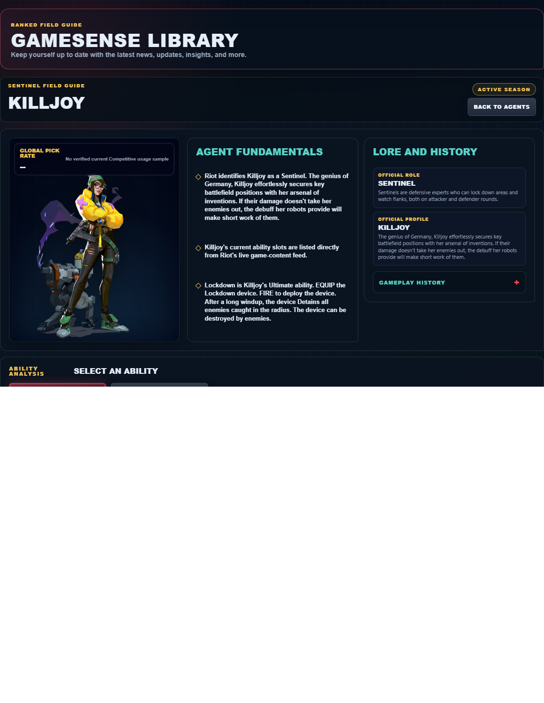

# Library Draft Review — Agent: Killjoy — 2026-07-23

## Summary

One-time full-coverage baseline. 2 fields changed for Patch 13.01.

## Screenshot

## Field-by-field changes

| Field | Tier | Before | After | Sources checked | Confidence |
| --- | --- | --- | --- | --- | --- |
| `abilities` | canonical | [   {     "id": "nanoswarm",     "name": "Nanoswarm",     "slot": "C - Basic",     "icon": "https://media.valorant-api.com/agents/1e58de9c-4950-5125-93e9-a0aee9f98746/abilities/grenade/displayicon.png",     "summary": "EQUIP a Nanoswarm grenade. FIRE to throw the grenade. Upon landing, the Nanoswarm goes covert. ALT FIRE to lob. ACTIVATE the Nanoswarm to deploy a damaging swarm of nanobots.  ",     "stats": {       "Cost": "200 credits",       "Charges": "2",       "Source": "Riot game text + Valorant Wiki current infobox"     },     "purpose": "Nanoswarm applies direct pressure. Pair its verified damage effect with a confirmed position rather than spending it on an unchecked guess.",     "setup": "Nanoswarm must be equipped before use. Prepare it behind cover, then return to the weapon as soon as the stated effect is active.",     "source": "https://valorant-api.com/v1/agents/1e58de9c-4950-5125-93e9-a0aee9f98746?language=en-US"   },   {     "id": "alarmbot",     "name": "ALARMBOT",     "slot": "Q - Basic",     "icon": "https://media.valorant-api.com/agents/1e58de9c-4950-5125-93e9-a0aee9f98746/abilities/ability1/displayicon.png",     "summary": "EQUIP a covert Alarmbot. FIRE to deploy a bot that hunts down enemies that get in range.  After reaching its target, the bot explodes and applies Vulnerable to enemies in the area. HOLD EQUIP to recall a deployed bot.",     "stats": {       "Cost": "Current client value not published in Riot's public content feed",       "Charges": "Current client value not published in Riot's public content feed",       "Source": "Riot game text; economy detail unavailable"     },     "purpose": "ALARMBOT applies direct pressure. Pair its verified damage effect with a confirmed position rather than spending it on an unchecked guess.",     "setup": "ALARMBOT must be equipped before use. Prepare it behind cover, then return to the weapon as soon as the stated effect is active.",     "source": "https://valorant-api.com/v1/agents/1e58de9c-4950-5125-93e9-a0aee9f98746?language=en-US"   },   {     "id": "turret",     "name": "TURRET",     "slot": "E - Signature",     "icon": "https://media.valorant-api.com/agents/1e58de9c-4950-5125-93e9-a0aee9f98746/abilities/ability2/displayicon.png",     "summary": "EQUIP a Turret. FIRE to deploy a turret that fires at enemies in a 100 degree cone. While targeting, EQUIP again to swap turret direction, HOLD ALT FIRE to rotate. HOLD EQUIP to recall the deployed turret.",     "stats": {       "Cost": "Current client value not published in Riot's public content feed",       "Charges": "Current client value not published in Riot's public content feed",       "Source": "Riot game text; economy detail unavailable"     },     "purpose": "TURRET performs the exact function in Riot's current description. Build the play around that stated effect instead of assuming an unlisted interaction.",     "setup": "TURRET must be equipped before use. Prepare it behind cover, then return to the weapon as soon as the stated effect is active.",     "source": "https://valorant-api.com/v1/agents/1e58de9c-4950-5125-93e9-a0aee9f98746?language=en-US"   },   {     "id": "lockdown",     "name": "Lockdown",     "slot": "X - Ultimate",     "icon": "https://media.valorant-api.com/agents/1e58de9c-4950-5125-93e9-a0aee9f98746/abilities/ultimate/displayicon.png",     "summary": "EQUIP the Lockdown device. FIRE to deploy the device. After a long windup, the device Detains all enemies caught in the radius. The device can be destroyed by enemies.",     "stats": {       "Cost": "9 ultimate points",       "Charges": "Current client value not published in Riot's public content feed",       "Source": "Riot game text + Valorant Wiki current infobox"     },     "purpose": "Lockdown limits an opponent's options. Time its verified control effect for the moment an enemy must cross or fight.",     "setup": "Lockdown must be equipped before use. Prepare it behind cover, then return to the weapon as soon as the stated effect is active.",     "source": "https://valorant-api.com/v1/agents/1e58de9c-4950-5125-93e9-a0aee9f98746?language=en-US"   } ] | [   {     "id": "nanoswarm",     "name": "Nanoswarm",     "slot": "E - Signature",     "icon": "https://media.valorant-api.com/agents/1e58de9c-4950-5125-93e9-a0aee9f98746/abilities/grenade/displayicon.png",     "summary": "EQUIP a Nanoswarm grenade. FIRE to throw the grenade. Upon landing, the Nanoswarm goes covert. ALT FIRE to lob. ACTIVATE the Nanoswarm to deploy a damaging swarm of nanobots.  ",     "stats": {       "Cost": "200 credits",       "Charges": "2",       "Source": "Riot game text + Valorant Wiki current infobox"     },     "purpose": "Nanoswarm applies direct pressure. Pair its verified damage effect with a confirmed position rather than spending it on an unchecked guess.",     "setup": "Nanoswarm must be equipped before use. Prepare it behind cover, then return to the weapon as soon as the stated effect is active.",     "source": "https://valorant-api.com/v1/agents/1e58de9c-4950-5125-93e9-a0aee9f98746?language=en-US"   },   {     "id": "alarmbot",     "name": "ALARMBOT",     "slot": "C - Basic",     "icon": "https://media.valorant-api.com/agents/1e58de9c-4950-5125-93e9-a0aee9f98746/abilities/ability1/displayicon.png",     "summary": "EQUIP a covert Alarmbot. FIRE to deploy a bot that hunts down enemies that get in range.  After reaching its target, the bot explodes and applies Vulnerable to enemies in the area. HOLD EQUIP to recall a deployed bot.",     "stats": {       "Cost": "Current client value not published in Riot's public content feed",       "Charges": "Current client value not published in Riot's public content feed",       "Source": "Riot game text; economy detail unavailable"     },     "purpose": "ALARMBOT applies direct pressure. Pair its verified damage effect with a confirmed position rather than spending it on an unchecked guess.",     "setup": "ALARMBOT must be equipped before use. Prepare it behind cover, then return to the weapon as soon as the stated effect is active.",     "source": "https://valorant-api.com/v1/agents/1e58de9c-4950-5125-93e9-a0aee9f98746?language=en-US"   },   {     "id": "turret",     "name": "TURRET",     "slot": "Q - Basic",     "icon": "https://media.valorant-api.com/agents/1e58de9c-4950-5125-93e9-a0aee9f98746/abilities/ability2/displayicon.png",     "summary": "EQUIP a Turret. FIRE to deploy a turret that fires at enemies in a 100 degree cone. While targeting, EQUIP again to swap turret direction, HOLD ALT FIRE to rotate. HOLD EQUIP to recall the deployed turret.",     "stats": {       "Cost": "Current client value not published in Riot's public content feed",       "Charges": "Current client value not published in Riot's public content feed",       "Source": "Riot game text; economy detail unavailable"     },     "purpose": "TURRET performs the exact function in Riot's current description. Build the play around that stated effect instead of assuming an unlisted interaction.",     "setup": "TURRET must be equipped before use. Prepare it behind cover, then return to the weapon as soon as the stated effect is active.",     "source": "https://valorant-api.com/v1/agents/1e58de9c-4950-5125-93e9-a0aee9f98746?language=en-US"   },   {     "id": "lockdown",     "name": "Lockdown",     "slot": "X - Ultimate",     "icon": "https://media.valorant-api.com/agents/1e58de9c-4950-5125-93e9-a0aee9f98746/abilities/ultimate/displayicon.png",     "summary": "EQUIP the Lockdown device. FIRE to deploy the device. After a long windup, the device Detains all enemies caught in the radius. The device can be destroyed by enemies.",     "stats": {       "Cost": "9 ultimate points",       "Charges": "Current client value not published in Riot's public content feed",       "Source": "Riot game text + Valorant Wiki current infobox"     },     "purpose": "Lockdown limits an opponent's options. Time its verified control effect for the moment an enemy must cross or fight.",     "setup": "Lockdown must be equipped before use. Prepare it behind cover, then return to the weapon as soon as the stated effect is active.",     "source": "https://valorant-api.com/v1/agents/1e58de9c-4950-5125-93e9-a0aee9f98746?language=en-US"   } ] | [https://valorant-api.com/v1/agents/1e58de9c-4950-5125-93e9-a0aee9f98746?language=en-US](https://valorant-api.com/v1/agents/1e58de9c-4950-5125-93e9-a0aee9f98746?language=en-US) | n/a (auto-approved) |
| `uuid` | canonical |  | 1e58de9c-4950-5125-93e9-a0aee9f98746 | [https://valorant-api.com/v1/agents/1e58de9c-4950-5125-93e9-a0aee9f98746?language=en-US](https://valorant-api.com/v1/agents/1e58de9c-4950-5125-93e9-a0aee9f98746?language=en-US) | n/a (auto-approved) |

## Approval

- [ ] Approved as-is
- [ ] Approved with edits (note edits below)
- [ ] Rejected (note why below)

Notes:

Promotion totals: 2 canonical, 0 synthesized, 0 mixed-tier field groups.
