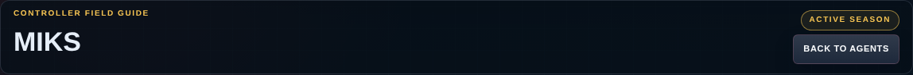
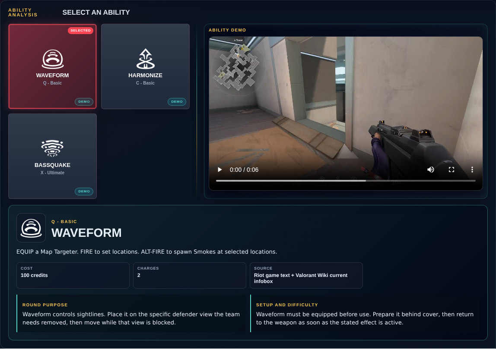

# Library Draft Review — Agent: Miks — 2026-07-30

## Summary

Scheduled canonical refresh. 1 field changed for Patch 13.02.

## Screenshot

## Field-by-field changes

| Field | Tier | Before | After | Sources checked | Confidence |
| --- | --- | --- | --- | --- | --- |
| `abilities` | canonical | [   {     "id": "m-pulse",     "name": "M-pulse",     "slot": "E - Signature",     "icon": "https://media.valorant-api.com/agents/7c8a4701-4de6-9355-b254-e09bc2a34b72/abilities/grenade/displayicon.png",     "summary": "EQUIP M-pulse. ALT-FIRE to toggle between Concuss and Healing outputs. FIRE to throw the device. Upon landing, M-pulse sends out sound waves, either Concussing or Healing players.",     "stats": {       "Cost": "250 credits",       "Charges": "2",       "Source": "Riot game text + Valorant Wiki current infobox"     },     "purpose": "M-pulse preserves team resources. Use its verified recovery effect only when the restored player can safely return to a useful fight.",     "setup": "M-pulse must be equipped before use. Prepare it behind cover, then return to the weapon as soon as the stated effect is active.",     "source": "https://valorant-api.com/v1/agents/7c8a4701-4de6-9355-b254-e09bc2a34b72?language=en-US",     "video": {       "src": "https://cmsassets.rgpub.io/sanity/files/dsfx7636/news_live/71696d85f7392dc2dbbefbf7d6d53b478dd50d1e.mp4?accountingTag=VAL",       "title": "M-pulse",       "source": "https://playvalorant.com/en-us/agents/miks/",       "provider": "riot"     }   },   {     "id": "waveform",     "name": "Waveform",     "slot": "Q - Basic",     "icon": "https://media.valorant-api.com/agents/7c8a4701-4de6-9355-b254-e09bc2a34b72/abilities/ability2/displayicon.png",     "summary": "EQUIP a Map Targeter. FIRE to set locations. ALT-FIRE to spawn Smokes at selected locations.",     "stats": {       "Cost": "100 credits",       "Charges": "2",       "Source": "Riot game text + Valorant Wiki current infobox"     },     "purpose": "Waveform controls sightlines. Place it on the specific defender view the team needs removed, then move while that view is blocked.",     "setup": "Waveform must be equipped before use. Prepare it behind cover, then return to the weapon as soon as the stated effect is active.",     "source": "https://valorant-api.com/v1/agents/7c8a4701-4de6-9355-b254-e09bc2a34b72?language=en-US",     "video": {       "src": "https://cmsassets.rgpub.io/sanity/files/dsfx7636/news_live/aba82134b8cf0f62eb0ba80daa9b6d86380e2348.mp4?accountingTag=VAL",       "title": "WAVEFORM",       "source": "https://playvalorant.com/en-us/agents/miks/",       "provider": "riot"     }   },   {     "id": "harmonize",     "name": "Harmonize",     "slot": "C - Basic",     "icon": "https://media.valorant-api.com/agents/7c8a4701-4de6-9355-b254-e09bc2a34b72/abilities/ability1/displayicon.png",     "summary": "EQUIP Harmonize. Target an ally and FIRE to activate a Combat Stim and a speed boost on yourself and the ally that refreshes with each kill. ALT-FIRE to grant Combat Stim and speed boost to yourself.",     "stats": {       "Cost": "200 credits",       "Charges": "1",       "Source": "Riot game text + Valorant Wiki current infobox"     },     "purpose": "Harmonize changes position. Choose the destination and nearby cover before activating the movement effect described by Riot.",     "setup": "Harmonize must be equipped before use. Prepare it behind cover, then return to the weapon as soon as the stated effect is active.",     "source": "https://valorant-api.com/v1/agents/7c8a4701-4de6-9355-b254-e09bc2a34b72?language=en-US",     "video": {       "src": "https://cmsassets.rgpub.io/sanity/files/dsfx7636/news_live/7fe1ccd5f450d0e4734c4452cedca5bf6fa818fc.mp4?accountingTag=VAL",       "title": "HARMONIZE",       "source": "https://playvalorant.com/en-us/agents/miks/",       "provider": "riot"     }   },   {     "id": "bassquake",     "name": "Bassquake",     "slot": "X - Ultimate",     "icon": "https://media.valorant-api.com/agents/7c8a4701-4de6-9355-b254-e09bc2a34b72/abilities/ultimate/displayicon.png",     "summary": "EQUIP Bassquake. FIRE to build up and unleash Sonic Radiance forward, knocking back, Deafening, and Slowing players.",     "stats": {       "Cost": "8 ultimate points",       "Charges": "Current client value not published in Riot's public content feed",       "Source": "Riot game text + Valorant Wiki current infobox"     },     "purpose": "Bassquake limits an opponent's options. Time its verified control effect for the moment an enemy must cross or fight.",     "setup": "Bassquake must be equipped before use. Prepare it behind cover, then return to the weapon as soon as the stated effect is active.",     "source": "https://valorant-api.com/v1/agents/7c8a4701-4de6-9355-b254-e09bc2a34b72?language=en-US",     "video": {       "src": "https://cmsassets.rgpub.io/sanity/files/dsfx7636/news_live/460f601d6928013be29591766945f2d6bd4759e2.mp4?accountingTag=VAL",       "title": "BASSQUAKE",       "source": "https://playvalorant.com/en-us/agents/miks/",       "provider": "riot"     }   } ] | [   {     "id": "waveform",     "name": "Waveform",     "slot": "Q - Basic",     "icon": "https://media.valorant-api.com/agents/7c8a4701-4de6-9355-b254-e09bc2a34b72/abilities/ability2/displayicon.png",     "summary": "EQUIP a Map Targeter. FIRE to set locations. ALT-FIRE to spawn Smokes at selected locations.",     "stats": {       "Cost": "100 credits",       "Charges": "2",       "Source": "Riot game text + Valorant Wiki current infobox"     },     "purpose": "Waveform controls sightlines. Place it on the specific defender view the team needs removed, then move while that view is blocked.",     "setup": "Waveform must be equipped before use. Prepare it behind cover, then return to the weapon as soon as the stated effect is active.",     "source": "https://valorant-api.com/v1/agents/7c8a4701-4de6-9355-b254-e09bc2a34b72?language=en-US",     "video": {       "src": "https://cmsassets.rgpub.io/sanity/files/dsfx7636/news_live/aba82134b8cf0f62eb0ba80daa9b6d86380e2348.mp4?accountingTag=VAL",       "title": "WAVEFORM",       "source": "https://playvalorant.com/en-us/agents/miks/",       "provider": "riot"     }   },   {     "id": "harmonize",     "name": "Harmonize",     "slot": "C - Basic",     "icon": "https://media.valorant-api.com/agents/7c8a4701-4de6-9355-b254-e09bc2a34b72/abilities/ability1/displayicon.png",     "summary": "EQUIP Harmonize. Target an ally and FIRE to activate a Combat Stim and a speed boost on yourself and the ally that refreshes with each kill. ALT-FIRE to grant Combat Stim and speed boost to yourself.",     "stats": {       "Cost": "200 credits",       "Charges": "1",       "Source": "Riot game text + Valorant Wiki current infobox"     },     "purpose": "Harmonize changes position. Choose the destination and nearby cover before activating the movement effect described by Riot.",     "setup": "Harmonize must be equipped before use. Prepare it behind cover, then return to the weapon as soon as the stated effect is active.",     "source": "https://valorant-api.com/v1/agents/7c8a4701-4de6-9355-b254-e09bc2a34b72?language=en-US",     "video": {       "src": "https://cmsassets.rgpub.io/sanity/files/dsfx7636/news_live/7fe1ccd5f450d0e4734c4452cedca5bf6fa818fc.mp4?accountingTag=VAL",       "title": "HARMONIZE",       "source": "https://playvalorant.com/en-us/agents/miks/",       "provider": "riot"     }   },   {     "id": "bassquake",     "name": "Bassquake",     "slot": "X - Ultimate",     "icon": "https://media.valorant-api.com/agents/7c8a4701-4de6-9355-b254-e09bc2a34b72/abilities/ultimate/displayicon.png",     "summary": "EQUIP Bassquake. FIRE to build up and unleash Sonic Radiance forward, knocking back, Deafening, and Slowing players.",     "stats": {       "Cost": "8 ultimate points",       "Charges": "Current client value not published in Riot's public content feed",       "Source": "Riot game text + Valorant Wiki current infobox"     },     "purpose": "Bassquake limits an opponent's options. Time its verified control effect for the moment an enemy must cross or fight.",     "setup": "Bassquake must be equipped before use. Prepare it behind cover, then return to the weapon as soon as the stated effect is active.",     "source": "https://valorant-api.com/v1/agents/7c8a4701-4de6-9355-b254-e09bc2a34b72?language=en-US",     "video": {       "src": "https://cmsassets.rgpub.io/sanity/files/dsfx7636/news_live/460f601d6928013be29591766945f2d6bd4759e2.mp4?accountingTag=VAL",       "title": "BASSQUAKE",       "source": "https://playvalorant.com/en-us/agents/miks/",       "provider": "riot"     }   } ] | [https://valorant-api.com/v1/agents/7c8a4701-4de6-9355-b254-e09bc2a34b72?language=en-US](https://valorant-api.com/v1/agents/7c8a4701-4de6-9355-b254-e09bc2a34b72?language=en-US) | n/a (auto-approved) |

## Approval

- [ ] Approved as-is
- [ ] Approved with edits (note edits below)
- [ ] Rejected (note why below)

Notes:

Promotion totals: 1 canonical, 0 synthesized, 0 mixed-tier field groups.
