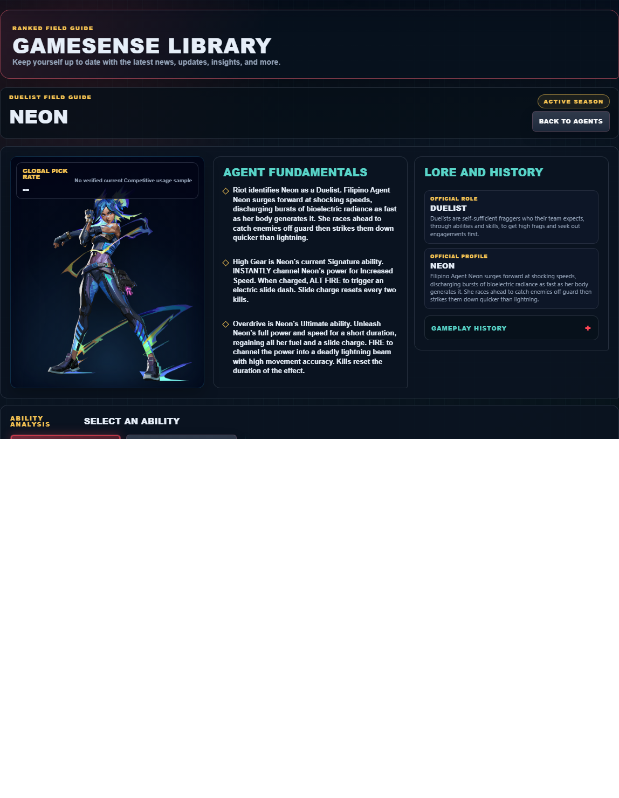
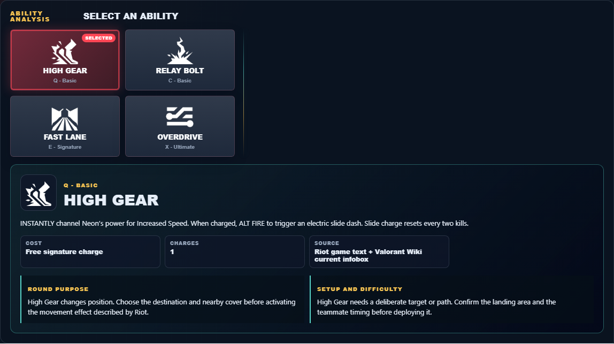

# Library Draft Review — Agent: Neon — 2026-07-23

## Summary

One-time full-coverage baseline. 2 fields changed for Patch 13.01.

## Screenshot

## Field-by-field changes

| Field | Tier | Before | After | Sources checked | Confidence |
| --- | --- | --- | --- | --- | --- |
| `abilities` | canonical | [   {     "id": "high-gear",     "name": "High Gear",     "slot": "E - Signature",     "icon": "https://media.valorant-api.com/agents/bb2a4828-46eb-8cd1-e765-15848195d751/abilities/ability2/displayicon.png",     "summary": "INSTANTLY channel Neon's power for Increased Speed. When charged, ALT FIRE to trigger an electric slide dash. Slide charge resets every two kills.",     "stats": {       "Cost": "Free signature charge",       "Charges": "1",       "Source": "Riot game text + Valorant Wiki current infobox"     },     "purpose": "High Gear changes position. Choose the destination and nearby cover before activating the movement effect described by Riot.",     "setup": "High Gear needs a deliberate target or path. Confirm the landing area and the teammate timing before deploying it.",     "source": "https://valorant-api.com/v1/agents/bb2a4828-46eb-8cd1-e765-15848195d751?language=en-US"   },   {     "id": "relay-bolt",     "name": "Relay Bolt",     "slot": "Q - Basic",     "icon": "https://media.valorant-api.com/agents/bb2a4828-46eb-8cd1-e765-15848195d751/abilities/ability1/displayicon.png",     "summary": "INSTANTLY throw an energy bolt that bounces once. Upon hitting each surface, the bolt electrifies the ground below with a Concussive blast.",     "stats": {       "Cost": "200 credits",       "Charges": "1",       "Source": "Riot game text + Valorant Wiki current infobox"     },     "purpose": "Relay Bolt limits an opponent's options. Time its verified control effect for the moment an enemy must cross or fight.",     "setup": "Relay Bolt needs a deliberate target or path. Confirm the landing area and the teammate timing before deploying it.",     "source": "https://valorant-api.com/v1/agents/bb2a4828-46eb-8cd1-e765-15848195d751?language=en-US"   },   {     "id": "fast-lane",     "name": "Fast Lane",     "slot": "C - Basic",     "icon": "https://media.valorant-api.com/agents/bb2a4828-46eb-8cd1-e765-15848195d751/abilities/grenade/displayicon.png",     "summary": "FIRE two energy lines forward on the ground that extend a short distance or until they hit a surface. The lines rise into walls of static electricity that block vision.",     "stats": {       "Cost": "300 credits",       "Charges": "1",       "Source": "Riot game text + Valorant Wiki current infobox"     },     "purpose": "Fast Lane performs the exact function in Riot's current description. Build the play around that stated effect instead of assuming an unlisted interaction.",     "setup": "Fast Lane needs a deliberate target or path. Confirm the landing area and the teammate timing before deploying it.",     "source": "https://valorant-api.com/v1/agents/bb2a4828-46eb-8cd1-e765-15848195d751?language=en-US"   },   {     "id": "overdrive",     "name": "Overdrive",     "slot": "X - Ultimate",     "icon": "https://media.valorant-api.com/agents/bb2a4828-46eb-8cd1-e765-15848195d751/abilities/ultimate/displayicon.png",     "summary": "Unleash Neon's full power and speed for a short duration, regaining all her fuel and a slide charge. FIRE to channel the power into a deadly lightning beam with high movement accuracy. Kills reset the duration of the effect. ",     "stats": {       "Cost": "8 ultimate points",       "Charges": "Current client value not published in Riot's public content feed",       "Source": "Riot game text + Valorant Wiki current infobox"     },     "purpose": "Overdrive changes position. Choose the destination and nearby cover before activating the movement effect described by Riot.",     "setup": "Overdrive needs a deliberate target or path. Confirm the landing area and the teammate timing before deploying it.",     "source": "https://valorant-api.com/v1/agents/bb2a4828-46eb-8cd1-e765-15848195d751?language=en-US"   } ] | [   {     "id": "high-gear",     "name": "High Gear",     "slot": "Q - Basic",     "icon": "https://media.valorant-api.com/agents/bb2a4828-46eb-8cd1-e765-15848195d751/abilities/ability2/displayicon.png",     "summary": "INSTANTLY channel Neon’s power for Increased Speed. When charged, ALT FIRE to trigger an electric slide dash. Slide charge resets every two kills.",     "stats": {       "Cost": "Free signature charge",       "Charges": "1",       "Source": "Riot game text + Valorant Wiki current infobox"     },     "purpose": "High Gear changes position. Choose the destination and nearby cover before activating the movement effect described by Riot.",     "setup": "High Gear needs a deliberate target or path. Confirm the landing area and the teammate timing before deploying it.",     "source": "https://valorant-api.com/v1/agents/bb2a4828-46eb-8cd1-e765-15848195d751?language=en-US"   },   {     "id": "relay-bolt",     "name": "Relay Bolt",     "slot": "C - Basic",     "icon": "https://media.valorant-api.com/agents/bb2a4828-46eb-8cd1-e765-15848195d751/abilities/ability1/displayicon.png",     "summary": "INSTANTLY throw an energy bolt that bounces once. Upon hitting each surface, the bolt electrifies the ground below with a Concussive blast.",     "stats": {       "Cost": "200 credits",       "Charges": "1",       "Source": "Riot game text + Valorant Wiki current infobox"     },     "purpose": "Relay Bolt limits an opponent's options. Time its verified control effect for the moment an enemy must cross or fight.",     "setup": "Relay Bolt needs a deliberate target or path. Confirm the landing area and the teammate timing before deploying it.",     "source": "https://valorant-api.com/v1/agents/bb2a4828-46eb-8cd1-e765-15848195d751?language=en-US"   },   {     "id": "fast-lane",     "name": "Fast Lane",     "slot": "E - Signature",     "icon": "https://media.valorant-api.com/agents/bb2a4828-46eb-8cd1-e765-15848195d751/abilities/grenade/displayicon.png",     "summary": "FIRE two energy lines forward on the ground that extend a short distance or until they hit a surface. The lines rise into walls of static electricity that block vision.",     "stats": {       "Cost": "300 credits",       "Charges": "1",       "Source": "Riot game text + Valorant Wiki current infobox"     },     "purpose": "Fast Lane performs the exact function in Riot's current description. Build the play around that stated effect instead of assuming an unlisted interaction.",     "setup": "Fast Lane needs a deliberate target or path. Confirm the landing area and the teammate timing before deploying it.",     "source": "https://valorant-api.com/v1/agents/bb2a4828-46eb-8cd1-e765-15848195d751?language=en-US"   },   {     "id": "overdrive",     "name": "Overdrive",     "slot": "X - Ultimate",     "icon": "https://media.valorant-api.com/agents/bb2a4828-46eb-8cd1-e765-15848195d751/abilities/ultimate/displayicon.png",     "summary": "Unleash Neon’s full power and speed for a short duration, regaining all her fuel and a slide charge. FIRE to channel the power into a deadly lightning beam with high movement accuracy. Kills reset the duration of the effect. ",     "stats": {       "Cost": "8 ultimate points",       "Charges": "Current client value not published in Riot's public content feed",       "Source": "Riot game text + Valorant Wiki current infobox"     },     "purpose": "Overdrive changes position. Choose the destination and nearby cover before activating the movement effect described by Riot.",     "setup": "Overdrive needs a deliberate target or path. Confirm the landing area and the teammate timing before deploying it.",     "source": "https://valorant-api.com/v1/agents/bb2a4828-46eb-8cd1-e765-15848195d751?language=en-US"   } ] | [https://valorant-api.com/v1/agents/bb2a4828-46eb-8cd1-e765-15848195d751?language=en-US](https://valorant-api.com/v1/agents/bb2a4828-46eb-8cd1-e765-15848195d751?language=en-US) | n/a (auto-approved) |
| `uuid` | canonical |  | bb2a4828-46eb-8cd1-e765-15848195d751 | [https://valorant-api.com/v1/agents/bb2a4828-46eb-8cd1-e765-15848195d751?language=en-US](https://valorant-api.com/v1/agents/bb2a4828-46eb-8cd1-e765-15848195d751?language=en-US) | n/a (auto-approved) |

## Approval

- [ ] Approved as-is
- [ ] Approved with edits (note edits below)
- [ ] Rejected (note why below)

Notes:

Promotion totals: 2 canonical, 0 synthesized, 0 mixed-tier field groups.
