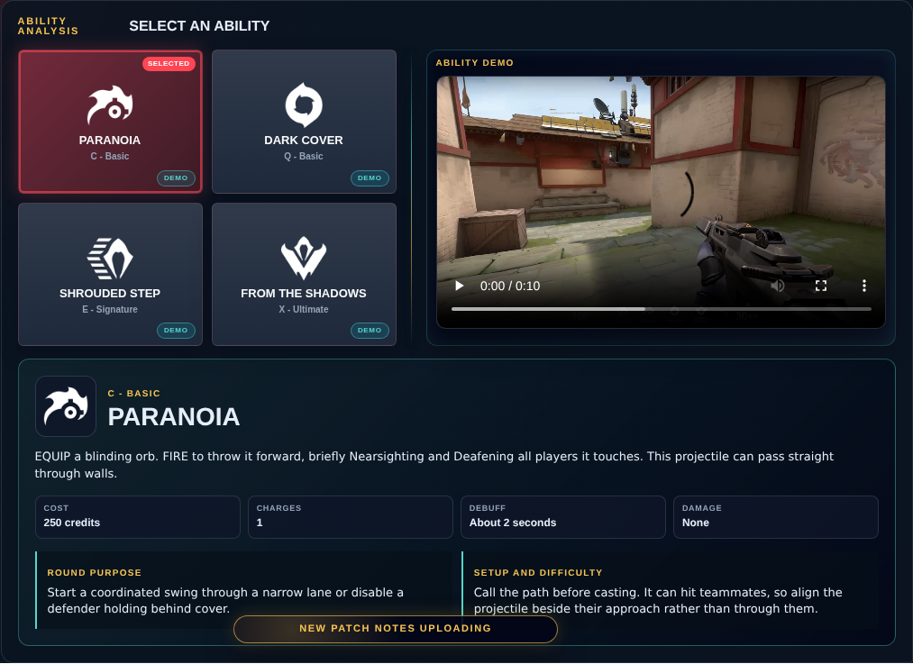
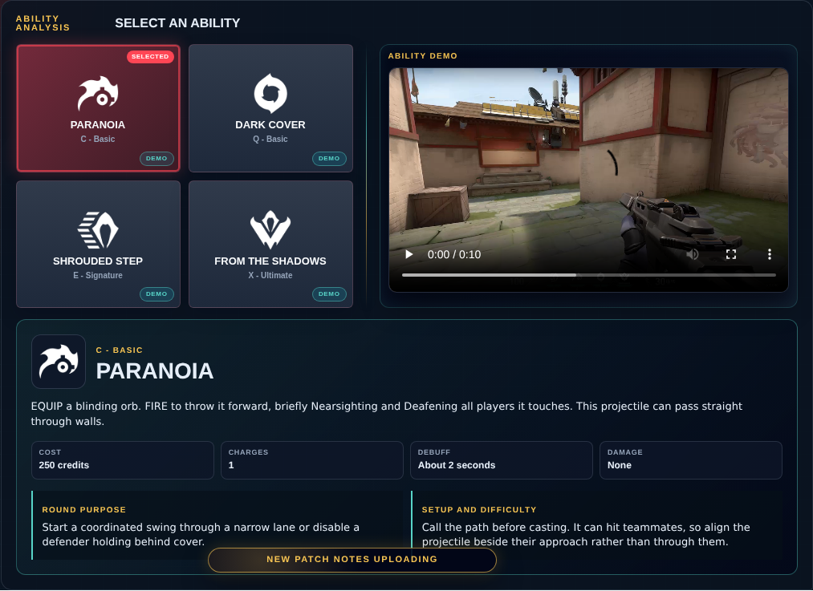

# Library Draft Review — Agent: Omen — 2026-08-16

## Summary

Scheduled canonical refresh. 1 field changed for Patch 13.02.

## Screenshot

## Field-by-field changes

| Field | Tier | Before | After | Sources checked | Confidence |
| --- | --- | --- | --- | --- | --- |
| `abilities` | canonical | [   {     "id": "paranoia",     "name": "Paranoia",     "slot": "C - Basic",     "icon": "https://media.valorant-api.com/agents/8e253930-4c05-31dd-1b6c-968525494517/abilities/ability1/displayicon.png",     "summary": "EQUIP a blinding orb.  FIRE to throw it forward, briefly Nearsighting and Deafening all players it touches. This projectile can pass straight through walls.",     "stats": {       "Cost": "250 credits",       "Charges": "1",       "Debuff": "About 2 seconds",       "Damage": "None"     },     "purpose": "Start a coordinated swing through a narrow lane or disable a defender holding behind cover.",     "setup": "Call the path before casting. It can hit teammates, so align the projectile beside their approach rather than through them.",     "video": {       "src": "https://cmsassets.rgpub.io/sanity/files/dsfx7636/game_data/f401fc788f3182b6d5aa25af6056c842117b1b36.mp4?accountingTag=VAL",       "title": "PARANOIA",       "source": "https://playvalorant.com/en-us/agents/omen/",       "provider": "riot"     },     "source": "https://valorant-api.com/v1/agents/8e253930-4c05-31dd-1b6c-968525494517?language=en-US"   },   {     "id": "dark-cover",     "name": "Dark Cover",     "slot": "Q - Basic",     "icon": "https://media.valorant-api.com/agents/8e253930-4c05-31dd-1b6c-968525494517/abilities/ability2/displayicon.png",     "summary": "EQUIP a shadow orb, entering a phased world to place and target the orbs. PRESS the ability key to throw the shadow orb to the marked location, creating a long-lasting shadow sphere that blocks vision. HOLD FIRE while targeting to move the marker further away. HOLD ALT FIRE while targeting to move the marker closer. PRESS RELOAD to toggle normal targeting view.",     "stats": {       "Cost": "1 free; extra charge 150",       "Charges": "2",       "Duration": "15 seconds",       "Recharge": "Cooldown"     },     "purpose": "Remove named angles, sell pressure across the map, and preserve a smoke for the late round.",     "setup": "One-ways are possible on ledges and boxes, but require consistent placement. A complete execute smoke matters more than a fragile trick setup.",     "video": {       "src": "https://cmsassets.rgpub.io/sanity/files/dsfx7636/game_data/ba0b035a5ff2bb8d9487ba461b3d15900ff50f6b.mp4?accountingTag=VAL",       "title": "DARK COVER",       "source": "https://playvalorant.com/en-us/agents/omen/",       "provider": "riot"     },     "source": "https://valorant-api.com/v1/agents/8e253930-4c05-31dd-1b6c-968525494517?language=en-US"   },   {     "id": "shrouded-step",     "name": "Shrouded Step",     "slot": "E - Signature",     "icon": "https://media.valorant-api.com/agents/8e253930-4c05-31dd-1b6c-968525494517/abilities/grenade/displayicon.png",     "summary": "EQUIP a shrouded step ability and see its range indicator. FIRE to begin a brief channel, then teleport to the marked location.",     "stats": {       "Cost": "100 credits",       "Charges": "2",       "Recharge": "No",       "Damage": "None"     },     "purpose": "Reach elevation, escape utility, cross a watched gap, or reposition after making noise elsewhere.",     "setup": "Hide the channel sound or force the enemy to watch multiple landing points. Unsupported open-ground teleports are a gamble.",     "video": {       "src": "https://cmsassets.rgpub.io/sanity/files/dsfx7636/game_data/33550fee410c5a55ea8832f41827a12aaddb686f.mp4?accountingTag=VAL",       "title": "SHROUDED STEP",       "source": "https://playvalorant.com/en-us/agents/omen/",       "provider": "riot"     },     "source": "https://valorant-api.com/v1/agents/8e253930-4c05-31dd-1b6c-968525494517?language=en-US"   },   {     "id": "from-the-shadows",     "name": "From the Shadows",     "slot": "X - Ultimate",     "icon": "https://media.valorant-api.com/agents/8e253930-4c05-31dd-1b6c-968525494517/abilities/ultimate/displayicon.png",     "summary": "EQUIP a tactical map. FIRE to begin teleporting to the selected location. While teleporting, Omen will appear as a Shade that can be destroyed by an enemy to cancel his teleport, or PRESS EQUIP for Omen to cancel his teleport.",     "stats": {       "Cost": "7 ultimate points",       "Range": "Map-wide",       "Damage": "None",       "Recharge": "No"     },     "purpose": "Recover the spike, force defenders to turn, sell a fake, or convert information into a fast rotation.",     "setup": "Choose a landing with cover and a reason. A cancel can still create value if it forces the enemy to abandon position.",     "video": {       "src": "https://cmsassets.rgpub.io/sanity/files/dsfx7636/game_data/252cf8ad86b6aca6210ba93ea856f52708476eba.mp4?accountingTag=VAL",       "title": "FROM THE SHADOWS",       "source": "https://playvalorant.com/en-us/agents/omen/",       "provider": "riot"     },     "source": "https://valorant-api.com/v1/agents/8e253930-4c05-31dd-1b6c-968525494517?language=en-US"   } ] | [   {     "id": "paranoia",     "name": "Paranoia",     "slot": "C - Basic",     "icon": "https://media.valorant-api.com/agents/8e253930-4c05-31dd-1b6c-968525494517/abilities/ability1/displayicon.png",     "summary": "EQUIP a blinding orb.  FIRE to throw it forward, briefly Nearsighting and Deafening all players it touches. This projectile can pass straight through walls.",     "stats": {       "Cost": "250 credits",       "Charges": "1",       "Debuff": "About 2 seconds",       "Damage": "None"     },     "purpose": "Start a coordinated swing through a narrow lane or disable a defender holding behind cover.",     "setup": "Call the path before casting. It can hit teammates, so align the projectile beside their approach rather than through them.",     "video": {       "src": "https://cmsassets.rgpub.io/sanity/files/dsfx7636/game_data/f401fc788f3182b6d5aa25af6056c842117b1b36.mp4?accountingTag=VAL",       "title": "Omen Paranoia ability demo",       "source": "https://playvalorant.com/en-us/agents/",       "provider": "riot"     },     "source": "https://valorant-api.com/v1/agents/8e253930-4c05-31dd-1b6c-968525494517?language=en-US"   },   {     "id": "dark-cover",     "name": "Dark Cover",     "slot": "Q - Basic",     "icon": "https://media.valorant-api.com/agents/8e253930-4c05-31dd-1b6c-968525494517/abilities/ability2/displayicon.png",     "summary": "EQUIP a shadow orb, entering a phased world to place and target the orbs. PRESS the ability key to throw the shadow orb to the marked location, creating a long-lasting shadow sphere that blocks vision. HOLD FIRE while targeting to move the marker further away. HOLD ALT FIRE while targeting to move the marker closer. PRESS RELOAD to toggle normal targeting view.",     "stats": {       "Cost": "1 free; extra charge 150",       "Charges": "2",       "Duration": "15 seconds",       "Recharge": "Cooldown"     },     "purpose": "Remove named angles, sell pressure across the map, and preserve a smoke for the late round.",     "setup": "One-ways are possible on ledges and boxes, but require consistent placement. A complete execute smoke matters more than a fragile trick setup.",     "video": {       "src": "https://cmsassets.rgpub.io/sanity/files/dsfx7636/game_data/ba0b035a5ff2bb8d9487ba461b3d15900ff50f6b.mp4?accountingTag=VAL",       "title": "Omen Dark Cover ability demo",       "source": "https://playvalorant.com/en-us/agents/",       "provider": "riot"     },     "source": "https://valorant-api.com/v1/agents/8e253930-4c05-31dd-1b6c-968525494517?language=en-US"   },   {     "id": "shrouded-step",     "name": "Shrouded Step",     "slot": "E - Signature",     "icon": "https://media.valorant-api.com/agents/8e253930-4c05-31dd-1b6c-968525494517/abilities/grenade/displayicon.png",     "summary": "EQUIP a shrouded step ability and see its range indicator. FIRE to begin a brief channel, then teleport to the marked location.",     "stats": {       "Cost": "100 credits",       "Charges": "2",       "Recharge": "No",       "Damage": "None"     },     "purpose": "Reach elevation, escape utility, cross a watched gap, or reposition after making noise elsewhere.",     "setup": "Hide the channel sound or force the enemy to watch multiple landing points. Unsupported open-ground teleports are a gamble.",     "video": {       "src": "https://cmsassets.rgpub.io/sanity/files/dsfx7636/game_data/33550fee410c5a55ea8832f41827a12aaddb686f.mp4?accountingTag=VAL",       "title": "Omen Shrouded Step ability demo",       "source": "https://playvalorant.com/en-us/agents/",       "provider": "riot"     },     "source": "https://valorant-api.com/v1/agents/8e253930-4c05-31dd-1b6c-968525494517?language=en-US"   },   {     "id": "from-the-shadows",     "name": "From the Shadows",     "slot": "X - Ultimate",     "icon": "https://media.valorant-api.com/agents/8e253930-4c05-31dd-1b6c-968525494517/abilities/ultimate/displayicon.png",     "summary": "EQUIP a tactical map. FIRE to begin teleporting to the selected location. While teleporting, Omen will appear as a Shade that can be destroyed by an enemy to cancel his teleport, or PRESS EQUIP for Omen to cancel his teleport.",     "stats": {       "Cost": "7 ultimate points",       "Range": "Map-wide",       "Damage": "None",       "Recharge": "No"     },     "purpose": "Recover the spike, force defenders to turn, sell a fake, or convert information into a fast rotation.",     "setup": "Choose a landing with cover and a reason. A cancel can still create value if it forces the enemy to abandon position.",     "video": {       "src": "https://cmsassets.rgpub.io/sanity/files/dsfx7636/game_data/252cf8ad86b6aca6210ba93ea856f52708476eba.mp4?accountingTag=VAL",       "title": "Omen From the Shadows ability demo",       "source": "https://playvalorant.com/en-us/agents/",       "provider": "riot"     },     "source": "https://valorant-api.com/v1/agents/8e253930-4c05-31dd-1b6c-968525494517?language=en-US"   } ] | [https://valorant-api.com/v1/agents/8e253930-4c05-31dd-1b6c-968525494517?language=en-US](https://valorant-api.com/v1/agents/8e253930-4c05-31dd-1b6c-968525494517?language=en-US) | n/a (auto-approved) |

## Approval

- [ ] Approved as-is
- [ ] Approved with edits (note edits below)
- [ ] Rejected (note why below)

Notes:

Promotion totals: 1 canonical, 0 synthesized, 0 mixed-tier field groups.
