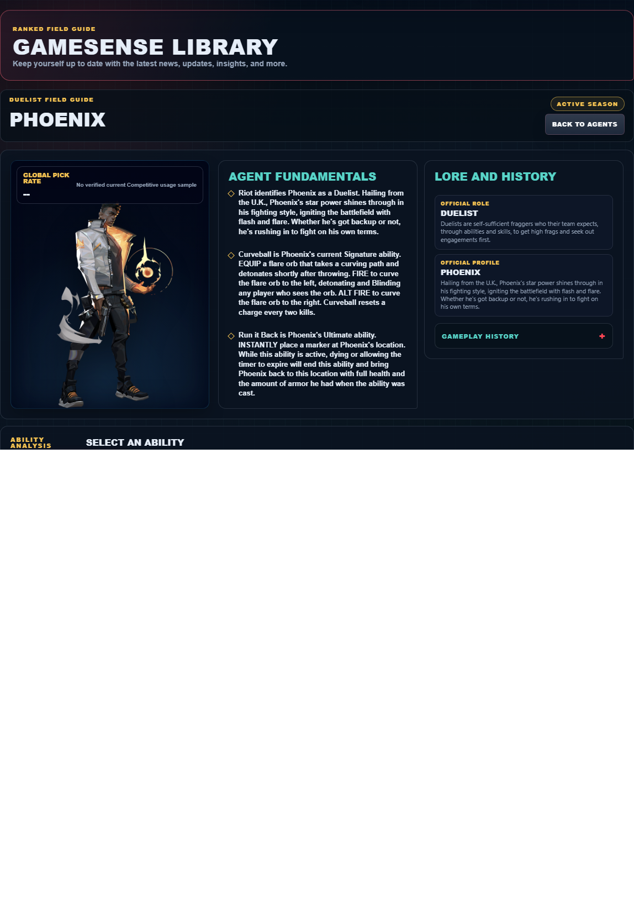

# Library Draft Review — Agent: Phoenix — 2026-07-23

## Summary

One-time full-coverage baseline. 2 fields changed for Patch 13.01.

## Screenshot

## Field-by-field changes

| Field | Tier | Before | After | Sources checked | Confidence |
| --- | --- | --- | --- | --- | --- |
| `abilities` | canonical | [   {     "id": "blaze",     "name": "Blaze",     "slot": "C - Basic",     "icon": "https://media.valorant-api.com/agents/eb93336a-449b-9c1b-0a54-a891f7921d69/abilities/grenade/displayicon.png",     "summary": "EQUIP a flame wall. FIRE to create a line of flame that moves forward, passing through the world and creating a wall of fire that blocks vision and damages players passing through it. The fire wall heals Phoenix instead of dealing damage. HOLD FIRE to bend the wall in the direction of your crosshair.",     "stats": {       "Cost": "150 credits",       "Charges": "1",       "Source": "Riot game text + Valorant Wiki current infobox"     },     "purpose": "Blaze controls sightlines. Place it on the specific defender view the team needs removed, then move while that view is blocked.",     "setup": "Blaze must be equipped before use. Prepare it behind cover, then return to the weapon as soon as the stated effect is active.",     "source": "https://valorant-api.com/v1/agents/eb93336a-449b-9c1b-0a54-a891f7921d69?language=en-US"   },   {     "id": "hot-hands",     "name": "Hot Hands",     "slot": "Q - Basic",     "icon": "https://media.valorant-api.com/agents/eb93336a-449b-9c1b-0a54-a891f7921d69/abilities/ability1/displayicon.png",     "summary": "EQUIP a fireball. FIRE to throw a fireball that explodes after a set amount of time or upon hitting the ground, creating a lingering fire zone that damages enemies. The fire zone heals Phoenix instead of dealing damage. ALT FIRE to lob.",     "stats": {       "Cost": "200 credits",       "Charges": "1",       "Source": "Riot game text + Valorant Wiki current infobox"     },     "purpose": "Hot Hands preserves team resources. Use its verified recovery effect only when the restored player can safely return to a useful fight.",     "setup": "Hot Hands must be equipped before use. Prepare it behind cover, then return to the weapon as soon as the stated effect is active.",     "source": "https://valorant-api.com/v1/agents/eb93336a-449b-9c1b-0a54-a891f7921d69?language=en-US"   },   {     "id": "curveball",     "name": "Curveball",     "slot": "E - Signature",     "icon": "https://media.valorant-api.com/agents/eb93336a-449b-9c1b-0a54-a891f7921d69/abilities/ability2/displayicon.png",     "summary": "EQUIP a flare orb that takes a curving path and detonates shortly after throwing. FIRE to curve the flare orb to the left, detonating and Blinding any player who sees the orb. ALT FIRE to curve the flare orb to the right. Curveball resets a charge every two kills.",     "stats": {       "Cost": "250 credits",       "Charges": "2",       "Source": "Riot game text + Valorant Wiki current infobox"     },     "purpose": "Curveball is the kit's vision-denial tool. Use its verified blind or Nearsight effect immediately before the team contests the affected angle.",     "setup": "Curveball must be equipped before use. Prepare it behind cover, then return to the weapon as soon as the stated effect is active.",     "source": "https://valorant-api.com/v1/agents/eb93336a-449b-9c1b-0a54-a891f7921d69?language=en-US"   },   {     "id": "run-it-back",     "name": "Run it Back",     "slot": "X - Ultimate",     "icon": "https://media.valorant-api.com/agents/eb93336a-449b-9c1b-0a54-a891f7921d69/abilities/ultimate/displayicon.png",     "summary": "INSTANTLY place a marker at Phoenix's location. While this ability is active, dying or allowing the timer to expire will end this ability and bring Phoenix back to this location with full health and the amount of armor he had when the ability was cast.",     "stats": {       "Cost": "6 ultimate points",       "Charges": "Current client value not published in Riot's public content feed",       "Source": "Riot game text + Valorant Wiki current infobox"     },     "purpose": "Run it Back preserves team resources. Use its verified recovery effect only when the restored player can safely return to a useful fight.",     "setup": "Run it Back needs a deliberate target or path. Confirm the landing area and the teammate timing before deploying it.",     "source": "https://valorant-api.com/v1/agents/eb93336a-449b-9c1b-0a54-a891f7921d69?language=en-US"   },   {     "id": "heating-up",     "name": "Heating Up",     "slot": "Passive",     "icon": null,     "summary": "PASSIVELY Heal Phoenix instead of taking damage after standing in Phoenix's own fire",     "stats": {       "Cost": "Passive; no purchase",       "Charges": "Current client value not published in Riot's public content feed",       "Source": "Riot game text + Valorant Wiki current infobox"     },     "purpose": "Heating Up preserves team resources. Use its verified recovery effect only when the restored player can safely return to a useful fight.",     "setup": "Heating Up needs a deliberate target or path. Confirm the landing area and the teammate timing before deploying it.",     "source": "https://valorant-api.com/v1/agents/eb93336a-449b-9c1b-0a54-a891f7921d69?language=en-US"   } ] | [   {     "id": "blaze",     "name": "Blaze",     "slot": "E - Signature",     "icon": "https://media.valorant-api.com/agents/eb93336a-449b-9c1b-0a54-a891f7921d69/abilities/grenade/displayicon.png",     "summary": "EQUIP a flame wall. FIRE to create a line of flame that moves forward, passing through the world and creating a wall of fire that blocks vision and damages players passing through it. The fire wall heals Phoenix instead of dealing damage. HOLD FIRE to bend the wall in the direction of your crosshair.",     "stats": {       "Cost": "150 credits",       "Charges": "1",       "Source": "Riot game text + Valorant Wiki current infobox"     },     "purpose": "Blaze controls sightlines. Place it on the specific defender view the team needs removed, then move while that view is blocked.",     "setup": "Blaze must be equipped before use. Prepare it behind cover, then return to the weapon as soon as the stated effect is active.",     "source": "https://valorant-api.com/v1/agents/eb93336a-449b-9c1b-0a54-a891f7921d69?language=en-US"   },   {     "id": "hot-hands",     "name": "Hot Hands",     "slot": "C - Basic",     "icon": "https://media.valorant-api.com/agents/eb93336a-449b-9c1b-0a54-a891f7921d69/abilities/ability1/displayicon.png",     "summary": "EQUIP a fireball. FIRE to throw a fireball that explodes after a set amount of time or upon hitting the ground, creating a lingering fire zone that damages enemies. The fire zone heals Phoenix instead of dealing damage. ALT FIRE to lob.",     "stats": {       "Cost": "200 credits",       "Charges": "1",       "Source": "Riot game text + Valorant Wiki current infobox"     },     "purpose": "Hot Hands preserves team resources. Use its verified recovery effect only when the restored player can safely return to a useful fight.",     "setup": "Hot Hands must be equipped before use. Prepare it behind cover, then return to the weapon as soon as the stated effect is active.",     "source": "https://valorant-api.com/v1/agents/eb93336a-449b-9c1b-0a54-a891f7921d69?language=en-US"   },   {     "id": "curveball",     "name": "Curveball",     "slot": "Q - Basic",     "icon": "https://media.valorant-api.com/agents/eb93336a-449b-9c1b-0a54-a891f7921d69/abilities/ability2/displayicon.png",     "summary": "EQUIP a flare orb that takes a curving path and detonates shortly after throwing. FIRE to curve the flare orb to the left, detonating and Blinding any player who sees the orb. ALT FIRE to curve the flare orb to the right. Curveball resets a charge every two kills.",     "stats": {       "Cost": "250 credits",       "Charges": "2",       "Source": "Riot game text + Valorant Wiki current infobox"     },     "purpose": "Curveball is the kit's vision-denial tool. Use its verified blind or Nearsight effect immediately before the team contests the affected angle.",     "setup": "Curveball must be equipped before use. Prepare it behind cover, then return to the weapon as soon as the stated effect is active.",     "source": "https://valorant-api.com/v1/agents/eb93336a-449b-9c1b-0a54-a891f7921d69?language=en-US"   },   {     "id": "run-it-back",     "name": "Run it Back",     "slot": "X - Ultimate",     "icon": "https://media.valorant-api.com/agents/eb93336a-449b-9c1b-0a54-a891f7921d69/abilities/ultimate/displayicon.png",     "summary": "INSTANTLY place a marker at Phoenix's location. While this ability is active, dying or allowing the timer to expire will end this ability and bring Phoenix back to this location with full health and the amount of armor he had when the ability was cast.",     "stats": {       "Cost": "6 ultimate points",       "Charges": "Current client value not published in Riot's public content feed",       "Source": "Riot game text + Valorant Wiki current infobox"     },     "purpose": "Run it Back preserves team resources. Use its verified recovery effect only when the restored player can safely return to a useful fight.",     "setup": "Run it Back needs a deliberate target or path. Confirm the landing area and the teammate timing before deploying it.",     "source": "https://valorant-api.com/v1/agents/eb93336a-449b-9c1b-0a54-a891f7921d69?language=en-US"   },   {     "id": "heating-up",     "name": "Heating Up",     "slot": "Passive - Passive",     "icon": "",     "summary": "PASSIVELY Heal Phoenix instead of taking damage after standing in Phoenix's own fire",     "stats": {       "Cost": "Passive; no purchase",       "Charges": "Current client value not published in Riot's public content feed",       "Source": "Riot game text + Valorant Wiki current infobox"     },     "purpose": "Heating Up preserves team resources. Use its verified recovery effect only when the restored player can safely return to a useful fight.",     "setup": "Heating Up needs a deliberate target or path. Confirm the landing area and the teammate timing before deploying it.",     "source": "https://valorant-api.com/v1/agents/eb93336a-449b-9c1b-0a54-a891f7921d69?language=en-US"   } ] | [https://valorant-api.com/v1/agents/eb93336a-449b-9c1b-0a54-a891f7921d69?language=en-US](https://valorant-api.com/v1/agents/eb93336a-449b-9c1b-0a54-a891f7921d69?language=en-US) | n/a (auto-approved) |
| `uuid` | canonical |  | eb93336a-449b-9c1b-0a54-a891f7921d69 | [https://valorant-api.com/v1/agents/eb93336a-449b-9c1b-0a54-a891f7921d69?language=en-US](https://valorant-api.com/v1/agents/eb93336a-449b-9c1b-0a54-a891f7921d69?language=en-US) | n/a (auto-approved) |

## Approval

- [ ] Approved as-is
- [ ] Approved with edits (note edits below)
- [ ] Rejected (note why below)

Notes:

Promotion totals: 2 canonical, 0 synthesized, 0 mixed-tier field groups.
