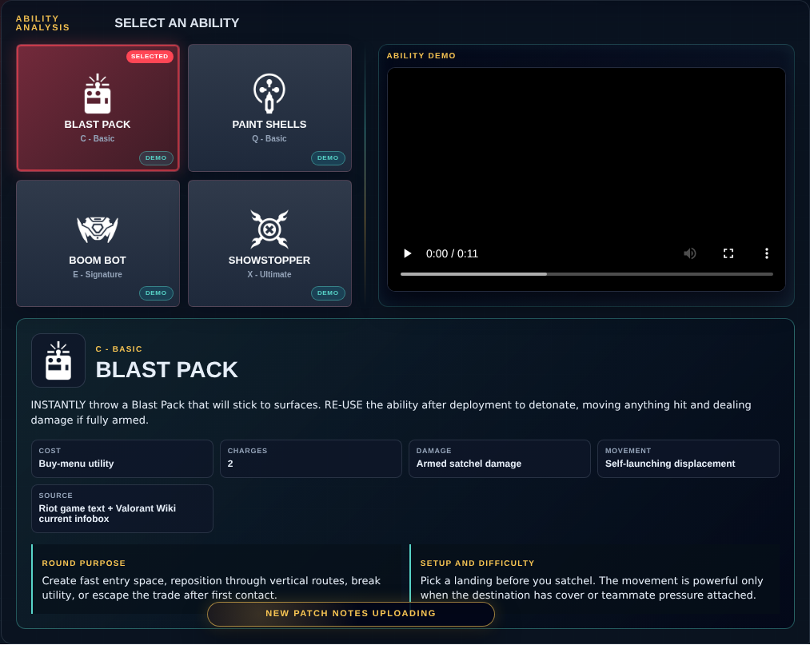

# Library Draft Review — Agent: Raze — 2026-08-16

## Summary

Scheduled canonical refresh. 1 field changed for Patch 13.02.

## Screenshot

## Field-by-field changes

| Field | Tier | Before | After | Sources checked | Confidence |
| --- | --- | --- | --- | --- | --- |
| `abilities` | canonical | [   {     "id": "blast-pack",     "name": "Blast Pack",     "slot": "C - Basic",     "icon": "https://media.valorant-api.com/agents/f94c3b30-42be-e959-889c-5aa313dba261/abilities/ability1/displayicon.png",     "summary": "INSTANTLY throw a Blast Pack that will stick to surfaces. RE-USE the ability after deployment to detonate, moving anything hit and dealing damage if fully armed.",     "stats": {       "Cost": "Buy-menu utility",       "Charges": "2",       "Damage": "Armed satchel damage",       "Movement": "Self-launching displacement",       "Source": "Riot game text + Valorant Wiki current infobox"     },     "purpose": "Create fast entry space, reposition through vertical routes, break utility, or escape the trade after first contact.",     "setup": "Pick a landing before you satchel. The movement is powerful only when the destination has cover or teammate pressure attached.",     "video": {       "src": "https://cmsassets.rgpub.io/sanity/files/dsfx7636/game_data/82028c5e9ae38b59660dbf9f57f341f1c20c5480.mp4?accountingTag=VAL",       "title": "BLAST PACK",       "source": "https://playvalorant.com/en-us/agents/raze/",       "provider": "riot"     },     "source": "https://valorant-api.com/v1/agents/f94c3b30-42be-e959-889c-5aa313dba261?language=en-US"   },   {     "id": "paint-shells",     "name": "Paint Shells",     "slot": "Q - Basic",     "icon": "https://media.valorant-api.com/agents/f94c3b30-42be-e959-889c-5aa313dba261/abilities/ability2/displayicon.png",     "summary": "EQUIP a cluster grenade. FIRE to throw the grenade, which does damage and creates sub-munitions, each doing damage to anyone in their range. ALT FIRE to lob. Paint Shells charge resets every two kills.",     "stats": {       "Cost": "Signature utility",       "Recharge": "Resets after two kills",       "Damage": "Cluster explosive damage",       "AltFire": "Lob throw",       "Charges": "1",       "Source": "Riot game text + Valorant Wiki current infobox"     },     "purpose": "Clear tight angles, deny a choke, punish trapped players, and force defenders out before the entry swing.",     "setup": "Throw it where defenders still need to stand, not where they already escaped. Paint Shells is best when a teammate can punish the exit path.",     "video": {       "src": "https://cmsassets.rgpub.io/sanity/files/dsfx7636/game_data/d75fd65435a84906bb3e8ad0b97c505e7359697b.mp4?accountingTag=VAL",       "title": "PAINT SHELLS",       "source": "https://playvalorant.com/en-us/agents/raze/",       "provider": "riot"     },     "source": "https://valorant-api.com/v1/agents/f94c3b30-42be-e959-889c-5aa313dba261?language=en-US"   },   {     "id": "boom-bot",     "name": "Boom Bot",     "slot": "E - Signature",     "icon": "https://media.valorant-api.com/agents/f94c3b30-42be-e959-889c-5aa313dba261/abilities/grenade/displayicon.png",     "summary": "EQUIP a Boom Bot. FIRE will deploy the bot, causing it to travel in a straight line on the ground, bouncing off walls. The Boom Bot will lock on to any enemies in its frontal cone and chase them, exploding for heavy damage if it reaches them.",     "stats": {       "Cost": "Buy-menu utility",       "Charges": "1",       "Damage": "Explosive on contact",       "Tracking": "Frontal cone",       "Source": "Riot game text + Valorant Wiki current infobox"     },     "purpose": "Clear close corners, force a defender to shoot, and create a safe entry timing through the noise and displacement.",     "setup": "Send it into the first danger pocket your entry cannot safely face-check. Swing while the defender is dodging or breaking the bot.",     "video": {       "src": "https://cmsassets.rgpub.io/sanity/files/dsfx7636/game_data/c824fe8e08a4f36be2273aa456819d2c2b6cd6b0.mp4?accountingTag=VAL",       "title": "BOOM BOT",       "source": "https://playvalorant.com/en-us/agents/raze/",       "provider": "riot"     },     "source": "https://valorant-api.com/v1/agents/f94c3b30-42be-e959-889c-5aa313dba261?language=en-US"   },   {     "id": "showstopper",     "name": "Showstopper",     "slot": "X - Ultimate",     "icon": "https://media.valorant-api.com/agents/f94c3b30-42be-e959-889c-5aa313dba261/abilities/ultimate/displayicon.png",     "summary": "EQUIP a rocket launcher. FIRE to shoot a rocket that does massive area damage on contact with anything.",     "stats": {       "Cost": "Ultimate points",       "Charges": "1 rocket",       "Damage": "Massive area damage",       "Range": "Projectile travel",       "Source": "Riot game text + Valorant Wiki current infobox"     },     "purpose": "Break a stacked defense, punish a trapped opponent, or force a retake player away from the spike timer.",     "setup": "Narrow the enemy's exits first with utility, contact, or teammate pressure. Fire at the space they must cross rather than at a guessed hiding spot.",     "video": {       "src": "https://cmsassets.rgpub.io/sanity/files/dsfx7636/game_data/7281a34566f12d202dee3d43e0fa0bf0b4271d60.mp4?accountingTag=VAL",       "title": "SHOWSTOPPER",       "source": "https://playvalorant.com/en-us/agents/raze/",       "provider": "riot"     },     "source": "https://valorant-api.com/v1/agents/f94c3b30-42be-e959-889c-5aa313dba261?language=en-US"   } ] | [   {     "id": "blast-pack",     "name": "Blast Pack",     "slot": "C - Basic",     "icon": "https://media.valorant-api.com/agents/f94c3b30-42be-e959-889c-5aa313dba261/abilities/ability1/displayicon.png",     "summary": "INSTANTLY throw a Blast Pack that will stick to surfaces. RE-USE the ability after deployment to detonate, moving anything hit and dealing damage if fully armed.",     "stats": {       "Cost": "Buy-menu utility",       "Charges": "2",       "Damage": "Armed satchel damage",       "Movement": "Self-launching displacement",       "Source": "Riot game text + Valorant Wiki current infobox"     },     "purpose": "Create fast entry space, reposition through vertical routes, break utility, or escape the trade after first contact.",     "setup": "Pick a landing before you satchel. The movement is powerful only when the destination has cover or teammate pressure attached.",     "video": {       "src": "https://cmsassets.rgpub.io/sanity/files/dsfx7636/game_data/82028c5e9ae38b59660dbf9f57f341f1c20c5480.mp4?accountingTag=VAL",       "title": "Raze Blast Pack ability demo",       "source": "https://playvalorant.com/en-us/agents/",       "provider": "riot"     },     "source": "https://valorant-api.com/v1/agents/f94c3b30-42be-e959-889c-5aa313dba261?language=en-US"   },   {     "id": "paint-shells",     "name": "Paint Shells",     "slot": "Q - Basic",     "icon": "https://media.valorant-api.com/agents/f94c3b30-42be-e959-889c-5aa313dba261/abilities/ability2/displayicon.png",     "summary": "EQUIP a cluster grenade. FIRE to throw the grenade, which does damage and creates sub-munitions, each doing damage to anyone in their range. ALT FIRE to lob. Paint Shells charge resets every two kills.",     "stats": {       "Cost": "Signature utility",       "Recharge": "Resets after two kills",       "Damage": "Cluster explosive damage",       "AltFire": "Lob throw",       "Charges": "1",       "Source": "Riot game text + Valorant Wiki current infobox"     },     "purpose": "Clear tight angles, deny a choke, punish trapped players, and force defenders out before the entry swing.",     "setup": "Throw it where defenders still need to stand, not where they already escaped. Paint Shells is best when a teammate can punish the exit path.",     "video": {       "src": "https://cmsassets.rgpub.io/sanity/files/dsfx7636/game_data/d75fd65435a84906bb3e8ad0b97c505e7359697b.mp4?accountingTag=VAL",       "title": "Raze Paint Shells ability demo",       "source": "https://playvalorant.com/en-us/agents/",       "provider": "riot"     },     "source": "https://valorant-api.com/v1/agents/f94c3b30-42be-e959-889c-5aa313dba261?language=en-US"   },   {     "id": "boom-bot",     "name": "Boom Bot",     "slot": "E - Signature",     "icon": "https://media.valorant-api.com/agents/f94c3b30-42be-e959-889c-5aa313dba261/abilities/grenade/displayicon.png",     "summary": "EQUIP a Boom Bot. FIRE will deploy the bot, causing it to travel in a straight line on the ground, bouncing off walls. The Boom Bot will lock on to any enemies in its frontal cone and chase them, exploding for heavy damage if it reaches them.",     "stats": {       "Cost": "Buy-menu utility",       "Charges": "1",       "Damage": "Explosive on contact",       "Tracking": "Frontal cone",       "Source": "Riot game text + Valorant Wiki current infobox"     },     "purpose": "Clear close corners, force a defender to shoot, and create a safe entry timing through the noise and displacement.",     "setup": "Send it into the first danger pocket your entry cannot safely face-check. Swing while the defender is dodging or breaking the bot.",     "video": {       "src": "https://cmsassets.rgpub.io/sanity/files/dsfx7636/game_data/c824fe8e08a4f36be2273aa456819d2c2b6cd6b0.mp4?accountingTag=VAL",       "title": "Raze Boom Bot ability demo",       "source": "https://playvalorant.com/en-us/agents/",       "provider": "riot"     },     "source": "https://valorant-api.com/v1/agents/f94c3b30-42be-e959-889c-5aa313dba261?language=en-US"   },   {     "id": "showstopper",     "name": "Showstopper",     "slot": "X - Ultimate",     "icon": "https://media.valorant-api.com/agents/f94c3b30-42be-e959-889c-5aa313dba261/abilities/ultimate/displayicon.png",     "summary": "EQUIP a rocket launcher. FIRE to shoot a rocket that does massive area damage on contact with anything.",     "stats": {       "Cost": "Ultimate points",       "Charges": "1 rocket",       "Damage": "Massive area damage",       "Range": "Projectile travel",       "Source": "Riot game text + Valorant Wiki current infobox"     },     "purpose": "Break a stacked defense, punish a trapped opponent, or force a retake player away from the spike timer.",     "setup": "Narrow the enemy's exits first with utility, contact, or teammate pressure. Fire at the space they must cross rather than at a guessed hiding spot.",     "video": {       "src": "https://cmsassets.rgpub.io/sanity/files/dsfx7636/game_data/7281a34566f12d202dee3d43e0fa0bf0b4271d60.mp4?accountingTag=VAL",       "title": "Raze Showstopper ability demo",       "source": "https://playvalorant.com/en-us/agents/",       "provider": "riot"     },     "source": "https://valorant-api.com/v1/agents/f94c3b30-42be-e959-889c-5aa313dba261?language=en-US"   } ] | [https://valorant-api.com/v1/agents/f94c3b30-42be-e959-889c-5aa313dba261?language=en-US](https://valorant-api.com/v1/agents/f94c3b30-42be-e959-889c-5aa313dba261?language=en-US) | n/a (auto-approved) |

## Approval

- [ ] Approved as-is
- [ ] Approved with edits (note edits below)
- [ ] Rejected (note why below)

Notes:

Promotion totals: 1 canonical, 0 synthesized, 0 mixed-tier field groups.
