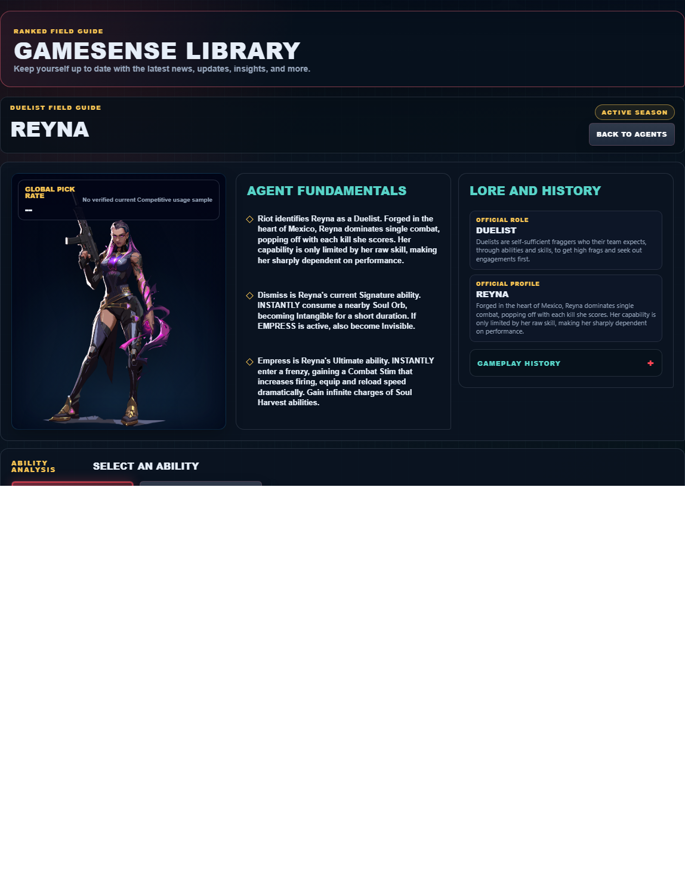
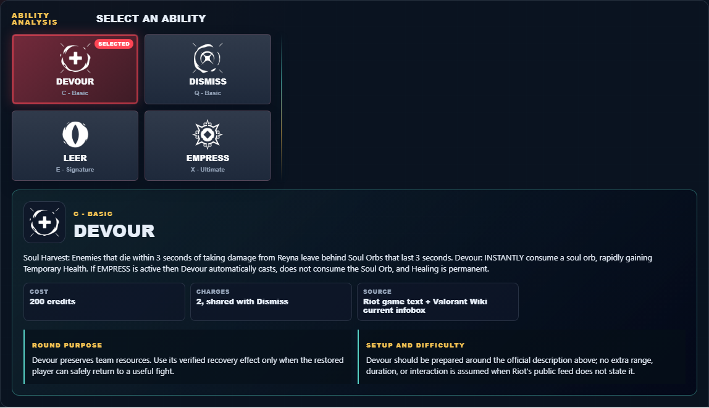

# Library Draft Review — Agent: Reyna — 2026-07-23

## Summary

One-time full-coverage baseline. 2 fields changed for Patch 13.01.

## Screenshot

## Field-by-field changes

| Field | Tier | Before | After | Sources checked | Confidence |
| --- | --- | --- | --- | --- | --- |
| `abilities` | canonical | [   {     "id": "devour",     "name": "Devour",     "slot": "Q - Basic",     "icon": "https://media.valorant-api.com/agents/a3bfb853-43b2-7238-a4f1-ad90e9e46bcc/abilities/ability1/displayicon.png",     "summary": "Soul Harvest: Enemies that die within 3 seconds of taking damage from Reyna leave behind Soul Orbs that last 3 seconds.\r\nDevour: INSTANTLY consume a soul orb, rapidly gaining Temporary Health. If EMPRESS is active then Devour automatically casts, does not consume the Soul Orb, and Healing is permanent.",     "stats": {       "Cost": "200 credits",       "Charges": "2, shared with Dismiss",       "Source": "Riot game text + Valorant Wiki current infobox"     },     "purpose": "Devour preserves team resources. Use its verified recovery effect only when the restored player can safely return to a useful fight.",     "setup": "Devour should be prepared around the official description above; no extra range, duration, or interaction is assumed when Riot's public feed does not state it.",     "source": "https://valorant-api.com/v1/agents/a3bfb853-43b2-7238-a4f1-ad90e9e46bcc?language=en-US"   },   {     "id": "dismiss",     "name": "Dismiss",     "slot": "E - Signature",     "icon": "https://media.valorant-api.com/agents/a3bfb853-43b2-7238-a4f1-ad90e9e46bcc/abilities/ability2/displayicon.png",     "summary": "INSTANTLY consume a nearby Soul Orb, becoming Intangible for a short duration. If EMPRESS is active, also become Invisible.",     "stats": {       "Cost": "200 credits",       "Charges": "2, shared with Devour",       "Source": "Riot game text + Valorant Wiki current infobox"     },     "purpose": "Dismiss performs the exact function in Riot's current description. Build the play around that stated effect instead of assuming an unlisted interaction.",     "setup": "Dismiss should be prepared around the official description above; no extra range, duration, or interaction is assumed when Riot's public feed does not state it.",     "source": "https://valorant-api.com/v1/agents/a3bfb853-43b2-7238-a4f1-ad90e9e46bcc?language=en-US"   },   {     "id": "leer",     "name": "Leer",     "slot": "C - Basic",     "icon": "https://media.valorant-api.com/agents/a3bfb853-43b2-7238-a4f1-ad90e9e46bcc/abilities/grenade/displayicon.png",     "summary": "EQUIP an ethereal, destructible eye. ACTIVATE to cast the eye a short distance forward. The eye will Nearsight all enemies who look at it.",     "stats": {       "Cost": "250 credits",       "Charges": "2",       "Source": "Riot game text + Valorant Wiki current infobox"     },     "purpose": "Leer is the kit's vision-denial tool. Use its verified blind or Nearsight effect immediately before the team contests the affected angle.",     "setup": "Leer must be equipped before use. Prepare it behind cover, then return to the weapon as soon as the stated effect is active.",     "source": "https://valorant-api.com/v1/agents/a3bfb853-43b2-7238-a4f1-ad90e9e46bcc?language=en-US"   },   {     "id": "empress",     "name": "Empress",     "slot": "X - Ultimate",     "icon": "https://media.valorant-api.com/agents/a3bfb853-43b2-7238-a4f1-ad90e9e46bcc/abilities/ultimate/displayicon.png",     "summary": "INSTANTLY enter a frenzy, gaining a Combat Stim that increases firing, equip and reload speed dramatically. Gain infinite charges of Soul Harvest abilities.",     "stats": {       "Cost": "7 ultimate points",       "Charges": "Current client value not published in Riot's public content feed",       "Source": "Riot game text + Valorant Wiki current infobox"     },     "purpose": "Empress changes position. Choose the destination and nearby cover before activating the movement effect described by Riot.",     "setup": "Empress must be equipped before use. Prepare it behind cover, then return to the weapon as soon as the stated effect is active.",     "source": "https://valorant-api.com/v1/agents/a3bfb853-43b2-7238-a4f1-ad90e9e46bcc?language=en-US"   } ] | [   {     "id": "devour",     "name": "Devour",     "slot": "C - Basic",     "icon": "https://media.valorant-api.com/agents/a3bfb853-43b2-7238-a4f1-ad90e9e46bcc/abilities/ability1/displayicon.png",     "summary": "Soul Harvest: Enemies that die within 3 seconds of taking damage from Reyna leave behind Soul Orbs that last 3 seconds.\r\nDevour: INSTANTLY consume a soul orb, rapidly gaining Temporary Health. If EMPRESS is active then Devour automatically casts, does not consume the Soul Orb, and Healing is permanent.",     "stats": {       "Cost": "200 credits",       "Charges": "2, shared with Dismiss",       "Source": "Riot game text + Valorant Wiki current infobox"     },     "purpose": "Devour preserves team resources. Use its verified recovery effect only when the restored player can safely return to a useful fight.",     "setup": "Devour should be prepared around the official description above; no extra range, duration, or interaction is assumed when Riot's public feed does not state it.",     "source": "https://valorant-api.com/v1/agents/a3bfb853-43b2-7238-a4f1-ad90e9e46bcc?language=en-US"   },   {     "id": "dismiss",     "name": "Dismiss",     "slot": "Q - Basic",     "icon": "https://media.valorant-api.com/agents/a3bfb853-43b2-7238-a4f1-ad90e9e46bcc/abilities/ability2/displayicon.png",     "summary": "INSTANTLY consume a nearby Soul Orb, becoming Intangible for a short duration. If EMPRESS is active, also become Invisible.",     "stats": {       "Cost": "200 credits",       "Charges": "2, shared with Devour",       "Source": "Riot game text + Valorant Wiki current infobox"     },     "purpose": "Dismiss performs the exact function in Riot's current description. Build the play around that stated effect instead of assuming an unlisted interaction.",     "setup": "Dismiss should be prepared around the official description above; no extra range, duration, or interaction is assumed when Riot's public feed does not state it.",     "source": "https://valorant-api.com/v1/agents/a3bfb853-43b2-7238-a4f1-ad90e9e46bcc?language=en-US"   },   {     "id": "leer",     "name": "Leer",     "slot": "E - Signature",     "icon": "https://media.valorant-api.com/agents/a3bfb853-43b2-7238-a4f1-ad90e9e46bcc/abilities/grenade/displayicon.png",     "summary": "EQUIP an ethereal, destructible eye. ACTIVATE to cast the eye a short distance forward. The eye will Nearsight all enemies who look at it.",     "stats": {       "Cost": "250 credits",       "Charges": "2",       "Source": "Riot game text + Valorant Wiki current infobox"     },     "purpose": "Leer is the kit's vision-denial tool. Use its verified blind or Nearsight effect immediately before the team contests the affected angle.",     "setup": "Leer must be equipped before use. Prepare it behind cover, then return to the weapon as soon as the stated effect is active.",     "source": "https://valorant-api.com/v1/agents/a3bfb853-43b2-7238-a4f1-ad90e9e46bcc?language=en-US"   },   {     "id": "empress",     "name": "Empress",     "slot": "X - Ultimate",     "icon": "https://media.valorant-api.com/agents/a3bfb853-43b2-7238-a4f1-ad90e9e46bcc/abilities/ultimate/displayicon.png",     "summary": "INSTANTLY enter a frenzy, gaining a Combat Stim that increases firing, equip and reload speed dramatically. Gain infinite charges of Soul Harvest abilities.",     "stats": {       "Cost": "7 ultimate points",       "Charges": "Current client value not published in Riot's public content feed",       "Source": "Riot game text + Valorant Wiki current infobox"     },     "purpose": "Empress changes position. Choose the destination and nearby cover before activating the movement effect described by Riot.",     "setup": "Empress must be equipped before use. Prepare it behind cover, then return to the weapon as soon as the stated effect is active.",     "source": "https://valorant-api.com/v1/agents/a3bfb853-43b2-7238-a4f1-ad90e9e46bcc?language=en-US"   } ] | [https://valorant-api.com/v1/agents/a3bfb853-43b2-7238-a4f1-ad90e9e46bcc?language=en-US](https://valorant-api.com/v1/agents/a3bfb853-43b2-7238-a4f1-ad90e9e46bcc?language=en-US) | n/a (auto-approved) |
| `uuid` | canonical |  | a3bfb853-43b2-7238-a4f1-ad90e9e46bcc | [https://valorant-api.com/v1/agents/a3bfb853-43b2-7238-a4f1-ad90e9e46bcc?language=en-US](https://valorant-api.com/v1/agents/a3bfb853-43b2-7238-a4f1-ad90e9e46bcc?language=en-US) | n/a (auto-approved) |

## Approval

- [ ] Approved as-is
- [ ] Approved with edits (note edits below)
- [ ] Rejected (note why below)

Notes:

Promotion totals: 2 canonical, 0 synthesized, 0 mixed-tier field groups.
