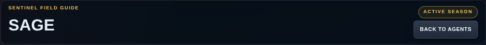
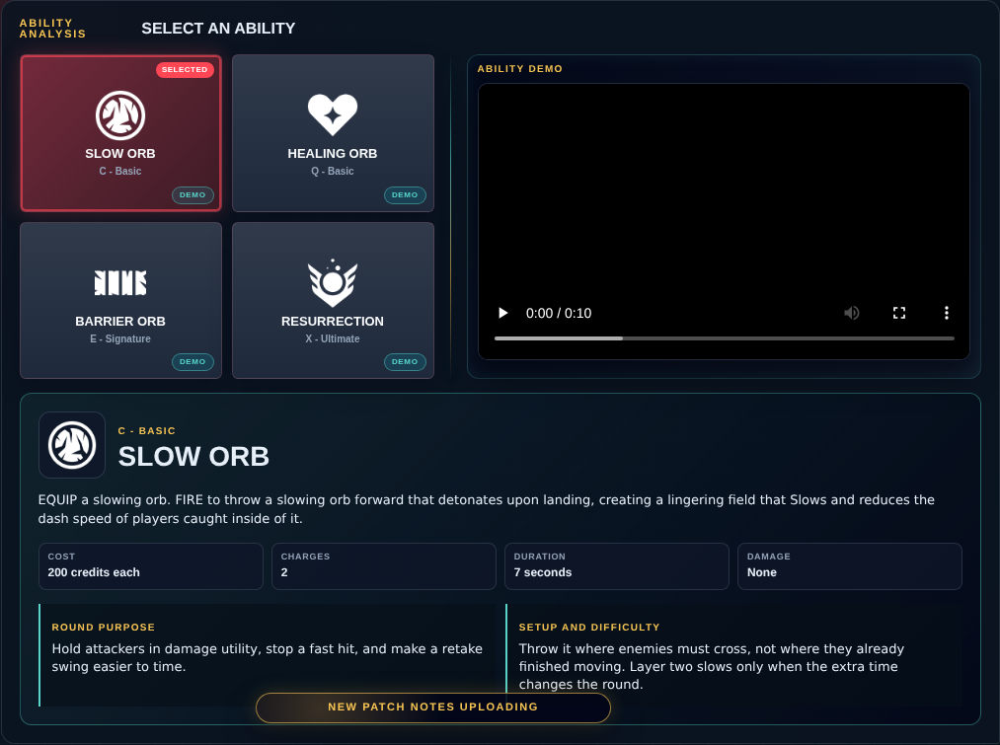

# Library Draft Review — Agent: Sage — 2026-08-17

## Summary

Scheduled canonical refresh. 1 field changed for Patch 13.02.

## Screenshot

## Field-by-field changes

| Field | Tier | Before | After | Sources checked | Confidence |
| --- | --- | --- | --- | --- | --- |
| `abilities` | canonical | [   {     "id": "slow-orb",     "name": "Slow Orb",     "slot": "C - Basic",     "icon": "https://media.valorant-api.com/agents/569fdd95-4d10-43ab-ca70-79becc718b46/abilities/ability1/displayicon.png",     "summary": "EQUIP a slowing orb. FIRE to throw a slowing orb forward that detonates upon landing, creating a lingering field that Slows and reduces the dash speed of players caught inside of it.",     "stats": {       "Cost": "200 credits each",       "Charges": "2",       "Duration": "7 seconds",       "Damage": "None"     },     "purpose": "Hold attackers in damage utility, stop a fast hit, and make a retake swing easier to time.",     "setup": "Throw it where enemies must cross, not where they already finished moving. Layer two slows only when the extra time changes the round.",     "video": {       "src": "https://cmsassets.rgpub.io/sanity/files/dsfx7636/game_data/45053483528b96cbe003ac39e6b53c9866d5fea6.mp4?accountingTag=VAL",       "title": "SLOW ORB",       "source": "https://playvalorant.com/en-us/agents/sage/",       "provider": "riot"     },     "source": "https://valorant-api.com/v1/agents/569fdd95-4d10-43ab-ca70-79becc718b46?language=en-US"   },   {     "id": "healing-orb",     "name": "Healing Orb",     "slot": "Q - Basic",     "icon": "https://media.valorant-api.com/agents/569fdd95-4d10-43ab-ca70-79becc718b46/abilities/ability2/displayicon.png",     "summary": "EQUIP a healing orb. FIRE with your crosshairs over a damaged ally to activate a Heal-Over-Time on them. ALT FIRE while Sage is damaged to activate a self Heal-Over-Time.",     "stats": {       "Cost": "Free",       "Charges": "1",       "Recharge": "Cooldown",       "Damage": "None"     },     "purpose": "Restore a teammate who can take another meaningful fight and preserve armor value.",     "setup": "Do not cross an exposed lane just to heal. Ask whether the healed player can actually rejoin the round.",     "video": {       "src": "https://cmsassets.rgpub.io/sanity/files/dsfx7636/game_data/a247d196383136d3de15b4d6d9c816e3c8054ba0.mp4?accountingTag=VAL",       "title": "HEALING ORB",       "source": "https://playvalorant.com/en-us/agents/sage/",       "provider": "riot"     },     "source": "https://valorant-api.com/v1/agents/569fdd95-4d10-43ab-ca70-79becc718b46?language=en-US"   },   {     "id": "barrier-orb",     "name": "Barrier Orb",     "slot": "E - Signature",     "icon": "https://media.valorant-api.com/agents/569fdd95-4d10-43ab-ca70-79becc718b46/abilities/grenade/displayicon.png",     "summary": "EQUIP a barrier orb. FIRE places a wall that fortifies after a few seconds. ALT FIRE rotates the targeter.",     "stats": {       "Cost": "300 credits",       "Charges": "1",       "Duration": "40 seconds",       "Health": "600 per fortified segment"     },     "purpose": "Delay a choke, secure a plant, reshape an angle, or elevate a teammate.",     "setup": "Off-angle walls are possible, but every exposed segment can give attackers a safe breaking target. Build for a specific fight or timing.",     "video": {       "src": "https://cmsassets.rgpub.io/sanity/files/dsfx7636/game_data/a79b1d6838cee5572b428babd74a2db0c07f4ea5.mp4?accountingTag=VAL",       "title": "BARRIER ORB",       "source": "https://playvalorant.com/en-us/agents/sage/",       "provider": "riot"     },     "source": "https://valorant-api.com/v1/agents/569fdd95-4d10-43ab-ca70-79becc718b46?language=en-US"   },   {     "id": "resurrection",     "name": "Resurrection",     "slot": "X - Ultimate",     "icon": "https://media.valorant-api.com/agents/569fdd95-4d10-43ab-ca70-79becc718b46/abilities/ultimate/displayicon.png",     "summary": "EQUIP a resurrection ability. FIRE with your crosshairs placed over a dead ally to begin resurrecting them. After a brief channel, the ally will be brought back to life with full health.",     "stats": {       "Cost": "7 ultimate points",       "Charges": "1",       "Health": "Full health",       "Damage": "None"     },     "purpose": "Recover a key weapon, restore numbers, or force defenders to contest the body.",     "setup": "Clear the body and name the revived player's escape route first. A resurrection that immediately dies spends the ultimate without restoring pressure.",     "video": {       "src": "https://cmsassets.rgpub.io/sanity/files/dsfx7636/game_data/df83929ed5da349c37a5bf4600c2b55010c72402.mp4?accountingTag=VAL",       "title": "RESURRECTION",       "source": "https://playvalorant.com/en-us/agents/sage/",       "provider": "riot"     },     "source": "https://valorant-api.com/v1/agents/569fdd95-4d10-43ab-ca70-79becc718b46?language=en-US"   } ] | [   {     "id": "slow-orb",     "name": "Slow Orb",     "slot": "C - Basic",     "icon": "https://media.valorant-api.com/agents/569fdd95-4d10-43ab-ca70-79becc718b46/abilities/ability1/displayicon.png",     "summary": "EQUIP a slowing orb. FIRE to throw a slowing orb forward that detonates upon landing, creating a lingering field that Slows and reduces the dash speed of players caught inside of it.",     "stats": {       "Cost": "200 credits each",       "Charges": "2",       "Duration": "7 seconds",       "Damage": "None"     },     "purpose": "Hold attackers in damage utility, stop a fast hit, and make a retake swing easier to time.",     "setup": "Throw it where enemies must cross, not where they already finished moving. Layer two slows only when the extra time changes the round.",     "video": {       "src": "https://cmsassets.rgpub.io/sanity/files/dsfx7636/game_data/45053483528b96cbe003ac39e6b53c9866d5fea6.mp4?accountingTag=VAL",       "title": "Sage Slow Orb ability demo",       "source": "https://playvalorant.com/en-us/agents/",       "provider": "riot"     },     "source": "https://valorant-api.com/v1/agents/569fdd95-4d10-43ab-ca70-79becc718b46?language=en-US"   },   {     "id": "healing-orb",     "name": "Healing Orb",     "slot": "Q - Basic",     "icon": "https://media.valorant-api.com/agents/569fdd95-4d10-43ab-ca70-79becc718b46/abilities/ability2/displayicon.png",     "summary": "EQUIP a healing orb. FIRE with your crosshairs over a damaged ally to activate a Heal-Over-Time on them. ALT FIRE while Sage is damaged to activate a self Heal-Over-Time.",     "stats": {       "Cost": "Free",       "Charges": "1",       "Recharge": "Cooldown",       "Damage": "None"     },     "purpose": "Restore a teammate who can take another meaningful fight and preserve armor value.",     "setup": "Do not cross an exposed lane just to heal. Ask whether the healed player can actually rejoin the round.",     "video": {       "src": "https://cmsassets.rgpub.io/sanity/files/dsfx7636/game_data/a247d196383136d3de15b4d6d9c816e3c8054ba0.mp4?accountingTag=VAL",       "title": "Sage Healing Orb ability demo",       "source": "https://playvalorant.com/en-us/agents/",       "provider": "riot"     },     "source": "https://valorant-api.com/v1/agents/569fdd95-4d10-43ab-ca70-79becc718b46?language=en-US"   },   {     "id": "barrier-orb",     "name": "Barrier Orb",     "slot": "E - Signature",     "icon": "https://media.valorant-api.com/agents/569fdd95-4d10-43ab-ca70-79becc718b46/abilities/grenade/displayicon.png",     "summary": "EQUIP a barrier orb. FIRE places a wall that fortifies after a few seconds. ALT FIRE rotates the targeter.",     "stats": {       "Cost": "300 credits",       "Charges": "1",       "Duration": "40 seconds",       "Health": "600 per fortified segment"     },     "purpose": "Delay a choke, secure a plant, reshape an angle, or elevate a teammate.",     "setup": "Off-angle walls are possible, but every exposed segment can give attackers a safe breaking target. Build for a specific fight or timing.",     "video": {       "src": "https://cmsassets.rgpub.io/sanity/files/dsfx7636/game_data/a79b1d6838cee5572b428babd74a2db0c07f4ea5.mp4?accountingTag=VAL",       "title": "Sage Barrier Orb ability demo",       "source": "https://playvalorant.com/en-us/agents/",       "provider": "riot"     },     "source": "https://valorant-api.com/v1/agents/569fdd95-4d10-43ab-ca70-79becc718b46?language=en-US"   },   {     "id": "resurrection",     "name": "Resurrection",     "slot": "X - Ultimate",     "icon": "https://media.valorant-api.com/agents/569fdd95-4d10-43ab-ca70-79becc718b46/abilities/ultimate/displayicon.png",     "summary": "EQUIP a resurrection ability. FIRE with your crosshairs placed over a dead ally to begin resurrecting them. After a brief channel, the ally will be brought back to life with full health.",     "stats": {       "Cost": "7 ultimate points",       "Charges": "1",       "Health": "Full health",       "Damage": "None"     },     "purpose": "Recover a key weapon, restore numbers, or force defenders to contest the body.",     "setup": "Clear the body and name the revived player's escape route first. A resurrection that immediately dies spends the ultimate without restoring pressure.",     "video": {       "src": "https://cmsassets.rgpub.io/sanity/files/dsfx7636/game_data/df83929ed5da349c37a5bf4600c2b55010c72402.mp4?accountingTag=VAL",       "title": "Sage Resurrection ability demo",       "source": "https://playvalorant.com/en-us/agents/",       "provider": "riot"     },     "source": "https://valorant-api.com/v1/agents/569fdd95-4d10-43ab-ca70-79becc718b46?language=en-US"   } ] | [https://valorant-api.com/v1/agents/569fdd95-4d10-43ab-ca70-79becc718b46?language=en-US](https://valorant-api.com/v1/agents/569fdd95-4d10-43ab-ca70-79becc718b46?language=en-US) | n/a (auto-approved) |

## Approval

- [ ] Approved as-is
- [ ] Approved with edits (note edits below)
- [ ] Rejected (note why below)

Notes:

Promotion totals: 1 canonical, 0 synthesized, 0 mixed-tier field groups.
