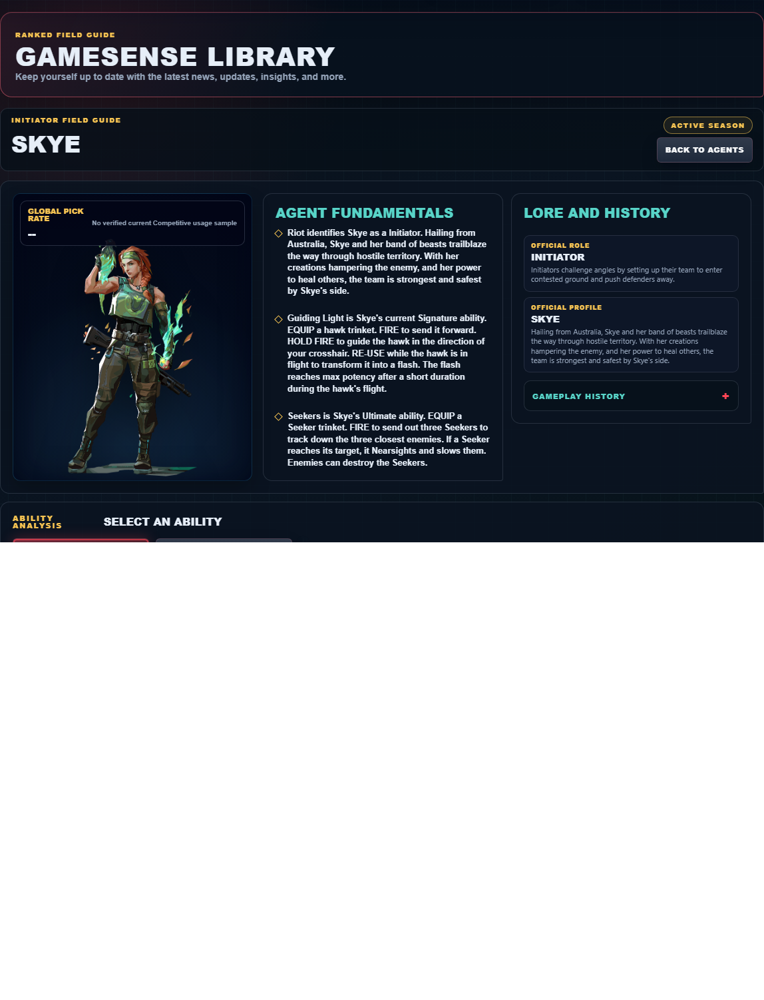
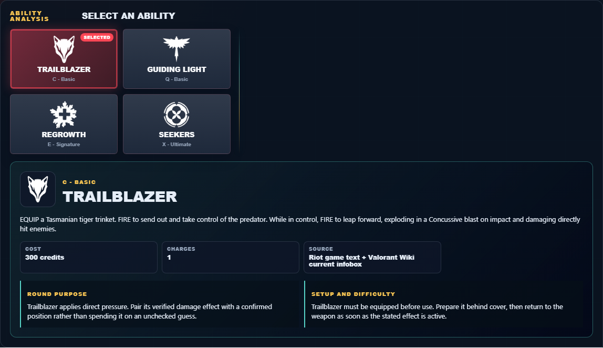

# Library Draft Review — Agent: Skye — 2026-07-23

## Summary

One-time full-coverage baseline. 2 fields changed for Patch 13.01.

## Screenshot

## Field-by-field changes

| Field | Tier | Before | After | Sources checked | Confidence |
| --- | --- | --- | --- | --- | --- |
| `abilities` | canonical | [   {     "id": "trailblazer",     "name": "Trailblazer",     "slot": "Q - Basic",     "icon": "https://media.valorant-api.com/agents/6f2a04ca-43e0-be17-7f36-b3908627744d/abilities/ability1/displayicon.png",     "summary": "EQUIP a Tasmanian tiger trinket. FIRE to send out and take control of the predator. While in control, FIRE to leap forward, exploding in a Concussive blast on impact and damaging directly hit enemies.",     "stats": {       "Cost": "300 credits",       "Charges": "1",       "Source": "Riot game text + Valorant Wiki current infobox"     },     "purpose": "Trailblazer applies direct pressure. Pair its verified damage effect with a confirmed position rather than spending it on an unchecked guess.",     "setup": "Trailblazer must be equipped before use. Prepare it behind cover, then return to the weapon as soon as the stated effect is active.",     "source": "https://valorant-api.com/v1/agents/6f2a04ca-43e0-be17-7f36-b3908627744d?language=en-US"   },   {     "id": "guiding-light",     "name": "Guiding Light",     "slot": "E - Signature",     "icon": "https://media.valorant-api.com/agents/6f2a04ca-43e0-be17-7f36-b3908627744d/abilities/ability2/displayicon.png",     "summary": "EQUIP a hawk trinket. FIRE to send it forward. HOLD FIRE to guide the hawk in the direction of your crosshair. RE-USE while the hawk is in flight to transform it into a flash. The flash reaches max potency after a short duration during the hawk's flight.",     "stats": {       "Cost": "250 credits",       "Charges": "2",       "Source": "Riot game text + Valorant Wiki current infobox"     },     "purpose": "Guiding Light is the kit's vision-denial tool. Use its verified blind or Nearsight effect immediately before the team contests the affected angle.",     "setup": "Guiding Light must be equipped before use. Prepare it behind cover, then return to the weapon as soon as the stated effect is active.",     "source": "https://valorant-api.com/v1/agents/6f2a04ca-43e0-be17-7f36-b3908627744d?language=en-US"   },   {     "id": "regrowth",     "name": "Regrowth",     "slot": "C - Basic",     "icon": "https://media.valorant-api.com/agents/6f2a04ca-43e0-be17-7f36-b3908627744d/abilities/grenade/displayicon.png",     "summary": "EQUIP a healing trinket. HOLD FIRE to channel, Healing allies in range and line of sight. Can be reused until her healing pool is depleted. Skye cannot heal herself.",     "stats": {       "Cost": "150 credits",       "Charges": "1",       "Source": "Riot game text + Valorant Wiki current infobox"     },     "purpose": "Regrowth preserves team resources. Use its verified recovery effect only when the restored player can safely return to a useful fight.",     "setup": "Regrowth must be equipped before use. Prepare it behind cover, then return to the weapon as soon as the stated effect is active.",     "source": "https://valorant-api.com/v1/agents/6f2a04ca-43e0-be17-7f36-b3908627744d?language=en-US"   },   {     "id": "seekers",     "name": "Seekers",     "slot": "X - Ultimate",     "icon": "https://media.valorant-api.com/agents/6f2a04ca-43e0-be17-7f36-b3908627744d/abilities/ultimate/displayicon.png",     "summary": "EQUIP a Seeker trinket. FIRE to send out three Seekers to track down the three closest enemies. If a Seeker reaches its target, it Nearsights and slows them. Enemies can destroy the Seekers.",     "stats": {       "Cost": "8 ultimate points",       "Charges": "Current client value not published in Riot's public content feed",       "Source": "Riot game text + Valorant Wiki current infobox"     },     "purpose": "Seekers is the kit's vision-denial tool. Use its verified blind or Nearsight effect immediately before the team contests the affected angle.",     "setup": "Seekers must be equipped before use. Prepare it behind cover, then return to the weapon as soon as the stated effect is active.",     "source": "https://valorant-api.com/v1/agents/6f2a04ca-43e0-be17-7f36-b3908627744d?language=en-US"   } ] | [   {     "id": "trailblazer",     "name": "Trailblazer",     "slot": "C - Basic",     "icon": "https://media.valorant-api.com/agents/6f2a04ca-43e0-be17-7f36-b3908627744d/abilities/ability1/displayicon.png",     "summary": "EQUIP a Tasmanian tiger trinket. FIRE to send out and take control of the predator. While in control, FIRE to leap forward, exploding in a Concussive blast on impact and damaging directly hit enemies.",     "stats": {       "Cost": "300 credits",       "Charges": "1",       "Source": "Riot game text + Valorant Wiki current infobox"     },     "purpose": "Trailblazer applies direct pressure. Pair its verified damage effect with a confirmed position rather than spending it on an unchecked guess.",     "setup": "Trailblazer must be equipped before use. Prepare it behind cover, then return to the weapon as soon as the stated effect is active.",     "source": "https://valorant-api.com/v1/agents/6f2a04ca-43e0-be17-7f36-b3908627744d?language=en-US"   },   {     "id": "guiding-light",     "name": "Guiding Light",     "slot": "Q - Basic",     "icon": "https://media.valorant-api.com/agents/6f2a04ca-43e0-be17-7f36-b3908627744d/abilities/ability2/displayicon.png",     "summary": "EQUIP a hawk trinket. FIRE to send it forward. HOLD FIRE to guide the hawk in the direction of your crosshair. RE-USE while the hawk is in flight to transform it into a flash. The flash reaches max potency after a short duration during the hawk's flight.",     "stats": {       "Cost": "250 credits",       "Charges": "2",       "Source": "Riot game text + Valorant Wiki current infobox"     },     "purpose": "Guiding Light is the kit's vision-denial tool. Use its verified blind or Nearsight effect immediately before the team contests the affected angle.",     "setup": "Guiding Light must be equipped before use. Prepare it behind cover, then return to the weapon as soon as the stated effect is active.",     "source": "https://valorant-api.com/v1/agents/6f2a04ca-43e0-be17-7f36-b3908627744d?language=en-US"   },   {     "id": "regrowth",     "name": "Regrowth",     "slot": "E - Signature",     "icon": "https://media.valorant-api.com/agents/6f2a04ca-43e0-be17-7f36-b3908627744d/abilities/grenade/displayicon.png",     "summary": "EQUIP a healing trinket. HOLD FIRE to channel, Healing allies in range and line of sight. Can be reused until her healing pool is depleted. Skye cannot heal herself.",     "stats": {       "Cost": "150 credits",       "Charges": "1",       "Source": "Riot game text + Valorant Wiki current infobox"     },     "purpose": "Regrowth preserves team resources. Use its verified recovery effect only when the restored player can safely return to a useful fight.",     "setup": "Regrowth must be equipped before use. Prepare it behind cover, then return to the weapon as soon as the stated effect is active.",     "source": "https://valorant-api.com/v1/agents/6f2a04ca-43e0-be17-7f36-b3908627744d?language=en-US"   },   {     "id": "seekers",     "name": "Seekers",     "slot": "X - Ultimate",     "icon": "https://media.valorant-api.com/agents/6f2a04ca-43e0-be17-7f36-b3908627744d/abilities/ultimate/displayicon.png",     "summary": "EQUIP a Seeker trinket. FIRE to send out three Seekers to track down the three closest enemies. If a Seeker reaches its target, it Nearsights and slows them. Enemies can destroy the Seekers.",     "stats": {       "Cost": "8 ultimate points",       "Charges": "Current client value not published in Riot's public content feed",       "Source": "Riot game text + Valorant Wiki current infobox"     },     "purpose": "Seekers is the kit's vision-denial tool. Use its verified blind or Nearsight effect immediately before the team contests the affected angle.",     "setup": "Seekers must be equipped before use. Prepare it behind cover, then return to the weapon as soon as the stated effect is active.",     "source": "https://valorant-api.com/v1/agents/6f2a04ca-43e0-be17-7f36-b3908627744d?language=en-US"   } ] | [https://valorant-api.com/v1/agents/6f2a04ca-43e0-be17-7f36-b3908627744d?language=en-US](https://valorant-api.com/v1/agents/6f2a04ca-43e0-be17-7f36-b3908627744d?language=en-US) | n/a (auto-approved) |
| `uuid` | canonical |  | 6f2a04ca-43e0-be17-7f36-b3908627744d | [https://valorant-api.com/v1/agents/6f2a04ca-43e0-be17-7f36-b3908627744d?language=en-US](https://valorant-api.com/v1/agents/6f2a04ca-43e0-be17-7f36-b3908627744d?language=en-US) | n/a (auto-approved) |

## Approval

- [ ] Approved as-is
- [ ] Approved with edits (note edits below)
- [ ] Rejected (note why below)

Notes:

Promotion totals: 2 canonical, 0 synthesized, 0 mixed-tier field groups.
