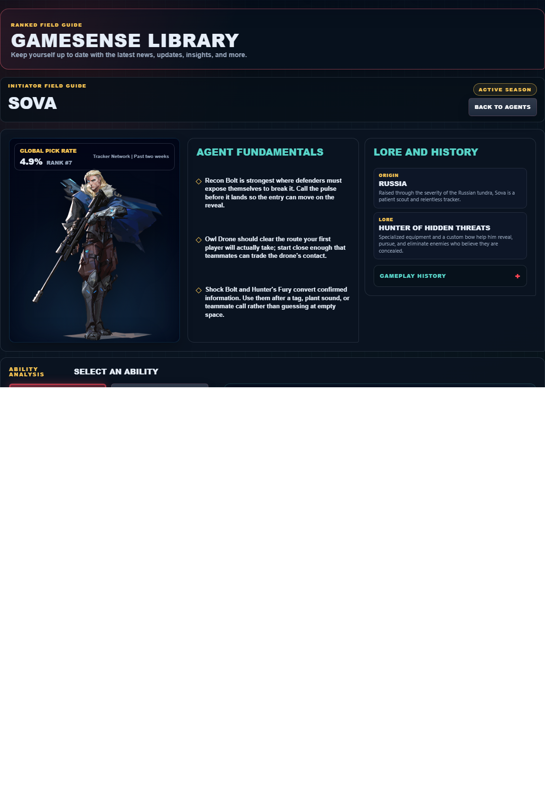
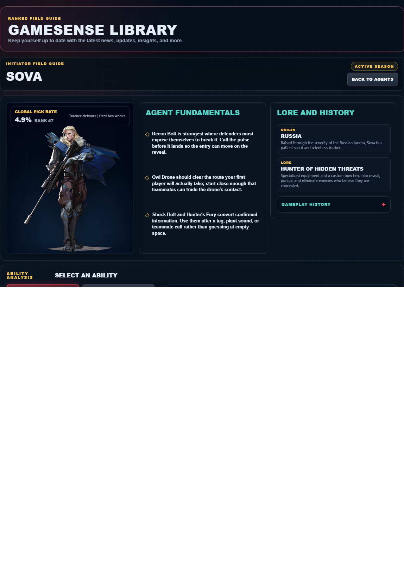

# Library Draft Review — Agent: Sova — 2026-07-23

## Summary

One-time full-coverage baseline. 5 fields changed for Patch 13.01.

## Screenshot

## Field-by-field changes

| Field | Tier | Before | After | Sources checked | Confidence |
| --- | --- | --- | --- | --- | --- |
| `icon` | canonical | /assets/library/agents/sova/icon.png | https://media.valorant-api.com/agents/320b2a48-4d9b-a075-30f1-1f93a9b638fa/displayicon.png | [https://valorant-api.com/v1/agents/320b2a48-4d9b-a075-30f1-1f93a9b638fa?language=en-US](https://valorant-api.com/v1/agents/320b2a48-4d9b-a075-30f1-1f93a9b638fa?language=en-US) | n/a (auto-approved) |
| `portrait` | canonical | /assets/library/agents/sova/portrait.png | https://media.valorant-api.com/agents/320b2a48-4d9b-a075-30f1-1f93a9b638fa/fullportrait.png | [https://valorant-api.com/v1/agents/320b2a48-4d9b-a075-30f1-1f93a9b638fa?language=en-US](https://valorant-api.com/v1/agents/320b2a48-4d9b-a075-30f1-1f93a9b638fa?language=en-US) | n/a (auto-approved) |
| `abilities` | canonical | [   {     "id": "owl-drone",     "name": "Owl Drone",     "slot": "C - Basic",     "icon": "/assets/library/agents/sova/owl-drone.png",     "summary": "A controllable drone that clears close space and can tag an enemy for repeated reveals.",     "stats": {       "Cost": "400 credits",       "Charges": "1",       "Duration": "About 10 seconds",       "Damage": "None"     },     "purpose": "Clear the exact route the entry will take and force defenders to shoot or give up space.",     "setup": "Start close enough that teammates can follow the drone. A full solo flight with nobody ready wastes the reveal window.",     "video": {       "provider": "riot",       "src": "https://cmsassets.rgpub.io/sanity/files/dsfx7636/game_data/6c6f036376c18ddf4ed0c589b506b8889d86a29a.mp4?accountingTag=VAL",       "title": "Sova Owl Drone ability demo",       "source": "https://playvalorant.com/en-us/agents/"     }   },   {     "id": "shock-bolt",     "name": "Shock Bolt",     "slot": "Q - Basic",     "icon": "/assets/library/agents/sova/shock-bolt.png",     "summary": "A charged, bouncing explosive arrow with damage that falls away from the blast center.",     "stats": {       "Cost": "150 credits each",       "Charges": "2",       "Damage": "Up to 75",       "Falloff": "Scales down from center"     },     "purpose": "Finish tagged enemies, clear utility, punish plants, and force players out of cover.",     "setup": "Use full damage only when the center can land. Edge damage is pressure, not a guaranteed kill.",     "video": {       "provider": "riot",       "src": "https://cmsassets.rgpub.io/sanity/files/dsfx7636/game_data/7776fa677e90c72da94ec7d188d2d4618116c41b.mp4?accountingTag=VAL",       "title": "Sova Shock Bolt ability demo",       "source": "https://playvalorant.com/en-us/agents/"     }   },   {     "id": "recon-bolt",     "name": "Recon Bolt",     "slot": "E - Signature",     "icon": "/assets/library/agents/sova/recon-bolt.png",     "summary": "A destructible scan arrow that reveals enemies in line of sight.",     "stats": {       "Cost": "Free",       "Charges": "1",       "Recharge": "Cooldown",       "Damage": "None"     },     "purpose": "Confirm occupied lanes and make defenders turn away from the entry fight to break the dart.",     "setup": "Place it where the pulse sees the fight but defenders cannot destroy it without exposing themselves.",     "video": {       "provider": "riot",       "src": "https://cmsassets.rgpub.io/sanity/files/dsfx7636/game_data/50f9d870fa2a9b9ba38408eb718ffc06879c11a8.mp4?accountingTag=VAL",       "title": "Sova Recon Bolt ability demo",       "source": "https://playvalorant.com/en-us/agents/"     }   },   {     "id": "hunter-s-fury",     "name": "Hunter's Fury",     "slot": "X - Ultimate",     "icon": "/assets/library/agents/sova/hunter-s-fury.png",     "summary": "Three long wall-piercing blasts that damage and reveal enemies caught in the beam.",     "stats": {       "Cost": "8 ultimate points",       "Charges": "3 blasts",       "Damage": "80 per blast",       "Falloff": "None through terrain"     },     "purpose": "Convert recon or a drone tag, deny a plant or defuse, and damage clustered rotations.",     "setup": "Lead the target between blasts. Firing all three at the same stale position gives away the remaining shots.",     "video": {       "provider": "riot",       "src": "https://cmsassets.rgpub.io/sanity/files/dsfx7636/game_data/df9ce34c3d2a7f527929cac123501e1473e0da0e.mp4?accountingTag=VAL",       "title": "Sova Hunter's Fury ability demo",       "source": "https://playvalorant.com/en-us/agents/"     }   } ] | [   {     "id": "shock-bolt",     "name": "Shock Bolt",     "slot": "C - Basic",     "icon": "https://media.valorant-api.com/agents/320b2a48-4d9b-a075-30f1-1f93a9b638fa/abilities/ability1/displayicon.png",     "summary": "EQUIP a bow with a shock bolt. FIRE to send the explosive bolt forward, detonating upon collision and damaging players nearby. HOLD FIRE to extend the range of the projectile. ALT FIRE to add up to two bounces to this arrow.",     "stats": {       "Cost": "150 credits each",       "Charges": "2",       "Damage": "Up to 75",       "Falloff": "Scales down from center"     },     "purpose": "Finish tagged enemies, clear utility, punish plants, and force players out of cover.",     "setup": "Use full damage only when the center can land. Edge damage is pressure, not a guaranteed kill.",     "video": {       "provider": "riot",       "src": "https://cmsassets.rgpub.io/sanity/files/dsfx7636/game_data/7776fa677e90c72da94ec7d188d2d4618116c41b.mp4?accountingTag=VAL",       "title": "Sova Shock Bolt ability demo",       "source": "https://playvalorant.com/en-us/agents/"     },     "source": "https://valorant-api.com/v1/agents/320b2a48-4d9b-a075-30f1-1f93a9b638fa?language=en-US"   },   {     "id": "recon-bolt",     "name": "Recon Bolt",     "slot": "Q - Basic",     "icon": "https://media.valorant-api.com/agents/320b2a48-4d9b-a075-30f1-1f93a9b638fa/abilities/ability2/displayicon.png",     "summary": "EQUIP a bow with recon bolt. FIRE to send the recon bolt forward, activating upon collision and Revealing the location of nearby enemies caught in the line of sight of the bolt. Enemies can destroy this bolt. HOLD FIRE to extend the range of the projectile. ALT FIRE to add up to two bounces to this arrow. ",     "stats": {       "Cost": "Free",       "Charges": "1",       "Recharge": "Cooldown",       "Damage": "None"     },     "purpose": "Confirm occupied lanes and make defenders turn away from the entry fight to break the dart.",     "setup": "Place it where the pulse sees the fight but defenders cannot destroy it without exposing themselves.",     "video": {       "provider": "riot",       "src": "https://cmsassets.rgpub.io/sanity/files/dsfx7636/game_data/50f9d870fa2a9b9ba38408eb718ffc06879c11a8.mp4?accountingTag=VAL",       "title": "Sova Recon Bolt ability demo",       "source": "https://playvalorant.com/en-us/agents/"     },     "source": "https://valorant-api.com/v1/agents/320b2a48-4d9b-a075-30f1-1f93a9b638fa?language=en-US"   },   {     "id": "owl-drone",     "name": "Owl Drone",     "slot": "E - Signature",     "icon": "https://media.valorant-api.com/agents/320b2a48-4d9b-a075-30f1-1f93a9b638fa/abilities/grenade/displayicon.png",     "summary": "EQUIP an owl drone. FIRE to deploy and take control of movement of the drone. While in control of the drone, FIRE to shoot a marking dart. This dart will Reveal the location of any player struck by the dart. Enemies can destroy the Owl Drone.",     "stats": {       "Cost": "400 credits",       "Charges": "1",       "Duration": "About 10 seconds",       "Damage": "None"     },     "purpose": "Clear the exact route the entry will take and force defenders to shoot or give up space.",     "setup": "Start close enough that teammates can follow the drone. A full solo flight with nobody ready wastes the reveal window.",     "video": {       "provider": "riot",       "src": "https://cmsassets.rgpub.io/sanity/files/dsfx7636/game_data/6c6f036376c18ddf4ed0c589b506b8889d86a29a.mp4?accountingTag=VAL",       "title": "Sova Owl Drone ability demo",       "source": "https://playvalorant.com/en-us/agents/"     },     "source": "https://valorant-api.com/v1/agents/320b2a48-4d9b-a075-30f1-1f93a9b638fa?language=en-US"   },   {     "id": "hunter-s-fury",     "name": "Hunter's Fury",     "slot": "X - Ultimate",     "icon": "https://media.valorant-api.com/agents/320b2a48-4d9b-a075-30f1-1f93a9b638fa/abilities/ultimate/displayicon.png",     "summary": "EQUIP a bow with three long-range, wall-piercing energy blasts. FIRE to release an energy blast in a line in front of Sova, dealing damage and Revealing the location of enemies caught in the line. This ability can be RE-USED up to two more times while the ability timer is active.",     "stats": {       "Cost": "8 ultimate points",       "Charges": "3 blasts",       "Damage": "80 per blast",       "Falloff": "None through terrain"     },     "purpose": "Convert recon or a drone tag, deny a plant or defuse, and damage clustered rotations.",     "setup": "Lead the target between blasts. Firing all three at the same stale position gives away the remaining shots.",     "video": {       "provider": "riot",       "src": "https://cmsassets.rgpub.io/sanity/files/dsfx7636/game_data/df9ce34c3d2a7f527929cac123501e1473e0da0e.mp4?accountingTag=VAL",       "title": "Sova Hunter's Fury ability demo",       "source": "https://playvalorant.com/en-us/agents/"     },     "source": "https://valorant-api.com/v1/agents/320b2a48-4d9b-a075-30f1-1f93a9b638fa?language=en-US"   },   {     "id": "uncanny-marksman",     "name": "Uncanny Marksman",     "slot": "Passive - Passive",     "icon": "",     "summary": "Sova's custom bow can fire his arrows and bounce them off terrain. Holding fire charges the bow's power, and the bolt is loosed when released. Press alt fire to change the number of bounces.Your arrows can bounce off terrain. Holding left click increases the bow's range trajectory. Right clicking Toggle through the desired number of terrain bounces by right clicking. The arrow is loosed when left click is released.",     "source": "https://valorant-api.com/v1/agents/320b2a48-4d9b-a075-30f1-1f93a9b638fa?language=en-US"   } ] | [https://valorant-api.com/v1/agents/320b2a48-4d9b-a075-30f1-1f93a9b638fa?language=en-US](https://valorant-api.com/v1/agents/320b2a48-4d9b-a075-30f1-1f93a9b638fa?language=en-US) | n/a (auto-approved) |
| `uuid` | canonical |  | 320b2a48-4d9b-a075-30f1-1f93a9b638fa | [https://valorant-api.com/v1/agents/320b2a48-4d9b-a075-30f1-1f93a9b638fa?language=en-US](https://valorant-api.com/v1/agents/320b2a48-4d9b-a075-30f1-1f93a9b638fa?language=en-US) | n/a (auto-approved) |
| `source` | canonical |  | https://valorant-api.com/v1/agents/320b2a48-4d9b-a075-30f1-1f93a9b638fa?language=en-US | [https://valorant-api.com/v1/agents/320b2a48-4d9b-a075-30f1-1f93a9b638fa?language=en-US](https://valorant-api.com/v1/agents/320b2a48-4d9b-a075-30f1-1f93a9b638fa?language=en-US) | n/a (auto-approved) |

## Approval

- [ ] Approved as-is
- [ ] Approved with edits (note edits below)
- [ ] Rejected (note why below)

Notes:

Promotion totals: 5 canonical, 0 synthesized, 0 mixed-tier field groups.
