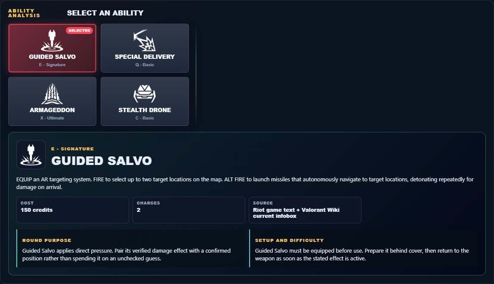
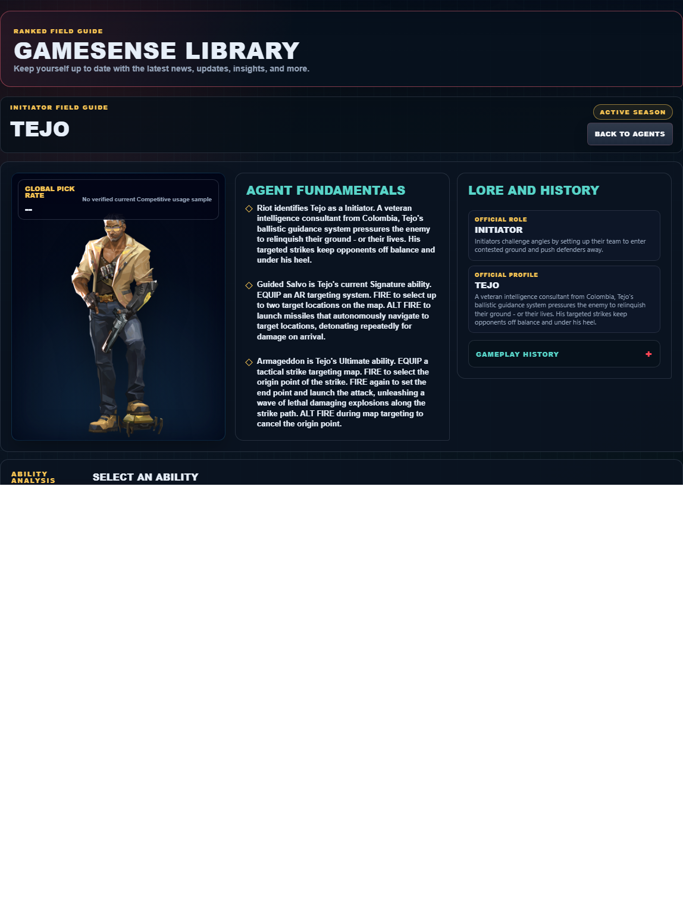

# Library Draft Review — Agent: Tejo — 2026-07-23

## Summary

One-time full-coverage baseline. 2 fields changed for Patch 13.01.

## Screenshot

## Field-by-field changes

| Field | Tier | Before | After | Sources checked | Confidence |
| --- | --- | --- | --- | --- | --- |
| `abilities` | canonical | [   {     "id": "guided-salvo",     "name": "Guided Salvo",     "slot": "E - Signature",     "icon": "https://media.valorant-api.com/agents/b444168c-4e35-8076-db47-ef9bf368f384/abilities/ability2/displayicon.png",     "summary": "EQUIP an AR targeting system. FIRE to select up to two target locations on the map. ALT FIRE to launch missiles that autonomously navigate to target locations, detonating repeatedly for damage on arrival.",     "stats": {       "Cost": "150 credits",       "Charges": "2",       "Source": "Riot game text + Valorant Wiki current infobox"     },     "purpose": "Guided Salvo applies direct pressure. Pair its verified damage effect with a confirmed position rather than spending it on an unchecked guess.",     "setup": "Guided Salvo must be equipped before use. Prepare it behind cover, then return to the weapon as soon as the stated effect is active.",     "source": "https://valorant-api.com/v1/agents/b444168c-4e35-8076-db47-ef9bf368f384?language=en-US"   },   {     "id": "special-delivery",     "name": "Special Delivery",     "slot": "Q - Basic",     "icon": "https://media.valorant-api.com/agents/b444168c-4e35-8076-db47-ef9bf368f384/abilities/ability1/displayicon.png",     "summary": "EQUIP a sticky grenade. FIRE to launch. The grenade sticks to the first surface it hits and explodes, Concussing and dealing damage to any targets caught in the blast. ALT FIRE to launch the grenade with a single bounce instead.",     "stats": {       "Cost": "200 credits",       "Charges": "1",       "Source": "Riot game text + Valorant Wiki current infobox"     },     "purpose": "Special Delivery applies direct pressure. Pair its verified damage effect with a confirmed position rather than spending it on an unchecked guess.",     "setup": "Special Delivery must be equipped before use. Prepare it behind cover, then return to the weapon as soon as the stated effect is active.",     "source": "https://valorant-api.com/v1/agents/b444168c-4e35-8076-db47-ef9bf368f384?language=en-US"   },   {     "id": "armageddon",     "name": "Armageddon",     "slot": "X - Ultimate",     "icon": "https://media.valorant-api.com/agents/b444168c-4e35-8076-db47-ef9bf368f384/abilities/ultimate/displayicon.png",     "summary": "EQUIP a tactical strike targeting map. FIRE to select the origin point of the strike. FIRE again to set the end point and launch the attack, unleashing a wave of lethal damaging explosions along the strike path. ALT FIRE during map targeting to cancel the origin point.",     "stats": {       "Cost": "9 ultimate points",       "Charges": "Current client value not published in Riot's public content feed",       "Source": "Riot game text + Valorant Wiki current infobox"     },     "purpose": "Armageddon performs the exact function in Riot's current description. Build the play around that stated effect instead of assuming an unlisted interaction.",     "setup": "Armageddon must be equipped before use. Prepare it behind cover, then return to the weapon as soon as the stated effect is active.",     "source": "https://valorant-api.com/v1/agents/b444168c-4e35-8076-db47-ef9bf368f384?language=en-US"   },   {     "id": "stealth-drone",     "name": "Stealth Drone",     "slot": "C - Basic",     "icon": "https://media.valorant-api.com/agents/b444168c-4e35-8076-db47-ef9bf368f384/abilities/grenade/displayicon.png",     "summary": "EQUIP a stealth drone. FIRE to throw the drone forward, assuming direct control of its movement. FIRE again to trigger a pulse that Suppresses and Reveals enemies hit.",     "stats": {       "Cost": "400 credits",       "Charges": "1",       "Source": "Riot game text + Valorant Wiki current infobox"     },     "purpose": "Stealth Drone provides information. Use the reveal, detection, or tracking result to name an occupied space before a teammate commits.",     "setup": "Stealth Drone must be equipped before use. Prepare it behind cover, then return to the weapon as soon as the stated effect is active.",     "source": "https://valorant-api.com/v1/agents/b444168c-4e35-8076-db47-ef9bf368f384?language=en-US"   } ] | [   {     "id": "guided-salvo",     "name": "Guided Salvo",     "slot": "Q - Basic",     "icon": "https://media.valorant-api.com/agents/b444168c-4e35-8076-db47-ef9bf368f384/abilities/ability2/displayicon.png",     "summary": "EQUIP an AR targeting system. FIRE to select up to two target locations on the map. ALT FIRE to launch missiles that autonomously navigate to target locations, detonating repeatedly for damage on arrival.",     "stats": {       "Cost": "150 credits",       "Charges": "2",       "Source": "Riot game text + Valorant Wiki current infobox"     },     "purpose": "Guided Salvo applies direct pressure. Pair its verified damage effect with a confirmed position rather than spending it on an unchecked guess.",     "setup": "Guided Salvo must be equipped before use. Prepare it behind cover, then return to the weapon as soon as the stated effect is active.",     "source": "https://valorant-api.com/v1/agents/b444168c-4e35-8076-db47-ef9bf368f384?language=en-US"   },   {     "id": "special-delivery",     "name": "Special Delivery",     "slot": "C - Basic",     "icon": "https://media.valorant-api.com/agents/b444168c-4e35-8076-db47-ef9bf368f384/abilities/ability1/displayicon.png",     "summary": "EQUIP a sticky grenade. FIRE to launch. The grenade sticks to the first surface it hits and explodes, Concussing and dealing damage to any targets caught in the blast. ALT FIRE to launch the grenade with a single bounce instead.",     "stats": {       "Cost": "200 credits",       "Charges": "1",       "Source": "Riot game text + Valorant Wiki current infobox"     },     "purpose": "Special Delivery applies direct pressure. Pair its verified damage effect with a confirmed position rather than spending it on an unchecked guess.",     "setup": "Special Delivery must be equipped before use. Prepare it behind cover, then return to the weapon as soon as the stated effect is active.",     "source": "https://valorant-api.com/v1/agents/b444168c-4e35-8076-db47-ef9bf368f384?language=en-US"   },   {     "id": "armageddon",     "name": "Armageddon",     "slot": "X - Ultimate",     "icon": "https://media.valorant-api.com/agents/b444168c-4e35-8076-db47-ef9bf368f384/abilities/ultimate/displayicon.png",     "summary": "EQUIP a tactical strike targeting map. FIRE to select the origin point of the strike. FIRE again to set the end point and launch the attack, unleashing a wave of lethal damaging explosions along the strike path. ALT FIRE during map targeting to cancel the origin point.",     "stats": {       "Cost": "9 ultimate points",       "Charges": "Current client value not published in Riot's public content feed",       "Source": "Riot game text + Valorant Wiki current infobox"     },     "purpose": "Armageddon performs the exact function in Riot's current description. Build the play around that stated effect instead of assuming an unlisted interaction.",     "setup": "Armageddon must be equipped before use. Prepare it behind cover, then return to the weapon as soon as the stated effect is active.",     "source": "https://valorant-api.com/v1/agents/b444168c-4e35-8076-db47-ef9bf368f384?language=en-US"   },   {     "id": "stealth-drone",     "name": "Stealth Drone",     "slot": "E - Signature",     "icon": "https://media.valorant-api.com/agents/b444168c-4e35-8076-db47-ef9bf368f384/abilities/grenade/displayicon.png",     "summary": "EQUIP a stealth drone. FIRE to throw the drone forward, assuming direct control of its movement. FIRE again to trigger a pulse that Suppresses and Reveals enemies hit.",     "stats": {       "Cost": "400 credits",       "Charges": "1",       "Source": "Riot game text + Valorant Wiki current infobox"     },     "purpose": "Stealth Drone provides information. Use the reveal, detection, or tracking result to name an occupied space before a teammate commits.",     "setup": "Stealth Drone must be equipped before use. Prepare it behind cover, then return to the weapon as soon as the stated effect is active.",     "source": "https://valorant-api.com/v1/agents/b444168c-4e35-8076-db47-ef9bf368f384?language=en-US"   } ] | [https://valorant-api.com/v1/agents/b444168c-4e35-8076-db47-ef9bf368f384?language=en-US](https://valorant-api.com/v1/agents/b444168c-4e35-8076-db47-ef9bf368f384?language=en-US) | n/a (auto-approved) |
| `uuid` | canonical |  | b444168c-4e35-8076-db47-ef9bf368f384 | [https://valorant-api.com/v1/agents/b444168c-4e35-8076-db47-ef9bf368f384?language=en-US](https://valorant-api.com/v1/agents/b444168c-4e35-8076-db47-ef9bf368f384?language=en-US) | n/a (auto-approved) |

## Approval

- [ ] Approved as-is
- [ ] Approved with edits (note edits below)
- [ ] Rejected (note why below)

Notes:

Promotion totals: 2 canonical, 0 synthesized, 0 mixed-tier field groups.
