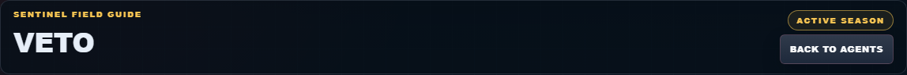
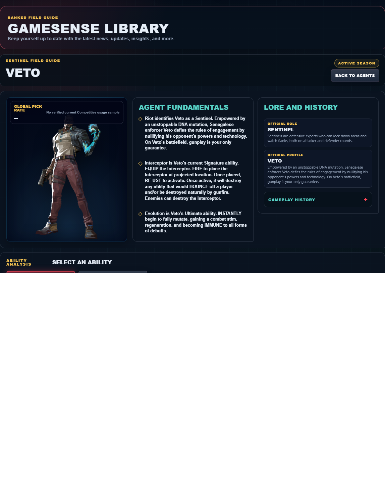

# Library Draft Review — Agent: Veto — 2026-07-23

## Summary

One-time full-coverage baseline. 2 fields changed for Patch 13.01.

## Screenshot

## Field-by-field changes

| Field | Tier | Before | After | Sources checked | Confidence |
| --- | --- | --- | --- | --- | --- |
| `abilities` | canonical | [   {     "id": "interceptor",     "name": "Interceptor",     "slot": "E - Signature",     "icon": "https://media.valorant-api.com/agents/92eeef5d-43b5-1d4a-8d03-b3927a09034b/abilities/ability2/displayicon.png",     "summary": "EQUIP the Interceptor. FIRE to place the Interceptor at projected location. Once placed, RE-USE to activate. Once active, it will destroy any utility that would BOUNCE off a player and/or be destroyed naturally by gunfire. Enemies can destroy the Interceptor.",     "stats": {       "Cost": "Free signature charge",       "Charges": "1",       "Source": "Riot game text + Valorant Wiki current infobox"     },     "purpose": "Interceptor performs the exact function in Riot's current description. Build the play around that stated effect instead of assuming an unlisted interaction.",     "setup": "Interceptor must be equipped before use. Prepare it behind cover, then return to the weapon as soon as the stated effect is active.",     "source": "https://valorant-api.com/v1/agents/92eeef5d-43b5-1d4a-8d03-b3927a09034b?language=en-US"   },   {     "id": "crosscut",     "name": "Crosscut",     "slot": "C - Basic",     "icon": "https://media.valorant-api.com/agents/92eeef5d-43b5-1d4a-8d03-b3927a09034b/abilities/grenade/displayicon.png",     "summary": "EQUIP a vortex. FIRE to place on the ground. While in range and looking at the vortex, ACTIVATE to teleport to the vortex. During the BUY PHASE, the vortex can be reclaimed to be REDEPLOYED.",     "stats": {       "Cost": "200 credits",       "Charges": "2",       "Source": "Riot game text + Valorant Wiki current infobox"     },     "purpose": "Crosscut changes position. Choose the destination and nearby cover before activating the movement effect described by Riot.",     "setup": "Crosscut must be equipped before use. Prepare it behind cover, then return to the weapon as soon as the stated effect is active.",     "source": "https://valorant-api.com/v1/agents/92eeef5d-43b5-1d4a-8d03-b3927a09034b?language=en-US"   },   {     "id": "evolution",     "name": "Evolution",     "slot": "X - Ultimate",     "icon": "https://media.valorant-api.com/agents/92eeef5d-43b5-1d4a-8d03-b3927a09034b/abilities/ultimate/displayicon.png",     "summary": "INSTANTLY begin to fully mutate, gaining a combat stim, regeneration, and becoming IMMUNE to all forms of debuffs.",     "stats": {       "Cost": "7 ultimate points",       "Charges": "Current client value not published in Riot's public content feed",       "Source": "Riot game text + Valorant Wiki current infobox"     },     "purpose": "Evolution performs the exact function in Riot's current description. Build the play around that stated effect instead of assuming an unlisted interaction.",     "setup": "Evolution should be prepared around the official description above; no extra range, duration, or interaction is assumed when Riot's public feed does not state it.",     "source": "https://valorant-api.com/v1/agents/92eeef5d-43b5-1d4a-8d03-b3927a09034b?language=en-US"   },   {     "id": "chokehold",     "name": "Chokehold",     "slot": "Q - Basic",     "icon": "https://media.valorant-api.com/agents/92eeef5d-43b5-1d4a-8d03-b3927a09034b/abilities/ability1/displayicon.png",     "summary": "EQUIP a viscous fragment of your mutation. FIRE to throw. The fragment deploys upon hitting the ground, creating a trap to hold enemies in place. Held enemies are Deafened, and Decayed. Enemies can destroy the trap before activation.",     "stats": {       "Cost": "200 credits",       "Charges": "1",       "Source": "Riot game text + Valorant Wiki current infobox"     },     "purpose": "Chokehold limits an opponent's options. Time its verified control effect for the moment an enemy must cross or fight.",     "setup": "Chokehold must be equipped before use. Prepare it behind cover, then return to the weapon as soon as the stated effect is active.",     "source": "https://valorant-api.com/v1/agents/92eeef5d-43b5-1d4a-8d03-b3927a09034b?language=en-US"   } ] | [   {     "id": "interceptor",     "name": "Interceptor",     "slot": "Q - Basic",     "icon": "https://media.valorant-api.com/agents/92eeef5d-43b5-1d4a-8d03-b3927a09034b/abilities/ability2/displayicon.png",     "summary": "EQUIP the Interceptor. FIRE to place the Interceptor at projected location. Once placed, RE-USE to activate. Once active, it will destroy any utility that would BOUNCE off a player and/or be destroyed naturally by gunfire. Enemies can destroy the Interceptor.",     "stats": {       "Cost": "Free signature charge",       "Charges": "1",       "Source": "Riot game text + Valorant Wiki current infobox"     },     "purpose": "Interceptor performs the exact function in Riot's current description. Build the play around that stated effect instead of assuming an unlisted interaction.",     "setup": "Interceptor must be equipped before use. Prepare it behind cover, then return to the weapon as soon as the stated effect is active.",     "source": "https://valorant-api.com/v1/agents/92eeef5d-43b5-1d4a-8d03-b3927a09034b?language=en-US"   },   {     "id": "crosscut",     "name": "Crosscut",     "slot": "E - Signature",     "icon": "https://media.valorant-api.com/agents/92eeef5d-43b5-1d4a-8d03-b3927a09034b/abilities/grenade/displayicon.png",     "summary": "EQUIP a vortex. FIRE to place on the ground. While in range and looking at the vortex, ACTIVATE to teleport to the vortex. During the BUY PHASE, the vortex can be reclaimed to be REDEPLOYED.",     "stats": {       "Cost": "200 credits",       "Charges": "2",       "Source": "Riot game text + Valorant Wiki current infobox"     },     "purpose": "Crosscut changes position. Choose the destination and nearby cover before activating the movement effect described by Riot.",     "setup": "Crosscut must be equipped before use. Prepare it behind cover, then return to the weapon as soon as the stated effect is active.",     "source": "https://valorant-api.com/v1/agents/92eeef5d-43b5-1d4a-8d03-b3927a09034b?language=en-US"   },   {     "id": "evolution",     "name": "Evolution",     "slot": "X - Ultimate",     "icon": "https://media.valorant-api.com/agents/92eeef5d-43b5-1d4a-8d03-b3927a09034b/abilities/ultimate/displayicon.png",     "summary": "INSTANTLY begin to fully mutate, gaining a combat stim, regeneration, and becoming IMMUNE to all forms of debuffs.",     "stats": {       "Cost": "7 ultimate points",       "Charges": "Current client value not published in Riot's public content feed",       "Source": "Riot game text + Valorant Wiki current infobox"     },     "purpose": "Evolution performs the exact function in Riot's current description. Build the play around that stated effect instead of assuming an unlisted interaction.",     "setup": "Evolution should be prepared around the official description above; no extra range, duration, or interaction is assumed when Riot's public feed does not state it.",     "source": "https://valorant-api.com/v1/agents/92eeef5d-43b5-1d4a-8d03-b3927a09034b?language=en-US"   },   {     "id": "chokehold",     "name": "Chokehold",     "slot": "C - Basic",     "icon": "https://media.valorant-api.com/agents/92eeef5d-43b5-1d4a-8d03-b3927a09034b/abilities/ability1/displayicon.png",     "summary": "EQUIP a viscous fragment of your mutation. FIRE to throw. The fragment deploys upon hitting the ground, creating a trap to hold enemies in place. Held enemies are Deafened, and Decayed. Enemies can destroy the trap before activation.",     "stats": {       "Cost": "200 credits",       "Charges": "1",       "Source": "Riot game text + Valorant Wiki current infobox"     },     "purpose": "Chokehold limits an opponent's options. Time its verified control effect for the moment an enemy must cross or fight.",     "setup": "Chokehold must be equipped before use. Prepare it behind cover, then return to the weapon as soon as the stated effect is active.",     "source": "https://valorant-api.com/v1/agents/92eeef5d-43b5-1d4a-8d03-b3927a09034b?language=en-US"   } ] | [https://valorant-api.com/v1/agents/92eeef5d-43b5-1d4a-8d03-b3927a09034b?language=en-US](https://valorant-api.com/v1/agents/92eeef5d-43b5-1d4a-8d03-b3927a09034b?language=en-US) | n/a (auto-approved) |
| `uuid` | canonical |  | 92eeef5d-43b5-1d4a-8d03-b3927a09034b | [https://valorant-api.com/v1/agents/92eeef5d-43b5-1d4a-8d03-b3927a09034b?language=en-US](https://valorant-api.com/v1/agents/92eeef5d-43b5-1d4a-8d03-b3927a09034b?language=en-US) | n/a (auto-approved) |

## Approval

- [ ] Approved as-is
- [ ] Approved with edits (note edits below)
- [ ] Rejected (note why below)

Notes:

Promotion totals: 2 canonical, 0 synthesized, 0 mixed-tier field groups.
