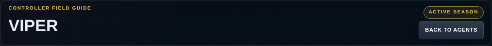
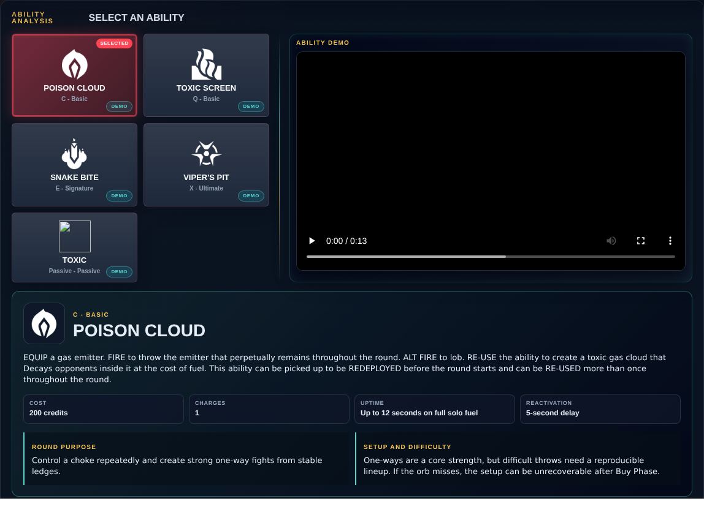

# Library Draft Review — Agent: Viper — 2026-08-15

## Summary

Scheduled canonical refresh. 1 field changed for Patch 13.02.

## Screenshot

## Field-by-field changes

| Field | Tier | Before | After | Sources checked | Confidence |
| --- | --- | --- | --- | --- | --- |
| `abilities` | canonical | [   {     "id": "poison-cloud",     "name": "Poison Cloud",     "slot": "C - Basic",     "icon": "https://media.valorant-api.com/agents/707eab51-4836-f488-046a-cda6bf494859/abilities/ability1/displayicon.png",     "summary": "EQUIP a gas emitter. FIRE to throw the emitter that perpetually remains throughout the round. ALT FIRE to lob. RE-USE the ability to create a toxic gas cloud that Decays opponents inside it at the cost of fuel. This ability can be picked up to be REDEPLOYED before the round starts and can be RE-USED more than once throughout the round.",     "stats": {       "Cost": "200 credits",       "Charges": "1",       "Uptime": "Up to 12 seconds on full solo fuel",       "Reactivation": "5-second delay"     },     "purpose": "Control a choke repeatedly and create strong one-way fights from stable ledges.",     "setup": "One-ways are a core strength, but difficult throws need a reproducible lineup. If the orb misses, the setup can be unrecoverable after Buy Phase.",     "video": {       "src": "https://cmsassets.rgpub.io/sanity/files/dsfx7636/game_data/49ff8efd75b76941da3018362061275d3a1d43d6.mp4?accountingTag=VAL",       "title": "POISON CLOUD",       "source": "https://playvalorant.com/en-us/agents/viper/",       "provider": "riot"     },     "source": "https://valorant-api.com/v1/agents/707eab51-4836-f488-046a-cda6bf494859?language=en-US"   },   {     "id": "toxic-screen",     "name": "Toxic Screen",     "slot": "Q - Basic",     "icon": "https://media.valorant-api.com/agents/707eab51-4836-f488-046a-cda6bf494859/abilities/ability2/displayicon.png",     "summary": "EQUIP a gas emitter launcher that penetrates terrain. FIRE to deploy a long line of gas emitters. RE-USE the ability to create a tall wall of toxic gas that Decays opponents that cross it at the cost of fuel. This ability can be RE-USED more than once.",     "stats": {       "Cost": "Free",       "Charges": "1",       "Uptime": "Up to 12 seconds on full solo fuel",       "Reactivation": "5-second delay"     },     "purpose": "Split open sites, hide several crossing lanes at once, and control when defenders regain information.",     "setup": "Place it for the entire round plan. The emitters cannot be moved, so a wall that helps defenders retake can hurt the team later.",     "video": {       "src": "https://cmsassets.rgpub.io/sanity/files/dsfx7636/game_data/36db8f44946850c2a20aba43d8ad3ecd977c7d7e.mp4?accountingTag=VAL",       "title": "TOXIC SCREEN",       "source": "https://playvalorant.com/en-us/agents/viper/",       "provider": "riot"     },     "source": "https://valorant-api.com/v1/agents/707eab51-4836-f488-046a-cda6bf494859?language=en-US"   },   {     "id": "snake-bite",     "name": "Snake Bite",     "slot": "E - Signature",     "icon": "https://media.valorant-api.com/agents/707eab51-4836-f488-046a-cda6bf494859/abilities/grenade/displayicon.png",     "summary": "EQUIP a chemical launcher. FIRE to launch a canister that shatters upon hitting the floor, creating a lingering chemical zone that damages and applies Vulnerable.",     "stats": {       "Cost": "300 credits",       "Charges": "1",       "Duration": "6.5 seconds",       "Damage": "Damage over time"     },     "purpose": "Clear a corner, stop a plant or defuse, and double the threat of teammate damage through Vulnerable.",     "setup": "Damage depends on how long the target remains inside, so pair it with a choke, smoke, stun, or confirmed spike timing.",     "video": {       "src": "https://cmsassets.rgpub.io/sanity/files/dsfx7636/game_data/9eeb3090efed080792e6ea2f264fd60ebb12694e.mp4?accountingTag=VAL",       "title": "SNAKE BITE",       "source": "https://playvalorant.com/en-us/agents/viper/",       "provider": "riot"     },     "source": "https://valorant-api.com/v1/agents/707eab51-4836-f488-046a-cda6bf494859?language=en-US"   },   {     "id": "viper-s-pit",     "name": "Viper's Pit",     "slot": "X - Ultimate",     "icon": "https://media.valorant-api.com/agents/707eab51-4836-f488-046a-cda6bf494859/abilities/ultimate/displayicon.png",     "summary": "EQUIP a chemical sprayer. FIRE to spray a chemical cloud in all directions around Viper, creating a large cloud that Nearsights players and Decays the health of enemies inside of it. HOLD the ability key to disperse the cloud early.",     "stats": {       "Cost": "9 ultimate points",       "Duration": "Persistent while maintained",       "Damage": "Decay, not direct damage",       "Recharge": "No"     },     "purpose": "Lock down a planted spike or high-value zone and force close, uncertain fights.",     "setup": "Move between several safe pockets. Repeating one hiding spot turns the entire ultimate into one pre-aimed duel.",     "video": {       "src": "https://cmsassets.rgpub.io/sanity/files/dsfx7636/game_data/4601fd972c588a79cdd910b2497546f156886c40.mp4?accountingTag=VAL",       "title": "VIPER'S PIT",       "source": "https://playvalorant.com/en-us/agents/viper/",       "provider": "riot"     },     "source": "https://valorant-api.com/v1/agents/707eab51-4836-f488-046a-cda6bf494859?language=en-US"   },   {     "id": "toxic",     "name": "Toxic",     "slot": "Passive - Passive",     "icon": "",     "summary": "You gradually generate and replenish the toxin that fuels your abilities.  Enemies that cross through Viper's Poison Cloud, Toxic Screen, or Viper's Pit are instantly inflicted with at least 30 Decay. Their Decay level increases the longer they remain in contact with it.",     "source": "https://valorant-api.com/v1/agents/707eab51-4836-f488-046a-cda6bf494859?language=en-US",     "video": {       "src": "https://cmsassets.rgpub.io/sanity/files/dsfx7636/game_data/36db8f44946850c2a20aba43d8ad3ecd977c7d7e.mp4?accountingTag=VAL",       "title": "Viper ability showcase",       "source": "https://playvalorant.com/en-us/agents/viper/",       "provider": "riot",       "contextualFallback": true     }   } ] | [   {     "id": "poison-cloud",     "name": "Poison Cloud",     "slot": "C - Basic",     "icon": "https://media.valorant-api.com/agents/707eab51-4836-f488-046a-cda6bf494859/abilities/ability1/displayicon.png",     "summary": "EQUIP a gas emitter. FIRE to throw the emitter that perpetually remains throughout the round. ALT FIRE to lob. RE-USE the ability to create a toxic gas cloud that Decays opponents inside it at the cost of fuel. This ability can be picked up to be REDEPLOYED before the round starts and can be RE-USED more than once throughout the round.",     "stats": {       "Cost": "200 credits",       "Charges": "1",       "Uptime": "Up to 12 seconds on full solo fuel",       "Reactivation": "5-second delay"     },     "purpose": "Control a choke repeatedly and create strong one-way fights from stable ledges.",     "setup": "One-ways are a core strength, but difficult throws need a reproducible lineup. If the orb misses, the setup can be unrecoverable after Buy Phase.",     "video": {       "src": "https://cmsassets.rgpub.io/sanity/files/dsfx7636/game_data/49ff8efd75b76941da3018362061275d3a1d43d6.mp4?accountingTag=VAL",       "title": "Viper Poison Cloud ability demo",       "source": "https://playvalorant.com/en-us/agents/",       "provider": "riot"     },     "source": "https://valorant-api.com/v1/agents/707eab51-4836-f488-046a-cda6bf494859?language=en-US"   },   {     "id": "toxic-screen",     "name": "Toxic Screen",     "slot": "Q - Basic",     "icon": "https://media.valorant-api.com/agents/707eab51-4836-f488-046a-cda6bf494859/abilities/ability2/displayicon.png",     "summary": "EQUIP a gas emitter launcher that penetrates terrain. FIRE to deploy a long line of gas emitters. RE-USE the ability to create a tall wall of toxic gas that Decays opponents that cross it at the cost of fuel. This ability can be RE-USED more than once.",     "stats": {       "Cost": "Free",       "Charges": "1",       "Uptime": "Up to 12 seconds on full solo fuel",       "Reactivation": "5-second delay"     },     "purpose": "Split open sites, hide several crossing lanes at once, and control when defenders regain information.",     "setup": "Place it for the entire round plan. The emitters cannot be moved, so a wall that helps defenders retake can hurt the team later.",     "video": {       "src": "https://cmsassets.rgpub.io/sanity/files/dsfx7636/game_data/36db8f44946850c2a20aba43d8ad3ecd977c7d7e.mp4?accountingTag=VAL",       "title": "Viper Toxic Screen ability demo",       "source": "https://playvalorant.com/en-us/agents/",       "provider": "riot"     },     "source": "https://valorant-api.com/v1/agents/707eab51-4836-f488-046a-cda6bf494859?language=en-US"   },   {     "id": "snake-bite",     "name": "Snake Bite",     "slot": "E - Signature",     "icon": "https://media.valorant-api.com/agents/707eab51-4836-f488-046a-cda6bf494859/abilities/grenade/displayicon.png",     "summary": "EQUIP a chemical launcher. FIRE to launch a canister that shatters upon hitting the floor, creating a lingering chemical zone that damages and applies Vulnerable.",     "stats": {       "Cost": "300 credits",       "Charges": "1",       "Duration": "6.5 seconds",       "Damage": "Damage over time"     },     "purpose": "Clear a corner, stop a plant or defuse, and double the threat of teammate damage through Vulnerable.",     "setup": "Damage depends on how long the target remains inside, so pair it with a choke, smoke, stun, or confirmed spike timing.",     "video": {       "src": "https://cmsassets.rgpub.io/sanity/files/dsfx7636/game_data/9eeb3090efed080792e6ea2f264fd60ebb12694e.mp4?accountingTag=VAL",       "title": "Viper Snake Bite ability demo",       "source": "https://playvalorant.com/en-us/agents/",       "provider": "riot"     },     "source": "https://valorant-api.com/v1/agents/707eab51-4836-f488-046a-cda6bf494859?language=en-US"   },   {     "id": "viper-s-pit",     "name": "Viper's Pit",     "slot": "X - Ultimate",     "icon": "https://media.valorant-api.com/agents/707eab51-4836-f488-046a-cda6bf494859/abilities/ultimate/displayicon.png",     "summary": "EQUIP a chemical sprayer. FIRE to spray a chemical cloud in all directions around Viper, creating a large cloud that Nearsights players and Decays the health of enemies inside of it. HOLD the ability key to disperse the cloud early.",     "stats": {       "Cost": "9 ultimate points",       "Duration": "Persistent while maintained",       "Damage": "Decay, not direct damage",       "Recharge": "No"     },     "purpose": "Lock down a planted spike or high-value zone and force close, uncertain fights.",     "setup": "Move between several safe pockets. Repeating one hiding spot turns the entire ultimate into one pre-aimed duel.",     "video": {       "src": "https://cmsassets.rgpub.io/sanity/files/dsfx7636/game_data/4601fd972c588a79cdd910b2497546f156886c40.mp4?accountingTag=VAL",       "title": "Viper's Pit ability demo",       "source": "https://playvalorant.com/en-us/agents/",       "provider": "riot"     },     "source": "https://valorant-api.com/v1/agents/707eab51-4836-f488-046a-cda6bf494859?language=en-US"   },   {     "id": "toxic",     "name": "Toxic",     "slot": "Passive - Passive",     "icon": "",     "summary": "You gradually generate and replenish the toxin that fuels your abilities.  Enemies that cross through Viper's Poison Cloud, Toxic Screen, or Viper's Pit are instantly inflicted with at least 30 Decay. Their Decay level increases the longer they remain in contact with it.",     "source": "https://valorant-api.com/v1/agents/707eab51-4836-f488-046a-cda6bf494859?language=en-US"   } ] | [https://valorant-api.com/v1/agents/707eab51-4836-f488-046a-cda6bf494859?language=en-US](https://valorant-api.com/v1/agents/707eab51-4836-f488-046a-cda6bf494859?language=en-US) | n/a (auto-approved) |

## Approval

- [ ] Approved as-is
- [ ] Approved with edits (note edits below)
- [ ] Rejected (note why below)

Notes:

Promotion totals: 1 canonical, 0 synthesized, 0 mixed-tier field groups.
