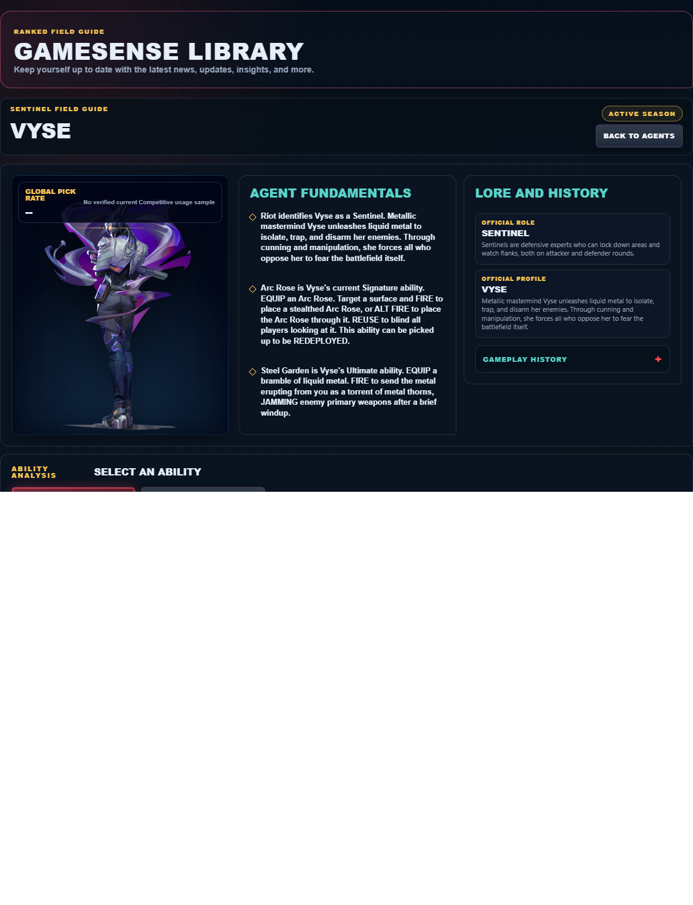

# Library Draft Review — Agent: Vyse — 2026-07-23

## Summary

One-time full-coverage baseline. 2 fields changed for Patch 13.01.

## Screenshot

## Field-by-field changes

| Field | Tier | Before | After | Sources checked | Confidence |
| --- | --- | --- | --- | --- | --- |
| `abilities` | canonical | [   {     "id": "shear",     "name": "Shear",     "slot": "Q - Basic",     "icon": "https://media.valorant-api.com/agents/efba5359-4016-a1e5-7626-b1ae76895940/abilities/ability1/displayicon.png",     "summary": "EQUIP filaments of liquid metal. FIRE to place a hidden wall trap. When an enemy crosses, an indestructible wall bursts from the ground behind them. The wall lasts for a brief time before dissipating.",     "stats": {       "Cost": "200 credits",       "Charges": "1",       "Source": "Riot game text + Valorant Wiki current infobox"     },     "purpose": "Shear limits an opponent's options. Time its verified control effect for the moment an enemy must cross or fight.",     "setup": "Shear must be equipped before use. Prepare it behind cover, then return to the weapon as soon as the stated effect is active.",     "source": "https://valorant-api.com/v1/agents/efba5359-4016-a1e5-7626-b1ae76895940?language=en-US"   },   {     "id": "arc-rose",     "name": "Arc Rose",     "slot": "E - Signature",     "icon": "https://media.valorant-api.com/agents/efba5359-4016-a1e5-7626-b1ae76895940/abilities/ability2/displayicon.png",     "summary": "EQUIP an Arc Rose. Target a surface and FIRE to place a stealthed Arc Rose, or ALT FIRE to place the Arc Rose through it. REUSE to blind all players looking at it. This ability can be picked up to be REDEPLOYED.",     "stats": {       "Cost": "Free signature charge",       "Charges": "1",       "Source": "Riot game text + Valorant Wiki current infobox"     },     "purpose": "Arc Rose is the kit's vision-denial tool. Use its verified blind or Nearsight effect immediately before the team contests the affected angle.",     "setup": "Arc Rose must be equipped before use. Prepare it behind cover, then return to the weapon as soon as the stated effect is active.",     "source": "https://valorant-api.com/v1/agents/efba5359-4016-a1e5-7626-b1ae76895940?language=en-US"   },   {     "id": "razorvine",     "name": "Razorvine",     "slot": "C - Basic",     "icon": "https://media.valorant-api.com/agents/efba5359-4016-a1e5-7626-b1ae76895940/abilities/grenade/displayicon.png",     "summary": "EQUIP a nest of liquid metal. FIRE to launch. Upon landing, the nest becomes invisible. When ACTIVATED, it sprawls out into a large razorvine nest which slows and damages all players who move through it.",     "stats": {       "Cost": "150 credits",       "Charges": "2",       "Source": "Riot game text + Valorant Wiki current infobox"     },     "purpose": "Razorvine applies direct pressure. Pair its verified damage effect with a confirmed position rather than spending it on an unchecked guess.",     "setup": "Razorvine must be equipped before use. Prepare it behind cover, then return to the weapon as soon as the stated effect is active.",     "source": "https://valorant-api.com/v1/agents/efba5359-4016-a1e5-7626-b1ae76895940?language=en-US"   },   {     "id": "steel-garden",     "name": "Steel Garden",     "slot": "X - Ultimate",     "icon": "https://media.valorant-api.com/agents/efba5359-4016-a1e5-7626-b1ae76895940/abilities/ultimate/displayicon.png",     "summary": "EQUIP a bramble of liquid metal. FIRE to send the metal erupting from you as a torrent of metal thorns, JAMMING enemy primary weapons after a brief windup.",     "stats": {       "Cost": "8 ultimate points",       "Charges": "Current client value not published in Riot's public content feed",       "Source": "Riot game text + Valorant Wiki current infobox"     },     "purpose": "Steel Garden performs the exact function in Riot's current description. Build the play around that stated effect instead of assuming an unlisted interaction.",     "setup": "Steel Garden must be equipped before use. Prepare it behind cover, then return to the weapon as soon as the stated effect is active.",     "source": "https://valorant-api.com/v1/agents/efba5359-4016-a1e5-7626-b1ae76895940?language=en-US"   } ] | [   {     "id": "shear",     "name": "Shear",     "slot": "C - Basic",     "icon": "https://media.valorant-api.com/agents/efba5359-4016-a1e5-7626-b1ae76895940/abilities/ability1/displayicon.png",     "summary": "EQUIP filaments of liquid metal. FIRE to place a hidden wall trap. When an enemy crosses, an indestructible wall bursts from the ground behind them. The wall lasts for a brief time before dissipating.",     "stats": {       "Cost": "200 credits",       "Charges": "1",       "Source": "Riot game text + Valorant Wiki current infobox"     },     "purpose": "Shear limits an opponent's options. Time its verified control effect for the moment an enemy must cross or fight.",     "setup": "Shear must be equipped before use. Prepare it behind cover, then return to the weapon as soon as the stated effect is active.",     "source": "https://valorant-api.com/v1/agents/efba5359-4016-a1e5-7626-b1ae76895940?language=en-US"   },   {     "id": "arc-rose",     "name": "Arc Rose",     "slot": "Q - Basic",     "icon": "https://media.valorant-api.com/agents/efba5359-4016-a1e5-7626-b1ae76895940/abilities/ability2/displayicon.png",     "summary": "EQUIP an Arc Rose. Target a surface and FIRE to place a stealthed Arc Rose, or ALT FIRE to place the Arc Rose through it. REUSE to blind all players looking at it. This ability can be picked up to be REDEPLOYED.",     "stats": {       "Cost": "Free signature charge",       "Charges": "1",       "Source": "Riot game text + Valorant Wiki current infobox"     },     "purpose": "Arc Rose is the kit's vision-denial tool. Use its verified blind or Nearsight effect immediately before the team contests the affected angle.",     "setup": "Arc Rose must be equipped before use. Prepare it behind cover, then return to the weapon as soon as the stated effect is active.",     "source": "https://valorant-api.com/v1/agents/efba5359-4016-a1e5-7626-b1ae76895940?language=en-US"   },   {     "id": "razorvine",     "name": "Razorvine",     "slot": "E - Signature",     "icon": "https://media.valorant-api.com/agents/efba5359-4016-a1e5-7626-b1ae76895940/abilities/grenade/displayicon.png",     "summary": "EQUIP a nest of liquid metal. FIRE to launch. Upon landing, the nest becomes invisible. When ACTIVATED, it sprawls out into a large razorvine nest which slows and damages all players who move through it.",     "stats": {       "Cost": "150 credits",       "Charges": "2",       "Source": "Riot game text + Valorant Wiki current infobox"     },     "purpose": "Razorvine applies direct pressure. Pair its verified damage effect with a confirmed position rather than spending it on an unchecked guess.",     "setup": "Razorvine must be equipped before use. Prepare it behind cover, then return to the weapon as soon as the stated effect is active.",     "source": "https://valorant-api.com/v1/agents/efba5359-4016-a1e5-7626-b1ae76895940?language=en-US"   },   {     "id": "steel-garden",     "name": "Steel Garden",     "slot": "X - Ultimate",     "icon": "https://media.valorant-api.com/agents/efba5359-4016-a1e5-7626-b1ae76895940/abilities/ultimate/displayicon.png",     "summary": "EQUIP a bramble of liquid metal. FIRE to send the metal erupting from you as a torrent of metal thorns, JAMMING enemy primary weapons after a brief windup.",     "stats": {       "Cost": "8 ultimate points",       "Charges": "Current client value not published in Riot's public content feed",       "Source": "Riot game text + Valorant Wiki current infobox"     },     "purpose": "Steel Garden performs the exact function in Riot's current description. Build the play around that stated effect instead of assuming an unlisted interaction.",     "setup": "Steel Garden must be equipped before use. Prepare it behind cover, then return to the weapon as soon as the stated effect is active.",     "source": "https://valorant-api.com/v1/agents/efba5359-4016-a1e5-7626-b1ae76895940?language=en-US"   } ] | [https://valorant-api.com/v1/agents/efba5359-4016-a1e5-7626-b1ae76895940?language=en-US](https://valorant-api.com/v1/agents/efba5359-4016-a1e5-7626-b1ae76895940?language=en-US) | n/a (auto-approved) |
| `uuid` | canonical |  | efba5359-4016-a1e5-7626-b1ae76895940 | [https://valorant-api.com/v1/agents/efba5359-4016-a1e5-7626-b1ae76895940?language=en-US](https://valorant-api.com/v1/agents/efba5359-4016-a1e5-7626-b1ae76895940?language=en-US) | n/a (auto-approved) |

## Approval

- [ ] Approved as-is
- [ ] Approved with edits (note edits below)
- [ ] Rejected (note why below)

Notes:

Promotion totals: 2 canonical, 0 synthesized, 0 mixed-tier field groups.
