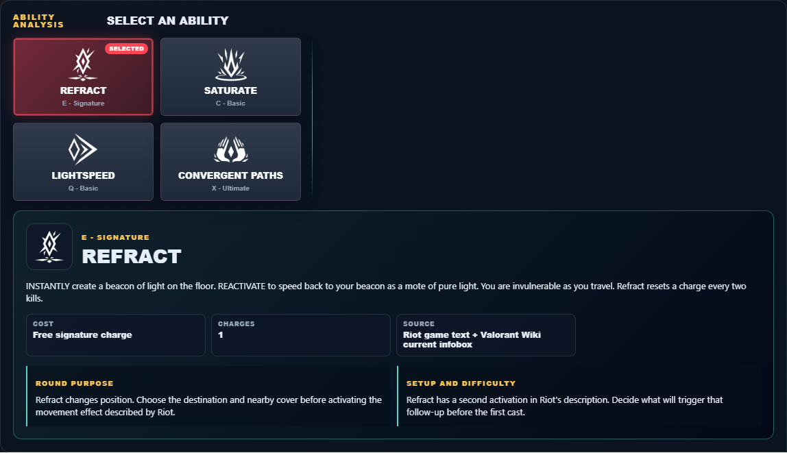
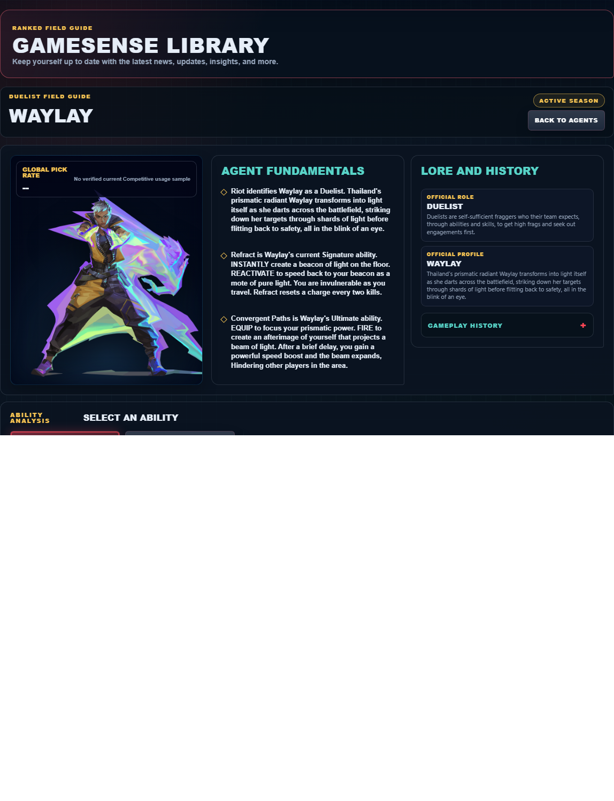

# Library Draft Review — Agent: Waylay — 2026-07-23

## Summary

One-time full-coverage baseline. 2 fields changed for Patch 13.01.

## Screenshot

## Field-by-field changes

| Field | Tier | Before | After | Sources checked | Confidence |
| --- | --- | --- | --- | --- | --- |
| `abilities` | canonical | [   {     "id": "refract",     "name": "Refract",     "slot": "E - Signature",     "icon": "https://media.valorant-api.com/agents/df1cb487-4902-002e-5c17-d28e83e78588/abilities/ability2/displayicon.png",     "summary": "INSTANTLY create a beacon of light on the floor. REACTIVATE to speed back to your beacon as a mote of pure light. You are invulnerable as you travel. Refract resets a charge every two kills.",     "stats": {       "Cost": "Free signature charge",       "Charges": "1",       "Source": "Riot game text + Valorant Wiki current infobox"     },     "purpose": "Refract changes position. Choose the destination and nearby cover before activating the movement effect described by Riot.",     "setup": "Refract has a second activation in Riot's description. Decide what will trigger that follow-up before the first cast.",     "source": "https://valorant-api.com/v1/agents/df1cb487-4902-002e-5c17-d28e83e78588?language=en-US"   },   {     "id": "saturate",     "name": "Saturate",     "slot": "C - Basic",     "icon": "https://media.valorant-api.com/agents/df1cb487-4902-002e-5c17-d28e83e78588/abilities/grenade/displayicon.png",     "summary": "EQUIP a cluster of light. FIRE to throw the cluster, which upon contact with the ground explodes, Hindering nearby players with a powerful movement and weapon slow.",     "stats": {       "Cost": "300 credits",       "Charges": "1",       "Source": "Riot game text + Valorant Wiki current infobox"     },     "purpose": "Saturate changes position. Choose the destination and nearby cover before activating the movement effect described by Riot.",     "setup": "Saturate must be equipped before use. Prepare it behind cover, then return to the weapon as soon as the stated effect is active.",     "source": "https://valorant-api.com/v1/agents/df1cb487-4902-002e-5c17-d28e83e78588?language=en-US"   },   {     "id": "lightspeed",     "name": "Lightspeed",     "slot": "Q - Basic",     "icon": "https://media.valorant-api.com/agents/df1cb487-4902-002e-5c17-d28e83e78588/abilities/ability1/displayicon.png",     "summary": "EQUIP to prepare for a burst of speed. FIRE to dash forward twice. ALT FIRE to dash once. Only your first dash can send you upward.",     "stats": {       "Cost": "300 credits",       "Charges": "1",       "Source": "Riot game text + Valorant Wiki current infobox"     },     "purpose": "Lightspeed changes position. Choose the destination and nearby cover before activating the movement effect described by Riot.",     "setup": "Lightspeed must be equipped before use. Prepare it behind cover, then return to the weapon as soon as the stated effect is active.",     "source": "https://valorant-api.com/v1/agents/df1cb487-4902-002e-5c17-d28e83e78588?language=en-US"   },   {     "id": "convergent-paths",     "name": "Convergent Paths",     "slot": "X - Ultimate",     "icon": "https://media.valorant-api.com/agents/df1cb487-4902-002e-5c17-d28e83e78588/abilities/ultimate/displayicon.png",     "summary": "EQUIP to focus your prismatic power. FIRE to create an afterimage of yourself that projects a beam of light. After a brief delay, you gain a powerful speed boost and the beam expands, Hindering other players in the area.",     "stats": {       "Cost": "8 ultimate points",       "Charges": "Current client value not published in Riot's public content feed",       "Source": "Riot game text + Valorant Wiki current infobox"     },     "purpose": "Convergent Paths changes position. Choose the destination and nearby cover before activating the movement effect described by Riot.",     "setup": "Convergent Paths must be equipped before use. Prepare it behind cover, then return to the weapon as soon as the stated effect is active.",     "source": "https://valorant-api.com/v1/agents/df1cb487-4902-002e-5c17-d28e83e78588?language=en-US"   } ] | [   {     "id": "refract",     "name": "Refract",     "slot": "Q - Basic",     "icon": "https://media.valorant-api.com/agents/df1cb487-4902-002e-5c17-d28e83e78588/abilities/ability2/displayicon.png",     "summary": "INSTANTLY create a beacon of light on the floor. REACTIVATE to speed back to your beacon as a mote of pure light. You are invulnerable as you travel. Refract resets a charge every two kills.",     "stats": {       "Cost": "Free signature charge",       "Charges": "1",       "Source": "Riot game text + Valorant Wiki current infobox"     },     "purpose": "Refract changes position. Choose the destination and nearby cover before activating the movement effect described by Riot.",     "setup": "Refract has a second activation in Riot's description. Decide what will trigger that follow-up before the first cast.",     "source": "https://valorant-api.com/v1/agents/df1cb487-4902-002e-5c17-d28e83e78588?language=en-US"   },   {     "id": "saturate",     "name": "Saturate",     "slot": "E - Signature",     "icon": "https://media.valorant-api.com/agents/df1cb487-4902-002e-5c17-d28e83e78588/abilities/grenade/displayicon.png",     "summary": "EQUIP a cluster of light. FIRE to throw the cluster, which upon contact with the ground explodes, Hindering nearby players with a powerful movement and weapon slow.",     "stats": {       "Cost": "300 credits",       "Charges": "1",       "Source": "Riot game text + Valorant Wiki current infobox"     },     "purpose": "Saturate changes position. Choose the destination and nearby cover before activating the movement effect described by Riot.",     "setup": "Saturate must be equipped before use. Prepare it behind cover, then return to the weapon as soon as the stated effect is active.",     "source": "https://valorant-api.com/v1/agents/df1cb487-4902-002e-5c17-d28e83e78588?language=en-US"   },   {     "id": "lightspeed",     "name": "Lightspeed",     "slot": "C - Basic",     "icon": "https://media.valorant-api.com/agents/df1cb487-4902-002e-5c17-d28e83e78588/abilities/ability1/displayicon.png",     "summary": "EQUIP to prepare for a burst of speed. FIRE to dash forward twice. ALT FIRE to dash once. Only your first dash can send you upward.",     "stats": {       "Cost": "300 credits",       "Charges": "1",       "Source": "Riot game text + Valorant Wiki current infobox"     },     "purpose": "Lightspeed changes position. Choose the destination and nearby cover before activating the movement effect described by Riot.",     "setup": "Lightspeed must be equipped before use. Prepare it behind cover, then return to the weapon as soon as the stated effect is active.",     "source": "https://valorant-api.com/v1/agents/df1cb487-4902-002e-5c17-d28e83e78588?language=en-US"   },   {     "id": "convergent-paths",     "name": "Convergent Paths",     "slot": "X - Ultimate",     "icon": "https://media.valorant-api.com/agents/df1cb487-4902-002e-5c17-d28e83e78588/abilities/ultimate/displayicon.png",     "summary": "EQUIP to focus your prismatic power. FIRE to create an afterimage of yourself that projects a beam of light. After a brief delay, you gain a powerful speed boost and the beam expands, Hindering other players in the area.",     "stats": {       "Cost": "8 ultimate points",       "Charges": "Current client value not published in Riot's public content feed",       "Source": "Riot game text + Valorant Wiki current infobox"     },     "purpose": "Convergent Paths changes position. Choose the destination and nearby cover before activating the movement effect described by Riot.",     "setup": "Convergent Paths must be equipped before use. Prepare it behind cover, then return to the weapon as soon as the stated effect is active.",     "source": "https://valorant-api.com/v1/agents/df1cb487-4902-002e-5c17-d28e83e78588?language=en-US"   } ] | [https://valorant-api.com/v1/agents/df1cb487-4902-002e-5c17-d28e83e78588?language=en-US](https://valorant-api.com/v1/agents/df1cb487-4902-002e-5c17-d28e83e78588?language=en-US) | n/a (auto-approved) |
| `uuid` | canonical |  | df1cb487-4902-002e-5c17-d28e83e78588 | [https://valorant-api.com/v1/agents/df1cb487-4902-002e-5c17-d28e83e78588?language=en-US](https://valorant-api.com/v1/agents/df1cb487-4902-002e-5c17-d28e83e78588?language=en-US) | n/a (auto-approved) |

## Approval

- [ ] Approved as-is
- [ ] Approved with edits (note edits below)
- [ ] Rejected (note why below)

Notes:

Promotion totals: 2 canonical, 0 synthesized, 0 mixed-tier field groups.
