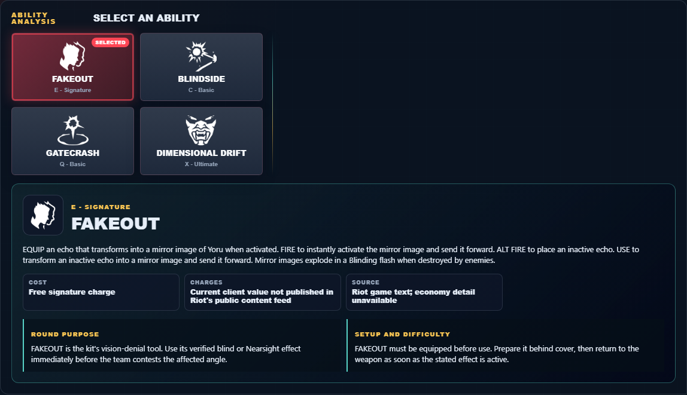

# Library Draft Review — Agent: Yoru — 2026-07-23

## Summary

One-time full-coverage baseline. 1 field changed for Patch 13.01.

## Screenshot

## Field-by-field changes

| Field | Tier | Before | After | Sources checked | Confidence |
| --- | --- | --- | --- | --- | --- |
| `uuid` | canonical |  | 7f94d92c-4234-0a36-9646-3a87eb8b5c89 | [https://valorant-api.com/v1/agents/7f94d92c-4234-0a36-9646-3a87eb8b5c89?language=en-US](https://valorant-api.com/v1/agents/7f94d92c-4234-0a36-9646-3a87eb8b5c89?language=en-US) | n/a (auto-approved) |

## Approval

- [ ] Approved as-is
- [ ] Approved with edits (note edits below)
- [ ] Rejected (note why below)

Notes:

Promotion totals: 1 canonical, 0 synthesized, 0 mixed-tier field groups.
