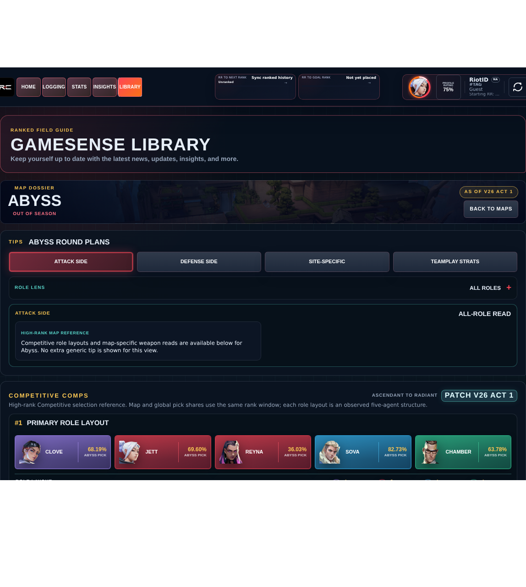
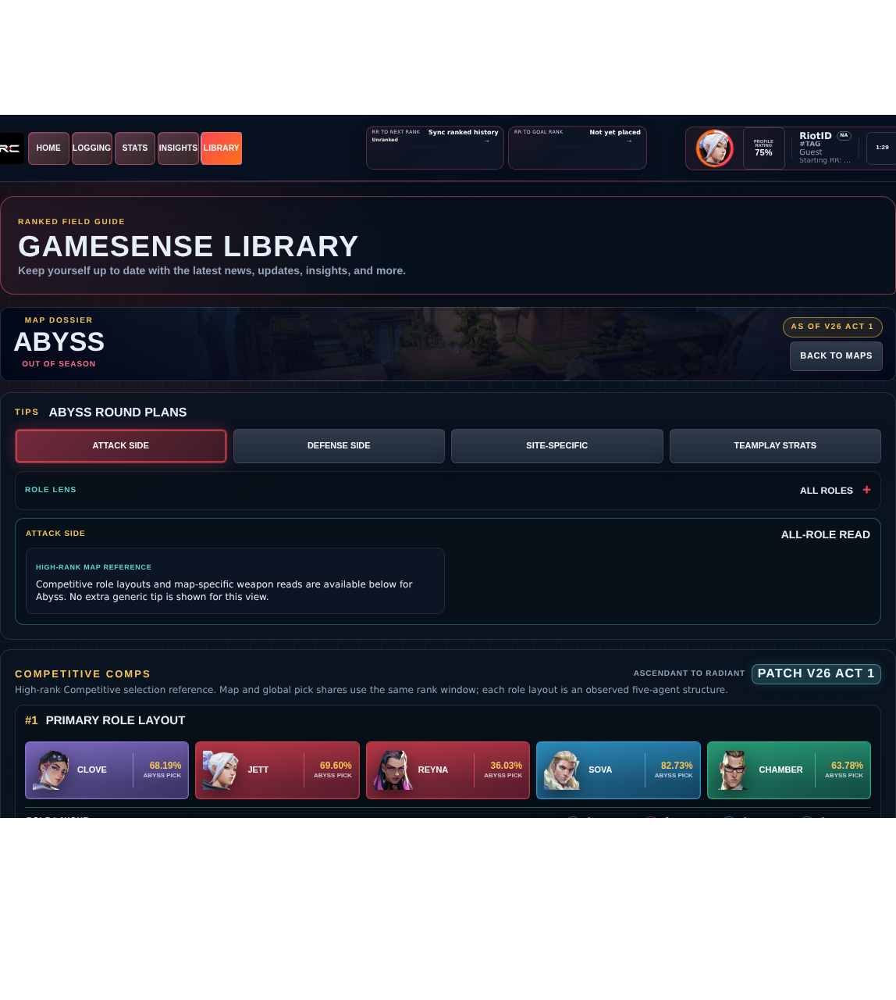

# Library Draft Review — Map: Abyss — 2026-07-31

## Summary

Scheduled canonical refresh. 1 field changed for Patch 13.02.

## Screenshot

## Field-by-field changes

| Field | Tier | Before | After | Sources checked | Confidence |
| --- | --- | --- | --- | --- | --- |
| `dataStatus` | canonical | verified | in-review | [https://valorant-api.com/v1/maps/224b0a95-48b9-f703-1bd8-67aca101a61f?language=en-US](https://valorant-api.com/v1/maps/224b0a95-48b9-f703-1bd8-67aca101a61f?language=en-US) | Pipeline status: canonical facts exist while synthesized guidance remains under review |

## Approval

- [ ] Approved as-is
- [ ] Approved with edits (note edits below)
- [ ] Rejected (note why below)

Notes:

Promotion totals: 1 canonical, 0 synthesized, 0 mixed-tier field groups.
