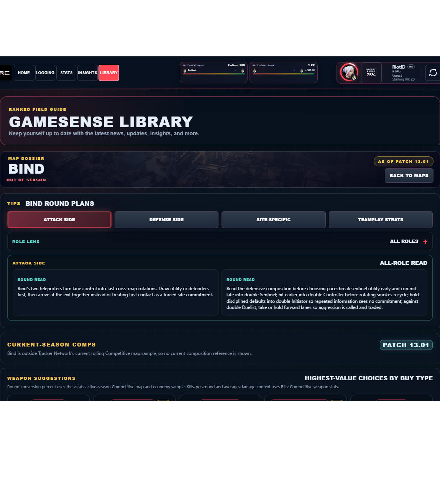

# Library Draft Review — Map: Bind — 2026-07-23

## Summary

One-time full-coverage baseline. 7 fields changed for Patch 13.01.

## Screenshot

## Field-by-field changes

| Field | Tier | Before | After | Sources checked | Confidence |
| --- | --- | --- | --- | --- | --- |
| `cardImage` | canonical | /assets/library/maps/bind-card.png | https://media.valorant-api.com/maps/2c9d57ec-4431-9c5e-2939-8f9ef6dd5cba/splash.png | [https://valorant-api.com/v1/maps/2c9d57ec-4431-9c5e-2939-8f9ef6dd5cba?language=en-US](https://valorant-api.com/v1/maps/2c9d57ec-4431-9c5e-2939-8f9ef6dd5cba?language=en-US) | n/a (auto-approved) |
| `layoutImage` | canonical | /assets/library/maps/bind-layout.png | /assets/library/maps/bind-layout-labeled.svg | [https://valorant-api.com/v1/maps/2c9d57ec-4431-9c5e-2939-8f9ef6dd5cba?language=en-US](https://valorant-api.com/v1/maps/2c9d57ec-4431-9c5e-2939-8f9ef6dd5cba?language=en-US) | n/a (auto-approved) |
| `callouts` | mixed | [   {     "label": "A Site",     "x": 73.4,     "y": 33.3   },   {     "label": "A Showers",     "x": 83.9,     "y": 43   },   {     "label": "A Short",     "x": 62.4,     "y": 49.7   },   {     "label": "A Lamps",     "x": 58.2,     "y": 33.9   },   {     "label": "A Tower",     "x": 72.8,     "y": 20.8   },   {     "label": "B Site",     "x": 29.2,     "y": 31.2   },   {     "label": "B Long",     "x": 19.3,     "y": 51.5   },   {     "label": "B Window",     "x": 32.3,     "y": 44.7   },   {     "label": "B Elbow",     "x": 15.8,     "y": 30.6   },   {     "label": "B Garden",     "x": 24.7,     "y": 42.8   } ] | [   {     "id": "bind-1",     "sourceKey": "A::Exit",     "sourceLabel": "A Exit",     "label": "A Exit",     "superRegionName": "A",     "regionName": "Exit",     "x": 92.35,     "y": 52.21   },   {     "id": "bind-2",     "sourceKey": "A::Link",     "sourceLabel": "A Link",     "label": "A Link",     "superRegionName": "A",     "regionName": "Link",     "x": 51.75,     "y": 59.2   },   {     "id": "bind-3",     "sourceKey": "A::Lobby",     "sourceLabel": "A Lobby",     "label": "A Lobby",     "superRegionName": "A",     "regionName": "Lobby",     "x": 76.33,     "y": 60.69   },   {     "id": "bind-4",     "sourceKey": "A::Short",     "sourceLabel": "A Short",     "label": "A Short",     "superRegionName": "A",     "regionName": "Short",     "x": 62.44,     "y": 49.65   },   {     "id": "bind-5",     "sourceKey": "A::Site",     "sourceLabel": "A Site",     "label": "A Site",     "superRegionName": "A",     "regionName": "Site",     "x": 73.41,     "y": 33.34   },   {     "id": "bind-6",     "sourceKey": "A::Teleporter",     "sourceLabel": "A Teleporter",     "label": "A Teleporter",     "superRegionName": "A",     "regionName": "Teleporter",     "x": 60.58,     "y": 41.11   },   {     "id": "bind-7",     "sourceKey": "Attacker Side::Spawn",     "sourceLabel": "Attacker Side Spawn",     "label": "Attacker Side Spawn",     "superRegionName": "Attacker Side",     "regionName": "Spawn",     "x": 58.15,     "y": 95.8   },   {     "id": "bind-8",     "sourceKey": "B::Exit",     "sourceLabel": "B Exit",     "label": "B Exit",     "superRegionName": "B",     "regionName": "Exit",     "x": 47.29,     "y": 44.12   },   {     "id": "bind-9",     "sourceKey": "B::Hall",     "sourceLabel": "B Hall",     "label": "B Hall",     "superRegionName": "B",     "regionName": "Hall",     "x": 28.54,     "y": 20.16   },   {     "id": "bind-10",     "sourceKey": "B::Link",     "sourceLabel": "B Link",     "label": "B Link",     "superRegionName": "B",     "regionName": "Link",     "x": 42.23,     "y": 59.22   },   {     "id": "bind-11",     "sourceKey": "B::Fountain",     "sourceLabel": "B Fountain",     "label": "B Fountain",     "superRegionName": "B",     "regionName": "Fountain",     "x": 25.89,     "y": 62.91   },   {     "id": "bind-12",     "sourceKey": "B::Long",     "sourceLabel": "B Long",     "label": "B Long",     "superRegionName": "B",     "regionName": "Long",     "x": 19.27,     "y": 51.52   },   {     "id": "bind-13",     "sourceKey": "B::Short",     "sourceLabel": "B Short",     "label": "B Short",     "superRegionName": "B",     "regionName": "Short",     "x": 39.66,     "y": 52.95   },   {     "id": "bind-14",     "sourceKey": "B::Site",     "sourceLabel": "B Site",     "label": "B Site",     "superRegionName": "B",     "regionName": "Site",     "x": 29.19,     "y": 31.22   },   {     "id": "bind-15",     "sourceKey": "B::Teleporter",     "sourceLabel": "B Teleporter",     "label": "B Teleporter",     "superRegionName": "B",     "regionName": "Teleporter",     "x": 15.07,     "y": 43.49   },   {     "id": "bind-16",     "sourceKey": "B::Window",     "sourceLabel": "B Window",     "label": "B Hookah",     "superRegionName": "B",     "regionName": "Window",     "x": 32.27,     "y": 44.68   },   {     "id": "bind-17",     "sourceKey": "A::Bath",     "sourceLabel": "A Bath",     "label": "A Showers",     "superRegionName": "A",     "regionName": "Bath",     "x": 83.95,     "y": 43.03   },   {     "id": "bind-18",     "sourceKey": "Attacker Side::Cave",     "sourceLabel": "Attacker Side Cave",     "label": "Attacker Side Cave",     "superRegionName": "Attacker Side",     "regionName": "Cave",     "x": 59.21,     "y": 73.63   },   {     "id": "bind-19",     "sourceKey": "A::Cubby",     "sourceLabel": "A Cubby",     "label": "A Cubby",     "superRegionName": "A",     "regionName": "Cubby",     "x": 58.73,     "y": 45.99   },   {     "id": "bind-20",     "sourceKey": "Defender Side::Spawn",     "sourceLabel": "Defender Side Spawn",     "label": "Defender Side Spawn",     "superRegionName": "Defender Side",     "regionName": "Spawn",     "x": 51.69,     "y": 10.37   },   {     "id": "bind-21",     "sourceKey": "B::Elbow",     "sourceLabel": "B Elbow",     "label": "B Elbow",     "superRegionName": "B",     "regionName": "Elbow",     "x": 15.83,     "y": 30.6   },   {     "id": "bind-22",     "sourceKey": "B::Garden",     "sourceLabel": "B Garden",     "label": "B Garden",     "superRegionName": "B",     "regionName": "Garden",     "x": 24.67,     "y": 42.81   },   {     "id": "bind-23",     "sourceKey": "A::Lamps",     "sourceLabel": "A Lamps",     "label": "A Lamps / U-Haul",     "superRegionName": "A",     "regionName": "Lamps",     "x": 58.17,     "y": 33.92   },   {     "id": "bind-24",     "sourceKey": "A::Tower",     "sourceLabel": "A Tower",     "label": "A Heaven",     "superRegionName": "A",     "regionName": "Tower",     "x": 72.78,     "y": 20.81   } ] | [https://valorant-api.com/v1/maps/2c9d57ec-4431-9c5e-2939-8f9ef6dd5cba?language=en-US](https://valorant-api.com/v1/maps/2c9d57ec-4431-9c5e-2939-8f9ef6dd5cba?language=en-US), [https://valohub.co/maps/bind](https://valohub.co/maps/bind), [https://www.reddit.com/r/VALORANT/comments/1dlyx4x/why_does_bind_have_different_callouts_then_the_map/](https://www.reddit.com/r/VALORANT/comments/1dlyx4x/why_does_bind_have_different_callouts_then_the_map/) | 3 independent Riot/community references logged for the baseline |
| `uuid` | canonical |  | 2c9d57ec-4431-9c5e-2939-8f9ef6dd5cba | [https://valorant-api.com/v1/maps/2c9d57ec-4431-9c5e-2939-8f9ef6dd5cba?language=en-US](https://valorant-api.com/v1/maps/2c9d57ec-4431-9c5e-2939-8f9ef6dd5cba?language=en-US) | n/a (auto-approved) |
| `coordinates` | canonical |  | 34°2'A'N,6°51'Z'W | [https://valorant-api.com/v1/maps/2c9d57ec-4431-9c5e-2939-8f9ef6dd5cba?language=en-US](https://valorant-api.com/v1/maps/2c9d57ec-4431-9c5e-2939-8f9ef6dd5cba?language=en-US) | n/a (auto-approved) |
| `calloutLabelsBakedIn` | canonical |  | true | [https://valorant-api.com/v1/maps/2c9d57ec-4431-9c5e-2939-8f9ef6dd5cba?language=en-US](https://valorant-api.com/v1/maps/2c9d57ec-4431-9c5e-2939-8f9ef6dd5cba?language=en-US) | n/a (auto-approved) |
| `source` | canonical |  | https://valorant-api.com/v1/maps/2c9d57ec-4431-9c5e-2939-8f9ef6dd5cba?language=en-US | [https://valorant-api.com/v1/maps/2c9d57ec-4431-9c5e-2939-8f9ef6dd5cba?language=en-US](https://valorant-api.com/v1/maps/2c9d57ec-4431-9c5e-2939-8f9ef6dd5cba?language=en-US) | n/a (auto-approved) |

## Approval

- [ ] Approved as-is
- [ ] Approved with edits (note edits below)
- [ ] Rejected (note why below)

Notes:

Promotion totals: 6 canonical, 0 synthesized, 1 mixed-tier field groups.
