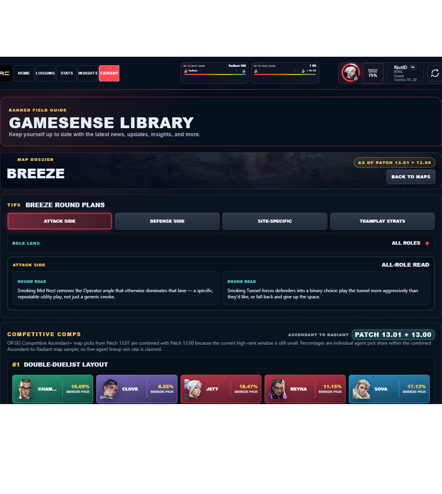

# Library Draft Review — Map: Breeze — 2026-07-23

## Summary

One-time full-coverage baseline. 7 fields changed for Patch 13.01.

## Screenshot

## Field-by-field changes

| Field | Tier | Before | After | Sources checked | Confidence |
| --- | --- | --- | --- | --- | --- |
| `cardImage` | canonical | /assets/library/maps/breeze-card.png | https://media.valorant-api.com/maps/2fb9a4fd-47b8-4e7d-a969-74b4046ebd53/splash.png | [https://valorant-api.com/v1/maps/2fb9a4fd-47b8-4e7d-a969-74b4046ebd53?language=en-US](https://valorant-api.com/v1/maps/2fb9a4fd-47b8-4e7d-a969-74b4046ebd53?language=en-US) | n/a (auto-approved) |
| `layoutImage` | canonical | /assets/library/maps/breeze-layout.png | /assets/library/maps/breeze-layout-labeled.svg | [https://valorant-api.com/v1/maps/2fb9a4fd-47b8-4e7d-a969-74b4046ebd53?language=en-US](https://valorant-api.com/v1/maps/2fb9a4fd-47b8-4e7d-a969-74b4046ebd53?language=en-US) | n/a (auto-approved) |
| `callouts` | mixed | [   {     "label": "A Site",     "x": 90.8,     "y": 49.5   },   {     "label": "A Lobby",     "x": 70.3,     "y": 92.1   },   {     "label": "Mid Hall",     "x": 63.9,     "y": 53.5   },   {     "label": "Mid Nest",     "x": 48.4,     "y": 22.8   },   {     "label": "Mid Wood Doors",     "x": 64.4,     "y": 49.5   },   {     "label": "B Tunnel",     "x": 36.4,     "y": 38.2   },   {     "label": "B Site",     "x": 7,     "y": 38.2   },   {     "label": "B Main",     "x": 15.4,     "y": 58.5   },   {     "label": "B Back",     "x": 6.8,     "y": 30.5   } ] | [   {     "id": "breeze-1",     "sourceKey": "Mid::Hall",     "sourceLabel": "Mid Hall",     "label": "Mid Hall",     "superRegionName": "Mid",     "regionName": "Hall",     "x": 63.95,     "y": 53.51   },   {     "id": "breeze-2",     "sourceKey": "A::Bridge",     "sourceLabel": "A Bridge",     "label": "A Bridge",     "superRegionName": "A",     "regionName": "Bridge",     "x": 71.19,     "y": 24.51   },   {     "id": "breeze-3",     "sourceKey": "Defender Side::Spawn",     "sourceLabel": "Defender Side Spawn",     "label": "Defender Side Spawn",     "superRegionName": "Defender Side",     "regionName": "Spawn",     "x": 71.19,     "y": 21.01   },   {     "id": "breeze-4",     "sourceKey": "Defender Side::Arches",     "sourceLabel": "Defender Side Arches",     "label": "Defender Side Arches",     "superRegionName": "Defender Side",     "regionName": "Arches",     "x": 37.41,     "y": 17.51   },   {     "id": "breeze-5",     "sourceKey": "Mid::Wood Doors",     "sourceLabel": "Mid Wood Doors",     "label": "Mid Wood Doors",     "superRegionName": "Mid",     "regionName": "Wood Doors",     "x": 64.36,     "y": 49.53   },   {     "id": "breeze-6",     "sourceKey": "Mid::Pillar",     "sourceLabel": "Mid Pillar",     "label": "Mid Pillar",     "superRegionName": "Mid",     "regionName": "Pillar",     "x": 49.84,     "y": 54.08   },   {     "id": "breeze-7",     "sourceKey": "Mid::Top",     "sourceLabel": "Mid Top",     "label": "Mid Top",     "superRegionName": "Mid",     "regionName": "Top",     "x": 50.19,     "y": 40.08   },   {     "id": "breeze-8",     "sourceKey": "Mid::Nest",     "sourceLabel": "Mid Nest",     "label": "Mid Nest",     "superRegionName": "Mid",     "regionName": "Nest",     "x": 48.44,     "y": 22.76   },   {     "id": "breeze-9",     "sourceKey": "B::Window",     "sourceLabel": "B Window",     "label": "B Window",     "superRegionName": "B",     "regionName": "Window",     "x": 17.29,     "y": 67.73   },   {     "id": "breeze-10",     "sourceKey": "B::Main",     "sourceLabel": "B Main",     "label": "B Main",     "superRegionName": "B",     "regionName": "Main",     "x": 15.36,     "y": 58.46   },   {     "id": "breeze-11",     "sourceKey": "B::Elbow",     "sourceLabel": "B Elbow",     "label": "B Elbow",     "superRegionName": "B",     "regionName": "Elbow",     "x": 26.21,     "y": 50.58   },   {     "id": "breeze-12",     "sourceKey": "B::Site",     "sourceLabel": "B Site",     "label": "B Site",     "superRegionName": "B",     "regionName": "Site",     "x": 6.96,     "y": 38.16   },   {     "id": "breeze-13",     "sourceKey": "B::Tunnel",     "sourceLabel": "B Tunnel",     "label": "B Tunnel",     "superRegionName": "B",     "regionName": "Tunnel",     "x": 36.36,     "y": 38.16   },   {     "id": "breeze-14",     "sourceKey": "A::Ramp",     "sourceLabel": "A Ramp",     "label": "A Ramp",     "superRegionName": "A",     "regionName": "Ramp",     "x": 65.59,     "y": 32.21   },   {     "id": "breeze-15",     "sourceKey": "B::Back",     "sourceLabel": "B Back",     "label": "B Back",     "superRegionName": "B",     "regionName": "Back",     "x": 6.79,     "y": 30.46   },   {     "id": "breeze-16",     "sourceKey": "B::Wall",     "sourceLabel": "B Wall",     "label": "B Wall",     "superRegionName": "B",     "regionName": "Wall",     "x": 25.51,     "y": 23.46   },   {     "id": "breeze-17",     "sourceKey": "Mid::Cannon",     "sourceLabel": "Mid Cannon",     "label": "Mid Cannon",     "superRegionName": "Mid",     "regionName": "Cannon",     "x": 33.56,     "y": 63.01   },   {     "id": "breeze-18",     "sourceKey": "Mid::Bottom",     "sourceLabel": "Mid Bottom",     "label": "Mid Bottom",     "superRegionName": "Mid",     "regionName": "Bottom",     "x": 49.84,     "y": 72.28   },   {     "id": "breeze-19",     "sourceKey": "A::Lobby",     "sourceLabel": "A Lobby",     "label": "A Lobby",     "superRegionName": "A",     "regionName": "Lobby",     "x": 70.31,     "y": 92.06   },   {     "id": "breeze-20",     "sourceKey": "A::Shop",     "sourceLabel": "A Shop",     "label": "A Shop",     "superRegionName": "A",     "regionName": "Shop",     "x": 76.26,     "y": 68.26   },   {     "id": "breeze-21",     "sourceKey": "A::Site",     "sourceLabel": "A Site",     "label": "A Site",     "superRegionName": "A",     "regionName": "Site",     "x": 90.79,     "y": 49.53   },   {     "id": "breeze-22",     "sourceKey": "A::Pyramids",     "sourceLabel": "A Pyramids",     "label": "A Pyramids",     "superRegionName": "A",     "regionName": "Pyramids",     "x": 84.66,     "y": 46.91   },   {     "id": "breeze-23",     "sourceKey": "Attacker Side::Spawn",     "sourceLabel": "Attacker Side Spawn",     "label": "Attacker Side Spawn",     "superRegionName": "Attacker Side",     "regionName": "Spawn",     "x": 43.36,     "y": 87.33   } ] | [https://valorant-api.com/v1/maps/2fb9a4fd-47b8-4e7d-a969-74b4046ebd53?language=en-US](https://valorant-api.com/v1/maps/2fb9a4fd-47b8-4e7d-a969-74b4046ebd53?language=en-US), [https://valohub.co/maps/breeze](https://valohub.co/maps/breeze), [https://www.redbull.com/us-en/valorant-breeze-map-guide](https://www.redbull.com/us-en/valorant-breeze-map-guide) | 3 independent Riot/community references logged for the baseline |
| `uuid` | canonical |  | 2fb9a4fd-47b8-4e7d-a969-74b4046ebd53 | [https://valorant-api.com/v1/maps/2fb9a4fd-47b8-4e7d-a969-74b4046ebd53?language=en-US](https://valorant-api.com/v1/maps/2fb9a4fd-47b8-4e7d-a969-74b4046ebd53?language=en-US) | n/a (auto-approved) |
| `coordinates` | canonical |  | 26°11'AG"N 71°10'WY"W | [https://valorant-api.com/v1/maps/2fb9a4fd-47b8-4e7d-a969-74b4046ebd53?language=en-US](https://valorant-api.com/v1/maps/2fb9a4fd-47b8-4e7d-a969-74b4046ebd53?language=en-US) | n/a (auto-approved) |
| `calloutLabelsBakedIn` | canonical |  | true | [https://valorant-api.com/v1/maps/2fb9a4fd-47b8-4e7d-a969-74b4046ebd53?language=en-US](https://valorant-api.com/v1/maps/2fb9a4fd-47b8-4e7d-a969-74b4046ebd53?language=en-US) | n/a (auto-approved) |
| `source` | canonical |  | https://valorant-api.com/v1/maps/2fb9a4fd-47b8-4e7d-a969-74b4046ebd53?language=en-US | [https://valorant-api.com/v1/maps/2fb9a4fd-47b8-4e7d-a969-74b4046ebd53?language=en-US](https://valorant-api.com/v1/maps/2fb9a4fd-47b8-4e7d-a969-74b4046ebd53?language=en-US) | n/a (auto-approved) |

## Approval

- [ ] Approved as-is
- [ ] Approved with edits (note edits below)
- [ ] Rejected (note why below)

Notes:

Promotion totals: 6 canonical, 0 synthesized, 1 mixed-tier field groups.
