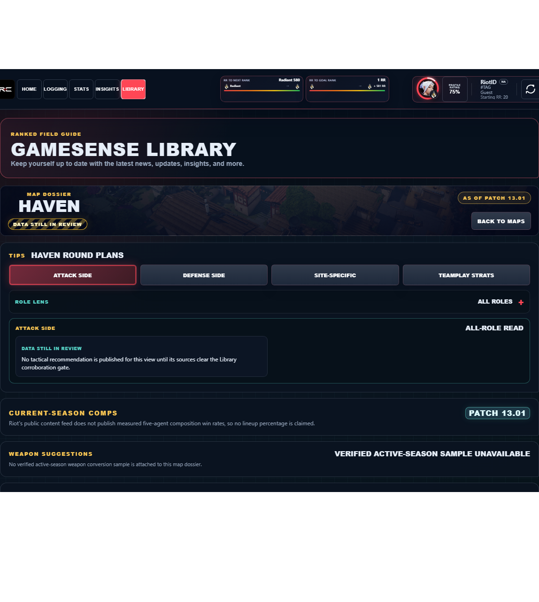

# Library Draft Review — Map: Haven — 2026-07-23

## Summary

Scheduled canonical refresh. 1 field changed for Patch 13.01.

## Screenshot

## Field-by-field changes

| Field | Tier | Before | After | Sources checked | Confidence |
| --- | --- | --- | --- | --- | --- |
| `roleNotes` | canonical | {   "Duelist": [     {       "category": "sites",       "text": "On Haven, connect A Link to A Lobby: Take first space only after support utility reaches the named defender angle."     }   ],   "Initiator": [     {       "category": "sites",       "text": "On Haven, connect A Lobby to A Site: Use information or disabling utility immediately before the teammate who will act on it."     }   ],   "Controller": [     {       "category": "sites",       "text": "On Haven, connect A Site to B Site: Block the sightline the team must cross, then keep one tool for the late-round route."     }   ],   "Sentinel": [     {       "category": "sites",       "text": "On Haven, connect B Site to C Link: Protect the route that would reach teammates from behind and survive long enough for that warning to matter."     }   ] } | {} | [https://valorant-api.com/v1/maps/2bee0dc9-4ffe-519b-1cbd-7fbe763a6047?language=en-US](https://valorant-api.com/v1/maps/2bee0dc9-4ffe-519b-1cbd-7fbe763a6047?language=en-US) | Held from publication because Riot's canonical map feed contains no tactical guidance and the retired generator logged no sources |

## Approval

- [ ] Approved as-is
- [ ] Approved with edits (note edits below)
- [ ] Rejected (note why below)

Notes:

Promotion totals: 1 canonical, 0 synthesized, 0 mixed-tier field groups.
