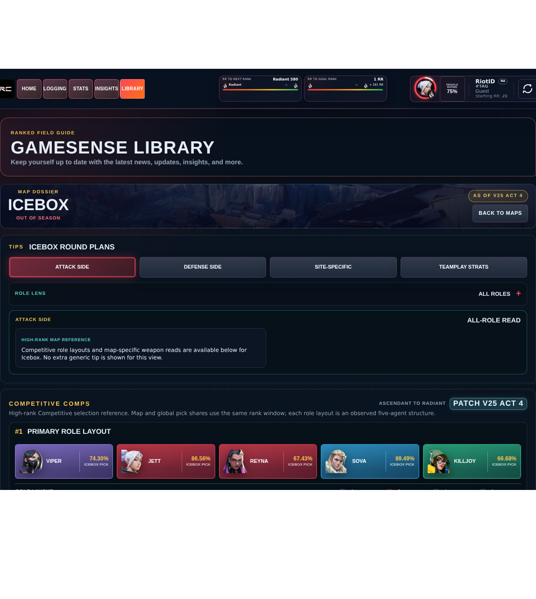

# Library Draft Review — Map: Icebox — 2026-07-29

## Summary

Scheduled canonical refresh. 2 fields changed for Patch 13.01.

## Screenshot

## Field-by-field changes

| Field | Tier | Before | After | Sources checked | Confidence |
| --- | --- | --- | --- | --- | --- |
| `layoutImage` | canonical | /assets/library/maps/icebox-layout-labeled.svg | https://media.valorant-api.com/maps/e2ad5c54-4114-a870-9641-8ea21279579a/displayicon.png | [https://valorant-api.com/v1/maps/e2ad5c54-4114-a870-9641-8ea21279579a?language=en-US](https://valorant-api.com/v1/maps/e2ad5c54-4114-a870-9641-8ea21279579a?language=en-US) | n/a (auto-approved) |
| `calloutLabelsBakedIn` | canonical | true | false | [https://valorant-api.com/v1/maps/e2ad5c54-4114-a870-9641-8ea21279579a?language=en-US](https://valorant-api.com/v1/maps/e2ad5c54-4114-a870-9641-8ea21279579a?language=en-US) | n/a (auto-approved) |

## Approval

- [ ] Approved as-is
- [ ] Approved with edits (note edits below)
- [ ] Rejected (note why below)

Notes:

Promotion totals: 2 canonical, 0 synthesized, 0 mixed-tier field groups.
