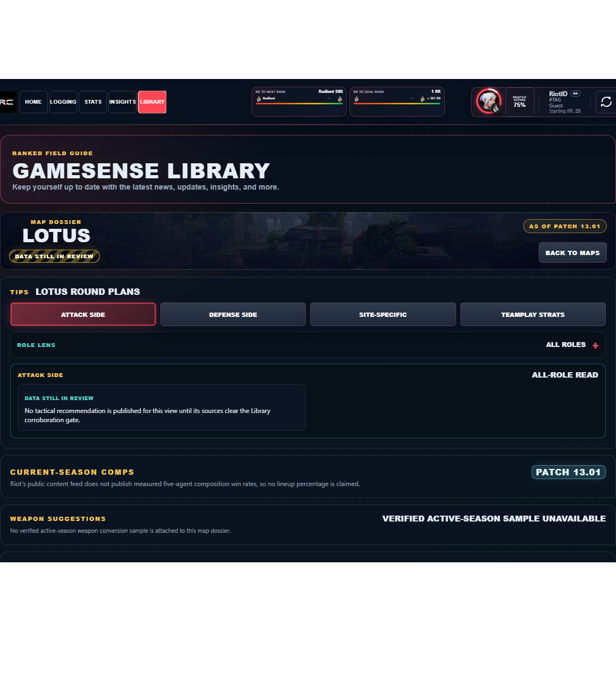

# Library Draft Review — Map: Lotus — 2026-07-30

## Summary

Scheduled canonical refresh. 3 fields changed for Patch 13.02.

## Screenshot

## Field-by-field changes

| Field | Tier | Before | After | Sources checked | Confidence |
| --- | --- | --- | --- | --- | --- |
| `layoutImage` | canonical | /assets/library/maps/lotus-layout-labeled.svg | https://media.valorant-api.com/maps/2fe4ed3a-450a-948b-6d6b-e89a78e680a9/displayicon.png | [https://valorant-api.com/v1/maps/2fe4ed3a-450a-948b-6d6b-e89a78e680a9?language=en-US](https://valorant-api.com/v1/maps/2fe4ed3a-450a-948b-6d6b-e89a78e680a9?language=en-US) | n/a (auto-approved) |
| `calloutLabelsBakedIn` | canonical | true | false | [https://valorant-api.com/v1/maps/2fe4ed3a-450a-948b-6d6b-e89a78e680a9?language=en-US](https://valorant-api.com/v1/maps/2fe4ed3a-450a-948b-6d6b-e89a78e680a9?language=en-US) | n/a (auto-approved) |
| `dataStatus` | canonical | verified | in-review | [https://valorant-api.com/v1/maps/2fe4ed3a-450a-948b-6d6b-e89a78e680a9?language=en-US](https://valorant-api.com/v1/maps/2fe4ed3a-450a-948b-6d6b-e89a78e680a9?language=en-US) | Pipeline status: canonical facts exist while synthesized guidance remains under review |

## Approval

- [ ] Approved as-is
- [ ] Approved with edits (note edits below)
- [ ] Rejected (note why below)

Notes:

Promotion totals: 3 canonical, 0 synthesized, 0 mixed-tier field groups.
