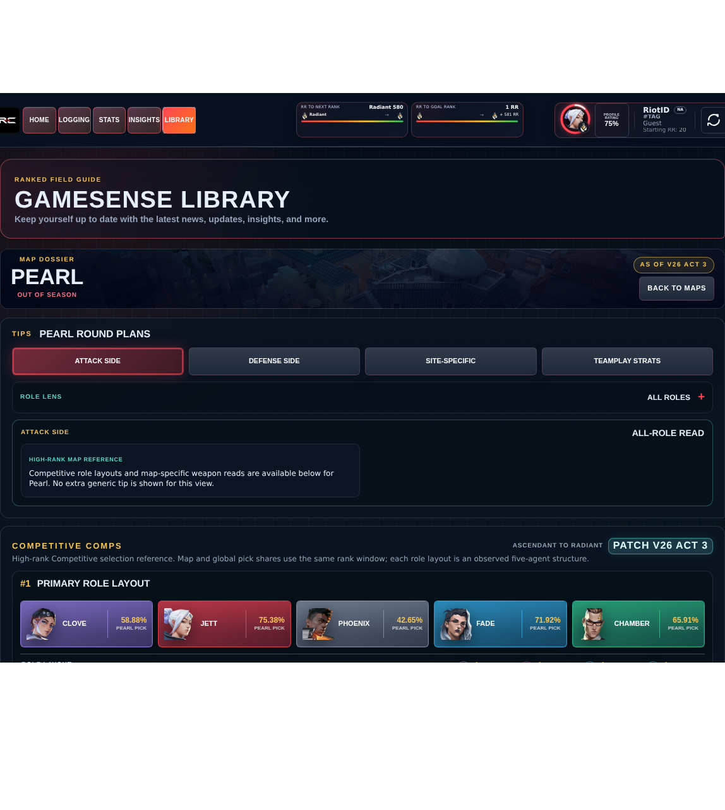

# Library Draft Review — Map: Pearl — 2026-07-28

## Summary

Scheduled canonical refresh. 3 fields changed for Patch 13.01.

## Screenshot

## Field-by-field changes

| Field | Tier | Before | After | Sources checked | Confidence |
| --- | --- | --- | --- | --- | --- |
| `layoutImage` | canonical | /assets/library/maps/pearl-layout-labeled.svg | https://media.valorant-api.com/maps/fd267378-4d1d-484f-ff52-77821ed10dc2/displayicon.png | [https://valorant-api.com/v1/maps/fd267378-4d1d-484f-ff52-77821ed10dc2?language=en-US](https://valorant-api.com/v1/maps/fd267378-4d1d-484f-ff52-77821ed10dc2?language=en-US) | n/a (auto-approved) |
| `calloutLabelsBakedIn` | canonical | true | false | [https://valorant-api.com/v1/maps/fd267378-4d1d-484f-ff52-77821ed10dc2?language=en-US](https://valorant-api.com/v1/maps/fd267378-4d1d-484f-ff52-77821ed10dc2?language=en-US) | n/a (auto-approved) |
| `dataStatus` | canonical | verified | in-review | [https://valorant-api.com/v1/maps/fd267378-4d1d-484f-ff52-77821ed10dc2?language=en-US](https://valorant-api.com/v1/maps/fd267378-4d1d-484f-ff52-77821ed10dc2?language=en-US) | Pipeline status: canonical facts exist while synthesized guidance remains under review |

## Approval

- [ ] Approved as-is
- [ ] Approved with edits (note edits below)
- [ ] Rejected (note why below)

Notes:

Promotion totals: 3 canonical, 0 synthesized, 0 mixed-tier field groups.
