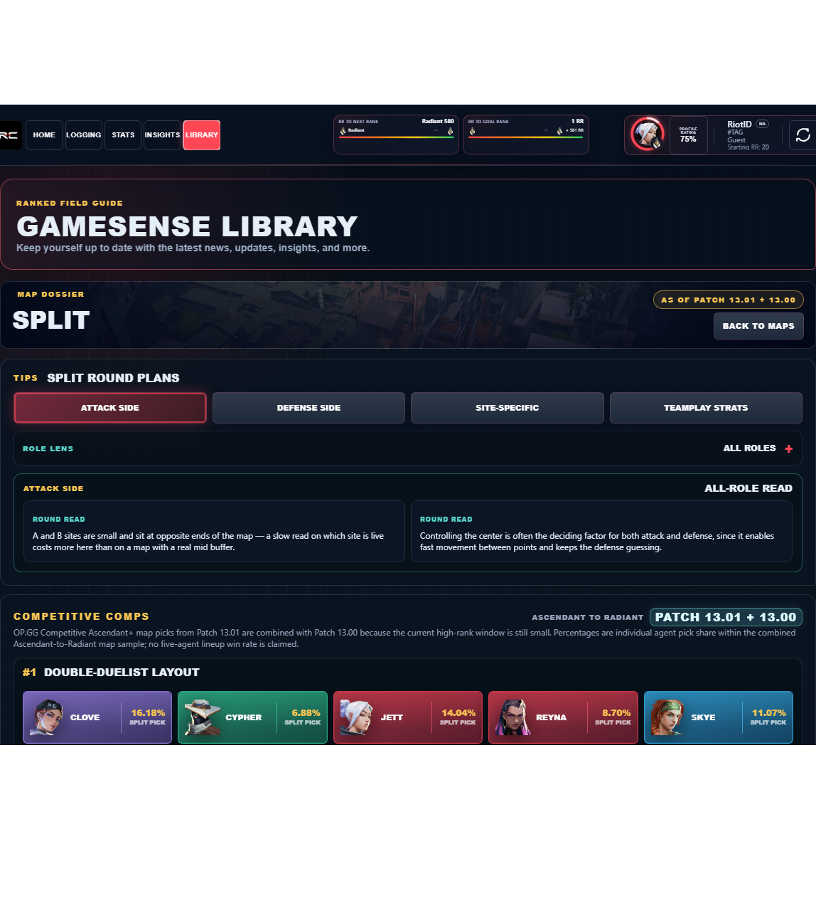

# Library Draft Review — Map: Split — 2026-07-23

## Summary

One-time full-coverage baseline. 6 fields changed for Patch 13.01.

## Screenshot

## Field-by-field changes

| Field | Tier | Before | After | Sources checked | Confidence |
| --- | --- | --- | --- | --- | --- |
| `cardImage` | canonical | /assets/library/maps/split-card.png | https://media.valorant-api.com/maps/d960549e-485c-e861-8d71-aa9d1aed12a2/splash.png | [https://valorant-api.com/v1/maps/d960549e-485c-e861-8d71-aa9d1aed12a2?language=en-US](https://valorant-api.com/v1/maps/d960549e-485c-e861-8d71-aa9d1aed12a2?language=en-US) | n/a (auto-approved) |
| `callouts` | mixed | [   {     "label": "A Site",     "x": 81.6,     "y": 31.5   },   {     "label": "A Main",     "x": 79.2,     "y": 49.2   },   {     "label": "A Rafters",     "x": 72.6,     "y": 35.4   },   {     "label": "A Screens",     "x": 74.3,     "y": 15   },   {     "label": "Mid Bottom",     "x": 45.2,     "y": 61.6   },   {     "label": "Mid Vent",     "x": 54.9,     "y": 42.6   },   {     "label": "Mid Mail",     "x": 39.3,     "y": 46.7   },   {     "label": "B Tower",     "x": 31.6,     "y": 43   },   {     "label": "B Site",     "x": 13.3,     "y": 35.4   },   {     "label": "B Garage",     "x": 13.2,     "y": 54.2   } ] | [   {     "id": "split-1",     "sourceKey": "A::Back",     "sourceLabel": "A Back",     "label": "A Back",     "superRegionName": "A",     "regionName": "Back",     "x": 22.93,     "y": 12.47   },   {     "id": "split-2",     "sourceKey": "A::Lobby",     "sourceLabel": "A Lobby",     "label": "A Lobby",     "superRegionName": "A",     "regionName": "Lobby",     "x": 65.05,     "y": 16.61   },   {     "id": "split-3",     "sourceKey": "A::Main",     "sourceLabel": "A Main",     "label": "A Main",     "superRegionName": "A",     "regionName": "Main",     "x": 49.17,     "y": 20.77   },   {     "id": "split-4",     "sourceKey": "A::Rafters",     "sourceLabel": "A Rafters",     "label": "A Rafters",     "superRegionName": "A",     "regionName": "Rafters",     "x": 35.4,     "y": 27.37   },   {     "id": "split-5",     "sourceKey": "A::Ramps",     "sourceLabel": "A Ramps",     "label": "A Ramps",     "superRegionName": "A",     "regionName": "Ramps",     "x": 47.17,     "y": 35.98   },   {     "id": "split-6",     "sourceKey": "A::Screens",     "sourceLabel": "A Screens",     "label": "A Screens",     "superRegionName": "A",     "regionName": "Screens",     "x": 15.04,     "y": 25.7   },   {     "id": "split-7",     "sourceKey": "A::Sewer",     "sourceLabel": "A Sewer",     "label": "A Sewers",     "superRegionName": "A",     "regionName": "Sewer",     "x": 65.75,     "y": 31.83   },   {     "id": "split-8",     "sourceKey": "A::Site",     "sourceLabel": "A Site",     "label": "A Site",     "superRegionName": "A",     "regionName": "Site",     "x": 31.48,     "y": 18.37   },   {     "id": "split-9",     "sourceKey": "A::Tower",     "sourceLabel": "A Tower",     "label": "A Heaven",     "superRegionName": "A",     "regionName": "Tower",     "x": 31.58,     "y": 33.59   },   {     "id": "split-10",     "sourceKey": "Attacker Side::Spawn",     "sourceLabel": "Attacker Side Spawn",     "label": "Attacker Side Spawn",     "superRegionName": "Attacker Side",     "regionName": "Spawn",     "x": 84.68,     "y": 54.92   },   {     "id": "split-11",     "sourceKey": "B::Alley",     "sourceLabel": "B Alley",     "label": "B Alley",     "superRegionName": "B",     "regionName": "Alley",     "x": 21.3,     "y": 78.79   },   {     "id": "split-12",     "sourceKey": "B::Back",     "sourceLabel": "B Back",     "label": "B Back",     "superRegionName": "B",     "regionName": "Back",     "x": 26.36,     "y": 93.99   },   {     "id": "split-13",     "sourceKey": "B::Link",     "sourceLabel": "B Link",     "label": "B Link",     "superRegionName": "B",     "regionName": "Link",     "x": 65.73,     "y": 69.97   },   {     "id": "split-14",     "sourceKey": "B::Garage",     "sourceLabel": "B Garage",     "label": "B Main",     "superRegionName": "B",     "regionName": "Garage",     "x": 54.2,     "y": 86.85   },   {     "id": "split-15",     "sourceKey": "B::Rafters",     "sourceLabel": "B Rafters",     "label": "B Rafters",     "superRegionName": "B",     "regionName": "Rafters",     "x": 36.87,     "y": 74.73   },   {     "id": "split-16",     "sourceKey": "B::Site",     "sourceLabel": "B Site",     "label": "B Site",     "superRegionName": "B",     "regionName": "Site",     "x": 35.35,     "y": 86.66   },   {     "id": "split-17",     "sourceKey": "B::Stairs",     "sourceLabel": "B Stairs",     "label": "B Stairs",     "superRegionName": "B",     "regionName": "Stairs",     "x": 31.48,     "y": 61.48   },   {     "id": "split-18",     "sourceKey": "B::Tower",     "sourceLabel": "B Tower",     "label": "B Heaven",     "superRegionName": "B",     "regionName": "Tower",     "x": 42.96,     "y": 68.44   },   {     "id": "split-19",     "sourceKey": "B::Lobby",     "sourceLabel": "B Lobby",     "label": "B Lobby",     "superRegionName": "B",     "regionName": "Lobby",     "x": 68.75,     "y": 79.68   },   {     "id": "split-20",     "sourceKey": "Defender Side::Spawn",     "sourceLabel": "Defender Side Spawn",     "label": "Defender Side Spawn",     "superRegionName": "Defender Side",     "regionName": "Spawn",     "x": 14.29,     "y": 53.05   },   {     "id": "split-21",     "sourceKey": "Mid::Bottom",     "sourceLabel": "Mid Bottom",     "label": "Mid Bottom",     "superRegionName": "Mid",     "regionName": "Bottom",     "x": 61.6,     "y": 54.76   },   {     "id": "split-22",     "sourceKey": "Mid::Mail",     "sourceLabel": "Mid Mail",     "label": "Mid Mail",     "superRegionName": "Mid",     "regionName": "Mail",     "x": 46.71,     "y": 60.75   },   {     "id": "split-23",     "sourceKey": "Mid::Top",     "sourceLabel": "Mid Top",     "label": "Mid Top",     "superRegionName": "Mid",     "regionName": "Top",     "x": 48.36,     "y": 53.99   },   {     "id": "split-24",     "sourceKey": "Mid::Vent",     "sourceLabel": "Mid Vent",     "label": "Mid Vents",     "superRegionName": "Mid",     "regionName": "Vent",     "x": 42.58,     "y": 45.15   } ] | [https://valorant-api.com/v1/maps/d960549e-485c-e861-8d71-aa9d1aed12a2?language=en-US](https://valorant-api.com/v1/maps/d960549e-485c-e861-8d71-aa9d1aed12a2?language=en-US), [https://valohub.co/maps/split](https://valohub.co/maps/split), [https://valorantinfo.gg/maps/split/](https://valorantinfo.gg/maps/split/) | 3 independent Riot/community references logged for the baseline |
| `uuid` | canonical |  | d960549e-485c-e861-8d71-aa9d1aed12a2 | [https://valorant-api.com/v1/maps/d960549e-485c-e861-8d71-aa9d1aed12a2?language=en-US](https://valorant-api.com/v1/maps/d960549e-485c-e861-8d71-aa9d1aed12a2?language=en-US) | n/a (auto-approved) |
| `coordinates` | canonical |  | 35°41'CD'N,139°41'WX'E | [https://valorant-api.com/v1/maps/d960549e-485c-e861-8d71-aa9d1aed12a2?language=en-US](https://valorant-api.com/v1/maps/d960549e-485c-e861-8d71-aa9d1aed12a2?language=en-US) | n/a (auto-approved) |
| `calloutLabelsBakedIn` | canonical |  | true | [https://valorant-api.com/v1/maps/d960549e-485c-e861-8d71-aa9d1aed12a2?language=en-US](https://valorant-api.com/v1/maps/d960549e-485c-e861-8d71-aa9d1aed12a2?language=en-US) | n/a (auto-approved) |
| `source` | canonical |  | https://valorant-api.com/v1/maps/d960549e-485c-e861-8d71-aa9d1aed12a2?language=en-US | [https://valorant-api.com/v1/maps/d960549e-485c-e861-8d71-aa9d1aed12a2?language=en-US](https://valorant-api.com/v1/maps/d960549e-485c-e861-8d71-aa9d1aed12a2?language=en-US) | n/a (auto-approved) |

## Approval

- [ ] Approved as-is
- [ ] Approved with edits (note edits below)
- [ ] Rejected (note why below)

Notes:

Promotion totals: 5 canonical, 0 synthesized, 1 mixed-tier field groups.
