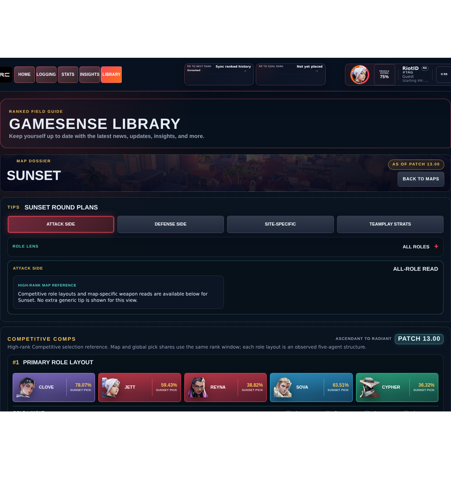

# Library Draft Review — Map: Sunset — 2026-07-30

## Summary

Scheduled canonical refresh. 2 fields changed for Patch 13.01.

## Screenshot

## Field-by-field changes

| Field | Tier | Before | After | Sources checked | Confidence |
| --- | --- | --- | --- | --- | --- |
| `layoutImage` | canonical | /assets/library/maps/sunset-layout-labeled.svg | https://media.valorant-api.com/maps/92584fbe-486a-b1b2-9faa-39b0f486b498/displayicon.png | [https://valorant-api.com/v1/maps/92584fbe-486a-b1b2-9faa-39b0f486b498?language=en-US](https://valorant-api.com/v1/maps/92584fbe-486a-b1b2-9faa-39b0f486b498?language=en-US) | n/a (auto-approved) |
| `calloutLabelsBakedIn` | canonical | true | false | [https://valorant-api.com/v1/maps/92584fbe-486a-b1b2-9faa-39b0f486b498?language=en-US](https://valorant-api.com/v1/maps/92584fbe-486a-b1b2-9faa-39b0f486b498?language=en-US) | n/a (auto-approved) |

## Approval

- [ ] Approved as-is
- [ ] Approved with edits (note edits below)
- [ ] Rejected (note why below)

Notes:

Promotion totals: 2 canonical, 0 synthesized, 0 mixed-tier field groups.
