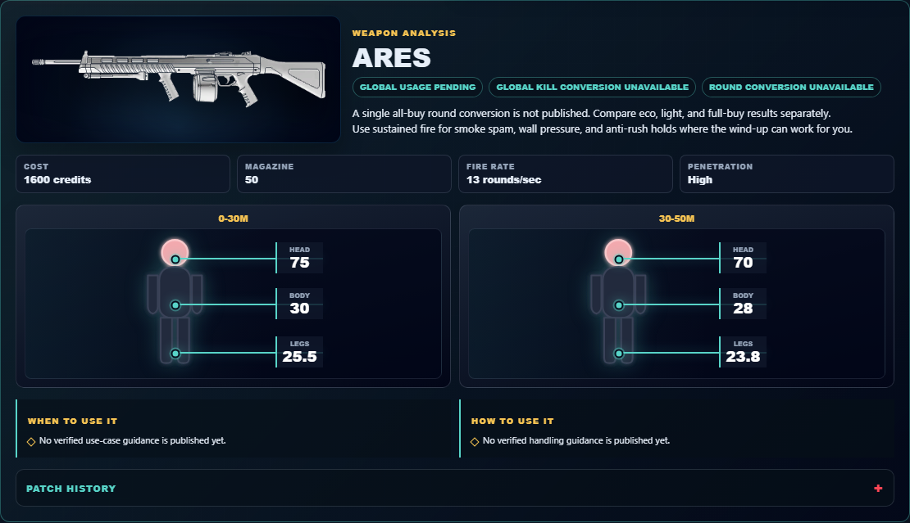

# Library Draft Review — Weapon: Ares — 2026-07-23

## Summary

One-time full-coverage baseline. 10 fields changed for Patch 13.01.

## Screenshot

## Field-by-field changes

| Field | Tier | Before | After | Sources checked | Confidence |
| --- | --- | --- | --- | --- | --- |
| `id` | canonical |  | ares | [https://valorant-api.com/v1/weapons/55d8a0f4-4274-ca67-fe2c-06ab45efdf58?language=en-US](https://valorant-api.com/v1/weapons/55d8a0f4-4274-ca67-fe2c-06ab45efdf58?language=en-US) | n/a (auto-approved) |
| `label` | canonical |  | Ares | [https://valorant-api.com/v1/weapons/55d8a0f4-4274-ca67-fe2c-06ab45efdf58?language=en-US](https://valorant-api.com/v1/weapons/55d8a0f4-4274-ca67-fe2c-06ab45efdf58?language=en-US) | n/a (auto-approved) |
| `uuid` | canonical |  | 55d8a0f4-4274-ca67-fe2c-06ab45efdf58 | [https://valorant-api.com/v1/weapons/55d8a0f4-4274-ca67-fe2c-06ab45efdf58?language=en-US](https://valorant-api.com/v1/weapons/55d8a0f4-4274-ca67-fe2c-06ab45efdf58?language=en-US) | n/a (auto-approved) |
| `image` | canonical |  | https://media.valorant-api.com/weapons/55d8a0f4-4274-ca67-fe2c-06ab45efdf58/displayicon.png | [https://valorant-api.com/v1/weapons/55d8a0f4-4274-ca67-fe2c-06ab45efdf58?language=en-US](https://valorant-api.com/v1/weapons/55d8a0f4-4274-ca67-fe2c-06ab45efdf58?language=en-US) | n/a (auto-approved) |
| `cost` | canonical |  | 1600 | [https://valorant-api.com/v1/weapons/55d8a0f4-4274-ca67-fe2c-06ab45efdf58?language=en-US](https://valorant-api.com/v1/weapons/55d8a0f4-4274-ca67-fe2c-06ab45efdf58?language=en-US) | n/a (auto-approved) |
| `magazine` | canonical |  | 50 | [https://valorant-api.com/v1/weapons/55d8a0f4-4274-ca67-fe2c-06ab45efdf58?language=en-US](https://valorant-api.com/v1/weapons/55d8a0f4-4274-ca67-fe2c-06ab45efdf58?language=en-US) | n/a (auto-approved) |
| `fireRate` | canonical |  | 13 rounds/sec | [https://valorant-api.com/v1/weapons/55d8a0f4-4274-ca67-fe2c-06ab45efdf58?language=en-US](https://valorant-api.com/v1/weapons/55d8a0f4-4274-ca67-fe2c-06ab45efdf58?language=en-US) | n/a (auto-approved) |
| `penetration` | canonical |  | High | [https://valorant-api.com/v1/weapons/55d8a0f4-4274-ca67-fe2c-06ab45efdf58?language=en-US](https://valorant-api.com/v1/weapons/55d8a0f4-4274-ca67-fe2c-06ab45efdf58?language=en-US) | n/a (auto-approved) |
| `damageRanges` | canonical |  | [   {     "range": "0-30m",     "head": 75,     "body": 30,     "legs": 25.5   },   {     "range": "30-50m",     "head": 70,     "body": 28,     "legs": 23.8   } ] | [https://valorant-api.com/v1/weapons/55d8a0f4-4274-ca67-fe2c-06ab45efdf58?language=en-US](https://valorant-api.com/v1/weapons/55d8a0f4-4274-ca67-fe2c-06ab45efdf58?language=en-US) | n/a (auto-approved) |
| `source` | canonical |  | https://valorant-api.com/v1/weapons/55d8a0f4-4274-ca67-fe2c-06ab45efdf58?language=en-US | [https://valorant-api.com/v1/weapons/55d8a0f4-4274-ca67-fe2c-06ab45efdf58?language=en-US](https://valorant-api.com/v1/weapons/55d8a0f4-4274-ca67-fe2c-06ab45efdf58?language=en-US) | n/a (auto-approved) |

## Approval

- [ ] Approved as-is
- [ ] Approved with edits (note edits below)
- [ ] Rejected (note why below)

Notes:

Promotion totals: 10 canonical, 0 synthesized, 0 mixed-tier field groups.
