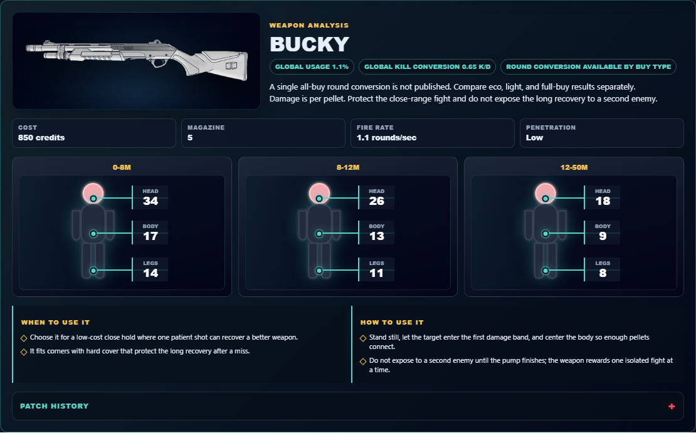
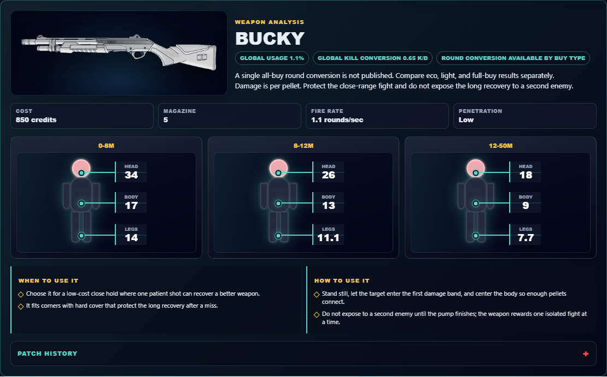

# Library Draft Review — Weapon: Bucky — 2026-07-23

## Summary

One-time full-coverage baseline. 4 fields changed for Patch 13.01.

## Screenshot

## Field-by-field changes

| Field | Tier | Before | After | Sources checked | Confidence |
| --- | --- | --- | --- | --- | --- |
| `image` | canonical | /assets/weapons/bucky.png | https://media.valorant-api.com/weapons/910be174-449b-c412-ab22-d0873436b21b/displayicon.png | [https://valorant-api.com/v1/weapons/910be174-449b-c412-ab22-d0873436b21b?language=en-US](https://valorant-api.com/v1/weapons/910be174-449b-c412-ab22-d0873436b21b?language=en-US) | n/a (auto-approved) |
| `damageRanges` | canonical | [   {     "range": "0-8m",     "head": 34,     "body": 17,     "legs": 14   },   {     "range": "8-12m",     "head": 26,     "body": 13,     "legs": 11   },   {     "range": "12-50m",     "head": 18,     "body": 9,     "legs": 8   } ] | [   {     "range": "0-8m",     "head": 34,     "body": 17,     "legs": 14   },   {     "range": "8-12m",     "head": 26,     "body": 13,     "legs": 11.05   },   {     "range": "12-50m",     "head": 18,     "body": 9,     "legs": 7.65   } ] | [https://valorant-api.com/v1/weapons/910be174-449b-c412-ab22-d0873436b21b?language=en-US](https://valorant-api.com/v1/weapons/910be174-449b-c412-ab22-d0873436b21b?language=en-US) | n/a (auto-approved) |
| `uuid` | canonical |  | 910be174-449b-c412-ab22-d0873436b21b | [https://valorant-api.com/v1/weapons/910be174-449b-c412-ab22-d0873436b21b?language=en-US](https://valorant-api.com/v1/weapons/910be174-449b-c412-ab22-d0873436b21b?language=en-US) | n/a (auto-approved) |
| `source` | canonical |  | https://valorant-api.com/v1/weapons/910be174-449b-c412-ab22-d0873436b21b?language=en-US | [https://valorant-api.com/v1/weapons/910be174-449b-c412-ab22-d0873436b21b?language=en-US](https://valorant-api.com/v1/weapons/910be174-449b-c412-ab22-d0873436b21b?language=en-US) | n/a (auto-approved) |

## Approval

- [ ] Approved as-is
- [ ] Approved with edits (note edits below)
- [ ] Rejected (note why below)

Notes:

Promotion totals: 4 canonical, 0 synthesized, 0 mixed-tier field groups.
