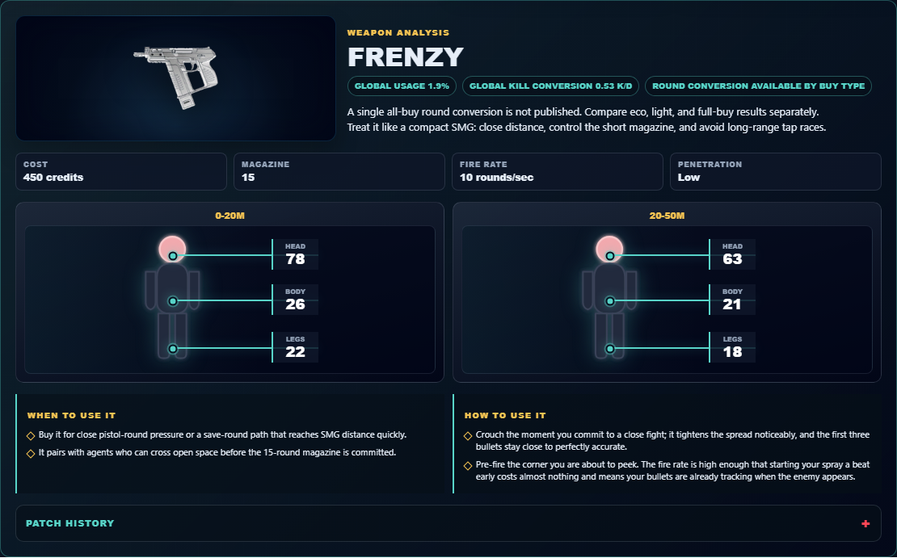
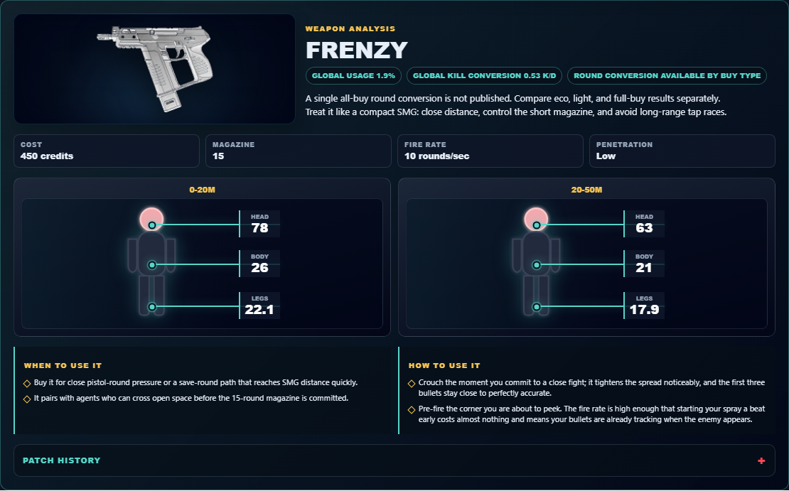

# Library Draft Review — Weapon: Frenzy — 2026-07-23

## Summary

One-time full-coverage baseline. 4 fields changed for Patch 13.01.

## Screenshot

## Field-by-field changes

| Field | Tier | Before | After | Sources checked | Confidence |
| --- | --- | --- | --- | --- | --- |
| `image` | canonical | /assets/weapons/frenzy.png | https://media.valorant-api.com/weapons/44d4e95c-4157-0037-81b2-17841bf2e8e3/displayicon.png | [https://valorant-api.com/v1/weapons/44d4e95c-4157-0037-81b2-17841bf2e8e3?language=en-US](https://valorant-api.com/v1/weapons/44d4e95c-4157-0037-81b2-17841bf2e8e3?language=en-US) | n/a (auto-approved) |
| `damageRanges` | canonical | [   {     "range": "0-20m",     "head": 78,     "body": 26,     "legs": 22   },   {     "range": "20-50m",     "head": 63,     "body": 21,     "legs": 18   } ] | [   {     "range": "0-20m",     "head": 78,     "body": 26,     "legs": 22.1   },   {     "range": "20-50m",     "head": 63,     "body": 21,     "legs": 17.85   } ] | [https://valorant-api.com/v1/weapons/44d4e95c-4157-0037-81b2-17841bf2e8e3?language=en-US](https://valorant-api.com/v1/weapons/44d4e95c-4157-0037-81b2-17841bf2e8e3?language=en-US) | n/a (auto-approved) |
| `uuid` | canonical |  | 44d4e95c-4157-0037-81b2-17841bf2e8e3 | [https://valorant-api.com/v1/weapons/44d4e95c-4157-0037-81b2-17841bf2e8e3?language=en-US](https://valorant-api.com/v1/weapons/44d4e95c-4157-0037-81b2-17841bf2e8e3?language=en-US) | n/a (auto-approved) |
| `source` | canonical |  | https://valorant-api.com/v1/weapons/44d4e95c-4157-0037-81b2-17841bf2e8e3?language=en-US | [https://valorant-api.com/v1/weapons/44d4e95c-4157-0037-81b2-17841bf2e8e3?language=en-US](https://valorant-api.com/v1/weapons/44d4e95c-4157-0037-81b2-17841bf2e8e3?language=en-US) | n/a (auto-approved) |

## Approval

- [ ] Approved as-is
- [ ] Approved with edits (note edits below)
- [ ] Rejected (note why below)

Notes:

Promotion totals: 4 canonical, 0 synthesized, 0 mixed-tier field groups.
