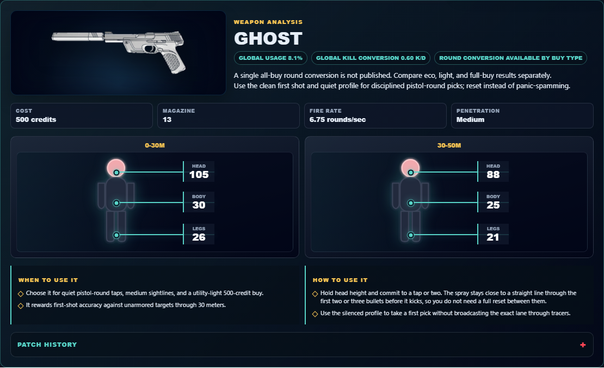
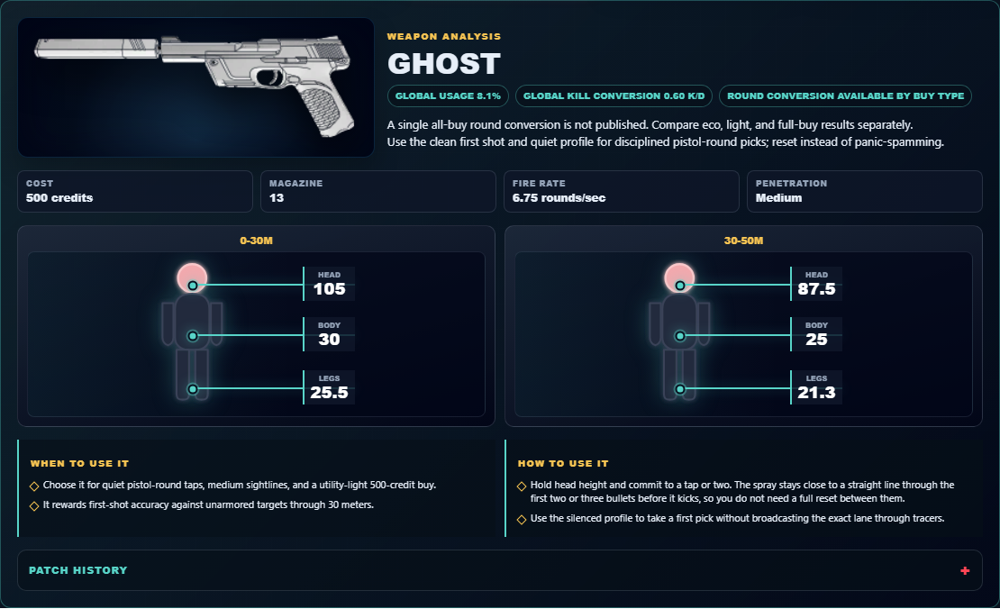

# Library Draft Review — Weapon: Ghost — 2026-07-23

## Summary

One-time full-coverage baseline. 4 fields changed for Patch 13.01.

## Screenshot

## Field-by-field changes

| Field | Tier | Before | After | Sources checked | Confidence |
| --- | --- | --- | --- | --- | --- |
| `image` | canonical | /assets/weapons/ghost.png | https://media.valorant-api.com/weapons/1baa85b4-4c70-1284-64bb-6481dfc3bb4e/displayicon.png | [https://valorant-api.com/v1/weapons/1baa85b4-4c70-1284-64bb-6481dfc3bb4e?language=en-US](https://valorant-api.com/v1/weapons/1baa85b4-4c70-1284-64bb-6481dfc3bb4e?language=en-US) | n/a (auto-approved) |
| `damageRanges` | canonical | [   {     "range": "0-30m",     "head": 105,     "body": 30,     "legs": 26   },   {     "range": "30-50m",     "head": 88,     "body": 25,     "legs": 21   } ] | [   {     "range": "0-30m",     "head": 105,     "body": 30,     "legs": 25.5   },   {     "range": "30-50m",     "head": 87.5,     "body": 25,     "legs": 21.25   } ] | [https://valorant-api.com/v1/weapons/1baa85b4-4c70-1284-64bb-6481dfc3bb4e?language=en-US](https://valorant-api.com/v1/weapons/1baa85b4-4c70-1284-64bb-6481dfc3bb4e?language=en-US) | n/a (auto-approved) |
| `uuid` | canonical |  | 1baa85b4-4c70-1284-64bb-6481dfc3bb4e | [https://valorant-api.com/v1/weapons/1baa85b4-4c70-1284-64bb-6481dfc3bb4e?language=en-US](https://valorant-api.com/v1/weapons/1baa85b4-4c70-1284-64bb-6481dfc3bb4e?language=en-US) | n/a (auto-approved) |
| `source` | canonical |  | https://valorant-api.com/v1/weapons/1baa85b4-4c70-1284-64bb-6481dfc3bb4e?language=en-US | [https://valorant-api.com/v1/weapons/1baa85b4-4c70-1284-64bb-6481dfc3bb4e?language=en-US](https://valorant-api.com/v1/weapons/1baa85b4-4c70-1284-64bb-6481dfc3bb4e?language=en-US) | n/a (auto-approved) |

## Approval

- [ ] Approved as-is
- [ ] Approved with edits (note edits below)
- [ ] Rejected (note why below)

Notes:

Promotion totals: 4 canonical, 0 synthesized, 0 mixed-tier field groups.
