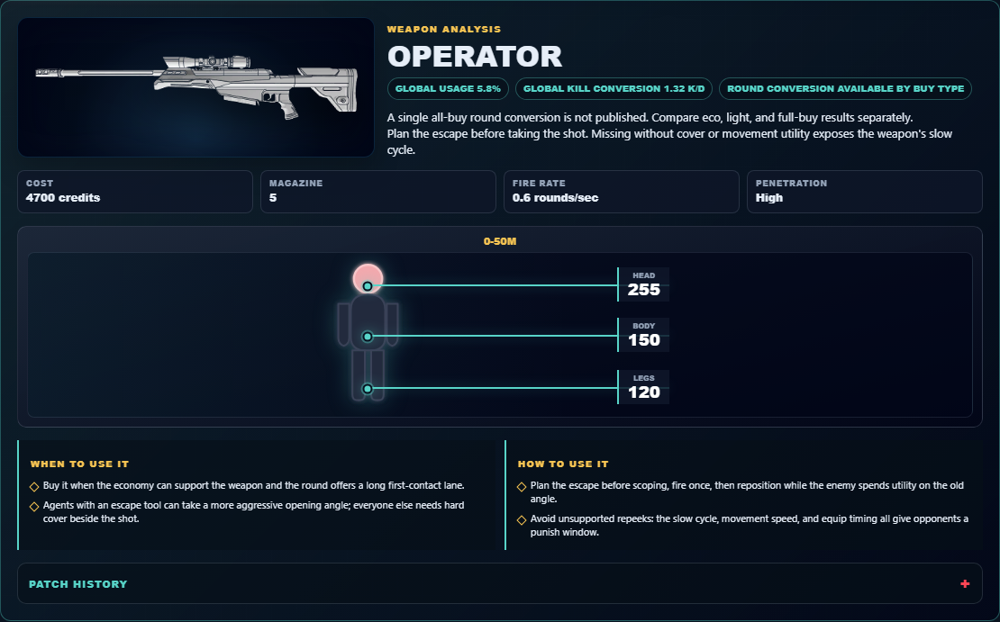

# Library Draft Review — Weapon: Operator — 2026-07-23

## Summary

One-time full-coverage baseline. 3 fields changed for Patch 13.01.

## Screenshot

## Field-by-field changes

| Field | Tier | Before | After | Sources checked | Confidence |
| --- | --- | --- | --- | --- | --- |
| `image` | canonical | /assets/weapons/operator.png | https://media.valorant-api.com/weapons/a03b24d3-4319-996d-0f8c-94bbfba1dfc7/displayicon.png | [https://valorant-api.com/v1/weapons/a03b24d3-4319-996d-0f8c-94bbfba1dfc7?language=en-US](https://valorant-api.com/v1/weapons/a03b24d3-4319-996d-0f8c-94bbfba1dfc7?language=en-US) | n/a (auto-approved) |
| `uuid` | canonical |  | a03b24d3-4319-996d-0f8c-94bbfba1dfc7 | [https://valorant-api.com/v1/weapons/a03b24d3-4319-996d-0f8c-94bbfba1dfc7?language=en-US](https://valorant-api.com/v1/weapons/a03b24d3-4319-996d-0f8c-94bbfba1dfc7?language=en-US) | n/a (auto-approved) |
| `source` | canonical |  | https://valorant-api.com/v1/weapons/a03b24d3-4319-996d-0f8c-94bbfba1dfc7?language=en-US | [https://valorant-api.com/v1/weapons/a03b24d3-4319-996d-0f8c-94bbfba1dfc7?language=en-US](https://valorant-api.com/v1/weapons/a03b24d3-4319-996d-0f8c-94bbfba1dfc7?language=en-US) | n/a (auto-approved) |

## Approval

- [ ] Approved as-is
- [ ] Approved with edits (note edits below)
- [ ] Rejected (note why below)

Notes:

Promotion totals: 3 canonical, 0 synthesized, 0 mixed-tier field groups.
