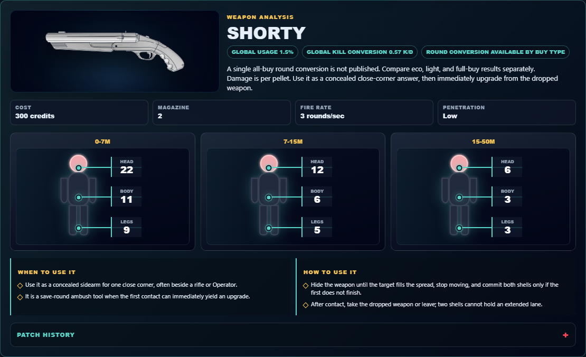
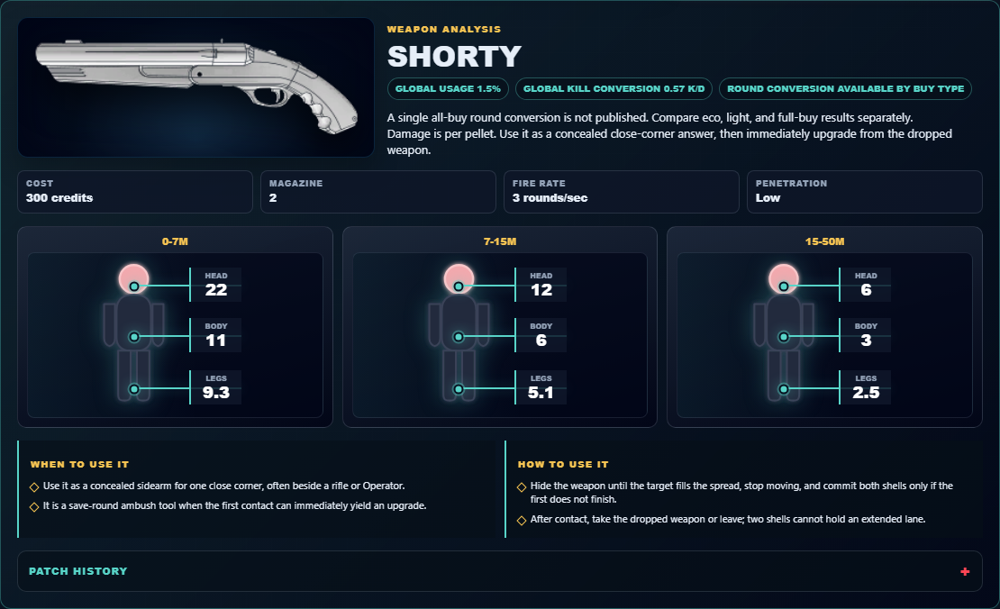

# Library Draft Review — Weapon: Shorty — 2026-07-23

## Summary

One-time full-coverage baseline. 4 fields changed for Patch 13.01.

## Screenshot

## Field-by-field changes

| Field | Tier | Before | After | Sources checked | Confidence |
| --- | --- | --- | --- | --- | --- |
| `image` | canonical | /assets/weapons/shorty.png | https://media.valorant-api.com/weapons/42da8ccc-40d5-affc-beec-15aa47b42eda/displayicon.png | [https://valorant-api.com/v1/weapons/42da8ccc-40d5-affc-beec-15aa47b42eda?language=en-US](https://valorant-api.com/v1/weapons/42da8ccc-40d5-affc-beec-15aa47b42eda?language=en-US) | n/a (auto-approved) |
| `damageRanges` | canonical | [   {     "range": "0-7m",     "head": 22,     "body": 11,     "legs": 9   },   {     "range": "7-15m",     "head": 12,     "body": 6,     "legs": 5   },   {     "range": "15-50m",     "head": 6,     "body": 3,     "legs": 3   } ] | [   {     "range": "0-7m",     "head": 22,     "body": 11,     "legs": 9.35   },   {     "range": "7-15m",     "head": 12,     "body": 6,     "legs": 5.1   },   {     "range": "15-50m",     "head": 6,     "body": 3,     "legs": 2.55   } ] | [https://valorant-api.com/v1/weapons/42da8ccc-40d5-affc-beec-15aa47b42eda?language=en-US](https://valorant-api.com/v1/weapons/42da8ccc-40d5-affc-beec-15aa47b42eda?language=en-US) | n/a (auto-approved) |
| `uuid` | canonical |  | 42da8ccc-40d5-affc-beec-15aa47b42eda | [https://valorant-api.com/v1/weapons/42da8ccc-40d5-affc-beec-15aa47b42eda?language=en-US](https://valorant-api.com/v1/weapons/42da8ccc-40d5-affc-beec-15aa47b42eda?language=en-US) | n/a (auto-approved) |
| `source` | canonical |  | https://valorant-api.com/v1/weapons/42da8ccc-40d5-affc-beec-15aa47b42eda?language=en-US | [https://valorant-api.com/v1/weapons/42da8ccc-40d5-affc-beec-15aa47b42eda?language=en-US](https://valorant-api.com/v1/weapons/42da8ccc-40d5-affc-beec-15aa47b42eda?language=en-US) | n/a (auto-approved) |

## Approval

- [ ] Approved as-is
- [ ] Approved with edits (note edits below)
- [ ] Rejected (note why below)

Notes:

Promotion totals: 4 canonical, 0 synthesized, 0 mixed-tier field groups.
