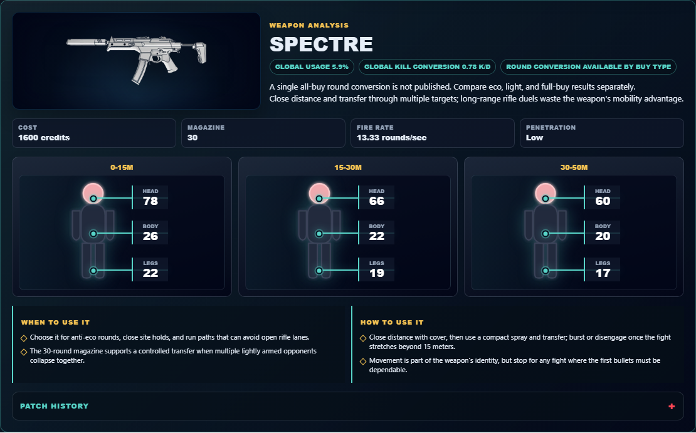
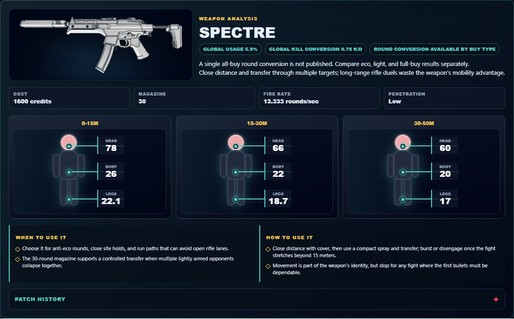

# Library Draft Review — Weapon: Spectre — 2026-07-23

## Summary

One-time full-coverage baseline. 5 fields changed for Patch 13.01.

## Screenshot

## Field-by-field changes

| Field | Tier | Before | After | Sources checked | Confidence |
| --- | --- | --- | --- | --- | --- |
| `image` | canonical | /assets/weapons/spectre.png | https://media.valorant-api.com/weapons/462080d1-4035-2937-7c09-27aa2a5c27a7/displayicon.png | [https://valorant-api.com/v1/weapons/462080d1-4035-2937-7c09-27aa2a5c27a7?language=en-US](https://valorant-api.com/v1/weapons/462080d1-4035-2937-7c09-27aa2a5c27a7?language=en-US) | n/a (auto-approved) |
| `fireRate` | canonical | 13.33 rounds/sec | 13.333 rounds/sec | [https://valorant-api.com/v1/weapons/462080d1-4035-2937-7c09-27aa2a5c27a7?language=en-US](https://valorant-api.com/v1/weapons/462080d1-4035-2937-7c09-27aa2a5c27a7?language=en-US) | n/a (auto-approved) |
| `damageRanges` | canonical | [   {     "range": "0-15m",     "head": 78,     "body": 26,     "legs": 22   },   {     "range": "15-30m",     "head": 66,     "body": 22,     "legs": 19   },   {     "range": "30-50m",     "head": 60,     "body": 20,     "legs": 17   } ] | [   {     "range": "0-15m",     "head": 78,     "body": 26,     "legs": 22.1   },   {     "range": "15-30m",     "head": 66,     "body": 22,     "legs": 18.7   },   {     "range": "30-50m",     "head": 60,     "body": 20,     "legs": 17   } ] | [https://valorant-api.com/v1/weapons/462080d1-4035-2937-7c09-27aa2a5c27a7?language=en-US](https://valorant-api.com/v1/weapons/462080d1-4035-2937-7c09-27aa2a5c27a7?language=en-US) | n/a (auto-approved) |
| `uuid` | canonical |  | 462080d1-4035-2937-7c09-27aa2a5c27a7 | [https://valorant-api.com/v1/weapons/462080d1-4035-2937-7c09-27aa2a5c27a7?language=en-US](https://valorant-api.com/v1/weapons/462080d1-4035-2937-7c09-27aa2a5c27a7?language=en-US) | n/a (auto-approved) |
| `source` | canonical |  | https://valorant-api.com/v1/weapons/462080d1-4035-2937-7c09-27aa2a5c27a7?language=en-US | [https://valorant-api.com/v1/weapons/462080d1-4035-2937-7c09-27aa2a5c27a7?language=en-US](https://valorant-api.com/v1/weapons/462080d1-4035-2937-7c09-27aa2a5c27a7?language=en-US) | n/a (auto-approved) |

## Approval

- [ ] Approved as-is
- [ ] Approved with edits (note edits below)
- [ ] Rejected (note why below)

Notes:

Promotion totals: 5 canonical, 0 synthesized, 0 mixed-tier field groups.
